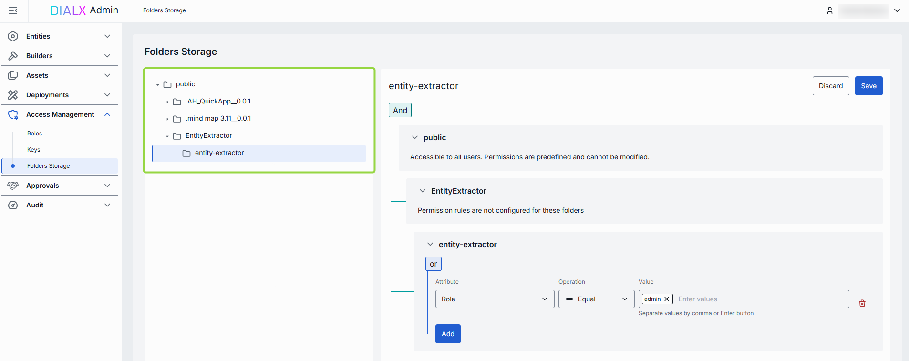
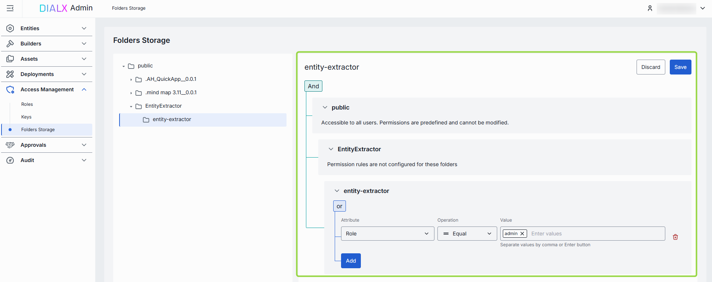
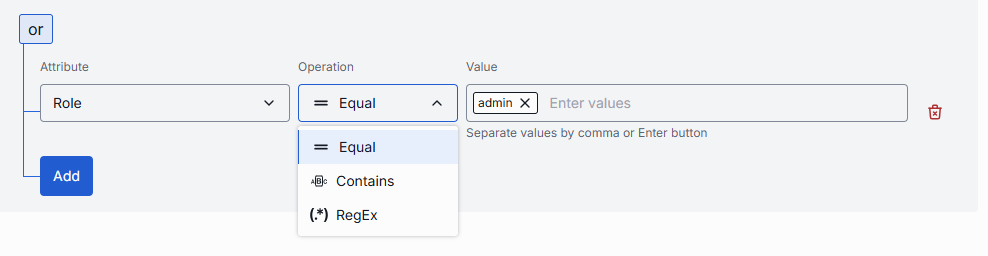
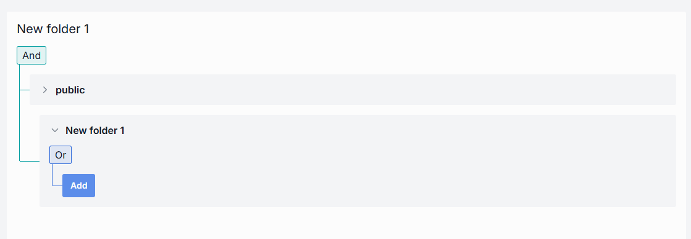

# Folders Storage

## Introduction

Folders Storage displays the current structure and content of the **Public** folder of the DIAL file storage. 

> Refer to [Access Control](/docs/platform/3.core/2.access-control-intro.md) to learn more about Private and Public logical spaces for objects storage in DIAL.

## Folders

Objects ([applications](/docs/tutorials/3.admin/assets-applications.md), [files](/docs/tutorials/3.admin/assets-files.md), [prompts](/docs/tutorials/3.admin/assets-prompts.md), [toolsets](/docs/tutorials/3.admin/assets-toolsets.md)) get to the Public folder when published by end users or added by administrators.

> Refer to [Chat User Guide](/docs/tutorials/0.user-guide.md#publish-2) to learn how end users can publish applications and to [DIAL Core API Publications](https://dialx.ai/dial_api#tag/Publications) to learn how to create and manage publication requests via API.

**Note**: Public folder does not contain private objects of DIAL users!

Objects in the Public folder are arranged hierarchically, similar to a file system. 

- **Root folder**: Pubic is a root folder which can include sub-folders and files.
- **Sub-folders**: Sub-folders can include uploaded files and files of published applications.

## Access Rules

Click any folder to display its access rules.

* **Public folder**: Access to the root Public folder is predefined and available to all authorized DIAL users. 
* **Sub-folders**: Sub-folders within the Public folder can have custom access rules defined by administrators or by users in publication requests. The effective authorization rule for an object in a sub-folder includes restrictions applied to all parent sub-folders up to the root folder. Refer to [Tutorials](/docs/tutorials/1.developers/1.work-with-resources/0.work-with-publications.md#effective-rules) to learn about affective rules for folders.

> Refer to [Access Control](/docs/platform/3.core/2.access-control-intro.md) to learn more about Private and Public logical spaces for objects storage in DIAL.

##### Working with access rules

To determine whether a logged-in user has access to a particular resource in sub-folders, DIAL Core matches `claims` from identity providers (IDPs) with access rules.

> * Refer to [JWT](/docs/tutorials/2.devops/2.auth-and-access-control/1.jwt.md) and [API Keys](/docs/tutorials/2.devops/2.auth-and-access-control/0.api-keys.md) to learn how to enables access to DIAL resources.
> * Refer to [Tutorials](/docs/tutorials/2.devops/2.auth-and-access-control/2.configure-idps/0.overview.md) to discover configurations for supported identity service providers.

Access rules for objects in sub-folders can be defined using three parameters:

* **Attribute**: Specific `claim` in JWT token payload. E.g: role.
* **Value**: Array of claim `values`. E.g.: admin.
* **Operation**: Matching functions for `claims` and `values`. E.g: Equal.

Rules can be nested under **And/Or** blocks to form complex access policies:

* **And**: All rules must be satisfied.
* **Or**: At least one rule must be satisfied.

> **Note**: If a folder has a parent folder, all access rules of a parent folder also apply to the child folder. Refer to [Tutorials](/docs/tutorials/1.developers/1.work-with-resources/0.work-with-publications.md#effective-rules) to learn about affective rules for folders.

