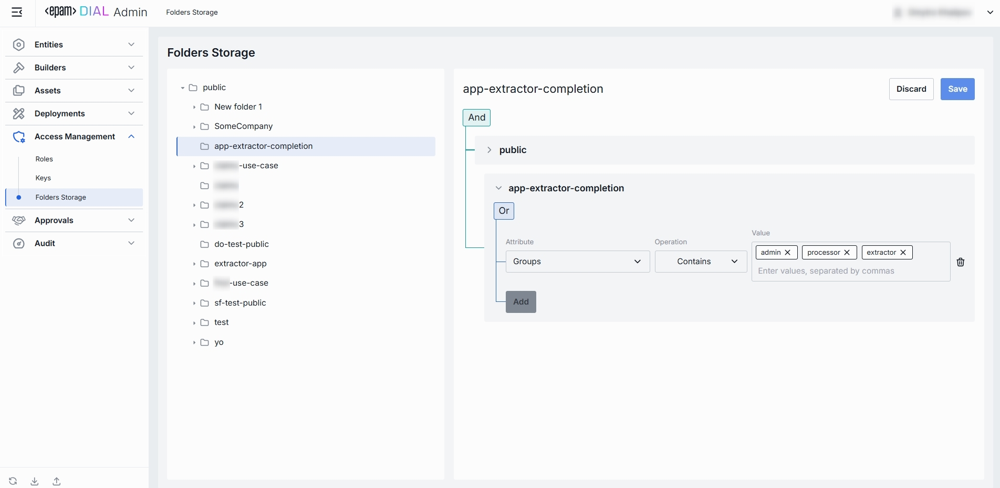

# Folders

## About Folders Storage

The Folders Storage section of DIAL Admin lets you control which users or roles can browse and access different directories in the [Assets (Prompts & Files) area](/docs/tutorials/3.admin/assets-files.md). On this screen, you can define per-folder Access Control Lists (ACLs) rules.

## Folders List

The **Folders Storage** section is where you manage all folders and their hierarchy.

### Folders Hierarchy

**Folders Structure (Left Pane)**: Shows a hierarchical view of all storage folders under the root.

| Element                  | Behavior                                                                                |
| ------------------------ | --------------------------------------------------------------------------------------- |
| **Public folder**        | A root folder accessible to all users.                                                  |
| **User-defined folders** | Collapsible folders you create to group files by project, team, domain, or environment. |

### Folders Permissions

When a folder is selected, the right pane displays its access-control rules which determine who can view or add assets in the selected folder.

Rules can be nested under **And/Or** blocks to form complex access policies:

- **And**: All rules must be satisfied.
- **Or**: At least one rule must be satisfied.

> **Note**: If a folder has a parent folder, all access rules of a parent folder also apply to the child folder.

##### Adding & Removing Access Rules

1. Click **Add** to append a new permission rule to the selected folder.
2. Specify attribute, operation and value.

Click the trash-can icon on the right edge of any rule to remove it.

