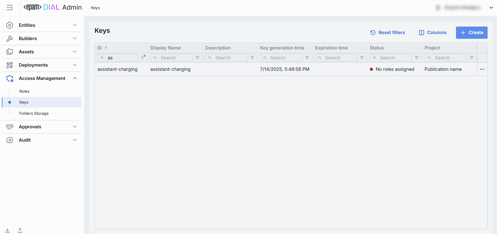

# Keys

## Introduction

DIAL Core uses API keys to manage access of external applications for resources in DIAL.

> * Refer to [DIAL Core](https://github.com/epam/ai-dial-core/blob/development/docs/dynamic-settings/keys.md) to learn how API keys are defined in DIAL Core configuration.
> * Refer to [Access Control](/docs/platform/3.core/2.access-control-intro.md) to learn more about access control in DIAL.
> * Refer to [Tutorials](/docs/tutorials/2.devops/2.auth-and-access-control/0.api-keys.md) to learn how to configure access and usage control for API keys.

## Main Screen

On this screen, you can find all API keys defined in your instance of DIAL. Here, you can also add and manage API keys. 

> API keys can also be defined directly in [DIAL Core configuration](https://github.com/epam/ai-dial-core/blob/development/docs/dynamic-settings/keys.md).

##### Keys grid

> **TIP**: Use the **Columns** selector to customize which columns are visible in the grid.

| Column | Definition |
|--------|------------|
| **ID** | Unique key identifier. |
| **Display Name** | Name of the key displayed on UI. |
| **Description** | Description of the key. |
| **Creation time** | Key's creation timestamp. |
| **Updated time** | Timestamp of the latest change. |
| **Key generation time** | Timestamp of the key's secret value generation. |
| **Expiration time** | Key's expiration timestamp. Setting expirations enforces regular key rotation. |
| **Status** | Current validity status of the key. A key is **invalid** in cases when there are no roles assigned to it, or its secret value is missing or is expired. |
| **Project** | Name of the project the key was created for. |
| **Project contact point** | Email of the responsible person or group. |
| **Secured** | Indication if it is [secured API key](/docs/platform/3.core/4.privacy.md#applications-audit-logs). |
| **Topics** | Tags assigned to the key (e.g. "admin", "user"). |

## Create Keys

Follow these steps to create a new API key:

1. Click **Create** to invoke the **Key** modal.
2. In the modal, specify the following parameters for the new key:

    | Field | Required | Description |
    |-------|----------|-------------|
    | **ID** | Yes | Unique key identifier. Click Generate to automatically create unique GUID. |
    | **Display Name** | Yes | Name of the key displayed on UI. |
    | **Description** | No | Description of the key. |
    | **Project** | Yes | Name of the project the key was created for. |
    | **Key value** | Yes | Secret string used for authentication. Initially hidden; click **👁️** to reveal. Press **Generate** to have its value automatically generated in GUID format. Can be changed in [Properties](#properties). |
    | **Validity Period** | Yes | Key's expiration time period. Use to enforce credential rotation and retirement. |

3. Once all required fields are filled, click **Create**. The dialog closes and the new [key configuration](#configuration) screen is opened. A new key entry will appear immediately in the listing once created.

    

## Delete

Click **Delete** on the main screen to permanently remove the selected key. 

> **Note**: All related entities (applications, models, routes) bound to the deleted API key will fail.

## Configuration

Click any API key to display the configuration screen.

### Keys Rotation

Use **Rotation** to refresh an existing API key.

> Note, that after rotation the key's generation timestamp will be updated accordingly.

1. Click any API key to invoke the configuration screen
2. Click **Rotate**.
3. Paste or auto-generate a new secret in the **Key value** field.
4. Pick the **Validity period**. The default expiration period is three months.
5. Click **Rotate** to apply the changes.

### Properties

In the Properties tab, you can view metadata and manage the selected settings for a specific API key. 

| Field | Required | Description |
|-------|----------|-------------|
| **ID** | - | Unique key identifier. |
| **Updated Time** | - | Timestamp of the last update. |
| **Creation Time** | - | Key's creation timestamp. |
| **Key Generation Time** | - | Timestamp of the key's secret value generation. |
| **Expiration Time** | - | Key's expiration timestamp. Setting expirations enforces regular key rotation. |
| **Status** | - | Current validity status of the key. A key is **invalid** in cases when there are no roles assigned to it, or its secret value is missing or is expired. |
| **Display Name** | Yes | Name of the key displayed on UI. |
| **Description** | No | Description of the key. |
| **Project** | Yes | Name of the project the key was created for. |
| **Project contact point** | No | Email of the responsible person or group. |
| **Key value** | Yes | Secret string used for authentication. Initially hidden - click **👁️** to reveal. Press **Copy** to copy it to clipboard. |
| **Secured** | Yes | Indication if it is [secured API key](/docs/platform/3.core/4.privacy.md#applications-audit-logs). |
| **Topics** | No | Tags assigned to the key (e.g. "admin", "user"). |

### Roles

API keys must be associated with a specific role in DIAL Core to be valid. Roles give access to specific DIAL resources and can impose usage and cost limits.

In the Roles tab, you can associate the selected API key with existing [roles](/docs/tutorials/3.admin/access-management-roles.md).

| Column | Description |
|--------|-------------|
| **Display Name** | Role's name displayed on UI. |
| **Description** | Description of a role. |
| **ID** | Unique role's identifier. |

##### Available actions 

| Action | Description | 
|--------|-------------|
| Add | Use to a role that will get access to the selected API key. |
| Remove | Use to disconnect the selected role from API keys. To delete role, go to [Roles](/docs/tutorials/3.admin/access-management-roles.md). | 

### Audit

The Activities section provides detailed visibility into all changes made to the selected API key. This section mimics the functionality available in the global [Audit → Activities](/docs/tutorials/3.admin/telemetry-activity-audit.md) menu, but is scoped specifically to the selected API key.

### JSON Editor

**Advanced users with technical expertise** can work with the keys properties in a JSON editor view mode. It is useful for advanced scenarios of bulk updates, copy/paste between environments, or tweaking settings not exposed on UI.

> **TIP**: You can switch between UI and JSON only if there are no unsaved changes.

In JSON editor, you can use the view dropdown to select between Admin format and Core format. Note, that these formatting options are for your convenience only and do not render properties as they are defined in DIAL Core.

##### Working with JSON Editor

1. Navigate to **Access Management → Keys**, then select the key you want to edit.
2. Click the **JSON Editor** toggle (top-right). The UI reveals the raw JSON.
3. Chose between the Admin and Core format to see and work with properties in the necessary format. **Note**: Core format view mode does not render the actual configuration stored in DIAL Core but the configuration in Admin service displayed in the DIAL Core format.
4. Make changes and click **Save** to apply them.