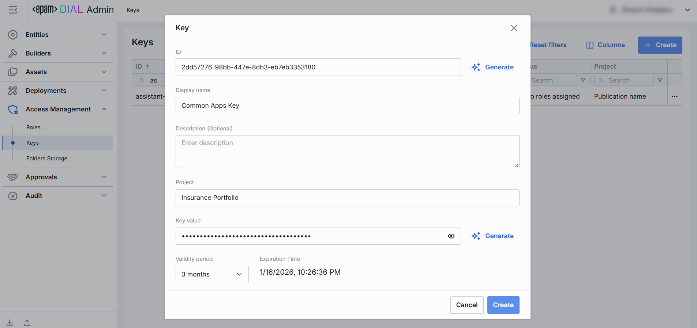

# Keys

## About API Keys

DIAL Core uses API keys to manage access of external applications for resources in DIAL.

> * Refer to [Access Control](/docs/platform/3.core/2.access-control-intro.md) to learn more about access control in DIAL.
> * Refer to [Tutorials](/docs/tutorials/2.devops/2.auth-and-access-control/0.api-keys.md) to learn how to configure access and usage control for API keys.

## Keys Main Screen

On the main screen you can see all existing API keys with their details.

##### Keys Grid

> **TIP**: Use the **Columns** selector to customize which columns are visible in the grid.

| Column                    | Definition                                                                                                          |
|---------------------------|---------------------------------------------------------------------------------------------------------------------|
| **ID**                    | A unique key under the Keys section of DIAL Admin.                                                                  |
| **Display Name**          | A user-friendly name of the Key.                                                                                    |
| **Description**           | Optional notes explaining the key’s purpose, owner/team, or special instructions.                                   |
| **Key generation time**   | A key's creation timestamp. Useful for auditing and correlating the key's usage with system changes or deployments. |
| **Expiration time**       | A key's expiration timestamp. Setting expirations enforces regular key rotation.                                    |
| **Status**                | The current state of the key.                                                                                       |
| **Project**               | The name of the project the key is associated with.                                                                 |
| **Updated time**          | Timestamp of the latest change.                                                                                     |
| **Creation time**         | Date and time when the key artefact was created in DIAL.                                                            |
| **Project contact point** | Email of the responsible person or group.                                                                           |
| **Secured**               | Indication if it is secured API key.                                                                                |

## Create Keys

Follow these steps to create a new API key:

1. Click **Create** to invoke the **Create Key** modal.
2. In the modal, specify the following parameters for the new key:

    | Field               | Required | Description & Use Cases                                                                                                                                                             |
    |---------------------|----------|-------------------------------------------------------------------------------------------------------------------------------------------------------------------------------------|
    | **ID**              | Yes      | A unique key under the Keys section of DIAL Admin. Click Generate to automatically create unique GUID.                                                                              |
    | **Display Name**    | Yes      | A user-friendly name of the Key.                                                                                                                                                    |
    | **Description**     | No       | An optional free-form text. Use to document the key’s purpose, owner team, or usage context.                                                                                   |
    | **Project**         | Yes      | Logical project or department grouping (e.g. "AnalyticsTeam"). Helps organize keys and apply cost/usage reporting by project.                                                  |
    | **Key value**       | Yes      | The actual secret string used for authentication. Initially hidden; click **👁️** to reveal. Press **Generate** to have its value automatically generated in GUID format. |
    | **Validity Period** | Yes      | A key's expiration time period. Use to enforce credential rotation and retirement.                                                                                                  |

3. Once all required fields are filled, click **Create**. The dialog closes and the new [key configuration](#key-configuration) screen is opened. A new key entry will appear immediately in the listing once created.

    

## Key Configuration

Click any API key to display the configuration screen.

### Keys Rotation

Use **Rotation** to refresh an existing API key.

1. Click any API key to invoke the configuration screen
2. Click **Rotate**.
3. Paste or auto-generate a new secret in the **Key value** field.
4. Pick the **Validity period**. The default expiration period is three months.
5. Click **Rotate** to apply the changes.

### Properties

In the Properties tab, you can view metadata and manage the selected settings for a specific API key. 

| Field                     | Required | Description & Use Cases                                                                                                                         |
|---------------------------|----------|-------------------------------------------------------------------------------------------------------------------------------------------------|
| **ID**                    | -        | A unique key under the Keys section of DIAL Admin.                                                                                              |
| **Creation Time**         | -        | Date and time when the key artefact was created in DIAL.                                                                                        |
| **Key Generation Time**   | -        | Date and time when the actual key value was last modified.                                                                                      |
| **Expiration Time**       | -        | Date and time when the key is expiring.                                                                                                         |
| **Status**                | -        | Indicates whether the key is valid or not.                                                                                                      |
| **Display Name**          | Yes      | A user-friendly identifier of a key. Use meaningful names to tie keys back to projects, environments, or teams.                            |
| **Description**           | No       | A free-form text. Use to document the key’s purpose, owner team, or usage context (e.g. "Used by QH Data Ingestion pipeline").             |
| **Project**               | Yes      | Logical project or department grouping (e.g. "QH", "AnalyticsTeam"). Helps organize keys and apply cost/usage reporting by project.        |
| **Project contact point** | No       | Email of the responsible person or group.                                                                                                       |
| **Key value**             | Yes      | The actual secret string used for authentication. Initially hidden - click **👁️** to reveal. Press **Copy** to copy it to clipboard. |
| **Secured**               | Yes      | Toggle to make the key a [secured API key](/docs/platform/3.core/4.privacy.md#applications-audit-logs).                                         |

### Roles

API keys must be associated with a specific role in DIAL Core to be valid. Roles give access to specific DIAL resources and can impose usage and cost limits.

In the Roles tab, you can associate the selected API key with existing [roles](/docs/tutorials/3.admin/access-management-roles.md).

| Column    | Description|
| --------------- |-----------------------------------------------|
| **Name**  | A unique identifier of the role.     |
| **Description** | User-friendly summary of the Role’s purpose. |

#### Add

To associate one or more roles with the selected API key:

1. Click **+ Add** (top-right of the Roles Grid).
2. **Select** one or more roles in the modal window. Roles are defined in the [Access Management → Roles](/docs/tutorials/3.admin/access-management-roles.md) section.
3. **Confirm** to insert them into the table.

#### Remove

Use to stop associating API keys with roles. 
 
1. Click the **actions** menu in the role's line.
2. Choose **Remove** in the menu.

    

> To delete a role, go to the [Access Management → Roles](/docs/tutorials/3.admin/access-management-roles.md) section.

### JSON Editor

For advanced scenarios of bulk updates, copy/paste between environments, or tweaking settings not exposed in the form UI—you can switch to the **JSON Editor** in any key's configuration page.

##### Switching to the JSON Editor

1. Navigate to **Access Management → Keys**, then select the key you want to edit.
2. Click the **JSON Editor** toggle (top-right). The UI reveals the raw JSON.

> **TIP**: You can switch between UI and JSON only if there are no unsaved changes.

## Delete

Click **Delete** on the main screen to permanently remove the selected key. 

> **Note**: All related entities (applications, models, routes) bound to the deleted API key will fail.
