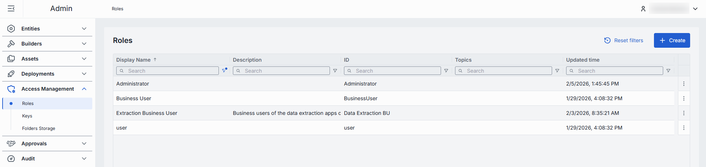
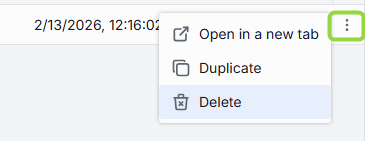
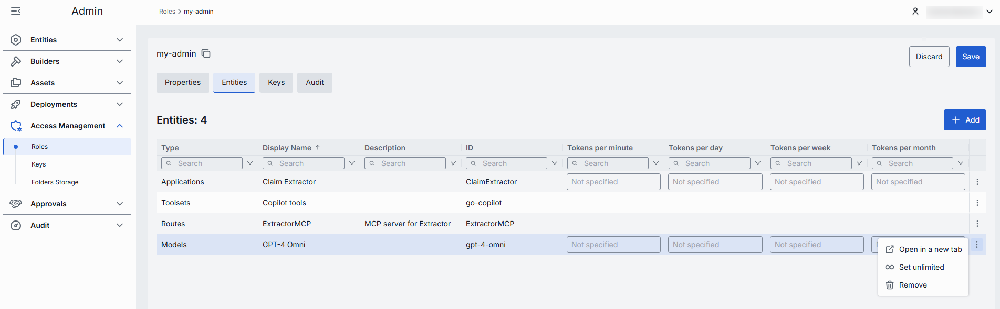
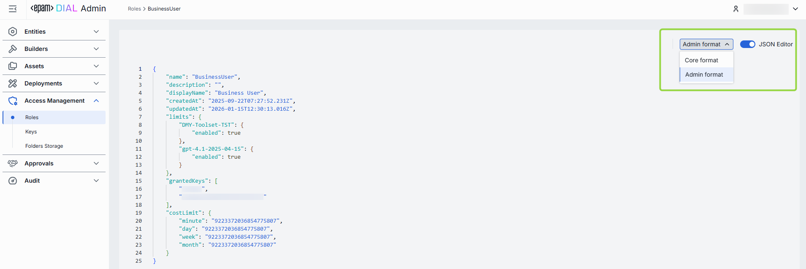

# Roles

## Introduction

DIAL uses Roles to enable roles-based access to resources such as applications, AI models, toolsets, routes, conversations and prompts.

> * Refer to [DIAL Core](https://github.com/epam/ai-dial-core/blob/development/docs/dynamic-settings/roles.md) to learn how roles are defined in DIAL Core configuration.
> * Refer to [Roles](/docs/platform/0.architecture-and-concepts/6.access-control.md#roles) to lean more about roles in DIAL.
> * Refer to [Tutorials](/docs/tutorials/2.devops/2.auth-and-access-control/0.api-keys.md) to learn how to configure roles for API keys.
> * Refer to [Tutorials](/docs/tutorials/2.devops/2.auth-and-access-control/1.jwt.md) to learn how to configure roles for JWT.

## Main Screen

On this screen, you can find all roles defined in your instance of DIAL. Here, you can also add and manage roles. 

> Roles can also be defined directly in [DIAL Core configuration](https://github.com/epam/ai-dial-core/blob/development/docs/dynamic-settings/roles.md).

##### Roles grid

| Column | Description |
|--------|-------------|
| **ID**| Unique role's identifier. |
| **Display Name** | Role's name displayed on UI. |
| **Description**  | Description of the given role. |
| **Updated Time** | Last update timestamp. |
| **Topics** | Semantic tags assigned to roles (e.g. "admin", "user"). |

## Create Role

Follow these steps to create a new role:

1. Click **Create** to invoke the **Create Role** modal.
2. Define role's parameters:

    | Field | Required | Description |
    |-------|----------|-------------|
    | **ID** | Yes | Unique role's identifier. |
    | **Display Name** | Yes | Role's name displayed on UI. |
    | **Description** | No | Description of the given role. |

3. Once all required fields are filled, click **Create**. The dialog closes and the new [role configuration](#configuration) screen is opened. A new role entry will appear immediately in the listing once created.

    

## Delete

Click **Delete** in the role's actions menu on the main screen or in the Configuration screen to permanently remove the selected role.

## Configuration

Click any role to display the configuration screen.

### Properties

In the Properties tab, you can define the identity and metadata for the role. These settings determine how the role appears throughout DIAL and help administrators understand its purpose.

| Field | Required | Description |
|-------|----------|-------------|
| **ID** | - | Unique role's identifier. |
| **Updated Time** | - | Last update timestamp. |
| **Creation Time** | - | Creation timestamp. |
| **Sync with core** | - | Indicates the state of the entity's configuration synchronization between Admin and DIAL Core. Synchronization occurs automatically every 2 mins (configurable via `CONFIG_AUTO_RELOAD_SCHEDULE_DELAY_MILLISECONDS`). **Important**: Sync state is not available for sensitive information (API keys/tokens/auth settings). **Synced**: Entity's states are identical in Admin and in Core for valid entities or entity is missing in Core for invalid entities. **In progress...**:  If Synced conditions are not met and changes were applied within last 2 mins (this period is configurable via `CONFIG_EXPORT_SYNC_DURATION_THRESHOLD_MS`). **Out of sync**: If Synced conditions are not met and changes were applied more than 2 mins ago (this period is configurable via `CONFIG_EXPORT_SYNC_DURATION_THRESHOLD_MS`). **Unavailable**: Displayed when it is not possible to determine the entity's state in Core. This occurs if: - The config was not received from Core for any reason. - The configuration of entities in Core is not entirely compatible with the one in the Admin service. |
| **Display Name** | Yes | Role's name displayed on UI. |
| **Description** | No | Description of the given role. |
| **Topics** | No | Semantic tags assigned to roles (e.g. "admin", "user"). |
| **Set cost limits** | No | These settings allow configuring [token usage limitations](/docs/platform/3.core/8.token-limits-and-cost-control.md#token-rate-limiting). **Available values**: Tokens per minute, Tokens per day, Tokens per week, Tokens per month. In case limitations for a specific role are not set, the limitations configured for the **default** role apply. In case limitations for the **default** role are not set, the value is unlimited. Refer to [DIAL Core documentation](https://github.com/epam/ai-dial-core/blob/development/docs/dynamic-settings/roles.md) to learn more about available usage and cost limitations for roles. |
| **Sharing** | No | Use to set the [sharing limits](/docs/tutorials/1.developers/1.work-with-resources/1.sharing.md) that apply for specific types of resources in DIAL. **Expiration time** refers to TTL of the sharing link. Default: 72 hrs. **Max users** refers to the maximum number of users who can accept a sharing link for a resource being shared. The limit is applied to the shared resource. Default: 10 for APPLICATION and UNLIMITED for other resource types. Refer to [DIAL Core documentation](https://github.com/epam/ai-dial-core/blob/development/docs/dynamic-settings/roles.md#rolesrole_nameshare) to learn more about sharing limitations. |

### Entities

In the Entities tab, you can assign which [Models](/docs/tutorials/3.admin/entities-models.md), [Applications](/docs/tutorials/3.admin/entities-applications.md), [Toolsets](/docs/tutorials/3.admin/entities-toolsets.md) or [Routes](/docs/tutorials/3.admin/entities-routes.md) this role can access, and within which rate limits.

| Column | Definition |
|--------|------------|
| **ID** | Unique role's identifier. |
| **Display Name** | Role's name displayed on UI. |
| **Description** | Description of the given role. |
| **Type** | Resource category: one of [Models](/docs/tutorials/3.admin/entities-models.md), [Applications](/docs/tutorials/3.admin/entities-applications.md), [Toolsets](/docs/tutorials/3.admin/entities-toolsets.md) or [Routes](/docs/tutorials/3.admin/entities-routes.md). |
| **Tokens per minute** | Maximum number of tokens this role may consume per minute when calling this resource.  Available to applications and models. |
| **Tokens per day** | Maximum number of tokens this role may consume per day when calling this resource.  Available to applications and models. |
| **Tokens per week** | Maximum number of tokens this role may consume per week when calling this resource.  Available to applications and models. |
| **Tokens per month** | Maximum number of tokens this role may consume per month when calling this resource.  Available to applications and models. |

##### Available actions 

| Action | Description | 
|--------|-------------|
| Add | Use to add a new entity which the selected role can access. |
| Remove | Use to remove entities and disable role's access to them. | 
| Set unlimited | Use to set an unlimited token usage for selected entities.  Available to applications and models. |

### Keys

In the Keys tab, you can assign [API keys](/docs/tutorials/3.admin/access-management-keys.md) for roles. API keys are defined in the [Access Management → Keys](/docs/tutorials/3.admin/access-management-keys.md) section.

| Column | Description |
|--------|-------------|
| Display Name | Name of the key displayed on UI. |
| Description | Description of the key. |
| ID | Unique key identifier. |
| Creation time | Key's creation timestamp. |
| Key generation time | Timestamp of the key's secret value generation. |
| Expiration time | Key's expiration timestamp. Blank means no expiration (i.e. permanent until manually revoked). |
| Status | Current validity status of the key. A key is **invalid** in cases when there are no roles assigned to it, or its secret value is missing or is expired. |
| Topics | Semantic tags associated with a key. |
| Updated time | Timestamp of the last update. |
| Project | Name of the project the key was created for. |

##### Available actions 

| Action | Description | 
|--------|-------------|
| Add | Use to add API keys which the selected role can use. |
| Remove | Use to disconnect the selected role from API keys. To delete API key, go to [Keys](/docs/tutorials/3.admin/access-management-keys.md). | 

### Audit

The Activities section provides detailed visibility into all changes made to the selected role. This section mimics the functionality available in the global [Audit → Activities](/docs/tutorials/3.admin/telemetry-activity-audit.md) menu, but is scoped specifically to the selected role.

### JSON Editor

**Advanced users with technical expertise** can work with the roles properties in a JSON editor view mode. It is useful for advanced scenarios of bulk updates, copy/paste between environments, or tweaking settings not exposed on UI.

> **TIP**: You can switch between UI and JSON only if there are no unsaved changes.

In JSON editor, you can use the view dropdown to select between Admin format and Core format. Note, that these formatting options are for your convenience only and do not render properties as they are defined in DIAL Core.

##### Working with JSON Editor

1. Navigate to **Access Management → Roles**, then select the role you want to edit.
2. Click the **JSON Editor** toggle (top-right). The UI reveals the raw JSON.
3. Chose between the Admin and Core format to see and work with properties in the necessary format. **Note**: Core format view mode does not render the actual configuration stored in DIAL Core but the configuration in Admin service displayed in the DIAL Core format.
4. Make changes and click **Save** to apply them.