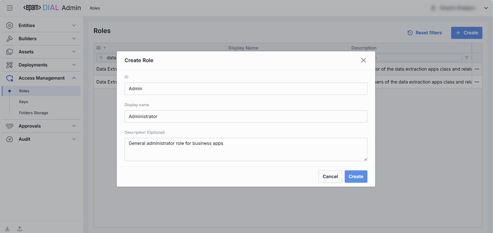

# Roles

## Introduction

Roles are used to enable roles-based access to resources in DIAL.

> * Refer to [Access Control](/docs/platform/3.core/2.access-control-intro.md) to learn more about access control in DIAL.
> * Refer to [Roles](/docs/platform/0.architecture-and-concepts/6.access-control.md#roles) to lean more about roles in DIAL.
> * Refer to [Tutorials](/docs/tutorials/2.devops/2.auth-and-access-control/0.api-keys.md) to learn how to configure roles for API keys.
> * Refer to [Tutorials](/docs/tutorials/2.devops/2.auth-and-access-control/1.jwt.md) to learn how to configure roles for JWT.
> * Refer to [IDP Configurations](/docs/tutorials/2.devops/2.auth-and-access-control/2.configure-idps/0.overview.md) to learn about the supported identity service providers and how to configure them.

## Main Screen

In Roles, you can define and manage roles in DIAL. 

> Roles can also be defined directly in [DIAL Core configuration](https://github.com/epam/ai-dial-core/blob/development/docs/dynamic-settings/roles.md).

##### Roles Grid

| Column | Description |
|--------|-------------|
| **ID**| This is a unique key under the Roles section of DIAL Admin.    |
| **Display Name** | A user-friendly name of a role (e.g. Data Extraction Admin, Analysts, Business User).   |
| **Description**  | A free-form description of a role (e.g. "Business User role for the Data Extraction application"). |
| **Updated Time** | Date and time when the role's configuration was last updated. |
| **Topics** | Tags assigned to roles (e.g. "admin", "user"). |

## Create Role

Follow these steps to create a new role:

1. Click **Create** to invoke the **Create Role** modal.
2. Define role's parameters:

    | Column | Required | Description |
    |-------|-----------|-----------------------|
    | **ID**| Yes      | This is a unique key under the Roles section of DIAL Admin.    |
    | **Display Name** | Yes      | A user-friendly name of a role (e.g. Data Extraction Admin, Analysts, Business User).   |
    | **Description**  | No       | A free-form description of a role (e.g. "Business User role for the Data Extraction application"). |

3. Once all required fields are filled, click **Create**. The dialog closes and the new [role configuration](#role-configuration) screen is opened. A new role entry will appear immediately in the listing once created.

    

## Role Configuration

Click any role to display the configuration screen.

### Properties

In the Properties tab, you can define the identity and metadata for the role. These settings determine how the role appears throughout DIAL and help administrators understand its purpose.

| Field    | Required | Description     |
|---------------------|----------|---------------------------|
| **ID**   | -        | This is a unique key under the Roles section of DIAL Admin. |
| **Updated Time**    | -        | Date and time when the role's configuration was last updated. |
| **Creation Time**   | -        | Date and time when the role's configuration was created. |
| **Sync with core** | -        | Indicates the state of the entity's configuration synchronization between Admin and DIAL Core. Synchronization occurs automatically every 2 mins (configurable via `CONFIG_AUTO_RELOAD_SCHEDULE_DELAY_MILLISECONDS`). **Important**: Sync state is not available for sensitive information (API keys/tokens/auth settings). **Synced**: Entity's states are identical in Admin and in Core for valid entities or entity is missing in Core for invalid entities. **In progress...**:  If Synced conditions are not met and changes were applied within last 2 mins (this period is configurable via `CONFIG_EXPORT_SYNC_DURATION_THRESHOLD_MS`). **Out of sync**: If Synced conditions are not met and changes were applied more than 2 mins ago (this period is configurable via `CONFIG_EXPORT_SYNC_DURATION_THRESHOLD_MS`). **Unavailable**: Displayed when it is not possible to determine the entity’s state in Core. This occurs if: - The config was not received from Core for any reason. - The configuration of entities in Core is not entirely compatible with the one in the Admin service. |
| **Display Name**    | Yes      | A unique identifier of the role, used in ACL selectors and in API calls.|
| **Description**     | No       | Optional free-form text describing the role’s intended audience or use.|
| **Set cost limits** | No       | Use to enable [token usage limitations](/docs/platform/3.core/8.token-limits-and-cost-control.md#token-rate-limiting). **Available values**: Tokens per minute, Tokens per day, Tokens per week, Tokens per month. In case limitations for a specific role are not set, the limitations configured for the **default** role apply. In case limitations for the **default** role are not set, the value is unlimited. Refer to [DIAL Core documentation](https://github.com/epam/ai-dial-core/blob/development/docs/dynamic-settings/roles.md) to learn more about available usage and cost limitations for roles.        |
| **Topics**                 | No          | Tags that you can assign to roles (e.g. "admin", "user"). Helps to split roles into categories for better navigation on UI. |
| **Sharing**         | No       | Use to set the [sharing limits](/docs/tutorials/1.developers/1.work-with-resources/1.sharing.md) that apply for specific types of resources in DIAL. **Expiration time** refers to TTL of the invitation link. Default: 72 (hrs). **Max users** refers to the maximum number of users who can accept an invitation link for a resource being shared. The limit is applied to the shared resource. Default: 10 for APPLICATION and UNLIMITED for other resource types. Refer to [DIAL Core documentation](https://github.com/epam/ai-dial-core/blob/development/docs/dynamic-settings/roles.md#rolesrole_nameshare) to learn more about sharing limitations.  |

### Entities

In the Entities tab, you can assign which [Models](/docs/tutorials/3.admin/entities-models.md), [Applications](/docs/tutorials/3.admin/entities-applications.md), [Toolsets](/docs/tutorials/3.admin/entities-toolsets.md) or [Routes](/docs/tutorials/3.admin/entities-routes.md) this role can access, and within which rate limits.

| Column     | Definition |
|-----------------------|------------------|
| **ID**     | This is a unique key under of the Entity (e.g., Model, Application).|
| **Display Name**      | A user-friendly name of the resource (Model, Application, or Route) as shown in DIAL.|
| **Description**       | A brief description of the resource. |
| **Type**   | Resource category: one of [Models](/docs/tutorials/3.admin/entities-models.md), [Applications](/docs/tutorials/3.admin/entities-applications.md), [Toolsets](/docs/tutorials/3.admin/entities-toolsets.md) or [Routes](/docs/tutorials/3.admin/entities-routes.md). |
| **Tokens per minute** | Maximum number of tokens this role may consume per minute when calling this resource.|
| **Tokens per day**    | Maximum number of tokens this role may consume per day when calling this resource.        |
| **Tokens per week**   | Maximum number of tokens this role may consume per week when calling this resource. |
| **Tokens per month**  | Maximum number of tokens this role may consume per month when calling this resource.   |

#### Add

Follow these steps to assign one or more entities to the selected role:

1. Click **+ Add** (top-right of the Entities Grid).
2. **Select** one or more applications/models in the modal window.
3. **Confirm** to insert them into the table.

#### Remove

Follow these steps to revoke an assigned entity from the selected role:
 
1. Click the **actions** menu in the entity's line.
2. Choose **Remove** in the menu.

### Keys

In the Keys tab, you can assign [API keys](/docs/tutorials/3.admin/access-management-keys.md) for roles. API keys are defined in the [Access Management → Keys](/docs/tutorials/3.admin/access-management-keys.md) section.

| Column       | Definition |
|-------------------------|-------------|
| **ID**       | A unique key under the Keys section of DIAL Admin.|
| **Display Name**        | A user-friendly name of the Key.       |
| **Description**         | Additional key’s details, e.g., purpose  or usage context.   |
| **Key generation time** | A key's creation timestamp. |
| **Expiration time**     | A key's expiration timestamp. Blank means no expiration (i.e. permanent until manually revoked). |
| **Status**   | The current state of the key.          |
| **Project**  | Project associated with the key for the costs tracking purpose. |

#### Add

Follow these steps to assign one or more API keys to the selected role:

1. Click **+ Add** (top-right of the Keys Grid).
2. **Select** one or more keys in the modal. Available API keys are defined in the [Access Management → Keys](/docs/tutorials/3.admin/access-management-keys.md) section.
3. **Confirm** to insert them into the table.

#### Remove

Follow these steps to revoke an assigned API key from the selected role:

1. Click the **actions** menu in the key's line.
2. Choose **Remove** in the menu.

> To delete API key, go to [Access Management → Keys](/docs/tutorials/3.admin/access-management-keys.md) section.

### Audit

In the **Audit** tab, you can monitor activities related to the selected role. 

#### Activities

The Activities section provides detailed visibility into all changes made to the selected role. This section mimics the functionality available in the global [Audit → Activities](/docs/tutorials/3.admin/telemetry-activity-audit.md) menu, but is scoped specifically to the selected role.

##### Activities List Table

| **Field**         | **Definition** |
|-------------------|-------------|
| **Activity type** | The type of action performed on the role (e.g., Create, Update, Delete). |
| **Time**          | Timestamp indicating when the activity occurred.   |
| **Initiated**     | Email address of the user who performed the activity.         |
| **Activity ID**   | A unique identifier for the logged activity, used for tracking and auditing. |
| **Actions**       | Available actions: - **View details**: Click to open a new screen with activity details. Refer to [Activity Details](#activity-details) to learn more. - **Resource rollback**: Use Resource Rollback to restore the previous version of the related resource. A rollback leads to generation of a new entry on the audit activity screen. |

##### Activity Details

The Activity Details view provides a detailed snapshot of a specific change made to a role.

To open Activity Details, click on the three-dot menu (⋮) at the end of a row in the Activities grid and select “View Details”.

| **Element/Section**  | **Description** |
|----------------------|------------------|
| **Activity type**    | Type of the change performed (e.g., Update, Create, Delete).|
| **Time**  | Timestamp of the change.|
| **Initiated**        | Identifier of the user who made the change.      |
| **Activity ID**      | Unique identifier for the specific activity tracking.       |
| **Comparison**       | A dropdown to switch between comparison modes: - **Before/After** - **Before/Current state**.     |
| **View**  | A dropdown to switch between view modes: - **All parameters**: select to view  all parameters. - **Changes only**: select to view just the parameters that have been changed.  |
| **Parameters Diff**  | Side-by-side comparison of role fields values before and after the change. Color-coding is used to indicate the operation type (Update, Create, Delete). |

### JSON Editor

For advanced scenarios of bulk updates, copy/paste between environments, or tweaking settings not exposed in the form UI—you can switch to the **JSON Editor** in any role's configuration page.

##### Switching to the JSON Editor

1. Navigate to **Access Management → Roles**, then select the role you want to edit.
2. Click the **JSON Editor** toggle (top-right). The UI reveals the raw JSON.

> **TIP**: You can switch between UI and JSON only if there are no unsaved changes.

## Delete

Click **Delete** on the main screen to permanently remove the selected role.