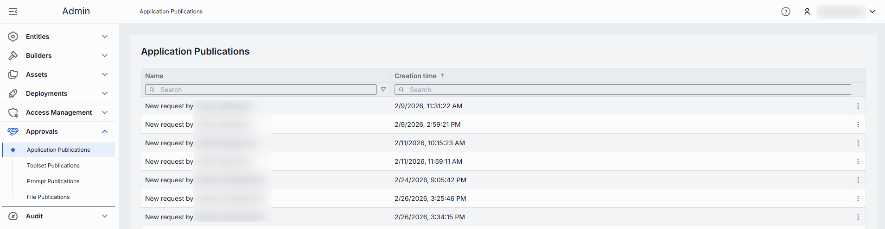
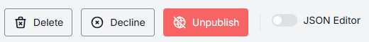
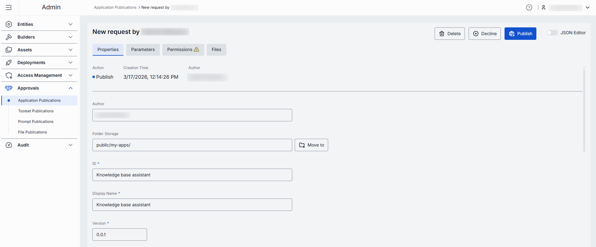
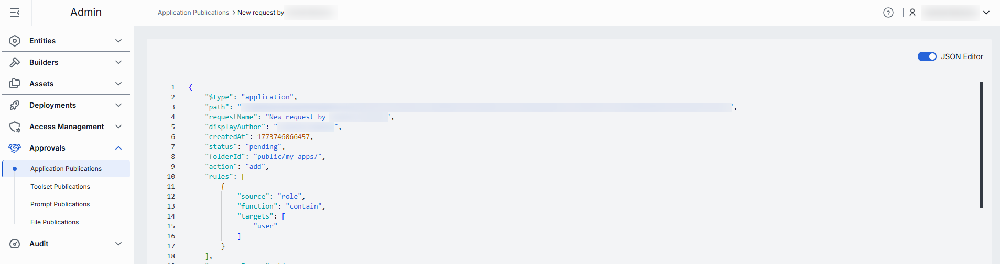
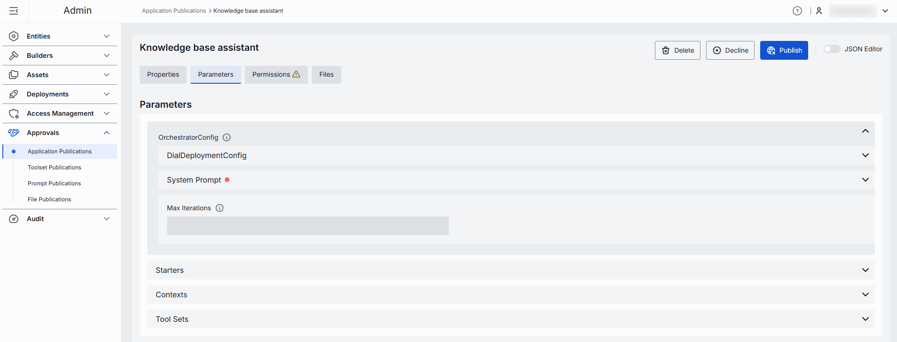
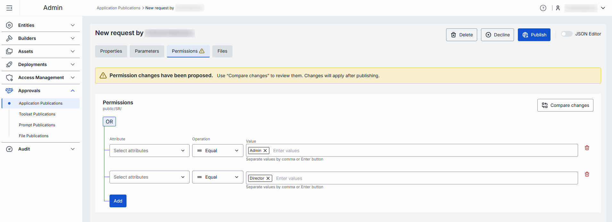

# Application Publications

## Introduction

DIAL users can publish their private applications to enable access to other users. Each publication request undergoes a review by DIAL administrators to ensure safety and security.

> You can find all published applications in [Assets/Applications](/docs/tutorials/3.admin/assets-applications.md) section. 

In this section of the DIAL Admin panel, admins can access and approve or decline requests to publish applications.

> * Refer to [Publications](/docs/platform/7.collaboration-intro.md#publication) to learn more about publications in DIAL.
> * Refer to [DIAL Chat User Guide](/docs/tutorials/0.user-guide.md#publications) to learn about the publication process from the perspective of a DIAL Chat end-user.
> * Refer to [Publication API](https://dialx.ai/dial_api#tag/Publications) for programmatic creation and management of publication requests.

## Main Screen

The Application Publications screen shows all publish/unpublish requests submitted by end-users using [Publication API](https://dialx.ai/dial_api#tag/Publications). 

##### Application publications grid

| Column | Description |
|--------|--------------|
| **Name** | Title of the submitted publication request (not the application). |
| **Author** | The user who has submitted the publication request. |
| **Creation time** | Publication request submission's timestamp. |

## Review Publication Request

Click any publication request on the main screen to access the review page. On this page, you can inspect the selected request and decide whether to **Publish**, **Unpublish**, **Decline** or delete it.

**Note**, that administrators can also modify selected properties in the request and take action on the modified request.

##### Top Bar Controls

* **Publish**: Applies to publish requests. Use to approve the request.
* **Unpublish**: Applies to unpublish requests. Use to approve the request and remove the published application from the public folder and make it inaccessible to other users.
* **Decline**: Reject the publish/unpublish request. Prompts you to enter a decline reason that will be sent back to the request author.
* **Delete**: Deletes the request.

### Properties

In this tab you can access and modify the selected properties of the application being published.

| Property | Editable | Description | 
|----------|----------|-------------|
| **Action** | No | Action to be taken on this request: Publish (to publish application) or Unpublish (to remove the application form the Public folder in DIAL file system). |
| **Creation Time** | No | Publication request creation timestamp. |
| **Author** | No | Name of the publication request creator. |
| **Folder Storage** | Yes | The path to the target folder in the Public file storage where the published application will be stored.   Use **Move to** to change the initial setting provided in the publication request. |
| **ID** | Yes |Unique identifier of the application. |
| **Display Name** | Yes | Name of the application displayed on UI. |
| **Version** | Yes | Version of the application to be published. |
| **Description** | Yes | Description of the application. |
| **Icon** | Yes | Application's icon that will be rendered on UI. |
| **Topics** | Yes | Topics are semantic labels that you can assign to apps (e.g. "finance", "support") for better navigation on UI. Click to display a list of available topics.   You can add your own custom topics to the list following these rules: - The topic name must not exceed 255 characters. - The topic name must not contain leading or trailing spaces. |
| **Source type** | Yes | Source type of application. - **Endpoints**: Application with this source type is a standalone application. DIAL Core communicates with such application via the explicitly-provided endpoints. - **Application runner**: Application runners can be seen as application factories, allowing users to create logical instances of apps with different configurations. Application runners are based on JSON schemas, which define structure, properties and endpoints for applications. In [Builders/Application Runners](/docs/tutorials/3.admin/builders-application-runners.md) you can see all the available runners and add new ones. |
| **Application runner** | Yes | Select one of the available application runners. If the application is created based on an application runner, DIAL Core will forward all payloads to endpoints defined in the [application runner configuration](/docs/tutorials/3.admin/builders-application-runners.md#features). Required if Source Type is **Application runner**. |
| **Completion endpoint** | Yes | Chat completion endpoint of the application. Required if Source Type is **Endpoints**. |
| **Attachment types** | Yes | Use to define the [attachment types](/docs/tutorials/1.developers/3.chat/0.chat-objects.md#attachments) (images, files) this app can have:   **Available values**:  **No attachments**: Disables all attachment types.    **All attachments types**: Allows all types of file attachments. Optionally specify max number of attachments.   **Specific attachments types**: Enables the user to define/select specific [MIME types](https://developer.mozilla.org/en-US/docs/Web/HTTP/Basics_of_HTTP/MIME_types/Common_types). Start typing to see suggestions or use `<type>/<subtype>` format for a manual entry. |
| **Attachments max number** | Yes | Maximum number of input attachments. Enabled if attachment types are defined. |
| **Defaults** | Yes | Default parameters for the application. Default parameters are applied if a request doesn't contain them in OpenAI chat/completions API call. |
| **Forward auth token** | Yes | Select a downstream auth token to forward from the user's session (for multi-tenant downstream). |
| **Max retry attempts** | Yes | Number of times DIAL Core will [retry](/docs/platform/3.core/5.load-balancer.md#fallbacks) a failed run (due to timeouts or 5xx errors). |

**Advanced users with technical expertise** can work with the publication request properties in a JSON editor view mode. It is useful for advanced scenarios and/or tweaking settings not exposed on UI.

> **TIP**: You can switch between UI and JSON only if there are no unsaved changes.

### Parameters

The Parameters tab within an application’s configuration allows administrators to manage application-specific parameters that influence its behavior. The content of this screen is determined by the [parameters of the related application runner](/docs/tutorials/3.admin/builders-application-runners.md#parameters).

### Permissions

If not defined otherwise, objects are published into the root (Public) folder in DIAL file storage by default. All authenticated users have access to this folder. To define access restrictions, publication request author can create a sub-folder and select it in the **Publish to** field in the publication request. Sub-folders can have access rules applied to them. Refer to [Access Rules](/docs/tutorials/3.admin/access-management-folders-storage.md#access-rules) to learn more.

In this section, you can see and modify access rules if they apply to the selected publication request.

### Files

If application includes files, they are published together with the application. For example, a talk-to-your-data application can include source files it uses to generate responses.

In this section, you can access and manage all files published with the application. 

| Field | Description |
|-------|-------------|
| **Display Name** | Name of the file. |
| **Extension** | File extension (e.g., `.json`, `.png`). |
| **Actions** | - **Preview**: Use the preview file content. Can be disabled for specific types of files.  - **Download**: Use to save file on your device.  - **Remove**: Use to remove file from the publication request. | 

Use **Add** to attach files to a publication request.

