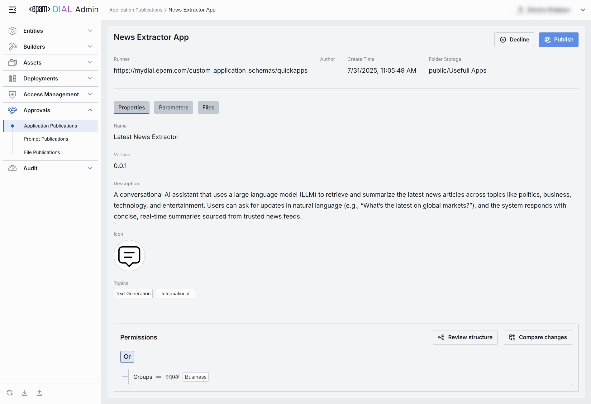
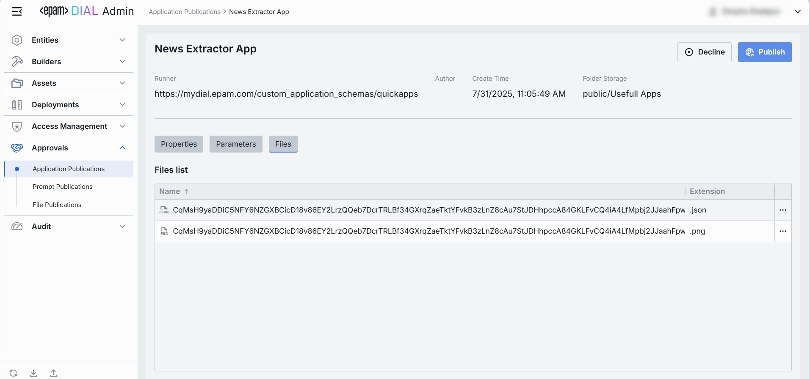

# Application Publications

## About Application Publications

DIAL offers [API](https://dialx.ai/dial_api#tag/Publications/operation/createPublication) for creating publication requests for resources, including applications.

In this section, an admin can review application properties, configuration and related files prior the approval of the publication request.

> * Refer to [Publications](/docs/platform/7.collaboration-intro.md#publication) to learn more about publications in DIAL.
> * Refer to [Publications](/docs/tutorials/0.user-guide.md#publications) in Chat user guide to learn more about end-to-end flow.

## Application Publications List

The Application Publications screen shows all apps that end-users have submitted for publication using the DIAL API. 

##### Application Publications Grid

| Field            | Definition                                                                                                                      |
|------------------|---------------------------------------------------------------------------------------------------------------------------------|
| **Name**         | The title of the submitted publication request (not the application).                                                           |
| **Author**       | The user who has submitted the publication request. Can be used to follow up with the creator if something needs clarification. |
| **Created at**   | Submission's timestamp.                                                                                                         |

## Application Publication Review Page

In the Application Publications Review page, you can inspect application publication request and decide whether to **Publish** it to marketplace or **Decline** it.

##### Top Bar

* **Publish**: Click Publish to approve the publication request and add application to the [DIAL Marketplace](/docs/tutorials/0.user-guide.md#marketplace), where other users can access it based on the publication rules specified in the publication request.
* **Decline**: Reject the publication request. Prompts you to enter a decline reason that will be sent back to the publication request author.

| Field               | Definition                                                                                               |
|---------------------|----------------------------------------------------------------------------------------------------------|
| **Runner**          | The application runner that is used by this app (shown as a URL).                                        |
| **Author**          | Username of the account that created the app publication request.                                        |
| **Create Time**     | The publication request's submission timestamp.                                                          |
| **Folder Storage**  | The path to the file storage folder where the application assets will be saved in case it is published.  |

## Properties Tab

The Properties tab shows the basic information about the app and related access rules. 

| Field            | Definition                                                                                                                                                               |
|------------------|--------------------------------------------------------------------------------------------------------------------------------------------------------------------------|
| **Name**         | The name of the application that will be rendered in [DIAL Marketplace](/docs/tutorials/0.user-guide.md#marketplace). It must be clear and policy-safe.   |
| **Version**      | Semantic version of the application (e.g., `0.0.1`) set on the DIAL chat side.                                                                                           |
| **Description**  | Summary of app's purpose and capabilities specified by the submitting user. Helps assess app's fit and scope.                                                            |
| **Icon**         | The application's icon that will be rendered on UI.                                                                                                                      |
| **Topics**       | Tags/categories (e.g., “Text Generation”, “Informational”) used for the app discovery in [DIAL Marketplace](/docs/tutorials/0.user-guide.md#marketplace). |
| **Permissions**  | The proposed access rules to the application (e.g., based on user group). Ensure the audience matches intended reach.                                                    |

**Controls:**
* **Review structure** opens a modal showing the storage folders tree and apps' folder position in the hierarchy.
* **Compare changes** side-by-side diff of **current vs proposed** permission rules to the app's folder. Use to verify and validate changes in access rules before approving the publication request.

## Parameters Tab

The Parameters tab provides administrators with technical metadata and runtime configuration related to the application. 

The content of this tab may vary depending on the app's type and configuration.

## Files Tab

The Files tab you can find a list of application-related assets. This section is empty if the application does not include any files.

| Field         | Definition                                                                       |
|---------------|----------------------------------------------------------------------------------|
| **Name**      | System-generated identifier of the file.                                         |
| **Extension** | File type (e.g., `.json`, `.png`).                                               |
| **Preview**   | An action button in the row menu can be used to open the file in a new tab.      |
| **Download**  | An action button in the row menu can be used to download the file to a local PC. |

