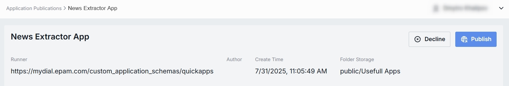

# Application Publications

## About Application Publications

DIAL users can publish their created apps to make them available to other users. Published apps become available in the public folder and can be accessible to users based on the access rules defined in the publication request. You can access published apps in [Assets/Applications](/docs/tutorials/3.admin/assets-applications.md) section. Published apps can be unpublished by DIAL admin or other DIAL users.

Apps can be published/unpublished using DIAL Core [API](https://dialx.ai/dial_api#tag/Publications/operation/createPublication) or in [DIAL Chat](/docs/tutorials/0.user-guide.md#publications).

In this section of the DIAL Admin panel, admins can access and approve or decline apps publication requests.

> * Refer to [Publications](/docs/platform/7.collaboration-intro.md#publication) to learn more about publications in DIAL.
> * Refer to [DIAL Chat User Guide](/docs/tutorials/0.user-guide.md#publications) to learn about the publication process from the perspective of a DIAL Chat end-user.

## Application Publications List

The Application Publications screen shows all publish/unpublish requests submitted by end-users using the DIAL API. 

##### Application Publications Grid

| Field            | Definition      |
|------------------|---------------------------------------------------------------------------------------------------------------------------------|
| **Name**         | The title of the submitted publication request (not the application).           |
| **Author**       | The user who has submitted the publication request. Can be used to follow up with the creator if something needs clarification. |
| **Created at**   | Publication request submission's timestamp.         |

## Review Page

Click any publication request on the main screen to access the review page. On this page, you can inspect the selected request and decide whether to **Publish**, **Unpublish** or **Decline** it.

##### Publication Request Controls

* **Publish**: Applies to publish requests. Use to approve the request.
* **Unpublish**: Applies to unpublish requests. Use to approve the request and remove the published application from the public folder and make it inaccessible to other users.
* **Decline**: Reject the publish/unpublish request. Prompts you to enter a decline reason that will be sent back to the request author.

| Field              | Definition   |
|--------------------|--------------|
| **Runner**         | The application runner that is used by this app (shown as a URL).        |
| **Author**         | The user who has submitted the publication request. Can be used to follow up with the creator if something needs clarification. |
| **Create Time**    | The publication request's submission timestamp.          |
| **Folder Storage** | The path to the file storage folder where the application assets will be saved in case it is published.  |

### Properties Tab

The Properties tab shows the basic information about the app and related access rules. 

| Field            | Definition |
|------------------|-----------|
| **Display Name**         | The name of the application that will be rendered in [DIAL Marketplace](/docs/tutorials/0.user-guide.md#dial-marketplace-home-page). It must be clear and policy-safe.   |
| **Version**      | Semantic version of the application (e.g., `0.0.1`) set on the DIAL chat side.           |
| **Description**  | Summary of app's purpose and capabilities specified by the submitting user. Helps assess app's fit and scope.            |
| **Icon**         | The application's icon that will be rendered on UI.      |
| **Topics**       | Tags/categories (e.g., “Text Generation”, “Informational”) used for the app discovery in [DIAL Marketplace](/docs/tutorials/0.user-guide.md#dial-marketplace-home-page). |
| **Permissions**  | The proposed access rules to the published application (e.g., based on user group). Ensure the audience matches intended reach. If rules are not defined, the published resources will be available to all users.   Available Controls:  - **Review structure** opens a modal showing the storage folders tree and apps' folder position in the hierarchy. - **Compare changes** side-by-side diff of **current vs proposed** permission rules to the app's folder. Use to verify and validate changes in access rules before approving the publication request.  |

### Parameters Tab

The Parameters tab provides administrators with technical metadata and runtime configuration related to the application. 

The content of this tab may vary depending on the app's type and configuration.

### Files Tab

In this tab you can find a list of application-related assets. This section is empty if the application does not include any files.

| Field         | Definition       |
|---------------|----------------------------------------------------------------------------------|
| **Name**      | System-generated identifier of the file.         |
| **Extension** | File type (e.g., `.json`, `.png`).               |
| **Preview**   | An action button in the row menu can be used to open the file in a new tab.      |
| **Download**  | An action button in the row menu can be used to download the file to a local PC. |

