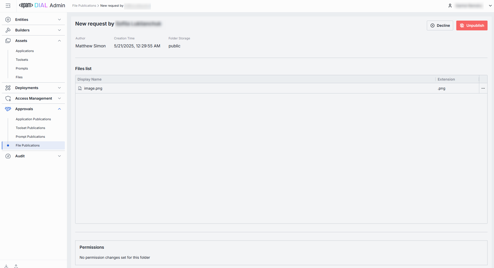

# File Publications

## About File Publications

DIAL users can leverage DIAL Core API to publish specific files to make them available to other users and apps in the organization. Published files become available in the public folder and can be accessible to users based on the access rules defined in the publication request.
DIAL Core provides [API](https://dialx.ai/dial_api#tag/Publications/operation/createPublication) for creating publication requests for resources, including files. 

Files from approved requests are available in [Assets/Files](/docs/tutorials/3.admin/assets-files.md). Published files can be unpublished by DIAL admin or other DIAL users.

> * Refer to [Publications](/docs/platform/7.collaboration-intro.md#publication) to learn more about publications in DIAL.
> * Refer to [User Guide](/docs/tutorials/0.user-guide.md#publications) to learn how to publish resources in DIAL Chat.

## File Publications List

The File Publications List screen shows all publish/unpublish requests submitted by end-users using the DIAL API. 

##### File Publications Grid

| Column         | Definition        |
|----------------|--------------------|
| **Name**       | A user-friendly name of the file submitted for publication.|
| **Author**     | The name of the publication request author.             |
| **Created at** | Timestamp when the file was submitted for publication. |

## Review Page

Click any publication request on the main screen to access the review page. On this page, you can inspect the selected request and decide whether to **Publish**, **Unpublish** or **Decline** it.

##### Publication Request Controls

On the top bar, you can find the following controls:

* **Publish**: Applies to publish requests. Use to approve the request.
* **Unpublish**: Applies to unpublish requests. Use to approve the request and remove the resource from the public folder and make it inaccessible to other users.
* **Decline**: Reject the publish/unpublish request. Prompts you to enter a decline reason that will be sent back to the request author.

| Element            | Definition     |
|--------------------|-----------------|
| **Author**         | A username of the account that created the file publication request.  |
| **Creation Time**     | A timestamp of when the file publication request was submitted for review.       |
| **Folder Storage** | The default target folder under [Assets → Files](/docs/tutorials/3.admin/assets-files.md), if published.                     |
| **Display Name**      | File display name.                   |
| **Extension** | File type/extension (e.g. .pdf, .csv, .docx).              |
| **Permissions**    | The proposed access rules to the published file (e.g., based on user group). Ensure the audience matches intended reach. If rules are not defined, the published resources will be available to all users.   Available Controls:  - **Review structure** opens a modal showing the storage folders tree and file's folder position in the hierarchy. - **Compare changes** side-by-side diff of **current vs proposed** permission rules to the file's folder. Use to verify and validate changes in access rules before approving the publication request.  |

