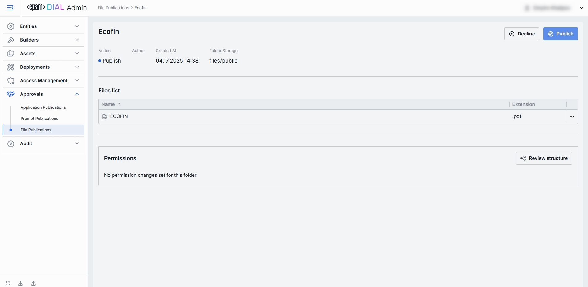

# File Publications

## About File Publications

DIAL offers [API](https://dialx.ai/dial_api#tag/Publications/operation/createPublication) for creating publication requests for resources, including files. In File Publications, administrators can view and manage publication requests. Files from approved requests are available in [Assets → Files](/docs/tutorials/3.admin/assets-files.md).

> * Refer to [Publications](/docs/platform/7.collaboration-intro.md#publication) to learn more about publications in DIAL.
> * Refer to [User Guide](/docs/tutorials/0.user-guide.md#publications) to learn how to publish resources in DIAL Chat.

## File Publications List

In File Publications, you can review all requests to publish files and decide whether to approve or to decline them.

##### File Publications Grid

| Column         | Definition                                                                                                                      |
|----------------|---------------------------------------------------------------------------------------------------------------------------------|
| **Name**       | A user-friendly name of the file submitted for publication.                                                                  |
| **Author**     | The name of the publication request author.                                                                               |
| **Created at** | Timestamp when the file was submitted for publication. |

## Review Page

When a DIAL Core user submits a file publication request, it appears on the main File Publications screen. Click any request to access the review screen, where you can inspect it and either Publish it into the central Assets store or Decline it (with feedback).

##### Top Bar Controls

* **Publish**: Accept the publication request. This adds the file into the Assets → Prompts folder (under the specified Folder).
* **Decline**: Reject the publication request. Prompts you to enter a decline reason that will be sent back to the publication request author.

| Element            | Definition                                                                       |
|--------------------|----------------------------------------------------------------------------------|
| **Action**         | A suggested action. The **Publish** action button is highlighted when review is pending.        |
| **Author**         | A username of the account that created the file publication request.  |
| **Created At**     | A timestamp of when the file publication request was submitted for review.                             |
| **Folder Storage** | The default target folder under [Assets → Files](/docs/tutorials/3.admin/assets-files.md), if published.                     |
| **File Name**      | File display name.                                                               |
| **File Extension** | File type/extension (e.g. .pdf, .csv, .docx).                                    |
| **Permissions**    | Shows the target folder's place in [folders hierarchy](/docs/tutorials/3.admin/access-management-folders-storage.md) and respective permissions. |