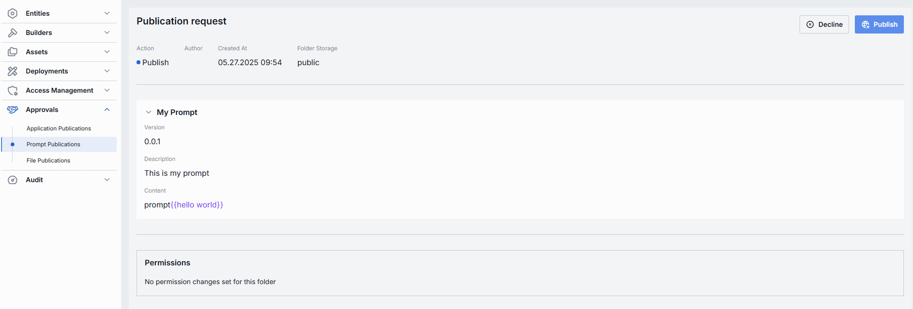

# Prompt Publications

## About Prompt Publications

DIAL users can publish their created prompts to make them available to other users. Published prompts become available in the public folder and can be accessible to users based on the publication rules defined during the publication process.

Prompts can be published using DIAL Core [API](https://dialx.ai/dial_api#tag/Publications/operation/createPublication) or in [DIAL Chat](/docs/tutorials/0.user-guide.md#publications).

In this section of the DIAL Admin panel, admins can access and approve or decline prompts publication requests.

> * Refer to [Publications](/docs/platform/7.collaboration-intro.md#publication) to learn more about publications in DIAL.
> * Refer to [DIAL Chat User Guide](/docs/tutorials/0.user-guide.md#publications) to learn about the publication process from the perspective of a DIAL Chat end-user.

### Prompt Publications List

The Prompt Publications screen shows all prompts that end-users have submitted for publication using the DIAL API. 

##### Prompt Publications Grid

| Column         | Definition|
|----------------|-----------|
| **Name**       | A user-friendly name of the prompt submitted for publication.|
| **Author**     | A username of the publication request author.|
| **Created at** | A timestamp when the prompt was submitted for publication. Sorted ascending/descending to find newest or oldest submissions easily. |
| **Folder Storage** | The location of the prompt in [Assets](/docs/tutorials/3.admin/assets-prompts.md). |

### Prompt Publication Review

In the Prompt Publications – Review page, you can inspect prompt publication requests and decide whether to **Publish** them into the shared [Assets → Prompts](/docs/tutorials/3.admin/assets-prompts.md) library or **Decline**.

##### Top Bar Controls

* **Publish**: Accept the publication request. This adds the prompt into the [Assets → Prompts](/docs/tutorials/3.admin/assets-prompts.md) folder (under the specified Folder).
* **Decline**: Reject the publication request. Prompts you to enter a decline reason that will be sent back to the publication request author.

| Element                | Definition                                                                        |
|------------------------|-----------------------------------------------------------------------------------|
| **Action**             | Suggested action. The **Publish** action button is highlighted when review is pending.                            |
| **Author**             | Username of the account that created the prompt publication request. |
| **Created At**         | Timestamp of when the prompt publication request was submitted for review.                            |
| **Folder Storage**     | The default target folder under [Assets → Prompts](/docs/tutorials/3.admin/assets-prompts.md), if published.                    |
| **Prompt Identifier**  | Header showing the prompt’s **name**.                                             |
| **Version**            | Version string assigned by the author.                                            |
| **Description**        | Optional user-friendly summary provided by the author.                           |
| **Content**            | The actual prompt string.         |
| **Permissions**        | Shows the target folder's place in [folders hierarchy](/docs/tutorials/3.admin/access-management-folders-storage.md) and respective permissions.  |
