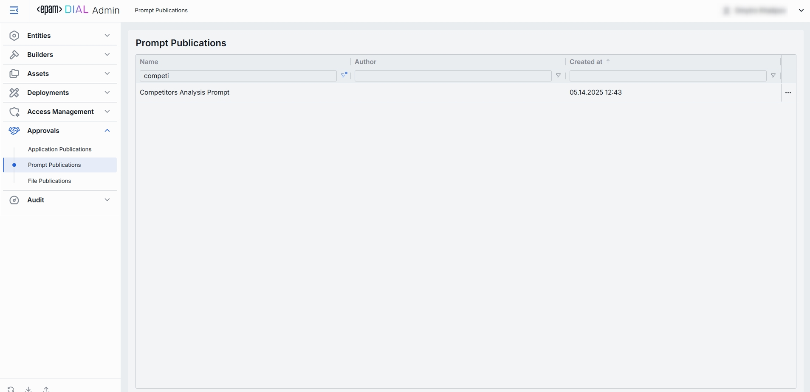
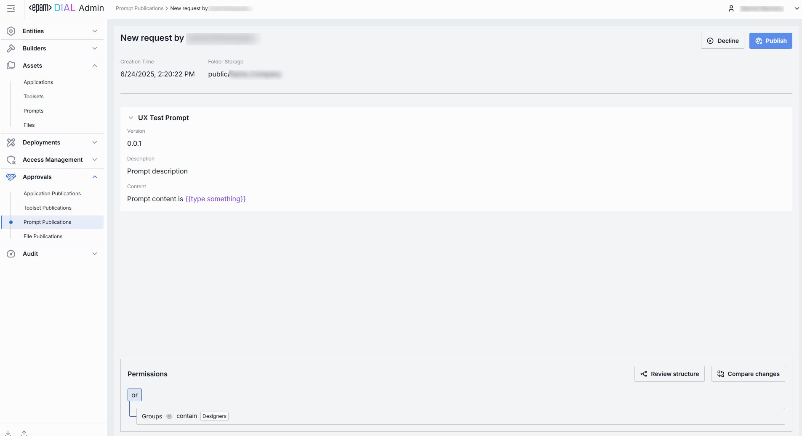

# Prompt Publications

## About Prompt Publications

DIAL users can publish their created prompts to make them available to other users. Published prompts become available in the public folder and can be accessible to users based on the access rules defined during the publication process. You can access published prompts in [Assets/Prompts](/docs/tutorials/3.admin/assets-prompts.md) section. Published prompts can be unpublished by DIAL admin or other DIAL users.

Prompts can be published using DIAL Core [API](https://dialx.ai/dial_api#tag/Publications/operation/createPublication) or in [DIAL Chat](/docs/tutorials/0.user-guide.md#publications).

In this section of the DIAL Admin panel, admins can access and approve or decline prompts publication requests.

> * Refer to [Publications](/docs/platform/7.collaboration-intro.md#publication) to learn more about publications in DIAL.
> * Refer to [DIAL Chat User Guide](/docs/tutorials/0.user-guide.md#publications) to learn about the publication process from the perspective of a DIAL Chat end-user.

## Prompt Publications List

The Prompt Publications screen shows all publish/unpublish requests submitted by end-users using the DIAL API. 

##### Prompt Publications Grid

| Column         | Definition|
|----------------|-----------|
| **Name**       | A user-friendly name of the prompt submitted for publication.|
| **Author**     | A username of the publication request author.|
| **Created at** | A timestamp when the prompt was submitted for publication. Sorted ascending/descending to find newest or oldest submissions easily. |
| **Folder Storage** | The location of the prompt in [Assets](/docs/tutorials/3.admin/assets-prompts.md). |

## Review Page

Click any publication request on the main screen to access the review page. On this page, you can inspect the selected request and decide whether to **Publish**, **Unpublish** or **Decline** it.

##### Publication Request Controls

On the top bar, you can find the following controls:

* **Publish**: Applies to publish requests. Use to approve the request.
* **Unpublish**: Applies to unpublish requests. Use to approve the request and remove the published prompts(s) from the public folder and make it inaccessible to other users.
* **Decline**: Reject the publish/unpublish request. Prompts you to enter a decline reason that will be sent back to the request author.

| Element                | Definition  |
|------------------------|-------------|
| **Author**             | Username of the account that created the prompt publication request. |
| **Creation Time**         | Timestamp of when the prompt publication request was submitted for review. |
| **Folder Storage**     | The default target folder under [Assets → Prompts](/docs/tutorials/3.admin/assets-prompts.md), if published.                    |
| **Prompt Identifier**  | Header showing the prompt’s **name**.                  |
| **Version**            | Version string assigned by the author.                 |
| **Description**        | Optional user-friendly summary provided by the author.|
| **Content**            | The actual prompt string.         |
| **Permissions**        | The proposed access rules to the published prompt (e.g., based on user group). Ensure the audience matches intended reach. If rules are not defined, the published resources will be available to all users.   Available Controls:  - **Review structure** opens a modal showing the storage folders tree and prompt's folder position in the hierarchy. - **Compare changes** side-by-side diff of **current vs proposed** permission rules to the prompt's folder. Use to verify and validate changes in access rules before approving the publication request. |

