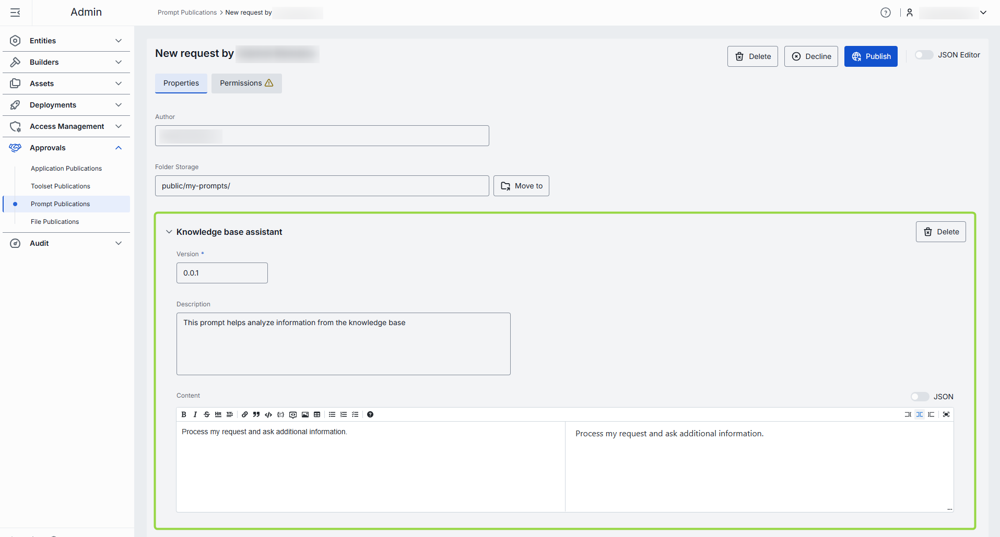
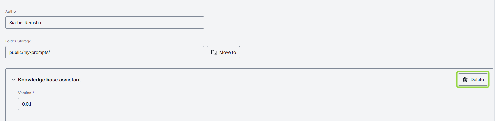
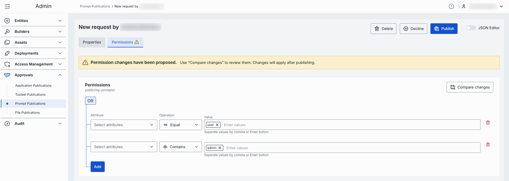

# Prompt Publications

DIAL users can publish their private prompts to enable access to other users. Each publication request undergoes a review by DIAL administrators to ensure safety and security.

> You can access published prompts in [Assets/Prompts](/docs/tutorials/3.admin/assets-prompts.md) section.

In this section of the DIAL Admin panel, admins can access and approve or decline requests to publish prompts.

> * Refer to [Publications](/docs/platform/7.collaboration-intro.md#publication) to learn more about publications in DIAL.
> * Refer to [DIAL Chat User Guide](/docs/tutorials/0.user-guide.md#publications) to learn about the publication process from the perspective of a DIAL Chat end-user.
> * Refer to [Publication API](https://dialx.ai/dial_api#tag/Publications) for programmatic creation and management of publication requests.

## Main Screen

The Prompt Publications screen shows all publish/unpublish requests submitted via [DIAL Chat UI](/docs/tutorials/0.user-guide.md#publish-1) or [Publication API](https://dialx.ai/dial_api#tag/Publications). 

##### Prompts publications grid

| Column | Description |
|--------|-------------|
| **Name** | Title of the submitted publication request. |
| **Author** | The user who has submitted the publication request. |
| **Creation time** | Publication request submission's timestamp. |

## Review Publication Request

Click any request on the main screen to access the review page. On this page, you can inspect the selected request and decide whether to **Publish**, **Unpublish**, **Decline** or delete it.

### Actions

* **Publish**: Applies to publish requests. Use to approve the request.
* **Unpublish**: Applies to unpublish requests. Use to approve the request and remove the published prompt from the Public folder and make it inaccessible to other users.
* **Decline**: Reject the publish/unpublish request. Prompts you to enter a decline reason that will be sent back to the request author.
* **Delete**: Deletes the publication request.

### Properties

In this tab you can access and modify the selected properties of the prompt and publication request.

##### Publication request properties

| Property | Editable | Description | 
|----------|----------|-------------|
| **Action** | No | Action to be taken on this request: Publish (to publish prompt) or Unpublish (to remove the prompt form the Public folder in DIAL file system). |
| **Creation Time** | No | Publication request creation timestamp. |
| **Author** | Yes | Name of the publication request creator. |
| **Folder Storage** | Yes | The path to the target folder in the Public file storage where the published prompt will be stored.   Use **Move to** to change the initial setting provided in the publication request. |

##### Prompt properties

| Property | Editable | Description | 
|----------|----------|-------------|
| **Version** | Yes | Prompt version. |
| **Description** | Yes | Description of the prompt purpose. |
| **Content** | Yes | The content of the prompt. |

##### Delete prompt

Publication request made via Publication API can include more that one prompt. Use **Delete** in prompt properties area to delete prompts if necessary.

##### JSON Editor

**Advanced users with technical expertise** can work with prompt and publication request properties in the UI or a JSON editor view modes. It is useful for advanced scenarios of bulk updates, copy/paste between environments, or tweaking settings not exposed on UI.

> **TIP**: You can switch between UI and JSON only if there are no unsaved changes.

### Permissions

If not defined otherwise, objects are published into the root (Public) folder in DIAL file storage by default. All authenticated users have access to this folder. To define access restrictions, publication request author can create a sub-folder and select it in the **Publish to** field in the publication request. Sub-folders can have access rules applied to them. Refer to [Access Rules](/docs/tutorials/3.admin/access-management-folders-storage.md#access-rules) to learn more.

In this section, you can see and modify access rules if they apply to the selected publication request.

