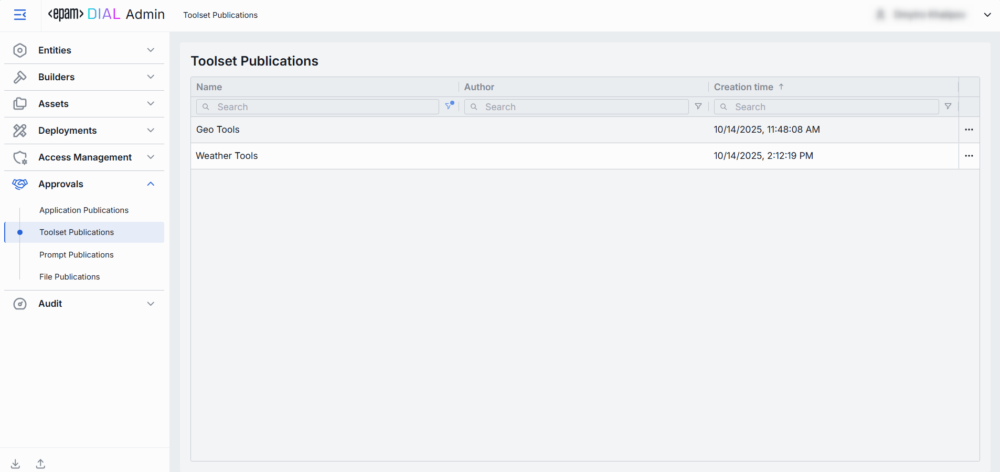
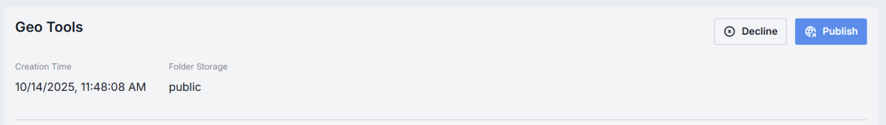
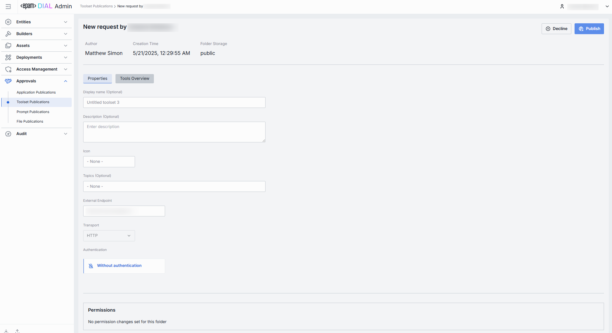
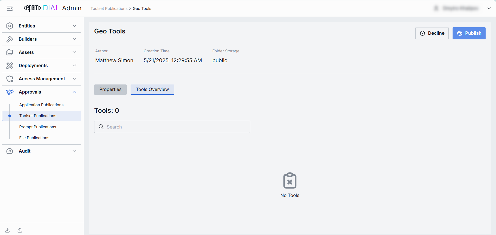

# Toolset Publications

## About Toolset Publications

DIAL offers [API](https://dialx.ai/dial_api#tag/Publications/operation/createPublication) for creating publication requests for resources, including toolsets.

In this section, an admin can review toolset properties and related tools prior the approval of the publication request.

> * Refer to [Publications](/docs/platform/7.collaboration-intro.md#publication) to learn more about publications in DIAL.
> * Refer to [Publications](/docs/tutorials/0.user-guide.md#publications) in Chat user guide to learn more about end-to-end flow.

## Toolset Publications List

The Toolset Publications screen shows all toolsets that end-users have submitted for publication using the DIAL API. 

##### Toolset Publications Grid

| Field             | Definition                                                                                                                      |
|-------------------|---------------------------------------------------------------------------------------------------------------------------------|
| **Name**          | The title of the submitted publication request (not the toolset).                                                               |
| **Author**        | The user who has submitted the publication request. Can be used to follow up with the creator if something needs clarification. |
| **Creation Time** | Submission's timestamp.                                                                                                         |

## Toolset Publication Review Page

In the Toolset Publications Review page, you can inspect toolset publication request and decide whether to **Publish** or **Decline** it.

##### Top Bar

* **Publish**: Click Publish to approve the publication request and add toolset to the [DIAL Marketplace](/docs/tutorials/0.user-guide.md#dial-marketplace-home-page), where other users can access it based on the publication rules specified in the publication request.
* **Decline**: Reject the publication request. Prompts you to enter a decline reason that will be sent back to the publication request author.

| Field               | Definition                                                                                          |
|---------------------|-----------------------------------------------------------------------------------------------------|
| **Create Time**     | The publication request's submission timestamp.                                                     |
| **Folder Storage**  | The path to the file storage folder where the toolset assets will be saved in case it is published. |

### Properties Tab

The Properties tab shows the basic information about the app and related access rules. 

| Field                  | Definition & Use Case                                                                                                                                                                    |
|------------------------|------------------------------------------------------------------------------------------------------------------------------------------------------------------------------------------|
| **Creation Time**      | The timestamp of when the toolset was created.                                                                                                                                           |
| **Folder Storage**     | The path to the toolset's location in the hierarchy of folders.                                                                                                                          |
| **Display Name**       | The name of the toolset assigned by the author.                                                                                                                                          |
| **Description**        | A free-text summary describing the toolset.                                                                                                                                              |
| **Icon**               | A logo to visually distinguish the toolset on the UI. Maximum size: 512 MB. Supported types: .jpeg, .jpg, .jpe, .png, .gif, .apng, .webp, .avif, .svg, .svgz, .bmp, .ico. Up to 1 files. |
| **Topics**             | Tags that you can assign to toolset. Helps to assign categories for better navigation on UI.                                                                                             |
| **External Endpoint**  | The endpoint that a Quick App can call to fetch external data.                                                                                                                           |
| **Transport**          | Default HTTP; choose SSE for server-sent events when supported.                                                                                                                          |

### Tools Overview

Tools in toolsets are functionalities that extend the capabilities of your DIAL Quick Apps. 
Tools can include applications or models deployed in DIAL, external services, and web APIs.
E.g., allowing to fetch the weather forecast from external API, or to get the geocode by address in Google Maps. 

The Tools Overview tab is where you review which tools belong to a toolset.

