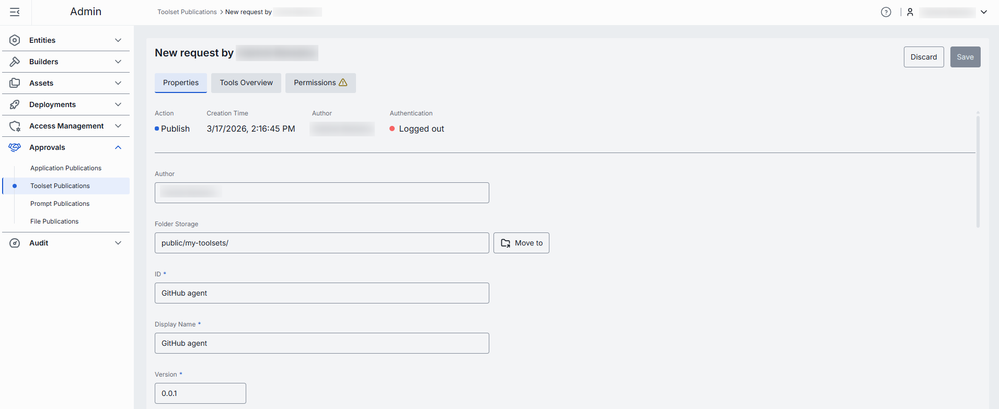
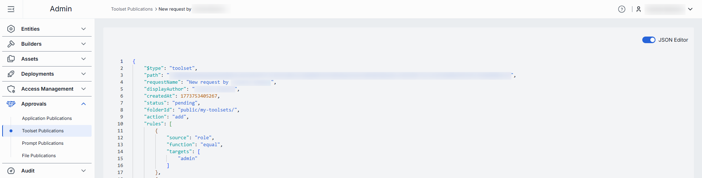
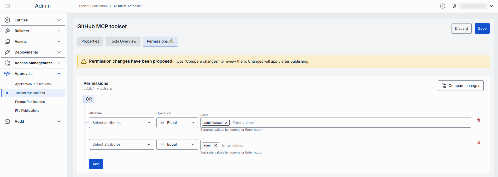

# Toolset Publications

## Introduction

DIAL users can publish their private toolsets to enable access to other users. Each publication request undergoes a review by DIAL administrators to ensure safety and security.

> You can find all published toolsets in [Assets/Toolsets](/docs/tutorials/3.admin/assets-toolsets.md) section. 

In this section of the DIAL Admin panel, admins can access and approve or decline requests to publish toolsets.

> * Refer to [Publications](/docs/platform/7.collaboration-intro.md#publication) to learn more about publications in DIAL.
> * Refer to [DIAL Chat User Guide](/docs/tutorials/0.user-guide.md#publications) to learn about the publication process from the perspective of a DIAL Chat end-user.
> * Refer to [Publication API](https://dialx.ai/dial_api#tag/Publications) for programmatic creation and management of publication requests.

## Main Screen

The Toolsets Publications screen shows all publish/unpublish requests submitted via [DIAL Chat UI](/docs/tutorials/0.user-guide.md#publish-3) or [Publication API](https://dialx.ai/dial_api#tag/Publications). 

##### Toolset publications grid

| Column | Description |
|--------|--------------|
| **Name** | Title of the submitted publication request. |
| **Author** | The user who has submitted the publication request. |
| **Creation time** | Publication request submission's timestamp. |

## Review Publication Request

Click any publication request on the main screen to access the review page. On this page, you can inspect the selected request and decide whether to **Publish**, **Unpublish**, **Decline** or delete it.

**Note**, that administrators can also modify selected properties in the request and take action on the modified request.

### Actions

* **Publish**: Applies to publish requests. Use to approve the request.
* **Unpublish**: Applies to unpublish requests. Use to approve the request and remove the published toolset from the Public folder and make it inaccessible to other users. **Note**, that deleting resources can break workflows that use them.
* **Decline**: Reject the publish/unpublish request. Prompts you to enter a decline reason that will be sent back to the request author.
* **Delete**: Deletes the request.

### Properties

In this tab you can access and modify the selected properties of the toolset being published and the publication request.

| Property | Editable | Description | 
|----------|----------|-------------|
| **Action** | No | Action to be taken on this request: Publish (to publish toolset) or Unpublish (to remove the toolset form the Public folder in DIAL file system). |
| **Creation Time** | No | Publication request creation timestamp. |
| **Authentication** | No | Current authentication status of the selected toolset:  - **Logged out**: The toolset in not authenticated with the related MCP server.  - **Logged in (Personal)**: The toolset is authenticated for your user only.  - **Logged in (Organization)**: The toolset is authenticated for all users in your organization. | 
| **Author** | Yes | Name of the publication request creator. |
| **Folder Storage** | Yes | The path to the target folder in the Public file storage where the published toolset will be stored.   Use **Move to** to change the initial setting provided in the publication request. |
| **ID** | Yes |Unique identifier of the toolset. |
| **Display Name** | Yes | Name of the toolset displayed on UI. |
| **Version** | Yes | Version of the toolset to be published. |
| **Description** | Yes | Description of the toolset. |
| **Icon** | Yes | Toolset's icon that will be rendered on UI. |
| **Topics** | Yes | Topics are semantic labels that you can assign to toolsets (e.g. "finance", "support") for better navigation on UI. Click to display a list of available topics.   You can add your own custom topics to the list following these rules: - The topic name must not exceed 255 characters. - The topic name must not contain leading or trailing spaces. |
| **External Endpoint**  | Yes | Toolset API endpoint for MCP calls. |
| **Transport** | Yes | Transport supported by a related endpoint. Available options: HTTP (default) or SSE (deprecated). |
| **Authentication** | Yes | [Toolset authentication configuration](/docs/tutorials/3.admin/entities-toolsets.md#authentication). |

##### JSON Editor

**Advanced users with technical expertise** can work with toolset and publication request properties in the UI or a JSON editor view modes. It is useful for advanced scenarios of bulk updates, copy/paste between environments, or tweaking settings not exposed on UI.

> **TIP**: You can switch between UI and JSON only if there are no unsaved changes.

### Tools Overview

[Tools](https://modelcontextprotocol.io/specification/2025-06-18/server/tools) are specific functions supported by a related MCP server that can be used by clients to perform specific actions.

On this screen, you can see and edit tools supported by the toolset submitted for publication.

> Refer to [Toolsets](/docs/tutorials/3.admin/entities-toolsets.md#tools-overview) to learn more about this functionality.

### Permissions

If not defined otherwise, objects are published into the root (Public) folder in DIAL file storage by default. All authenticated users have access to this folder. To define access restrictions, publication request author can create a sub-folder and select it in the **Publish to** field in the publication request. Sub-folders can have access rules applied to them. Refer to [Access Rules](/docs/tutorials/3.admin/access-management-folders-storage.md#access-rules) to learn more.

In this section, you can see and modify access rules if they apply to the selected publication request.

