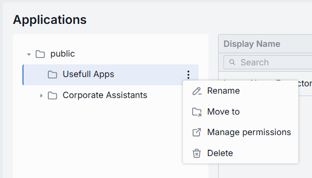

# Applications

## About Applications

Application is a DIAL-native service that implements DIAL’s unified API and can be called from the chat UI. 
Applications are also used as a building block (“agent”) inside other apps. Apps can directly front one or more models, toolsets and orchestrate interceptors. 

> Refer to [User Guide](/docs/tutorials/0.user-guide.md#applications) to learn more about applications.

## Applications List

In the list you can see all the Applications created by DIAL users.

### Grid and Folders

##### Folders Structure (Left Pane)

| Element                | Behavior                                                                                                                    |
|------------------------|-----------------------------------------------------------------------------------------------------------------------------|
| **Root folder**        | A root folder with the applications and sub-folders. It is visible to all users.                                            |
| **Sub-folders**        | Collapsible folders you create to group applications.                                                                       |
| **Collapse All**       | Button in the bottom of pane. Allows to collapse all expanded folders in the folders tree.                                  |
| **Context actions**    | Hover the folder to see additional actions.                                                                                 |
| **Rename**             | Allows to rename the folder. Requires folder name to be provided.                                                           |
| **Move to**            | Allows moving the folder to another place in the folders tree.                                                              |
| **Manage permissions** | Redirects to [Folder Storage](/docs/tutorials/3.admin/access-management-folders-storage.md) to manage access to the folder. |
| **Delete**             | Deletes the folder and all its applications. Requires confirmation.                                                         |

##### Applications Grid (Right Pane)

| Column           | Definition                                                                                                |
|------------------|-----------------------------------------------------------------------------------------------------------|
| **Display Name** | In a combination with version comprises a technical key for the application (e.g. `workflow helper`).     |
| **Version**      | Version of the application.                                                                               |
| **Author**       | A username or system ID of the user who created or last modified this application.                        |
| **Updated time** | The timestamp of the last modification of the application. Use to track changes.                          |
| **Actions**      | Row menu with actions:   - Open application in new tab   - Move to another folder - Delete |

## Configuration

##### Top Bar Controls

* **Delete**: Permanently removes the selected application from your DIAL instance.
* **JSON Editor** (Toggle): Switch between the form-based UI and raw JSON view of the application’s configuration. Use JSON mode for configuration copy-pastes.

### Properties

In the Properties tab, you can define the application's parameters.

| Field              | Required | Definition & Use Case                                                                                                                                                                                       |
|--------------------|----------|-------------------------------------------------------------------------------------------------------------------------------------------------------------------------------------------------------------|
| **Display Name**   | -        | The Name of the application given by the author. Display-only but with a copy-to-clipboard button for easy reference.                                                                                       |
| **Runner**         | -        | Also known as `ApplicationTypeSchemas` in [DIAL Core dynamic settings](https://github.com/epam/ai-dial-core?tab=readme-ov-file#dynamic-settings), is predefined template used for creating the application. |
| **Author**         | -        | A username or system ID of the user who created or last modified this application.                                                                                                                          |
| **Creation time**  | -        | The timestamp of when the application was created.                                                                                                                                                          |
| **Updated Time**   | -        | Date and time when the app's configuration was last updated.                                                                                                                                                |
| **Version**        | -        | Version of the application. Can be selected from the dropdown.                                                                                                                                              |
| **Description**    | No       | A free-text summary describing the application (e.g. tooling, supported inputs/outputs, SLAs).                                                                                                              |
| **Icon**           | No       | A logo to visually distinguish the app on the UI.                                                                                                                                                           |
| **Topics**         | No       | Tags that you can assign to apps (e.g. "finance", "support"). Helps to split apps into categories for better navigation on UI.                                                                              |
| **Storage Folder** | Yes      | The actual path of the application in the folders hierarchy. Allows you to move the application across folders.                                                                                             |  

### Features

In the Features tab, you can control optional capabilities of application. 

#### Endpoints

You can override or extend DIAL Core’s built-in protocol calls with your own HTTP services. Here, you can specify endpoints used by [Application Runners](/docs/tutorials/3.admin/builders-application-runners.md) to perform preprocessing or policy checks before delegating to your underlying models and workflows.

| Field                        | Description & When to Use                       |
|------------------------------|-------------------------------------------------|
| **Rate endpoint**            | A URL to call a custom rate-estimation API.     |
| **Tokenize endpoint**        | A URL to call a custom tokenization service.    |
| **Truncate prompt endpoint** | A URL to call your own prompt-truncation API.   |
| **Configuration endpoint**   | A URL to fetch dynamic app-specific settings    |

#### Feature Flags (Toggles)

Enable or disable per-request options that your application accepts from clients and forwards to the underlying models. **Toggle On/Off** any feature as needed.

| Toggle                        | What It Does                                                                                                                                                  |
|-------------------------------|---------------------------------------------------------------------------------------------------------------------------------------------------------------|
| **System prompt**             | Enables an initial "system" message injection. Useful for orchestrating multi-step agents where you need to enforce a global policy at the application level. |
| **Tools**                     | Enables `tools`/`functions` payloads in API calls. Switch on if your application makes external function calls (e.g. calendar lookup, database fetch).        |
| **Seed**                      | Enables the `seed` parameter for reproducible results. Great for testing or deterministic pipelines.  Disable to ensure randomized creativity.                |
| **URL Attachments**           | Enables URL references (images, docs) as attachments in API requests. Must be enabled if your workflow downloads or processes remote assets via URLs.         |
| **Folder Attachments**        | Enables attachments of folders (batching multiple files).                                                                                                     |
| **Accessible by request key** | Indicates whether the deployment is accessible using a [per-request API key](/docs/platform/3.core/3.per-request-keys.md).                                    |
| **Content parts**             | Indicates whether the deployment supports requests with content parts or not.                                                                                 |
| **Consent required**          | indicates whether the application requires user consent before use.                                                                                           |
