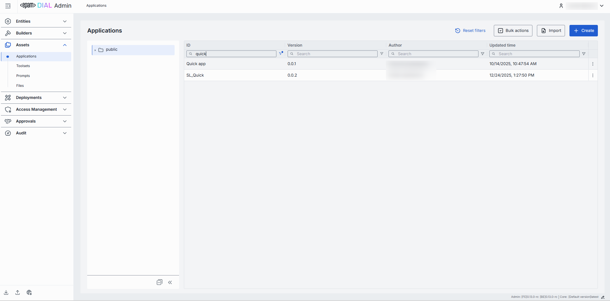
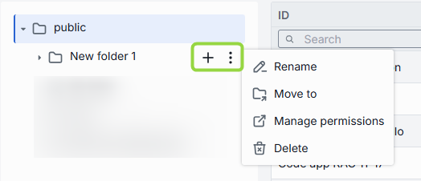
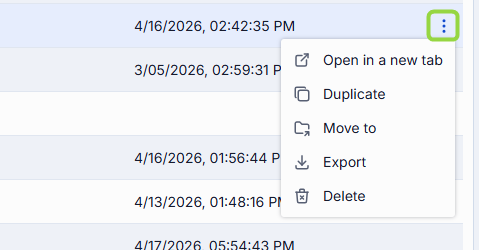
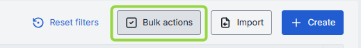
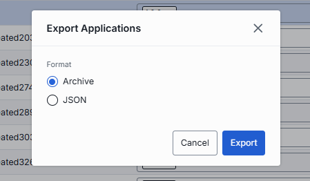
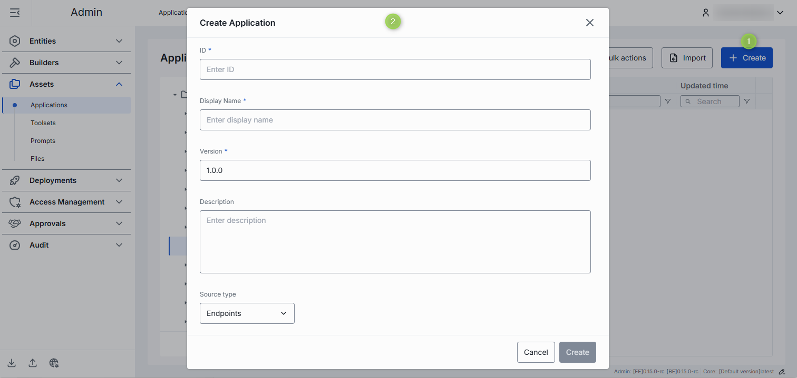
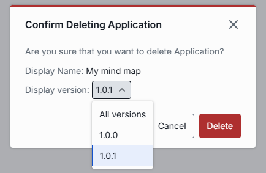
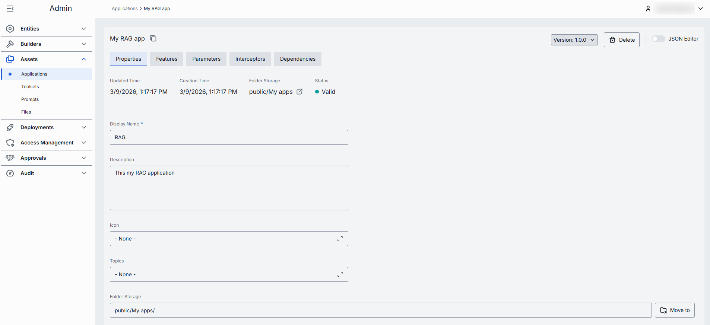
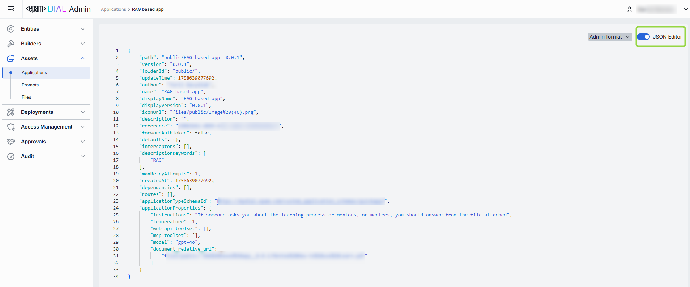

# Applications

## Introduction

In DIAL, applications created by users (either using DIAL Core API or UI) are stored in a private folder of a dedicated user in the DIAL file storage and are not accessible to anyone but the application author (owner). To enable access for other users, application owners can publish applications or DIAL administrators can manually add applications to the Public folder, where all published resources are stored.

> Refer to [Entities/Applications](/docs/tutorials/3.admin/entities-applications.md) to learn about applications in DIAL.

## Main Screen

The Assets/Applications screen displays all applications located in the Public folder in DIAL file storage. Applications get to the Public folder when published by users or added by administrators.

> * Refer to [Access Control](/docs/platform/3.core/2.access-control-intro.md) to learn more about Private and Public logical spaces for objects storage in DIAL.
> * Refer to [Chat User Guide](/docs/tutorials/0.user-guide.md#publish-2) to learn how end users can publish applications and to [DIAL Core API Publications](https://dialx.ai/dial_api#tag/Publications) to learn how to create and manage publication requests via API.

##### Public file storage

Objects in the [Public folder](/docs/platform/3.core/2.access-control-intro.md) are arranged hierarchically, similar to a file system. 

- **Root folder**: Pubic is a root folder with sub-folders. It is visible to all authorized users. If a sub-folder is not specified for the new object being published, it is placed in the root folder by default.
- **Sub-folders**: Objects can be placed in sub-folders for logical organization purposes - one object per sub-folder is recommended. 

> **Note**, that access rules can be applied to sub-folders (manually or in publication request). You can view and manage access rules in [Folders Storage](/docs/tutorials/3.admin/access-management-folders-storage.md). The effective authorization rule for an object in a sub-folder includes restrictions applied to all parent sub-folders up to the root folder. Refer to [Tutorials](/docs/tutorials/1.developers/1.work-with-resources/0.work-with-publications.md#effective-rules) to learn about affective rules for folders.

| Available Actions | Description |
|-------------------|-------------|
| **Create sub-folder + import objects** | Hover over any folder to display the **+** icon. It allows importing objects into new child or sibling sub-folders. Same flow as [Import](#import), but requires providing a new folder name. **Note** that new sub-folders can be added only via this method or along with the publication request if a new folder is defined in it. |
| **Actions** | Hover over any folder to view a context menu icon with actions you can perform in relation to the selected folder. **Note**, that actions performed to a folder with apps that include attached files will be applied to a related folder in [Assets/Files](/docs/tutorials/3.admin/assets-files.md).   - **Rename**: Use to rename the selected folder.  - **Move to**: Use to select a target location in the hierarchy to move the selected folder. - **Manage permissions**: Redirects to [Folder Storage](/docs/tutorials/3.admin/access-management-folders-storage.md) to manage access to the folder. - **Delete**: Use to delete the folder with objects inside it.|

##### Applications grid

Click any folder to display its content in the applications grid.

| Column | Description |
|--------|-------------|
| **ID** | Unique identifier of the application. |
| **Version** | Published version of the application. |
| **Author** | Username or system ID associated with the user who created or last updated this application. |
| **Updated time** | Timestamp of the last modification of the application. |
| **Actions** | Actions you can perform on the selected application: - **Open in new tab**: Opens the application's properties, features, and parameters in a new tab. - **Move to another folder**: Select a target folder in the hierarchy to move the application. - **Delete**: Remove the application. You can also use **Bulk Actions** in the toolbar to delete multiple applications at once. - **Duplicate**: Create a copy of the application in one of two ways: **New version**: Creates another version of the selected application. You can also quickly add a new version on the [Configuration](#configuration) screen by clicking **Create** in the **Version** dropdown. **New application**: Clones the selected application as a new one. |

## Export

Use **Bulk Actions** in the toolbar to download selected applications. This is useful for migrating applications between environments, sharing sets of applications with other users, or keeping a point-in-time backup.

##### To export applications:

1. Click **Bulk Actions** button in the toolbar.
2. Select applications by checking the boxes in each row. You can also select the version you want to export. 
3. Click **Export** in the bottom to launch the export modal. 
4. In the modal window select the export format: ZIP archive or JSON file.
5. Click **Export** to generate export file and start downloading.

    

## Import

Use **Import** in the toolbar to upload new or update existing applications from external JSON files or ZIP archive. This is essential for migrating, restoring, or sharing application assets between DIAL users.

##### To import applications:

1. Click **Import** in the toolbar to launch the import modal.
2. Select the type of files you want to import. **Drag & Drop** your archive or JSON files into the files area or click **Browse** to open a file picker.
   * **Archive**: Select if you want to import a single ZIP or tarball containing multiple JSON files. **Note**: Only 1 archive can be imported at a time.
   * **JSON**: Select if you want to import JSON files. **Note**: Up to 30 files can be imported at once.
3. Select a Conflict resolution Strategy. It allows you to decide how to handle existing applications with the same name and version in your workspace:
   * **Skip**: Leave existing applications untouched, only new ones will be added.
   * **Override**: Replace applications with the same name and version with the imported ones.
   * **Edit manually**: Resolve conflicts manually one by one.
4. Use **Ignore paths** toggle to skip folder structure from the imported files. When enabled, all applications will be imported directly into the root folder without recreating the original folder hierarchy.
5. Click **Finish** to start.

## Create

On the main screen you can manually add new DIAL application to the public folder.

> **Tip**: You can quickly add new applications by duplicating existing ones. Use the **Duplicate** action in the application's context menu.

Follow these steps to add a new application to the Public folder: 

1. Select a folder where you want to add a new application and click **+ Create** in the header to invoke the **Create Application** modal.
2. Define application's parameters

    | Field | Required | Description |
    |-------|----------|-------------|
    | **ID** | Yes | Unique identifier of the application. |
    | **Display Name** | Yes | Application name displayed on UI (e.g. "Customer Support Bot"). |
    | **Version** | Yes | Semantic identifier (e.g., 1.2.0) of an application's version. |
    | **Description** | No | Description of the application. |
    | **Source Type** | Yes | Source type of application. - **Endpoints**: Application with this source type is a standalone application. DIAL Core communicates with such application via the explicitly-provided chat completion endpoint. - **Application runner**: Application runners can be seen as application factories, allowing users to create logical instances of apps with different configurations. Application runners are based on JSON schemas, which define structure, properties and endpoints for applications. In [Builders/Application Runners](/docs/tutorials/3.admin/builders-application-runners.md) you can see all the available runners and add new ones.|
    | **Completion endpoint** | Conditional | The application's chat completion endpoint that will be used by DIAL Core. Required if Source Type is **Endpoints**. |
    | **Application runner** | Conditional | Select one of the [available application runners](/docs/tutorials/3.admin/builders-application-runners.md). Required if Source Type is **Application runner**. |

3. Once all required fields are filled click **Create**. The dialog closes and the new [application configuration](#configuration) screen is opened. This entry will appear immediately in the listing under the selected folder once created.

    

## Delete

There are several ways to delete an application or a specific version of it:

* Click **Delete** in the toolbar on the Configuration screen to permanently remove the selected application from your DIAL instance.
* Use the Delete option in the application context menu.
* Delete the related folder where the application is located.
* Use **Bulk Actions** on the main screen to delete more than one application.

## Configuration

Click any application to open a screen with information about the selected application and its configuration details.

### Properties

In the Properties tab, you can see all and define selected application's basic properties.

##### Available actions

You can find the following action buttons in the configuration screen header:

| Action | Description |
|--------|-------------|
| **Version**  | Version of the application. Can be selected from the dropdown to display properties for different versions of application.   In the dropdown, click **Create** to add a new version of the application. |
| **Delete** | Use to delete the selected application. |

##### Fields description

| Field | Description |
|-------|-------------|
| **ID** | Unique identifier of the application. It is read-only but includes a copy-to-clipboard button for easy reference. |
| **Updated Time** | Timestamp of the last updated. |
| **Creation Time** | Application creation timestamp. |
| **Folder Storage** | Path to the application's location in the hierarchy of folders. Click to navigate to [Folders Storage](/docs/tutorials/3.admin/access-management-folders-storage.md). |
| **Status** | Current status of the application: **Valid**: application configuration is compatible with the JSON schema or the related application runner. Only valid entities will be materialized into the DIAL Core configuration. **Invalid**: application configuration is incompatible with the JSON schema of the related application runner. |
| **Display Name** | Name of the application displayed on UI. |
| **Description** | Free-text summary describing the application (e.g. tooling, supported inputs/outputs, SLAs). |
| **Icon** | Logo to visually distinguish the app on the UI. Maximum size: 512 MB. Supported types: .jpeg, .jpg, .jpe, .png, .gif, .apng, .webp, .avif, .svg, .svgz, .bmp, .ico. Up to 1 files.|
| **Topics** | Topics are semantic labels that you can assign to apps (e.g. "finance", "support") for better navigation on UI. Click to display a list of available topics.   You can add your own custom topics to the list following these rules: - The topic name must not exceed 255 characters. - The topic name must not contain leading or trailing spaces. |
| **Folder Storage** | Path to the application's location in the hierarchy of folders. Use **Move to** to change the application's location. |
| **Source Type** | Source type of application. - **Endpoints**: Application with this source type is a standalone application. DIAL Core communicates with such application via the explicitly-provided endpoints. - **Application runner**: Application runners can be seen as application factories, allowing users to create logical instances of apps with different configurations. Application runners are based on JSON schemas, which define structure, properties and endpoints for applications. In [Builders/Application Runners](/docs/tutorials/3.admin/builders-application-runners.md) you can see all the available runners and add new ones.|
| **Application runner** | [Application Runner](/docs/tutorials/3.admin/builders-application-runners.md) the application is based upon.  **Note**: Enabled and is required if Source Type = Application runner is selected. |
| **Completion endpoint** | The application's chat completion endpoint that will be used by DIAL Core.  **Note**: Enabled and is required if Source Type = Endpoints is selected. |
| **Editor URL** | URL of the application's custom builder UI. Application builder allows creating instances of apps using a [UI wizard](/docs/tutorials/0.user-guide.md#application-builder). **Note**:  Enabled if Source Type = Endpoints is selected. |
| **Viewer URL** | URL of the application's custom UI. A custom UI, if enabled, will override the standard DIAL Chat UI. **Note**: Enabled if Source Type = Endpoints is selected. |
| **Attachments types** | Use to define the [attachment types](/docs/tutorials/1.developers/3.chat/0.chat-objects.md#attachments) (images, files) this app can have.  Available values:  - **No attachments**: Disables all attachment types. - **All attachments types**: Allows all types of file attachments. Optionally specify max number of attachments. - **Specific attachments types**: Enables the user to define/select specific [MIME types](https://developer.mozilla.org/en-US/docs/Web/HTTP/Basics_of_HTTP/MIME_types/Common_types). Start typing to see suggestions or use `<type>/<subtype>` format for a manual entry. |
| **Attachments max number** | Maximum number of input attachments.  **Note**: Enabled if attachment types are defined. |
| **Defaults** | Default parameters for the application. Default parameters are applied if a request doesn't contain them in OpenAI chat/completions API call. |
| **Forward auth token** | Select a downstream auth token to forward from the user's session (for multi-tenant downstream). |
| **Max retry attempts** | Number of times DIAL Core will [retry](/docs/platform/3.core/5.load-balancer.md#fallbacks) a failed run (due to timeouts or 5xx errors). |

### Features

In the Features tab, you can control optional capabilities of the selected application. 

#### Endpoints

Use these fields to apply optional service endpoints that extend the app’s runtime behavior. 
By providing URLs for rating, tokenization, prompt truncation, and dynamic configuration, the application can delegate cost/quota calculations, precise token counting, context-window management, and JSON-schema–driven settings to external services.

> **Note**: If the application is created based on application runner, values provided in this section override endpoints in [Application Runner](/docs/tutorials/3.admin/builders-application-runners.md#properties).

| Field | Description |
|-------|-------------|
| **Rate endpoint** | A URL to call a custom rate-estimation API. Use this to compute cost or quota usage based on your own logic (e.g. grouping by tenant, complex billing rules). |
| **Tokenize endpoint** | A URL to call a custom tokenization service. When you need precise, app-wide token counting (for mixed-model or multi-step prompts) that the model adapter can't provide. |
| **Truncate prompt endpoint** | A URL to call your own prompt-truncation API. Handy if you implement advanced context-window management (e.g. dynamic summarization) before the actual app call. |
| **Configuration endpoint** | A URL to fetch JSON Schema describing settings of the DIAL application. DIAL Core exposes this endpoint to DIAL clients as `GET v1/deployments/<deployment name>/configuration`. DIAL client must provide a JSON value corresponding to the configuration JSON Schema in a chat completion request in the `custom_fields.configuration` field. |

#### Feature Flags (Toggles)

Enable or disable per-request options that your application accepts from clients and forwards to the underlying models. **Toggle On/Off** any feature as needed.

| Toggle | Description |
|--------|-------------|
| **System prompt** | Enables an initial "system" message injection. Useful for orchestrating multi-step agents where you need to enforce a global policy at the application level. |
| **Tools** | Enables `tools`/`functions` payloads in API calls. Switch on if your application makes external function calls (e.g. calendar lookup, database fetch). |
| **Seed** | Enables the `seed` parameter for reproducible results. Great for testing or deterministic pipelines. Disable to ensure randomized creativity. |
| **URL Attachments** | Enables URL references (images, docs) as attachments in API requests. Must be enabled if your workflow downloads or processes remote assets via URLs. |
| **Folder Attachments** | Enables attachments of folders (batching multiple files). |
| **Assistant attachments in request** | Indicates whether the application supports `attachments` in `messages` from `role=assistant` in [chat completion request](https://dialx.ai/dial_api#operation/sendChatCompletionRequest). When set to `true`, DIAL Chat preserves `attachments` in `messages` in the chat completion requests to DIAL Core, instead of removing them. The feature is especially useful for apps that can generate attachments as well as take attachments in its input. |
| **Accessible by request key** | Indicates whether the application is accessible using a [per-request API key](/docs/platform/3.core/3.per-request-keys.md). |
| **Content parts** | Indicates whether the deployment supports requests with content parts or not. |
| **Consent required** | Indicates whether the application requires [user consent](https://dialx.ai/dial_api#tag/User-Consent) before use. |
| **Support comment in rate response** | Indicates whether the application supports the field `comment` in rate response payload. |

### Parameters

The Parameters tab within an application’s configuration allows administrators to manage application-specific parameters that influence its behavior.

If the application is created based on application runner, the content of this screen is determined by the [parameters of the related application runner](/docs/tutorials/3.admin/builders-application-runners.md#parameters). If it is a standalone application with its structure and properties defined by a JSON schema, the content of this screen must conform to the app's JSON schema.

> Refer to [Schema-rich Applications](/docs/platform/3.core/7.apps.md#schema-rich-applications) to learn more.

### Interceptors

DIAL uses Interceptors to add custom logic to in/out requests for models and apps, enabling PII obfuscation, guardrails, safety checks, and beyond. You can define Interceptors in the [Entities → Interceptors](/docs/tutorials/3.admin/entities-interceptors.md) section to add them to the processing pipeline of DIAL Core.

> Refer to [Interceptors](/docs/platform/3.core/6.interceptors.md) to learn more.

In the **Interceptors** tab of an application configuration, you can preview [global](/docs/tutorials/3.admin/home.md#system-properties) and interceptors defined on the [application runner level](/docs/tutorials/3.admin/builders-application-runners.md#interceptors) and also define local interceptors specific to this application.

##### Interceptors grid

| Column | Description |
|--------|-------------|
| **Order** | Execution sequence. Interceptors run in ascending order (1 → 2 → 3...). A request will flow through each interceptor's in this order. Response interceptors are invoked in the reversed order. |
| **Display Name** | The interceptor's alias, matching the **Name** field in its definition. |
| **Description** | Free-text summary from the interceptor's definition, explaining its purpose. |
| **ID** | Unique identifier of the interceptor. |
| **Actions** | Additional interceptor-specific actions.   - Open interceptor in a new tab.   - [Remove](#remove) the selected interceptor from the app's configuration. |

#### Add

1. Click **+ Add** (in the upper-right of the interceptors grid).
2. In the **Add Interceptors** modal, choose one or more from the grid of [defined interceptors](/docs/tutorials/3.admin/entities-interceptors.md).
3. **Apply** to append them to the bottom of the list (are added in the same order as selected in the modal).

> **TIP**: If you need a new interceptor, first create it under [Entities → Interceptors](/docs/tutorials/3.admin/entities-interceptors.md) and then revisit this tab to attach it to the application's configuration.

#### Reorder

1. **Drag & Drop** the handle (⋮⋮⋮⋮) to reassign the order in which interceptors are triggered.
2. Release to reposition; order renumbers automatically.
3. **Save** to lock-in the new execution sequence.

#### Remove

1. Click the actions menu in the interceptor's row.
2. Choose **Remove** to detach it from this application.
3. **Save** to lock-in the interceptors list

### Dependencies

This tab lists other entities Models or Applications that the current Application depends on. Administrators can manually add new dependencies (by selecting from available Models and Applications) or remove the existing ones.

| Column | Description |
|--------|-------------|
| **Entity Type** | Indication whether dependent object is an Application or a Model. |
| **ID** | Identifier of the respective model or application. |
| **Display Name** | Descriptive name of the dependent model or application. |
| **Version** | Version of the dependent model. |
| **Description** | Additional textual details about the dependent model or application. |
| **Actions** | Allows to open the dependent object in new tab or remove it from the list of dependencies. |

#### Add

1. Click **+ Add** (in the upper-right of the dependencies grid).
2. Select the type of object to add: Application or Model.
3. In the modal window, choose model or application existing in DIAL from the grid.
4. **Add** to append them to the dependencies grid.

### JSON Editor

**Advanced users with technical expertise** can work with the application properties in a JSON editor view mode. It is useful for advanced scenarios of bulk updates, copy/paste between environments, or tweaking settings not exposed on UI.

> **TIP**: You can switch between UI and JSON only if there are no unsaved changes.

##### Switching to the JSON Editor

1. Navigate to **Assets → Applications**, then select the application you want to edit.
2. Click the **JSON Editor** toggle (top-right). The UI reveals the raw JSON.

