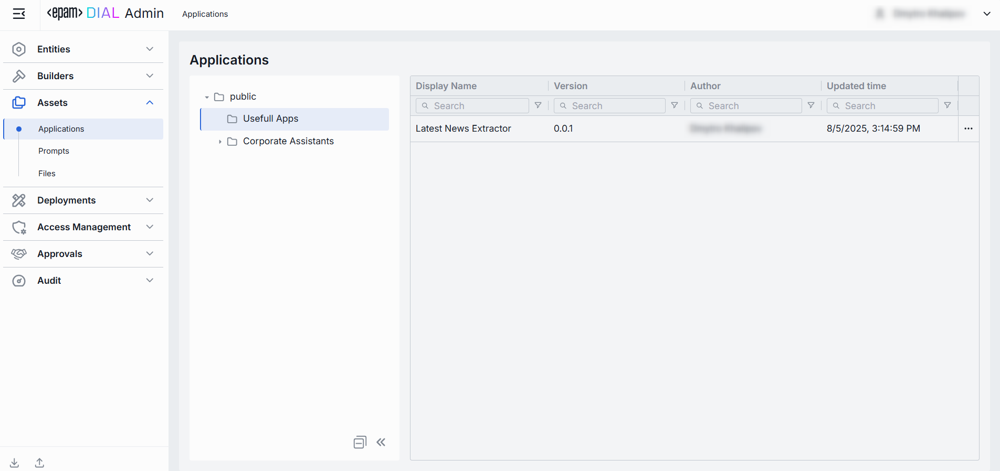

# Applications

## Introduction

DIAL-native applications adhere to the [unified protocol](/docs/platform/3.core/0.about-core.md#unified-api) of DIAL, a single protocol for all applications and models deployed in a specific DIAL instance. 

> Refer to [DIAL Core](/docs/platform/3.core/7.apps.md) to learn more about applications in DIAL.

## Main Screen

Applications, when added via DIAL Core configuration files or published by users are placed in the Public folder. The main screen displays all the applications available in Public folder in DIAL. 

> Refer to [Access Control](/docs/platform/3.core/2.access-control-intro.md) to lean more about Private and Public logical spaces for objects storage in DIAL. 

##### Folders Structure

Objects in the [Public space](/docs/platform/3.core/2.access-control-intro.md) are arranged hierarchically, similar to a file system. In this part of the screen, you can see the hierarchical structure of folders in the Public space. 

| Element | Description          |
|------------------------|--------------------------------------------|
| **Root folder**        | A root folder. Contains the sub-folders and applications. It is visible to all users. Applications when added via the DIAL Core configuration file, are automatically placed in the root folder.   |
| **Sub-folders**        | Applications can be placed in a specific sub-folder for logical organization purposes.          |
| **Actions**    | Hover over any folder to view a context menu icon with actions you can perform in relation to the selected folder.  - **Rename**: Use to rename the selected folder. - **Move to**: Use to select a target location in the hierarchy to move the selected folder. - **Manage permissions**: Redirects to [Folder Storage](/docs/tutorials/3.admin/access-management-folders-storage.md) to manage access to the folder. - **Delete**: Use to delete the folder with applications inside it.|

##### Applications Grid

Click on any folder to display applications in the applications grid.

| Column           | Definition                    |
|------------------|----------------------------|
| **Display Name** | Along with the version, it makes up the application’s unique key.      |
| **Version**      | Version of the application.              |
| **Author**       | The username or system ID associated with the user who created or last updated this application.     |
| **Updated time** | The timestamp of the last modification of the application. Use to track changes.                     |
| **Actions**      | Actions you can perform on the selected application:   - **Open in new tab**: Opens a new tab with application's properties, features and parameters.    - **Move to another folder**: Use to select the target folder in the hierarchy to move the application. - **Delete**: Use to delete the application. Alternatively you can use **Bulk Actions** in the header to remove multiple applications. |

## Export

Use **Bulk Actions** in the toolbar to download selected applications. 

This is useful for migrating applications between environments, sharing sets of applications with another users, or keeping a point-in-time backup.

##### To export applications:

1. Click **Bulk Actions** button in the toolbar.
2. Select applications by checking the boxes in each row. You can also select the version you want to export. 
3. Click **Export** in the bottom to launch the export modal. 
4. In the modal window select the export format: Archive or JSON.
5. Click **Export** to generate export file and start downloading.

## Import

Use **Import** in the toolbar to upload new or update existing applications from external JSON files or ZIP archive. This is essential for migrating, restoring, or sharing application assets between DIAL users.

##### To import applications:

1. Click **Import** in the toolbar to launch the import modal.
2. Select the type of files you want to import. **Drag & Drop** your archive or JSON files into the files area or click **Browse** to open a file picker.
   * **Archive**: Select if you want to import a single ZIP or tarball containing multiple JSON files. **Note**: Only 1 archive can be imported at a time.
   * **JSON**: Select if you want to import JSON files. **Note**: Up to 30 files can be imported at once.
3. Select a Conflict resolution Strategy. It allows you to decide how to handle existing applications with the same name and version in your workspace:
   * **Skip**: Leave existing applications untouched, only new ones will be added.
   * **Override**: Replace applications with the same name and version with the imported ones.
   * **Edit manually**: Resolve conflicts manually one by one.
4. Use **Ignore paths** toggle to skip folder structure from the imported files. When enabled, all applications will be imported directly into the root folder without recreating the original folder hierarchy.
5. Click **Finish** to start.

## Create

On the main screen you can manually add new DIAL application to the public folder.

> Refer to [DIAL-Native Applications](/docs/tutorials/1.developers/4.apps-development/3.enable-app.md#dial-native-applications) to learn more about native applications in DIAL.

Follow these steps to add a new application: 

1. Select a folder where you want to add a new application and click **+ Create** to invoke the **Create Application** modal.
2. Define application's parameters

    | Field                    | Required    | Definition & Guidance|
    |--------------------------|-------------|----------------------|
    | **ID**                   | Yes         | A unique identifier under the `applications` section of DIAL Core’s [dynamic settings](https://github.com/epam/ai-dial-core?tab=readme-ov-file#dynamic-settings) (e.g. support-bot, data-cluster).   |
    | **Display Name**         | Yes         | A user-friendly label (e.g. "Customer Support Bot") shown throughout the Admin UI.     |
    | **Version**              | Yes         | Semantic identifier (e.g., 1.2.0) of an application's version.   |
    | **Description**          | No          | A free-text summary describing the application (e.g. supported inputs, business purpose). |
    | **Source Type**          | Yes         | Source type of application. - **Endpoints**: Application with this source type is a standalone application. DIAL Core communicates with such application via the explicitly-provided chat completion endpoint. - **Application runner**: Application runners can be seen as application factories, allowing users to create logical instances of apps with different configurations. Application runners are based on JSON schemas, which define structure, properties and endpoints for applications. In [Builders/Application Runners](/docs/tutorials/3.admin/builders-application-runners.md) you can see all the available runners and add new ones.|
    | **Endpoint**             | Conditional | The application’s chat completion endpoint that will be used by DIAL Core. Required if Source Type is **Endpoints**.        |
    | **Application runner**   | Conditional | Select one of the [available application runners](/docs/tutorials/3.admin/builders-application-runners.md). Required if Source Type is **Application runner**. |

3. Once all required fields are filled click **Create**. The dialog closes and the new [application configuration](#configuration-screen) screen is opened. This entry will appear immediately in the listing under the selected folder once created.

    

## Configuration Screen

Click any application to open a screen with information about the selected application and its configuration details.

### Properties

In the Properties tab, you can see all and define selected application's basic properties.

##### Available Actions

You can find the following action buttons in the configuration screen header:

| Action | Description |
|--------|-------------|
| **Version**  | Version of the application. Can be selected from the dropdown to display information for different versions.           |
| **Delete** | Use to delete the selected application. |

##### Fields Description

| Field    | Description |
|----------|--------------------------|
| **ID**      | A unique identifier of the application. |
| **Author**  | The username or system ID associated with the user who created or last updated this application.      |
| **Creation Time** | The timestamp of when the application was created.   |
| **Updated Time** | Date and time when the app's configuration was last updated.             |
| **Folder Storage**  | The path to the application's location in the hierarchy of folders. It allows you to move the application between folders.| 
| **Status** | Current status of the application: **Valid**: application configuration is compatible with the JSON schema or the related application runner. Only valid entities will be materialized into the DIAL Core configuration. **Invalid**: application configuration is incompatible with the JSON schema of the related application runner. |
| **Display Name**  | The name of the application assigned by the author. It is read-only but includes a copy-to-clipboard button for easy reference.    |
| **Description**   | A free-text summary describing the application (e.g. tooling, supported inputs/outputs, SLAs).  |
| **Icon**  | A logo to visually distinguish the app on the UI. Maximum size: 512 MB. Supported types: .jpeg, .jpg, .jpe, .png, .gif, .apng, .webp, .avif, .svg, .svgz, .bmp, .ico. Up to 1 files.|
| **Topics**  | Tags that you can assign to apps (e.g. "finance", "support"). Helps to assign categories for better navigation on UI.  |
| **Folder Storage**  | The path to the application's location in the hierarchy of folders. It allows you to move the application between folders.| 
| **Source Type**     | Source type of application. - **Endpoints**: Application with this source type is a standalone application. DIAL Core communicates with such application via the explicitly-provided endpoints. - **Application runner**: Application runners can be seen as application factories, allowing users to create logical instances of apps with different configurations. Application runners are based on JSON schemas, which define structure, properties and endpoints for applications. In [Builders/Application Runners](/docs/tutorials/3.admin/builders-application-runners.md) you can see all the available runners and add new ones.|
| **Application runner**   | [Application Runner](/docs/tutorials/3.admin/builders-application-runners.md) the application is based upon. Enabled and is required if Source Type = Application runner is selected. |
| **Completion endpoint** | The application’s chat completion endpoint that will be used by DIAL Core. Enabled and is required if Source Type = Endpoints is selected. |
| **Editor URL** | URL of the application's custom builder UI. Application builder allows creating instances of apps using a [UI wizard](/docs/tutorials/0.user-guide.md#application-builder). Enabled if Source Type = Endpoints is selected. |
| **Viewer URL** | URL of the application's custom UI. A custom UI, if enabled, will override the standard DIAL Chat UI. Enabled if Source Type = Endpoints is selected. |
| **Attachments** | An option you can use to define the [attachment types](/docs/tutorials/1.developers/3.chat/0.chat-objects.md#attachments) (images, files) this app can have:   **Available values**:  **None** – attachments are not allowed.    **Use all** – unrestricted types. Optionally specify max number of attachments.   **Custom** – enter specific [MIME types](https://developer.mozilla.org/en-US/docs/Web/HTTP/Basics_of_HTTP/MIME_types/Common_types). Optionally specify max number of attachments. |
| **Attachments max number**  | Maximum number of input attachments. Enabled if attachment types are defined. |
| **Defaults** | Default parameters for the application. Default parameters are applied if a request doesn't contain them in OpenAI chat/completions API call. |
| **Forward auth token** | Select a downstream auth token to forward from the user’s session (for multi-tenant downstream). |
| **Max retry attempts**  | Number of times DIAL Core will [retry](/docs/platform/3.core/5.load-balancer.md#fallbacks) a failed run (due to timeouts or 5xx errors). |

### Features

In the Features tab, you can control optional capabilities of the selected application. 

#### Endpoints

Use these fields to apply optional service endpoints that extend the app’s runtime behavior. 
By providing URLs for rating, tokenization, prompt truncation, and dynamic configuration, the application can delegate cost/quota calculations, precise token counting, context-window management, and JSON-schema–driven settings to external services.
Endpoints specified here override endpoints in [Application Runner](/docs/tutorials/3.admin/builders-application-runners.md#properties).

| Field         | Description    |
|------------------------------|-----------------------------------------------|
| **Rate endpoint**            | A URL to call a custom rate-estimation API. Use this to compute cost or quota usage based on your own logic (e.g. grouping by tenant, complex billing rules).   |
| **Tokenize endpoint**        | A URL to call a custom tokenization service. When you need precise, app-wide token counting (for mixed-model or multi-step prompts) that the model adapter can’t provide.   |
| **Truncate prompt endpoint** | A URL to call your own prompt-truncation API. Handy if you implement advanced context-window management (e.g. dynamic summarization) before the actual app call. |
| **Configuration endpoint**   | A URL to fetch JSON Schema describing settings of the DIAL application. DIAL Core exposes this endpoint to DIAL clients as `GET v1/deployments/<deployment name>/configuration`. DIAL client must provide a JSON value corresponding to the configuration JSON Schema in a chat completion request in the `custom_fields.configuration` field.  |

#### Feature Flags (Toggles)

Enable or disable per-request options that your application accepts from clients and forwards to the underlying models. **Toggle On/Off** any feature as needed.

| Toggle         | What It Does            |
|-------------------------------|-----------------------------------------------------------------------------|
| **System prompt**             | Enables an initial "system" message injection. Useful for orchestrating multi-step agents where you need to enforce a global policy at the application level. |
| **Tools**      | Enables `tools`/`functions` payloads in API calls. Switch on if your application makes external function calls (e.g. calendar lookup, database fetch).        |
| **Seed**       | Enables the `seed` parameter for reproducible results. Great for testing or deterministic pipelines.  Disable to ensure randomized creativity. |
| **URL Attachments**           | Enables URL references (images, docs) as attachments in API requests. Must be enabled if your workflow downloads or processes remote assets via URLs.         |
| **Folder Attachments**        | Enables attachments of folders (batching multiple files).    |
| **Accessible by request key** | Indicates whether the deployment is accessible using a [per-request API key](/docs/platform/3.core/3.per-request-keys.md). |
| **Content parts**             | Indicates whether the deployment supports requests with content parts or not.  |
| **Consent required**          | Indicates whether the application requires [user consent](https://dialx.ai/dial_api#tag/User-Consent) before use.     |

### JSON Editor

**Advanced users with technical expertise** can work with the application properties in a JSON editor view mode. It is useful for advanced scenarios of bulk updates, copy/paste between environments, or tweaking settings not exposed in the form UI.

> **TIP**: You can switch between UI and JSON only if there are no unsaved changes.

##### Switching to the JSON Editor

1. Navigate to **Assets → Applications**, then select the application you want to edit.
2. Click the **JSON Editor** toggle (top-right). The UI reveals the raw JSON.

## Delete

Click **Delete** in the toolbar on the Configuration screen to permanently remove the selected application from your DIAL instance.

You can also delete an application using the Delete option in the application context menu or by deleting the related folder.
