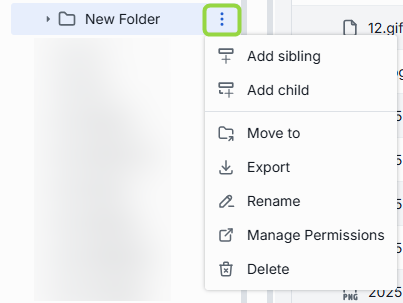
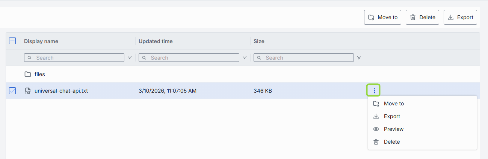
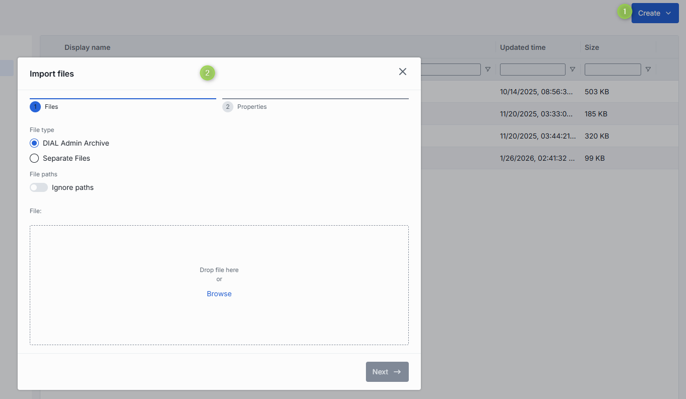

# Files

## Introduction

Files in DIAL are arbitrary binary or text assets (JSON, CSV, PDF, images, etc.) which AI models and/or applications can reference at runtime. Files in DIAL can be stored in BLOB storage or a local file system.

Files are considered to be a protected resource. Refer to [Access Control](/docs/platform/3.core/2.access-control-intro.md) to learn how protected resources are handled in DIAL.

## Main Screen

In Files, you can view and manage all files located the **Public** folder in the DIAL's file system. Files in the Public folder are files published with applications by end users or manually uploaded by administrators.

> **Note**: This screen, does not give access to private files of users.

#### Folders

Objects in the [Public folder](/docs/platform/3.core/2.access-control-intro.md) are arranged hierarchically, similar to a file system. 

- **Root folder**: Pubic is a root folder which can include sub-folders and files. Files in the root folder are visible to all authorized users.
- **Sub-folders**: Sub-folders can include uploaded files and files of published applications.

> **Note**, that access rules can be applied to sub-folders (manually or in publication request). You can view and manage access rules in [Folders Storage](/docs/tutorials/3.admin/access-management-folders-storage.md). The effective authorization rule for an object in a sub-folder includes restrictions applied to all parent sub-folders up to the root folder. Refer to [Tutorials](/docs/tutorials/1.developers/1.work-with-resources/0.work-with-publications.md#effective-rules) to learn about affective rules for folders.

You can perform various actions on folders:

| Available Actions | Description |
|-------------------|-------------|
| **Add folder** | Use context menu **Add sibling** or **Add child** to add sub-folders.  You can also add folders using **Create** control in the toolbar.  **Note**: All you can do with a root folder is to add a child sub-folder. |
| **Actions** | Hover over any folder to view its context menu icon with available actions.  - **Move to**: Use to select a target location in the hierarchy to move the selected folder.   - **Export**: Use to export the content of the folder as a ZIP archive.  - **Rename**: Use to rename the selected folder. - **Manage permissions**: Redirects to [Folder Storage](/docs/tutorials/3.admin/access-management-folders-storage.md) where you can view and manage access rules that apply to the selected folder. - **Delete**: Use to delete the folder with objects inside it. **Note**: Any models or applications that reference files in the removed folder will break until you re-upload valid file(s).|

#### Files

Click any folder to display files in it. 

##### Files grid

| Column | Description |
|--------|-------------|
| **Display Name** | File name. |
| **Updated time** | Timestamp of the last file update. |
| **Size** | File size in kilobytes. |

Click any file (or select several files) to see the context menu with available actions:

| Available Actions | Description |
|-------------------|-------------|
| **Move to** | Use to move the selected file(s) to another folder. |
| **Export** | Use to download a ZIP archive with the selected file(s).|
| **Delete** | Use to delete file(s).  **Note**: Any models or applications that reference it will break until you reattach a valid file. |

## To import files

Click **Create --> File** in the toolbar to upload files.

##### To import files:

1. Click **Create** in the toolbar  and select **File** to invoke the import modal.
2. Select the type of files you want to import. Drag & drop files or an archive into the drop zone, or click **Browse** to open your local file browser.
    * **Archive** (single ZIP file). Only 1 archive file can be imported at a time.
    * **Separate Files** (up to 30 individual files). Each file must be ≤ 512 MB.
3. Once files appear in the list, click **Next** to proceed.
4. Resolve any conflicts by choosing a strategy for handling files with the same name and path:
   * **Override**: Replace existing files with the new ones.
   * **Skip**: Do not import conflicting files and keep existing files unchanged.
   * **Edit manually**: Rename incoming files one by one to avoid conflicts. Each conflicting file is flagged with red color and becomes editable - update its **Name** to avoid conflicts.
5. Use **Ignore paths** toggle to skip folder structure from the imported files. When enabled, all files will be imported directly into the root folder without recreating the original folder hierarchy.
6. Once all conflicts are resolved, click **Finish** to complete the import.

    

<!-- ## Properties

Click any file to open the Properties screen. In Properties, you can view files metadata, download, delete or move file across folders.

 -->

