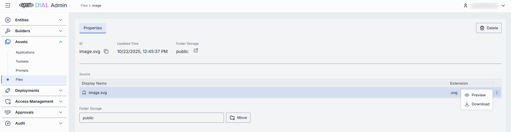

# Files

## Introduction

Files in DIAL are arbitrary binary or text assets (JSON, CSV, PDF, images, etc.) which AI models and/or applications can reference at runtime. Files in DIAL can be stored in BLOB storage or a local file system.

Files are considered to be a protected resource. Refer to [Access Control](/docs/platform/3.core/2.access-control-intro.md) to learn how protected resources are handled in DIAL.

## Main Screen

In Files, you can view and manage all files located the **Public** folder in the DIAL's file system. Files in the Public folder are files published with applications by end users. Such files are accessible to all authorized DIAL users.

> **Note**: This screen, does not give access to private files of users.

##### Public file storage

Objects in the [Public folder](/docs/platform/3.core/2.access-control-intro.md) are arranged hierarchically, similar to a file system. 

- **Root folder**: Pubic is a root folder that includes sub-folders with files. It is visible to all authorized users.
- **Sub-folders**:  Files of published applications appear in sub-folders. Also, admin can import files into a new sub-folder manually.  **Note**, that an application publication request can include access rules for the selected target sub-folder. You can view and manage access rules in [Folders Storage](/docs/tutorials/3.admin/access-management-folders-storage.md). The effective authorization rule for an object in a sub-folder includes restrictions applied to all parent sub-folders up to the root folder. Refer to [Tutorials](/docs/tutorials/1.developers/1.work-with-resources/0.work-with-publications.md#effective-rules) to learn about affective rules for folders.

| Available Actions | Description |
|-------------------|-------------|
| **Create folder + import objects** | Hover over any folder to display the **+** icon. It allows importing objects into new child or sibling folders. Same flow as [Import](#import), but requires providing a new folder name. **Note** that new folders can be added only via this method or along with the publication request if a new folder is defined in it. |
| **Actions** | Hover over any folder to view a context menu icon with actions you can perform in relation to the selected folder.  - **Rename**: Use to rename the selected folder. - **Move to**: Use to select a target location in the hierarchy to move the selected folder. - **Manage permissions**: Redirects to [Folder Storage](/docs/tutorials/3.admin/access-management-folders-storage.md) to manage access to the folder. - **Delete**: Use to delete the folder with objects inside it.|

##### Files grid

| Column | Description |
|--------|-------------|
| **Display Name** | File name. |
| **Extension** | File extension. |
| **Author** | Username or system ID associated with the user who created or last updated this file. |
| **Actions** | Actions you can perform on the selected file:   - **Open in new tab**: Opens a new tab with file's properties.   - **Move to another folder**: Use to select the target folder in the hierarchy to move the file. - **Delete**: Use to delete the file. |

## Export

Use **Bulk Actions** in the toolbar to export files. This is helpful for backup, sharing, or migrating files.

##### To export files:

1. Click **Bulk Actions**.
2. Select files by checking the boxes in each row.
3. Click **Export** to download a ZIP archive with files.

## Import

Use **Import** in the toolbar to upload external files into the Public folder in the file storage.

##### To import files:

1. Click **Import** in the toolbar to launch the import modal.
2. Select the type of files you want to import. Drag & drop files or an archive into the drop zone, or click **Browse** to open your local file browser.
    * **Archive** (single ZIP file). Only 1 archive file can be imported at a time.
    * **Separate Files** (up to 30 individual files). Each file must be ≤ 512 MB.
3. Once files appear in the list, click **Next** to proceed.
4. Resolve any conflicts by choosing a strategy for handling files with the same name and path:
   * **Override**: Replace existing files with the new ones.
   * **Skip**: Do not import conflicting files and keep existing files unchanged.
   * **Edit manually**: Rename incoming files one by one to avoid conflicts. Each conflicting file is flagged with red color and becomes editable - update its **Name** to avoid conflicts.
5. Use **Ignore paths** toggle to skip folder structure from the imported files. When enabled, all files will be imported directly into the root folder without recreating the original folder hierarchy.
6. Once all conflicts are resolved, click **Finish** to complete the import.

    

## Delete

Click **Delete** in the toolbar on the Properties screen to permanently remove the selected file from your workspace. 

> **Note**: Any models or applications that reference it will break until you reattach a valid file.

You can also delete a file using the Delete option in the file context menu or by deleting the related folder.

Use **Bulk Actions** in the toolbar to delete multiple files. 

## Properties

Click any file to open the Properties screen. In Properties, you can view files metadata, download, delete or move file across folders.

