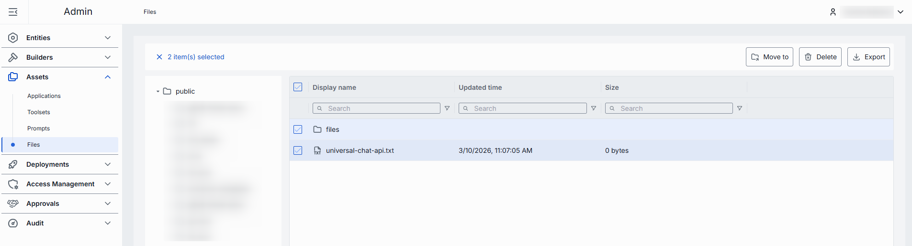
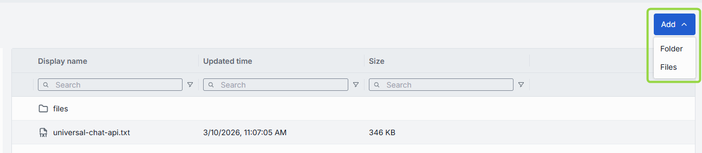
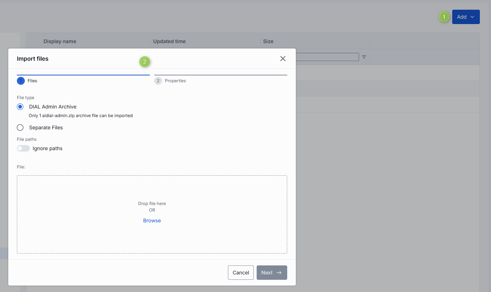
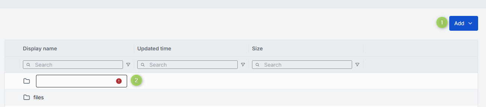
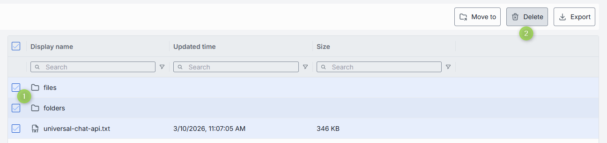

# Files

## Introduction

Files in DIAL are arbitrary binary or text assets (JSON, CSV, PDF, images, etc.) which AI models and/or applications can reference at runtime. 

In DIAL, files added by users (either using [DIAL Core API](https://dialx.ai/dial_api#tag/Files) or [UI File Manager](/docs/tutorials/0.user-guide.md#files)) are stored in a private folder of a dedicated user in the DIAL file storage and are not accessible to anyone but the file author (owner). Files become available to other users and applications when [published](/docs/tutorials/0.user-guide.md#access-to-application-files-1) with applications and conversations that reference them or via [Publication API](https://dialx.ai/dial_api#tag/Publications).

DIAL can be configured to store files in a BLOB storage of the selected cloud provider, ensuring scalability and security of your data.

> Files are considered to be a protected resource. Refer to [Access Control](/docs/platform/3.core/2.access-control-intro.md#acls-for-objects) to learn how protected resources are handled in DIAL.

## Main Screen

The Assets/Files screen displays all files located in the Public folder in DIAL file storage. Files get to the Public folder when published by users or added by administrators.

> **Note**: This screen, does not give access to private files of users.

##### Public file storage

Objects in the [Public folder](/docs/platform/3.core/2.access-control-intro.md) are arranged hierarchically, similar to a file system. 

- **Root folder**: Public is a root folder with sub-folders. It is visible to all authorized users. If a sub-folder is not specified for the new object being published, it is placed in the root folder by default.
- **Sub-folders**: Objects can be placed in sub-folders for logical organization purposes - one object per sub-folder is recommended. 

> **Note**, that access rules can be applied to sub-folders (manually or in publication request). You can view and manage access rules in [Folders Storage](/docs/tutorials/3.admin/access-management-folders-storage.md). The effective authorization rule for an object in a sub-folder includes restrictions applied to all parent sub-folders up to the root folder. Refer to [Tutorials](/docs/tutorials/1.developers/1.work-with-resources/0.work-with-publications.md#effective-rules) to learn about affective rules for folders.

Hover over any folder in the right or left panel to display the context menu.

| Available Actions | Description |
|-------------------|-------------|
| **Create sub-folders** |  Use to add new child or sibling sub-folders. |
| **Move to** | Use to select a target location in the hierarchy to move the selected folder. | 
| **Export** | Use to download the content of the selected folder with objects inside it as a ZIP archive. |
| **Rename** | Use to rename the selected folder. | 
| **Manage permissions** | Redirects to [Folder Storage](/docs/tutorials/3.admin/access-management-folders-storage.md) to manage access to the folder. |
| **Delete** | Use to delete the folder with objects inside it.|

##### Files grid

Click any folder to display its content (files and sub-folders)

| Column | Description |
|--------|-------------|
| **Display Name** | File name displayed on UI. |
| **Updated time** | Timestamp of the last file update. |
| **Size** | File size in kilobytes. |

Click any file (or select several files) to see the context menu with available actions:

| Available Actions | Description |
|-------------------|-------------|
| **Move to** | Use to move the selected file(s) to another folder. |
| **Export** | Use to download a ZIP archive with the selected file(s).|
| **Preview** | Use to preview the content of the file. Can be disabled for selected types of files. The list of file extensions for which preview is enabled: `.html`, `.htm`, `.css`, `.js`, `.mjs`, `.json`, `.xml`, `.txt`, `.md`, `.csv`, `.jpg`, `.jpeg`, `.png`, `.gif`, `.webp`, `.svg`, `.ico`, `.bmp`, `.avif`, `.mp3`, `.wav`, `.ogg`, `.mp4`, `.webm`, `.pdf` |
| **Delete** | Use to delete file(s).  **Note**: Any models or applications that reference it will break until you reattach a valid file. |

## Export 

You can download selected files or folders as a ZIP archive.

To export, make a selection and click **Export** in the toolbar. You can also access the Export button in the context menu of each file or folder.

## Import Files

Use the **Add** dropdown in the toolbar to add new folders or files.

1. Click **Add** in the toolbar and select **Files** to invoke the **Import Files** modal.
2. You can choose to import a ZIP archive or separate files. **Note**: Up to 30 files can be imported at once. Each file must be ≤ 512 MB. Only 1 archive can be imported at a time.
3. Use **Ignore paths** toggle to skip folder structure from the imported files. When enabled, all files will be imported directly into the root folder without recreating the original folder hierarchy.
4. Add file either by dragging them into the window or using file browser.
5. Click **Next** to select a conflict resolution strategy. It allows you to decide how to handle existing prompts with the same name and version in your workspace:
   * **Skip**: Do not import conflicting files and keep existing files unchanged.
   * **Override**: Replace files with the same name and version with the imported ones.
   * **Edit manually**: Rename incoming files one by one to avoid conflicts. Each conflicting file is flagged with red color and becomes editable - update its Name to avoid conflicts.
6. Click **Finish** to start.

## Add Folders

You can add new child or sibling folders to the hierarchy using the context menu of each folder. 

> **Note**: The name of the folder must not exceed 160 characters.

You can also navigate to a specific folder and use the **Add** dropdown in the toolbar to add sub-folders.

## Delete 

There are several ways to delete a file:

> **Note**: Any applications that reference it will break until you reattach a valid file.

* Select one of several files/folders and click **Delete** in the toolbar.
* Use the **Delete** option in the file/folder context menu.
* To delete a file, you can delete the related folder where the file is located.

