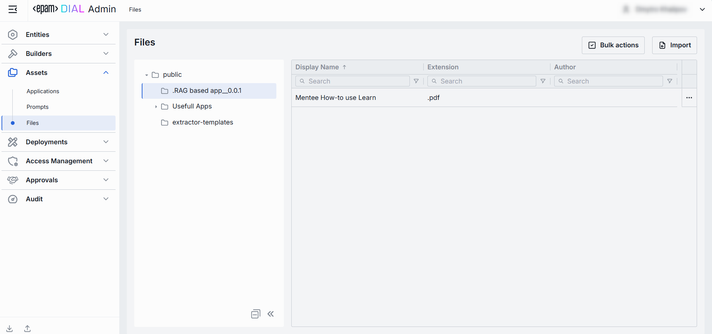
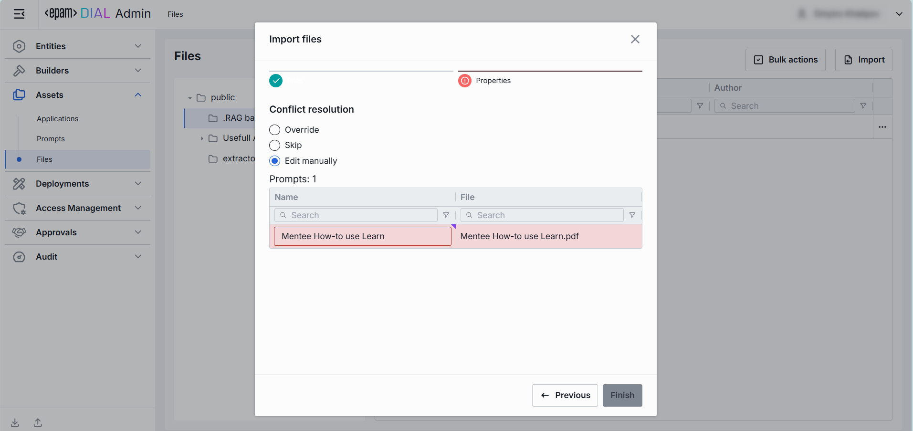

# Files

## About Files

Files in DIAL are arbitrary binary or text assets (JSON, CSV, PDF, images, etc.) your models and applications can reference at runtime.

## Files Main Screen

In Files, you can manage all files in the Public folder.

> Refer to [Access Control](/docs/platform/3.core/2.access-control-intro.md) to lean more about Private and Public logical spaces for objects storage in DIAL. 

### Folders Structure

| Element | Description          |
|------------------------|--------------------------------------------|
| **Root folder**        | A root folder. Contains the sub-folders and files. It is visible to all users.  |
| **Sub-folders**        | Files can be placed in a specific sub-folder for logical organization purposes.          |
| **+ (Create)**         | Hover over any folder to display this action. Allows creating new child or sibling folder and import the files into it. Same flow as [Import](#import), but also requires to provide a folder name. |
| **Actions**    | Hover over any folder to view a context menu icon with actions you can perform in relation to the selected folder.  - **Rename**: Use to rename the selected folder. - **Move to**: Use to select a target location in the hierarchy to move the selected folder. - **Manage permissions**: Redirects to [Folder Storage](/docs/tutorials/3.admin/access-management-folders-storage.md) to manage access to the folder. - **Delete**: Use to delete the folder with files inside it.|

### Files Grid

| Column           | Definition                                                                                          |
|------------------|-------------------|
| **Display Name** | A technical key for the file (e.g. `exclusion-words`).                                              |
| **Extension**    | The extension of the file.                                                                 |
| **Author**       | The username or system ID associated with the user who created or last updated this file.    |
| **Actions**      | Actions you can perform on the selected file:   - **Open in new tab**: Opens a new tab with file's properties.    - **Move to another folder**: Use to select the target folder in the hierarchy to move the file. - **Delete**: Use to delete the file.  |

## Export

Use **Bulk Actions** in the toolbar to export files. This is helpful for backup, sharing, or migrating supporting assets alongside your DIAL configuration.

##### To export files:

1. Click **Bulk Actions**.
2. Select files by checking the boxes in each row.
3. Click **Export** to download a ZIP archive with files.

## Import

Use **Import** in the toolbar to upload external files into DIAL’s assets storage. This is useful for adding reference documents, data or other supporting assets.

##### To import files:

1. Click **Import** in the toolbar to launch the import modal.
2. Select the type of files you want to import. Drag & drop files or an archive into the drop zone, or click **Browse** to open your local file browser.
    * **Archive** (single ZIP file). Only 1 archive file can be imported at a time.
    * **Separate Files** (up to 30 individual files). Each file must be ≤ 512 MB.
3. Once files appear in the list, click **Next** to proceed.
4. Resolve any conflicts by choosing a strategy for handling files with the same name and path:
   * **Override**: Replace existing files with the new ones.
   * **Skip**: Do not import conflicting files and keep existing files unchanged.
   * **Edit manually**: Rename incoming files one by one to avoid conflicts. Each conflicting file is flagged with red color and becomes editable - update its **Name** to avoid conflicts.
5. Once all conflicts are resolved, click **Finish** to complete the import.

    

## Configuration

Click any file to open the configuration screen.

##### Top Bar Controls

* **Delete**: Permanently removes the selected file from your DIAL instance.

### Properties

In the Properties tab, you can view and manage the selected file, including moving them across folders.

| Field | Definition & Use Case                                                                                                                  |
|--------------------|------------------------------------------------------|
| **Display Name**   | The filename including extension (e.g. request.json, lookup.csv). Display-only but with a copy-to-clipboard button for easy reference. |
| **Source/Display Name**    | The name of the file without the extension (e.g. request).   |
| **Source/Extension**  | The file type (e.g. .json, .csv, .pdf). |
|**Source/Actions** |Click the context menu icon to open additional actions: - **Preview**: Click to preview a file. - **Download**: Click to download a file.|
| **Storage Folder**   | The path to the file's location in the hierarchy of folders. Use for moving files between folders.                                            |  
