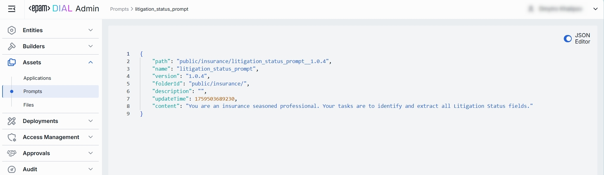

# Prompts

## About Prompts

Prompts in DIAL are reusable, versioned text templates that can be used either in the chat or by custom applications.
Everything from system instructions ("You are a financial advisor…") to few-short examples and user-message wrappers.

> Refer to [User Guide](/docs/tutorials/0.user-guide.md#prompts) to learn more about prompts and DIAL Chat features.

## Prompts List

In the Prompts section, you can manage all system and user prompt templates. Here, you can also arrange prompts into folders, version them, and then use them in applications or chats.

### Grid and Folders

##### Folders Structure (Left Pane)

| Element                | Behavior                                                                                                                                    |
|------------------------|---------------------------------------------------------------------------------------------------------------------------------------------|
| **Root folder**        | A root folder with all shared prompts. It is visible to all users.                                                                          |
| **Sub-folders**        | Collapsible folders you create to group prompts by project, team, domain, or environment.                                                   |
| **Collapse All**       | Allows collapsing all expanded folders in the folders tree.                                                                                 |
| **Context actions**    | Hover over the folder to view additional actions.                                                                                           |
| **+ (Create)**         | Allows to create new child or sibling folder and import the prompts into it. Same flow as [Import](#import), but also requires folder name. |
| **Rename**             | Allows to rename the folder. Requires folder name to be provided.                                                                           |
| **Move to**            | Allows moving the folder to another place in the folders tree.                                                                              |
| **Manage permissions** | Redirects to [Folder Storage](/docs/tutorials/3.admin/access-management-folders-storage.md) to manage access to the folder.                 |
| **Delete**             | Deletes the folder and all its prompts. Requires confirmation.                                                                              |

##### Prompts Grid (Right Pane)

| Column           | Definition                                                                                                                                                                                                                                   |
|------------------|----------------------------------------------------------------------------------------------------------------------------------------------------------------------------------------------------------------------------------------------|
| **Display Name** | A technical key for the prompt (e.g. `customer_onboarding_intro`).                                                                                                                                                                           |
| **Version**      | Semantic version of this prompt template (e.g. `1.0.0`).                                                                                                                                                                                     |
| **Author**       | The username or system ID associated with the user who created or last updated this application.                                                                                                                                             |
| **Update time**  | The timestamp of the last modification of the prompt. Use to track changes.                                                                                                                                                                  |
| **Actions**      | Row menu with available actions:  - [Duplicate](/docs/tutorials/0.user-guide.md#duplicate-1) - Move to another folder - Delete. Alternatively you can use Bulk Actions in the header to remove multiple prompts and versions. |

## Create

1. Select a folder for a new prompt (e.g. public/marketing, private/project-x).
2. Click **Create** to invoke the **Create Prompt** modal.
3. Define prompt's parameters

    | Column           | Definition                                                                                                                                     |
    |------------------|------------------------------------------------------------------------------------------------------------------------------------------------|
    | **Display Name** | A unique identifier for a prompt (e.g. reject-blacklisted-words, audit-logger). This key is used when you attach it to a Model or Application. |
    | **Version**      | Semantic version string (e.g. 1.0.0, 0.1.2) that enables safe updates.                                                                         |
    | **Description**  | Free-text summary of the prompt’s purpose and key placeholders.                                                                                |

4. Once all required fields are filled, click **Create**. The dialog closes and the new prompt [configuration screen](#configuration) is opened. This entry will appear immediately in the listing once created.

## Export

Use Export to bulk download prompts. This is useful for migrating prompts between environments, sharing sets of prompts with another users, or keeping a point-in-time backup.

##### To export prompts:

1. Click **Bulk Actions** button.
2. Select prompts by checking the boxes in each row. You can also select the version you want to export. 
3. Click **Export** in the bottom to launch the export modal. 
4. In the modal window select the export format: Archive or JSON.
5. Click **Export** to generate export file and start downloading.

## Import

Use Import to upload new or update existing prompts from external JSON files or ZIP archive. This is essential for migrating, restoring, or sharing prompt assets between DIAL users.

##### To import prompts:

1. Click **Import** in the toolbar to launch the import modal 
2. Select the type of files you want to import. **Drag & Drop** your archive or JSON files into the files area or click **Browse** to open a file picker.
   * **Archive**: Select if you want to import a single ZIP or tarball containing multiple JSON files. **Note**: Only 1 archive can be imported at a time.
   * **JSON**: Select if you want to import JSON files. **Note**: Up to 30 files can be imported at once.
3. Select a Conflict resolution Strategy. It allows you to decide how to handle existing prompts with the same name and version in your workspace:
   * **Skip**: Leave existing prompts untouched, only new ones will be added.
   * **Override**: Replace prompts with the same name and version with the imported ones.
   * **Edit manually**: Resolve conflicts manually one by one.
4. Click **Finish** to start.

## Configuration

##### Top Bar Controls

* **Delete**: Permanently removes this prompt (or the selected versions) from your workspace. Any applications that reference it will break until you reattach a valid prompt.
* **JSON Editor** (Toggle): Switch between the form-based UI and raw [JSON view](#json-editor) of the prompt’s configuration. Use JSON mode for copy-paste or advanced edits.

Once the prompt edited, top bar allows to:
* **Discard** changes made since last save.
* **Save** changes to the current version of prompt.
* **Save as new version**. Automatically creates new version. Keeps current version untouched:

### Properties

In the Properties tab, you can view and edit metadata and the template content of prompts.

| Field              | Required | Definition & Use Case                                                                                                                                                                                        |
|--------------------|----------|--------------------------------------------------------------------------------------------------------------------------------------------------------------------------------------------------------------|
| **Display Name**   | -        | Immutable key for the prompt (e.g. `customer_base_growth`). It cannot be edited after the prompt is created.                                                                                                 |
| **Update Time**    | -        | Read-only timestamp of the last save (e.g. `04.29.2025 00:14`). Helps you track when the prompt was last modified.                                                                                           |
| **Version**        | Yes      | Select the semantic version of this prompt (e.g. `1.0.0`, `0.1.2`). Use **+ Create** button in the dropdown with versions to create a new version.                                                           |
| **Description**    | No       | Free-form summary of the prompt’s intent, variables, or context requirements (e.g. "Extracts customer base growth; variables: `{{growth}}`").                                                                |
| **Content**        | Yes      | The actual prompt text. Markdown editor with preview capability. Supports: - **Plain text** with Markdown formatting.  - **Mustache-style variables** `{{variableName}}` for dynamic substitution. |  
| **Storage Folder** | Yes      | The actual path to the prompt in the folders hierarchy.                                                                                                                                                      |  

#### Compare Versions
Tool allows comparing the prompt text across its versions. Provides ability to select exact versions to compare. Highlights add and remove changes.

### JSON Editor

For advanced scenarios of bulk updates, copy/paste between environments, or tweaking settings not exposed in the form UI—you can switch to the **JSON Editor** in any prompt's configuration page.

##### Switching to the JSON Editor

1. Navigate to **Assets → Prompts**, then select the prompt you want to edit.
2. Click the **JSON Editor** toggle (top-right). The UI reveals the raw JSON.

> **TIP**: You can switch between UI and JSON only if there are no unsaved changes.

