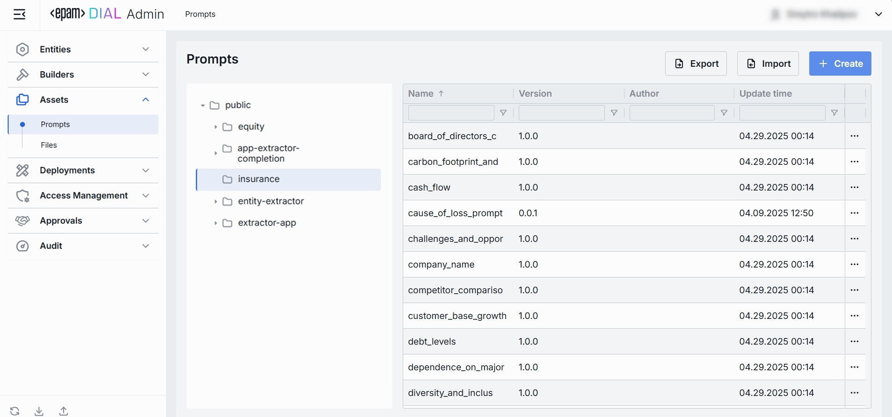
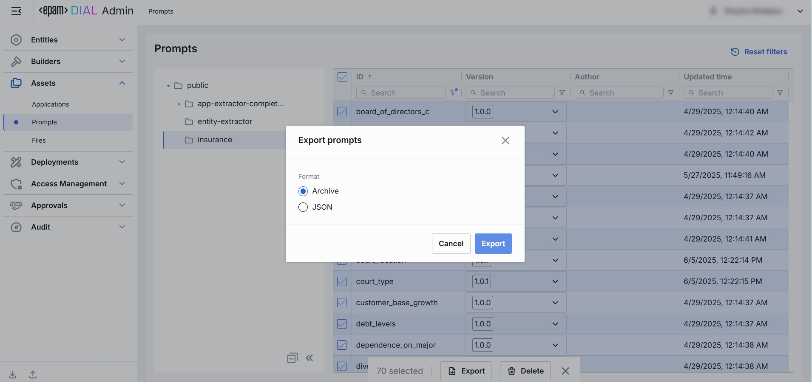
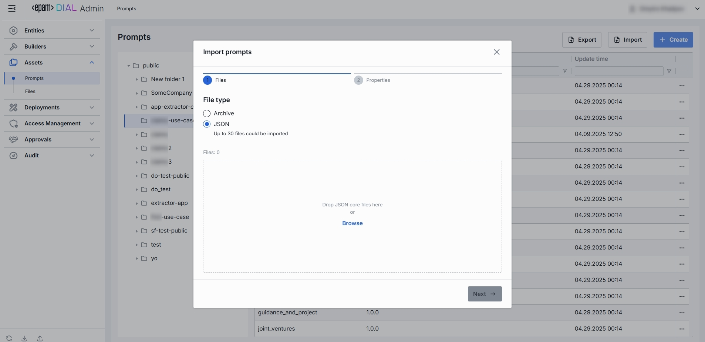
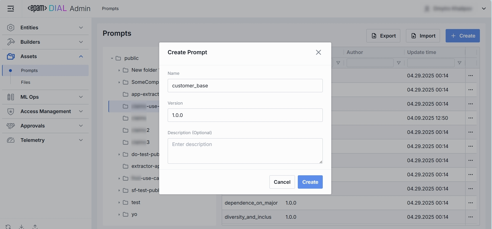

# Prompts

## Introduction

In DIAL, prompts created by users (either using [DIAL Core API](https://dialx.ai/dial_api#tag/Prompts) or [UI](/docs/tutorials/0.user-guide.md#prompts)) are stored in a private folder of a dedicated user in the DIAL file storage and are not accessible to anyone but the prompt author (owner). To enable access for other users, prompts owners can publish them or DIAL administrators can manually add them to the Public folder, where all published resources are stored.

> * Prompts are considered to be a protected resource. Refer to [Access Control](/docs/platform/3.core/2.access-control-intro.md) to learn how protected resources are handled in DIAL.
> * Refer to [DIAL Chat User Guide](/docs/tutorials/0.user-guide.md#prompts) to learn more about prompts.

## Main Screen

The Assets/Prompts screen displays all prompts located in the Public folder in DIAL file storage. Prompts get to the Public folder when published by users or added by administrators.

##### Public file storage

Objects in the [Public folder](/docs/platform/3.core/2.access-control-intro.md) are arranged hierarchically, similar to a file system. 

- **Root folder**: Pubic is a root folder with sub-folders. It is visible to all authorized users. If a sub-folder is not specified for the new object being published, it is placed in the root folder by default.
- **Sub-folders**: Objects can be placed in sub-folders for logical organization purposes - one object per sub-folder is recommended. 

> **Note**, that access rules can be applied to sub-folders (manually or in publication request). You can view and manage access rules in [Folders Storage](/docs/tutorials/3.admin/access-management-folders-storage.md). The effective authorization rule for an object in a sub-folder includes restrictions applied to all parent sub-folders up to the root folder. Refer to [Tutorials](/docs/tutorials/1.developers/1.work-with-resources/0.work-with-publications.md#effective-rules) to learn about affective rules for folders.

| Available Actions | Description |
|-------------------|-------------|
| **Create sub-folder + import objects** | Hover over any folder to display the **+** icon. It allows importing objects into new child or sibling sub-folders. Same flow as [Import](#import), but requires providing a new folder name. **Note** that new sub-folders can be added only via this method or along with the publication request if a new folder is defined in it. |
| **Actions** | Hover over any folder to view a context menu icon with actions you can perform in relation to the selected folder.  - **Rename**: Use to rename the selected folder.  - **Move to**: Use to select a target location in the hierarchy to move the selected folder. - **Manage permissions**: Redirects to [Folder Storage](/docs/tutorials/3.admin/access-management-folders-storage.md) to manage access to the folder. - **Delete**: Use to delete the folder with objects inside it.|

##### Prompts grid

Click any folder in the hierarchy to display prompts stored in it.

| Column | Description |
|--------|-------------|
| **Display Name** | Prompt name displayed on UI. |
| **Version** | Version of the prompt (e.g. `1.0.0`). |
| **Author** | Username or system ID associated with the user who created or last updated this file. |
| **Updated time** | The timestamp of the last modification of the prompt. |
| **Actions** | Actions you can perform on the selected prompt: - **Open in new tab**: Opens the prompt's properties in a new tab. - **Move to another folder**: Select a target folder in the hierarchy to move the prompt. - **Delete**: Remove the prompt. You can also use **Bulk Actions** in the toolbar to delete multiple prompts at once. - **Duplicate**: Create a copy of the prompt in one of two ways: **New version**: Creates another version of the selected prompt. You can also quickly add a new version on the [Properties](#properties) screen by clicking **Create** in the **Version** dropdown. **New prompt**: Clones the selected prompt as a new one. |

#### Export

Use **Bulk Actions** in the toolbar to bulk download prompts. This is useful for migrating prompts between environments, sharing sets of prompts with other users, or keeping a point-in-time backup.

##### To export prompts:

1. Click **Bulk Actions** button in the toolbar.
2. Select prompts by checking the boxes in each row. You can also select the version you want to export. 
3. Click **Export** in the bottom to launch the export modal. 
4. In the modal window select the export format: ZIP Archive or JSON file.
5. Click **Export** to generate export file and start downloading.

   

#### Import

Use **Import** in the toolbar to upload new or update existing prompts from external JSON files or ZIP archive. This is essential for migrating, restoring, or sharing prompt assets between DIAL users.

##### To import prompts:

1. Click **Import** in the toolbar to launch the import modal.
2. Select the type of files you want to import. **Drag & Drop** your archive or JSON files into the files area or click **Browse** to open a file picker.
   * **Archive**: Select if you want to import a single ZIP or tarball containing multiple JSON files. **Note**: Only 1 archive can be imported at a time.
   * **JSON**: Select if you want to import JSON files. **Note**: Up to 30 files can be imported at once.
3. Select a Conflict resolution Strategy. It allows you to decide how to handle existing prompts with the same name and version in your workspace:
   * **Skip**: Leave existing prompts untouched, only new ones will be added.
   * **Override**: Replace prompts with the same name and version with the imported ones.
   * **Edit manually**: Resolve conflicts manually one by one.
4. Use **Ignore paths** toggle to skip folder structure from the imported files. When enabled, all prompts will be imported directly into the root folder without recreating the original folder hierarchy.
5. Click **Finish** to start.

#### Create

Follow these steps to add a new prompt to the Public folder:

1. Select a target folder for a new prompt.
2. Click **Create** in the toolbar to invoke the **Create Prompt** modal.
3. Define prompt's parameters

   | Column | Required | Description |
   |--------|----------|-------------|
   | **Display Name** | Yes | Prompt name displayed on UI. |
   | **Version** | Yes | Version of the prompt (e.g. `1.0.0`).|
   | **Description** | No | Free-form description of the prompt.|

4. Once all required fields are filled, click **Create**. The dialog closes and the new prompt [configuration screen](#configuration) is opened. This entry will appear immediately in the listing once created.

   

#### Delete

There are several ways to delete a prompt or a specific version of it:

> **Note**: Any applications that reference it will break until you reattach a valid prompt.

* Click **Delete** in the toolbar on the Properties screen to permanently remove the selected prompt from your DIAL instance.
* Use the Delete option in the prompt context menu.
* Delete the related folder where the prompt is located.
* Use **Bulk Actions** on the main screen to delete more than one prompt.

## Properties

Click any prompt to open the Properties screen where you can see it's details and edit the selected properties.

##### Available actions

You can find the following action buttons in the screen header:

| Action | Description |
|--------|-------------|
| **Version**  | Version of the prompt. Can be selected from the dropdown to display properties for different versions of prompt.   In the dropdown, click **Create** to add a new version of the prompt. |
| **Delete** | Use to delete the selected prompt. |

##### Fields description

| Field | Description |
|-------|-------------|
| **Display Name** | Read-only key for the prompt (e.g. `customer_base_growth`). Display Name cannot be edited after the prompt is created. |
| **Updated Time** | Read-only timestamp of the last update (e.g. `04.29.2025 00:14`). |
| **Storage Folder** | The path to the prompt's location in the folders hierarchy.  Click to navigate to [Folders Storage](/docs/tutorials/3.admin/access-management-folders-storage.md). | 
| **Description** | Description of a prompt. |
| **Content** | Markdown editor with the prompt's content which supports: - **Plain text** with Markdown formatting.  - **Mustache-style variables** `{{variableName}}` for dynamic substitution. - **JSON** editor.   Refer to [Chat User Guide](/docs/tutorials/0.user-guide.md#variables) to learn more about variables in prompts. |
| **Storage Folder** | The path to the prompt's location in the folders hierarchy.  Use **Move to** to change the folder. |

### Edit Prompt

In the Properties tab, you can edit selected information. Once the prompt edited, top bar allows to:

* **Discard**: Use to discard changes made since last save.
* **Save**: Use to save changes to the current version of prompt.
* **Save as new version**: Use to save changes in a new version keeping the current version intact.

### Compare Versions

When there are several versions of the same prompt, **Compare versions** is enabled. 

Use it to compare the prompt's text across its versions. You can select versions you want to compare to see the changes highlighted.

### JSON Editor

**Advanced users with technical expertise** can work with the prompt properties in a JSON editor view mode. It is useful for advanced scenarios of bulk updates, copy/paste between environments, or tweaking settings not exposed on UI.

> **TIP**: You can switch between UI and JSON only if there are no unsaved changes.

##### Switching to the JSON Editor

1. Navigate to **Assets → Prompts**, then select the prompt you want to edit.
2. Click the **JSON Editor** toggle (top-right). The UI reveals the raw JSON.

