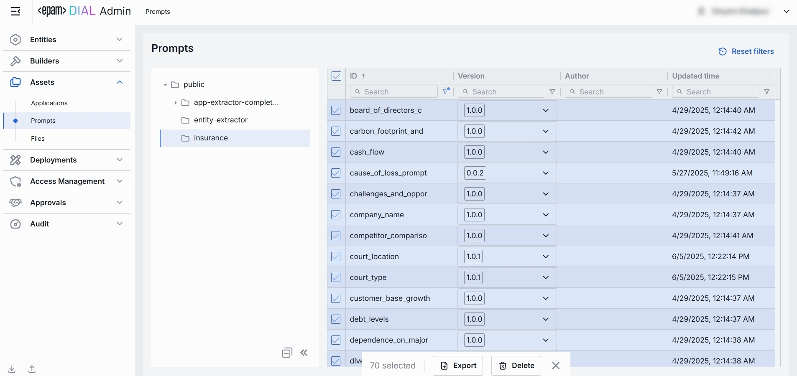
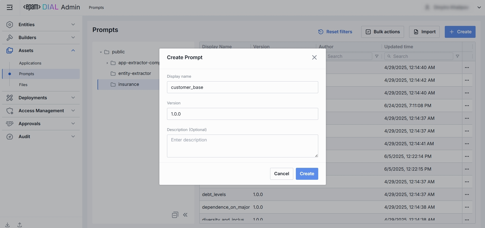

# Prompts

## About Prompts

A prompt is an instruction, a question, or a message that a user provides to a language model to receive an answer. Prompts can also contain constraints or requirements. They help the model understand the task at hand and the types of responses that are expected. You can use prompts as templates for your messages, instructions to the model, or to encourage the model to generate specific types of content. In DIAL, you can create prompts beforehand and reuse them in one or several conversations.

> Refer to [DIAL Chat User Guide](/docs/tutorials/0.user-guide.md#prompts) to learn more about prompts and DIAL Chat features.

## Main Screen

All prompts published by users get into the Public folder. In the Prompts section, you can manage all system and user prompt templates available in the Public folder. All  Here, you can also arrange prompts into folders, version them, and then use them in applications or chats.

> Refer to [Access Control](/docs/platform/3.core/2.access-control-intro.md) to lean more about Private and Public logical spaces for objects storage in DIAL. 

##### Folders Structure

Objects in the [Public space](/docs/platform/3.core/2.access-control-intro.md) are arranged hierarchically, similar to a file system. In this part of the screen, you can see the hierarchical structure of folders in the Public space. 

| Element | Description          |
|------------------------|--------------------------------------------|
| **Root folder**        | A root folder. Contains the sub-folders and prompts. It is visible to all users.  |
| **Sub-folders**        | Prompts can be placed in a specific sub-folder for logical organization purposes.          |
| **+ (Create)**         | Hover over any folder to display this action. Use it to import prompts into a new folder. The logic is similar to [Import](#import), but requires providing a new target folder name. |
| **Actions**    | Hover over any folder to view a context menu icon with actions you can perform in relation to the selected folder.  - **Rename**: Use to rename the selected folder. - **Move to**: Use to select a target location in the hierarchy to move the selected folder. - **Manage permissions**: Redirects to [Folder Storage](/docs/tutorials/3.admin/access-management-folders-storage.md) to manage access to the folder. - **Delete**: Use to delete the folder with prompts inside it.|

##### Prompts Grid

Click any folder in the hierarchy to display prompts stored in it.

| Column           | Definition                                |
|------------------|----------------|
| **Display Name** | A technical key for the prompt (e.g. `customer_onboarding_intro`).                                                      |
| **Version**      | Semantic version of this prompt template (e.g. `1.0.0`).                                                                |
| **Author**       | The username or system ID associated with the user who created or last updated this application.                        |
| **Update time**  | The timestamp of the last modification of the prompt. Use to track changes.                                             |
| **Actions**      | Actions you can perform on the selected prompt:   - **Open in new tab**: Opens a new tab with prompt's properties.    - [Duplicate](/docs/tutorials/0.user-guide.md#duplicate-1): Click to duplicate a prompt. - **Move to another folder**: Use to select the target folder in the hierarchy to move the file. - **Delete**: Use to delete a prompt. Alternatively you can use **Bulk Actions** in the header to remove multiple prompts. |

## Export

Use **Bulk Actions** in the toolbar to bulk download prompts. 

This is useful for migrating prompts between environments, sharing sets of prompts with another users, or keeping a point-in-time backup.

##### To export prompts:

1. Click **Bulk Actions** button in the toolbar.
2. Select prompts by checking the boxes in each row. You can also select the version you want to export. 
3. Click **Export** in the bottom to launch the export modal. 
4. In the modal window select the export format: Archive or JSON.
5. Click **Export** to generate export file and start downloading.

## Import

Use **Import** in the toolbar to upload new or update existing prompts from external JSON files or ZIP archive. This is essential for migrating, restoring, or sharing prompt assets between DIAL users.

##### To import prompts:

1. Click **Import** in the toolbar to launch the import modal.
2. Select the type of files you want to import. **Drag & Drop** your archive or JSON files into the files area or click **Browse** to open a file picker.
   * **Archive**: Select if you want to import a single ZIP or tarball containing multiple JSON files. **Note**: Only 1 archive can be imported at a time.
   * **JSON**: Select if you want to import JSON files. **Note**: Up to 30 files can be imported at once.
3. Select a Conflict resolution Strategy. It allows you to decide how to handle existing prompts with the same name and version in your workspace:
   * **Skip**: Leave existing prompts untouched, only new ones will be added.
   * **Override**: Replace prompts with the same name and version with the imported ones.
   * **Edit manually**: Resolve conflicts manually one by one.
4. Use **Ignore paths** toggle to skip folder structure from the imported files. When enabled, all prompts will be imported directly into the root folder without recreating the original folder hierarchy.
5. Click **Finish** to start.

## Create

Follow these steps to add a new prompt:

1. Select a folder for a new prompt (e.g. public/marketing, private/project-x).
2. Click **Create** in the toolbar to invoke the **Create Prompt** modal.
3. Define prompt's parameters

    | Column           |Required| Definition |
    |------------------|--------|------------|
    | **Display name** | Yes | Unique identifier for a prompt (e.g. reject-blacklisted-words, audit-logger). This key is used when you attach it to a Model or Application. |
    | **Version**      | Yes | Semantic version string (e.g. 1.0.0, 0.1.2) that enables safe updates.|
    | **Description**  | No | Free-text summary of the prompt’s purpose and key placeholders.|

4. Once all required fields are filled, click **Create**. The dialog closes and the new prompt [configuration screen](#configuration) is opened. This entry will appear immediately in the listing once created.

   

## Configuration

Click any prompt to open the configuration screen where you can see it's details and edit the selected properties.

### Properties

In the Properties tab, you can view and edit the metadata and the content of the selected prompt.

| Field| Definition & Use Case                                                                   |
|-------|-----------------------------------------------------------------------------------------------|
| **Display Name**   | Immutable key for the prompt (e.g. `customer_base_growth`). It cannot be edited after the prompt is created.                   |
| **Update Time**       | Read-only timestamp of the last save (e.g. `04.29.2025 00:14`). Helps you track when the prompt was last modified.             |
| **Version**        | Select the semantic version of this prompt (e.g. `1.0.0`, `0.1.2`). Use **+ Create** button in the dropdown with versions to create a new version.                                                           |
| **Description**     | Free-form summary of the prompt’s intent, variables, or context requirements (e.g. "Extracts customer base growth; variables: `{{growth}}`").                                                                |
| **Content**         | A markdown editor with the prompt's text which supports: - **Plain text** with Markdown formatting.  - **Mustache-style variables** `{{variableName}}` for dynamic substitution. |  
| **Storage Folder**     | The path to the prompt's location in the folders hierarchy.                                 |  

### Edit Prompt

In the Properties tab, you can edit selected information. Once the prompt edited, top bar allows to:

* **Discard**: Use to discard changes made since last save.
* **Save**: Use to save changes to the current version of prompt.
* **Save as new version**: Use to save changes in a new version keeping the current version intact.

### Compare Versions

Use **compare versions** to compare the prompt's text across its versions. You can select versions you want to compare to see the changes highlighted.

### JSON Editor

**Advanced users with technical expertise** can work with the prompt properties in a JSON editor view mode. It is useful for advanced scenarios of bulk updates, copy/paste between environments, or tweaking settings not exposed on UI.

> **TIP**: You can switch between UI and JSON only if there are no unsaved changes.

##### Switching to the JSON Editor

1. Navigate to **Assets → Prompts**, then select the prompt you want to edit.
2. Click the **JSON Editor** toggle (top-right). The UI reveals the raw JSON.

## Delete

Click **Delete** in the toolbar on the Configuration screen to permanently remove the selected prompt (or the selected versions) from your workspace. Any applications that reference it will break until you reattach a valid prompt.

You can also remove a prompt using the Delete option in the prompt context menu.

To remove multiple prompts at once, use **Bulk Actions** in the toolbar on the Main Screen.

