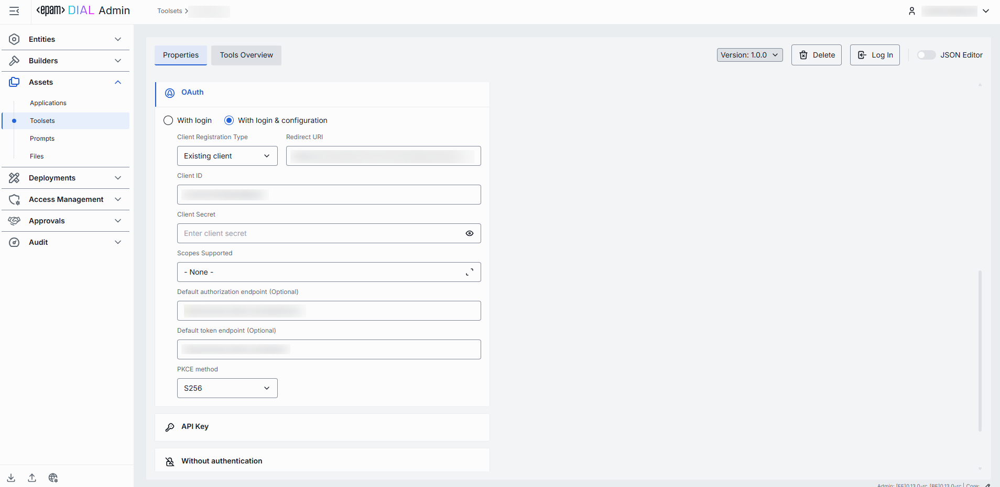
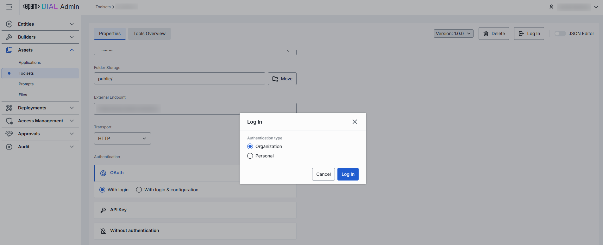
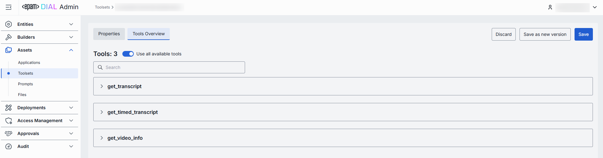
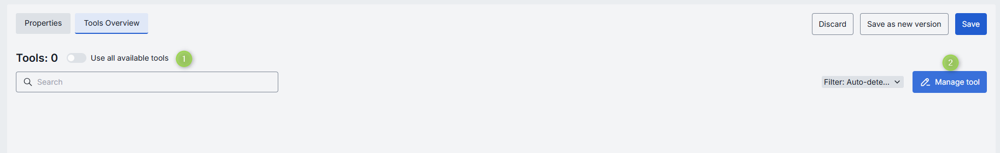
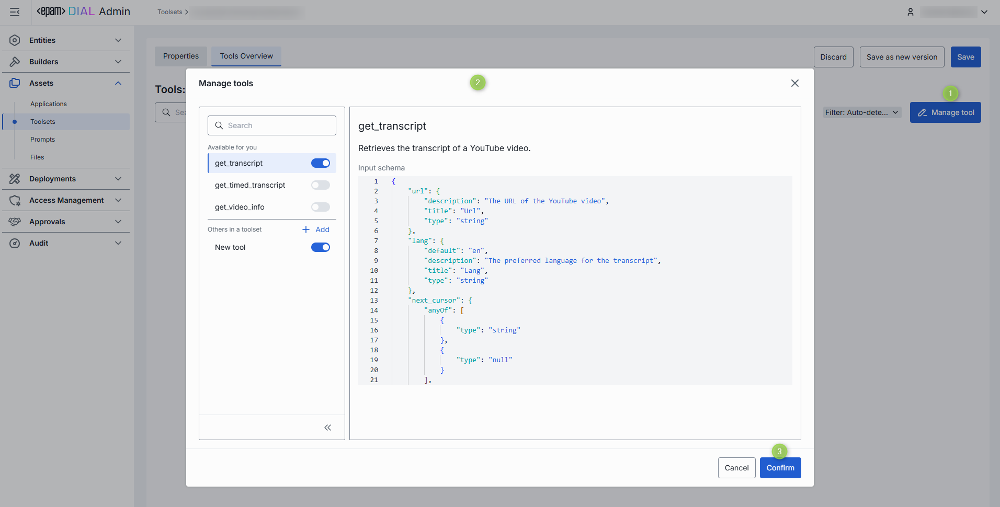
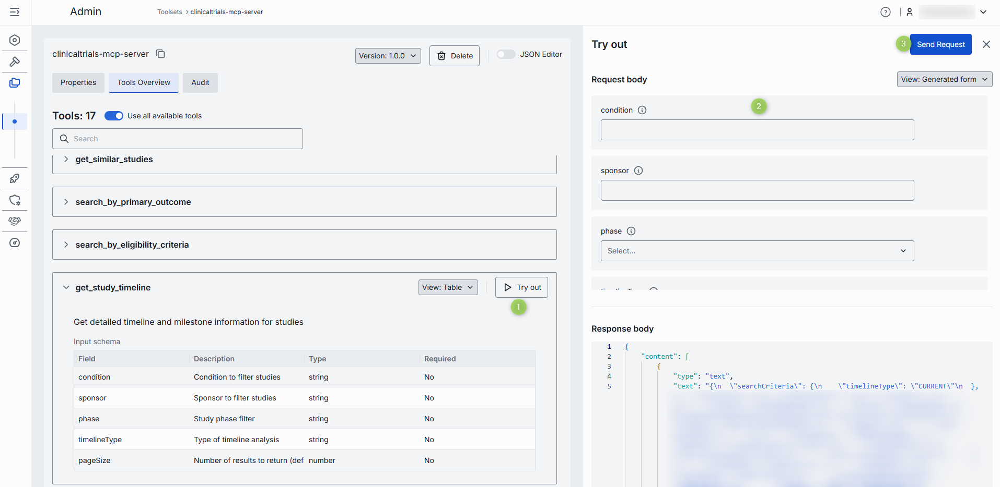
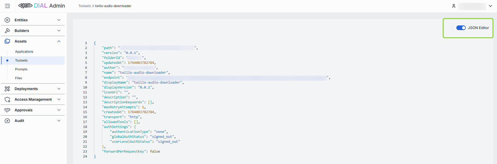

# Toolsets

## Introduction

Toolsets in DIAL are connections with MCP servers that can be used as tools by any internal or external application to perform specific actions. Refer to [Video Demo](/docs/video%20demos/2.Applications/5.quick-apps.md) to watch how tools are used in [DIAL Quick Apps 2.0](/docs/platform/3.core/7.apps.md#quick-apps-20).

Toolsets are considered to be a protected resource. Refer to [Access Control](/docs/platform/3.core/2.access-control-intro.md) to learn how protected resources are handled in DIAL.

## Main Screen

On the main screen, you can find all Toolsets located in the Public folder. Such toolsets have either been published by DIAL users or added by administrators. 

##### Public file storage

Objects in the [Public folder](/docs/platform/3.core/2.access-control-intro.md) are arranged hierarchically, similar to a file system. 

- **Root folder**: Pubic is a root folder with sub-folders. It is visible to all authorized users. If a sub-folder is not specified for the new object, it is placed in the root folder by default.
- **Sub-folders**: Objects can be placed in sub-folders for logical organization purposes - one object per sub-folder is recommended. **Note**, that a publication request can include access rules for the selected target sub-folder. You can view and manage access rules in [Folders Storage](/docs/tutorials/3.admin/access-management-folders-storage.md). The effective authorization rule for an object in a sub-folder includes restrictions applied to all parent sub-folders up to the root folder. Refer to [Tutorials](/docs/tutorials/1.developers/1.work-with-resources/0.work-with-publications.md#effective-rules) to learn about affective rules for folders.

| Available Actions | Description |
|-------------------|-------------|
| **Create folder + import objects** | Hover over any folder to display the **+** icon. It allows importing objects into new child or sibling folders. Same flow as [Import](#import), but requires providing a new folder name. **Note** that new folders can be added only via this method or along with the publication request if a new folder is defined in it. |
| **Actions** | Hover over any folder to view a context menu icon with actions you can perform in relation to the selected folder.  - **Rename**: Use to rename the selected folder. - **Move to**: Use to select a target location in the hierarchy to move the selected folder. - **Manage permissions**: Redirects to [Folder Storage](/docs/tutorials/3.admin/access-management-folders-storage.md) to manage access to the folder. - **Delete**: Use to delete the folder with objects inside it.|

##### Toolsets grid

Click on any folder to display toolsets in the toolsets grid.

| Column | Description |
|--------|-------------|
| **ID** | Toolset's unique key. |
| **Version** | Version of the toolset. |
| **Author** | Username or system ID associated with the user who created or last updated this toolset. |
| **Updated time** | Timestamp of the last modification of the toolset. Use to track changes. |
| **Actions** | Actions you can perform on the selected toolset:   - **Open in new tab**: Opens a new tab with toolset's properties and parameters.  - **Duplicate**: Use to create a copy of the toolset.   - **Move to another folder**: Use to select the target folder in the hierarchy to move the toolset. - **Delete**: Use to delete the toolset. Alternatively you can use **Bulk Actions** in the header to remove multiple toolsets. |

## Export

Use **Bulk Actions** in the toolbar to download selected toolsets. This is useful for migrating toolsets between environments, sharing sets of toolsets with other users, or keeping a point-in-time backup.

##### To export toolsets:

1. Click **Bulk Actions** button in the toolbar.
2. Select toolsets by checking the boxes in each row. You can also select the version you want to export. 
3. Click **Export** in the bottom to launch the export modal.
4. In the modal window select the export format: Archive or JSON.
5. Click **Export** to generate export file and start downloading.  

## Import

Use **Import** in the toolbar to upload new or update existing toolsets from ZIP archive. This is essential for migrating, restoring, or sharing toolsets assets between DIAL users.

##### To import toolsets:

1. Click **Import** in the toolbar to launch the import modal.
2. **Drag & Drop** your DIAL Admin archive into the files area or click **Browse** to open a file picker.

    

3. Select a Conflict resolution strategy. It allows you to decide how to handle existing toolsets with the same identifier and version:
   * **Skip**: Leave existing toolsets untouched, only new ones will be added.
   * **Override**: Replace toolsets having the same name and version with the imported ones.
4. Use **Ignore paths** toggle to skip folder structure from the imported files. When enabled, all toolsets will be imported directly into the root folder without recreating the original folder hierarchy.
5. Click **Finish** to start.

    

## Create

On the main screen you can add new toolsets to the public folder.

Follow these steps to add a new toolset: 

1. Click **+ Create** to invoke the **Create Toolset** modal.

    | Field | Required | Description |
    |-------|----------|-------------|
    | **ID** | Yes | Unique identifier of the toolset. |
    | **Display Name** | Yes | Name of the toolset displayed on UI. |
    | **Version** | Yes | Semantic identifier (e.g., 1.2.0) of a toolset's version. |
    | **Description** | No | Description of a toolset. |
    | **External Endpoint** | Yes | Endpoint DIAL Core will use to communicate with the related MCP server. |

3. Once all required fields are filled click **Create**. The dialog closes and the new [toolset configuration](#configuration-screen) screen is opened. This entry will appear immediately in the listing under the selected folder once created.

    

## Delete

Use the **Delete** button in the Configuration screen toolbar to permanently remove the selected toolset. To remove several toolsets, use the **Bulk Actions** option on the main screen.

## Configuration

Click any toolset on the main screen to open a screen with information about the selected toolset and its configuration details.

### Properties

In the **Properties** tab, you can preview and modify selected toolset's basic properties.

| Field | Required | Editable | Description |
|-------|----------|----------|-------------|
| **ID** | - | No | Unique identifier of the toolset. |
| **Creation Time** | - | No | Creation timestamp. |
| **Updated Time** | - | No | Timestamps if the last update. |
| **Authentication** | - | No | Current authentication status of the selected toolset:  - **Logged out**: The toolset in not authenticated with the related MCP server.  - **Logged in (Personal)**: The toolset is authenticated for your user only.  - **Logged in (Organization)**: The toolset is authenticated for all users in your organization. |
| **Folder Storage** | - | No | Path to the toolset's location in the hierarchy within the public folder. |
| **Display Name** | Yes | Yes | The name of the toolset displayed on UI. |
| **Description** | No | Yes | Toolset description. |
| **Icon** | Yes | Yes | Logo of the toolset displayed on UI. Maximum size: 512 MB. Supported types: .jpeg, .jpg, .jpe, .png, .gif, .apng, .webp, .avif, .svg, .svgz, .bmp, .ico. |
| **Topics** | No | Yes | Semantic tags associated wih the toolset. |
| **Storage folder** | Yes | Yes | Path to the toolset's location in the hierarchy of the Public folders. It allows you to move the toolset between folders. |
| **External Endpoint** | Yes | Yes | Endpoint DIAL Core will use to communicate with the related MCP server. |
| **Transport** | Yes | Yes | Transport supported by MCP server. - **HTTP** (default) - **SSE** (for server-sent events when supported) |
| **Authentication** | Yes | Yes | [Authentication settings for the toolset.](#authentication) |
| **Forward per request key** | Yes | Yes | Set this flag to `true` if you want a [per-request key](/docs/platform/3.core/3.per-request-keys.md) to be forwarded to the toolset endpoint allowing a toolset to access files in the DIAL storage. **Note**: it is not allowed to create toolsets with `authType.API_KEY` and `forwardPerRequestKey=true`. |
| **Max retry attempts** | Yes | Yes | Number of times DIAL Core will [retry](/docs/platform/3.core/5.load-balancer.md#fallbacks) a failed call (due to timeouts or 5xx errors). |

#### Authentication

If the toolset you have chosen requires authentication at the related MCP server, you will have to sign in before you can use it. For example, if you are using an application that relies on the MCP toolset and authentication is required, you will not be able to access it unless you are logged in. Therefore, make sure you are authenticated with MCP server you are about to use.

**Note**, that toolset can be published with credentials by other users. In this case, a toolset can be already authenticated for all users in the organization - **Logged in (Organization)**. You can use it or log out and log back in with your personal credentials - **Logged in (Personal)**.

> Refer to [DIAL Core](https://github.com/epam/ai-dial-core/blob/development/docs/dynamic-settings/toolset_credentials_api.md) to learn more about toolset authentication

##### Step 1: Select and configure the authentication method 

DIAL supports several authentication methods for toolsets:

* **OAuth**: Authenticate via OAuth 2.0 with an external identity provider. If this option is selected, you have to choose **With login** for a dynamic registration of clients or **With login & configuration** for a static registration of clients - depending on what method your MCP server supports. For a dynamic option, it is enough to provide an **External Endpoint** in the toolset properties. For a static, populate the authentication form with correct values provided by the identity provider:
    - **Redirect URI**: Redirect URI used during sign in flows. After authentication, the MCP Server redirects the User to the provided URI.
    - **Client ID**: Unique identifier of the client/application requesting access to the resource. 
    - **Client Secret**: Confidential key used by a client to authenticate itself with the authentication server. 
    - **Scopes Supported**: List of supported scopes that define access levels. May be discovered via .well-known endpoints. 
    - **Default authorization endpoint**: URL for performing authorization. Can be discovered via .well-known metadata if provided by the Authorization Server.
    - **Default token endpoint**: URL where a client exchanges authorization code for an access token. Can be discovered via .well-known metadata if provided by the Authorization Server.
    - **PKCE method**: Proof Key method for Code Exchange (PKCE), usually `plain` or `S256`.
* **API Key**: Authenticate using API key. If this option is selected, provide API key and header name in the configuration.
* **Without authentication**: No authentication is required.

##### Step 2: Choose personal or organization authentication

Having selected and configured any authentication method, click **Save** and **Log In** to authenticate a toolset with the related MCP server. At this step, prior to the actual authentication, you will be prompted to select between **Personal** and **Organization** authentication:

* **Personal**: the toolset will be authenticated for your user only with the authentication state labeled **Logged in (Personal)**.
* **Organization**: the toolset will be authenticated for all users in your organization with the authentication state labeled **Logged in (Organization)**. Any user will be able to log out and log back in with personal credentials.

**Important**: at this step, for authentication with API keys, you will be prompted to provide a valid API key value.

### Tools Overview

[Tools](https://modelcontextprotocol.io/specification/2025-06-18/server/tools) are specific functions supported by a related MCP server that can be used by clients to perform specific actions. On this screen, you can find and manage all tools supported by the related MCP server.

In case your toolset was created based on the MCP container deployed in DIAL, the content of this screen is inherited from the related [MCP container](/docs/tutorials/3.admin/deployments-mcp.md#tools-overview).

#### Use all tools

Enable **Use all available tools** toggle to automatically include all tools supported by the related MCP server. When enabled, you cannot add or remove tools manually.

Click on any tool to preview its details or [try it out](#try-tools).

#### Manage tools

Disable **Use all available tools** toggle to enable a manual tools management mode.

1. Disable **Use all available tools** toggle and click **Manage tool** button to open the **Manage tools** modal.
2. The modal displays all tools available to your user. You can preview and enable/disable each tool individually.
3. MCP sever can support other tools that are not available to your user and therefore are not rendered in the list of available tools. If you know their names, you can manually add them. Manually-added tools are labeled accordingly on the Tools Overview screen.
4. Click **Confirm** to apply changes.
5. On the **Tools overview** screen, use the filter to see all tools, just auto-detected tools or manually added tools.
6. Hover over any tool to see its details or [try it out](#try-tools).

#### Try tools

Click or hover over any **enabled** tool to enter the Try out mode.

In the **Try out mode**, you can test each enabled tool by sending a sample request to the server. When sending a request, you can use the rendered UI form to populate the request input fields or enter JSON view mode to get access to all the fields supported by the input schema.

### JSON Editor

**Advanced users with technical expertise** can work with the toolset properties in a JSON editor view mode.

Use the **JSON Editor** toggle to switch between the form-based UI and raw JSON view of the toolset’s configuration. It is useful for advanced scenarios of bulk updates, copy/paste between environments, or tweaking settings not exposed on UI.

> **TIP**: You can switch between UI and JSON only if there are no unsaved changes.

##### Switching to the JSON Editor

1. Navigate to **Assets → Toolsets**, then select the toolset you want to edit.
2. Click the **JSON Editor** toggle (top-right). The UI reveals the raw JSON.
