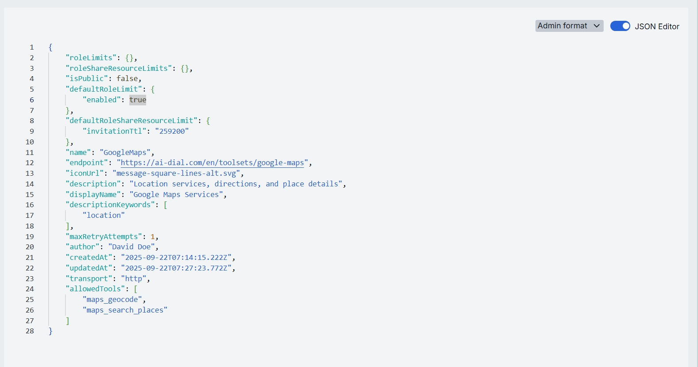

# Toolsets

## Introduction

Toolsets in DIAL are connections with MCP servers that you can use as tools in [Quick Apps 2.0](/docs/video%20demos/2.Applications/5.quick-apps.md).

## Main Screen

On the main screen, you can find all publicly-available Toolsets that have either been published by DIAL users or added via a direct modification to [DIAL Core's dynamic settings](https://github.com/epam/ai-dial-core/blob/development/docs/dynamic-settings/toolsets.md). 

Publicly-available toolsets can be accessed via [DIAL Core API](https://dialx.ai/dial_api#tag/Deployment-listing/operation/getToolSets) or [DIAL Marketplace](/docs/platform/4.chat/1.marketplace.md) by all authorized users and apps.

> Refer to [Access Control](/docs/platform/3.core/2.access-control-intro.md) to lean more about Private and Public logical spaces for objects storage in DIAL. 

##### Folders Structure

Objects in the [Public space](/docs/platform/3.core/2.access-control-intro.md) are arranged hierarchically, similar to a file system. In this part of the screen, you can see the hierarchical structure of folders in the Public space. 

| Element         | Description    |
|-----------------|----------------|
| **Root folder** | A root public folder. Contains the sub-folders and toolsets. It is visible to all users.   |
| **Sub-folders** | Toolsets can be placed in a specific sub-folder for logical organization purposes.      |
| **Actions**     | Hover over any folder to view a context menu icon with actions you can perform in relation to the selected folder.  - **Rename**: Use to rename the selected folder. - **Move to**: Use to select a target location in the hierarchy to move the selected folder. - **Manage permissions**: Redirects to [Folder Storage](/docs/tutorials/3.admin/access-management-folders-storage.md) to manage access to the folder. - **Delete**: Use to delete the folder with Toolsets inside it. |

##### Toolsets Grid

Click on any folder to display toolsets in the toolsets grid.

| Column           | Definition       |
|------------------|---------------------------|
| **ID**           | The toolset’s unique key.    |
| **Version**      | Version of the toolset.      |
| **Author**       | The username or system ID associated with the user who created or last updated this toolset. |
| **Updated time** | The timestamp of the last modification of the toolset. Use to track changes.     |
| **Actions**      | Actions you can perform on the selected toolset:   - **Open in new tab**: Opens a new tab with toolset's properties and parameters.  - **Duplicate**: Use to create a copy of the toolset.   - **Move to another folder**: Use to select the target folder in the hierarchy to move the toolset. - **Delete**: Use to delete the toolset. Alternatively you can use **Bulk Actions** in the header to remove multiple toolsets. |

## Export

Use **Bulk Actions** in the toolbar to download selected toolsets. 

This is useful for migrating toolsets between environments, sharing sets of toolsets with another users, or keeping a point-in-time backup.

##### To export toolsets:

1. Click **Bulk Actions** button in the toolbar.
2. Select toolsets by checking the boxes in each row. You can also select the version you want to export. 
3. Click **Export** in the bottom to launch the export modal.
4. In the modal window select the export format: Archive or JSON.
5. Click **Export** to generate export file and start downloading.  

## Import

Use **Import** in the toolbar to upload new or update existing toolsets from ZIP archive. This is essential for migrating, restoring, or sharing toolsets assets between DIAL users.

##### To import toolsets:

1. Click **Import** in the toolbar to launch the import modal.
2. **Drag & Drop** your DIAL Admin archive into the files area or click **Browse** to open a file picker.

    

3. Select a Conflict resolution strategy. It allows you to decide how to handle existing toolsets with the same identifier and version:
   * **Skip**: Leave existing toolsets untouched, only new ones will be added.
   * **Override**: Replace toolsets having the same name and version with the imported ones.
4. Use **Ignore paths** toggle to skip folder structure from the imported files. When enabled, all toolsets will be imported directly into the root folder without recreating the original folder hierarchy.
5. Click **Finish** to start.

    

## Create

On the main screen you can add new toolsets to the public folder.

Follow these steps to add a new toolset: 

1. Click **+ Create** to invoke the **Create Toolset** modal.
2. Define toolset's parameters

    | Field     | Required    | Definition & Guidance    |
    |-----------------------|-------------|--------------|
    | **ID**    | Yes         | A unique identifier of the toolset.  |
    | **Display Name**      | Yes         | A user-friendly label shown throughout the Admin UI and in DIAL Core. |
    | **Version**           | Yes         | Semantic identifier (e.g., 1.2.0) of a toolset's version. |
    | **Description**       | No          | A free-text summary describing the toolset (e.g. purpose and data being fetched). |
    | **External Endpoint** | Yes | Endpoint DIAL Core will use to communicate with the toolset.   |

3. Once all required fields are filled click **Create**. The dialog closes and the new [toolset configuration](#configuration-screen) screen is opened. This entry will appear immediately in the listing under the selected folder once created.

    

## Configuration Screen

Click any toolset on the main screen to open a screen with information about the selected toolset and its configuration details.

### Properties

In the **Properties** tab, you can preview and modify selected toolset's basic properties.

| Field        | Definition & Use Case     |
|--------------------------|------------------------|
| **Id**       | A unique identifier of the toolset.   |
| **Author**   | The username or system ID associated with the user who created or last updated this toolset.   |
| **Creation Time**        | The timestamp of when the toolset was created.    |
| **Updated Time**         | Date and time when the toolset's configuration was last updated.       |
| **Authentication**       | Current authentication status of the selected toolset.        |
| **Folder Storage**       | The path to the toolset's location in the hierarchy of the public folder.| 
| **Display Name**         | The name of the toolset assigned by the author.   |
| **Version**  | Version of the toolset. Can be selected from the dropdown to display information for different versions.|
| **Description**          | A free-text summary describing the toolset.       |
| **Icon**     | A logo to visually distinguish the toolset on the UI. Maximum size: 512 MB. Supported types: .jpeg, .jpg, .jpe, .png, .gif, .apng, .webp, .avif, .svg, .svgz, .bmp, .ico. Up to 1 files. |
| **Topics**   | Tags that you can assign to toolset. Helps to assign categories for better navigation on UI.   | 
| **Storage folder**       | The path to the toolset's location in the hierarchy of folders. It allows you to move the toolset between folders.  | 
| **External Endpoint**    | The MCP endpoint that a Quick App can call to fetch external data.         |
| **Transport**|  A transport supported by MCP server. The available options are: HTTP or SSE. Default: HTTP. Choose SSE for server-sent events when supported.        |
|**Authentication**|Authentication settings for the Toolset. Supported OAUTH, API_KEY, or NONE. Refer to [DIAL Core](https://github.com/epam/ai-dial-core/blob/development/docs/dynamic-settings/toolset_credentials_api.md) to learn more about toolset authentication.|
|**Forward per request key**|Set this flag to `true` if you want a [per-request key](/docs/platform/3.core/3.per-request-keys.md) to be forwarded to the toolset endpoint allowing a toolset to access files in the DIAL storage. **Note**: it is not allowed to create toolsets with `authType.API_KEY` and `forwardPerRequestKey=true`.|
| **Max retry attempts**   | Number of times DIAL Core will [retry](/docs/platform/3.core/5.load-balancer.md#fallbacks) a failed call (due to timeouts or 5xx errors).   |

### Tools Overview

Tools in toolsets are functionalities supported by a corresponding MCP server that can be used to extend the capabilities of your toolset. In this tab, you can find all tools included in the toolset and add more tools.

#### Add

You can add a tool manually only if **Use all available tools** toggle is **Off**.

1. Click **+ Add** on the top-right.
2. Click **+ Add** in the modal and give names to the tools that will be added.
3. **Add** to add tools to the toolset.

#### Remove

You can remove a tool only if **Use all available tools** toggle is **Off**.

1. Hover the tool by the pointer to see Delete button.
2. Click **Delete** to remove a tool.

### JSON Editor

Use the **JSON Editor** toggle to switch between the form-based UI and raw JSON view of the toolset’s configuration. It is useful for advanced scenarios of bulk updates, copy/paste between environments, or tweaking settings not exposed in the form UI—you can switch to the **JSON Editor** on any toolset configuration page.

##### Switching to the JSON Editor

1. Navigate to **Assets → Toolsets**, then select the toolset you want to edit.
2. Click the **JSON Editor** toggle (top-right). The UI reveals the raw JSON.

> **TIP**: You can switch between UI and JSON only if there are no unsaved changes.

## Delete

Use the **Delete** button in the Configuration screen toolbar to permanently remove the selected toolset. To remove several toolsets, use the **Bulk Actions** option on the main screen.
