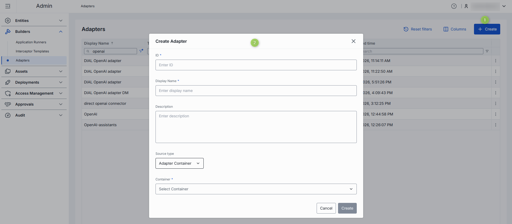
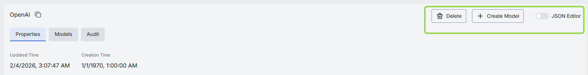
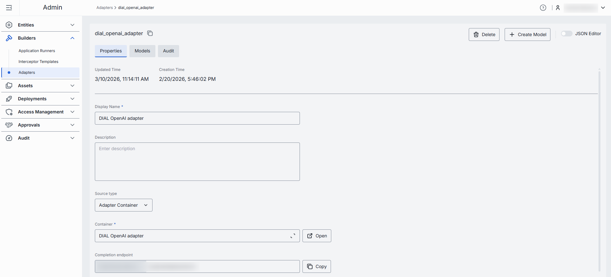
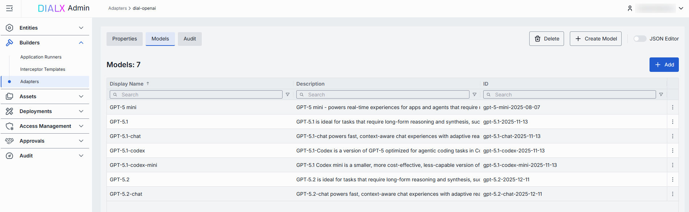
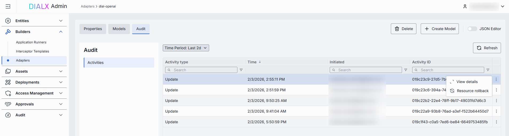

# Adapters

## Introduction

In DIAL, **model adapters** unify provider-specific model APIs with the **Unified Protocol** of DIAL Core. Each adapter consists of:

* **Coded implementation** that talks to the AI model and implements the Unified Protocol.
* **Metadata object** that you manage in **Builders/Adapters**, which establishes the relationship to the **models**.

DIAL includes adapters for [Azure OpenAI](https://github.com/epam/ai-dial-adapter-openai) models, [GCP Vertex AI](https://github.com/epam/ai-dial-adapter-vertexai/?tab=readme-ov-file#supported-models) models, and [AWS Bedrock](https://github.com/epam/ai-dial-adapter-bedrock) models. 

Compatibility with Azure OpenAI API, makes it simple to add new adapters for language models or develop them with [DIAL SDK](https://github.com/epam/ai-dial-sdk).

## Main Screen

The main screen displays all registered adapters in your DIAL instance.

##### Adapters grid

| Column | Description |
|--------|-------------|
| **ID** | Unique identifier of the adapter. |
| **Display Name** | Name of the adapter displayed on UI. |
| **Description** | Brief description of the adapter (e.g., "Adapter for OpenAI models"). |
| **Updated time** | Timestamp of the last update to this adapter's configuration. Useful to track recent changes. |
| **Topics** | Semantic tags associated with adapter. |

## Create

On the main screen, you can add new adapters by following these steps:

1. Click **+ Create** to invoke the **Adapter** modal.

    | Field | Required | Description |
    |-------|----------|------------|
    | **ID** | Yes | Unique identifier. |
    | **Display name** | Yes | Unique name of the adapter displayed on UI. |
    | **Description** | No | Description of the adapter. |
    | **Base endpoint** | Yes | Base URL of the adapter service that implements the Unified Protocol (following the format: `{ADAPTER_ORIGIN}/openai/deployments/`). |

3. Once all required fields are filled, click **Create**. The dialog closes and the new adapter's configuration screen is opened. A new adapter will appear immediately on the main screen once it is created.

    

## Configuration

Click any adapter on the main screen to open its configuration page.

##### Top Bar Controls

* **Create Model**: Use to create a model deployment using the selected model adapter as a source type. Created models will be available in the [Entities → Models](/docs/tutorials/3.admin/entities-models.md) section.
* **Delete**: Use to remove the adapter itself and all models utilizing it. After confirmation - the adapter and all related models are deleted.
* **Save**: Use to save and apply any changes.
* **Discard**: Use to discard any unsaved changes. You can revert changes in the [Audit](#audit) section.
* **JSON Editor** (Toggle): Switch between the form-based UI and raw [JSON view](#json-editor) of the adapter's configuration. Use JSON mode for copy-paste or advanced edits.

### Properties

In the Properties tab, you can view and define identity and metadata of the selected adapter.

| Field | Required | Editable | Description |
|-------|----------|----------|-------------|
| **ID** | - | No | Unique identifier. |
| **Updated Time** | - | No | Timestamp of the last update to this adapter's configuration. Useful to track recent changes. |
| **Creation Time** | - | No | Adapter creation timestamp. |
| **Display Name** | Yes | Yes | Unique name of the adapter displayed on UI. |
| **Description** | No | Yes | Brief description of the adapter. |
| **Base endpoint** | Yes | Yes | Base URL of the adapter service that implements the Unified Protocol (following the format: `{ADAPTER_ORIGIN}/openai/deployments/`). |
| **Topics** | No | Yes |Semantic tags associated with adapter. |

### Models

In the **Models** tab, you can view and add AI models exposed by the selected adapter.

| Field | Description |
|-------|-------------|
| **ID** | Model's identifier. |
| **Display Name** | Name of the AI model displayed on UI. |
| **Description** | Description of the model. |

#### Add

You can add AI models that will be processed by the selected adapter. 

1. Click **+ Add**.
2. **Select** one or more available models in the modal window. You can check all the available models in the [Entities → Models](/docs/tutorials/3.admin/entities-models.md) section. You can also use **+ Create Model** button [on this screen](#top-bar-controls) to create a new model on the fly.
3. Click **Apply** to insert them into the table.

#### Remove

You can remove models processed by the adapter.
 
1. Click the **actions** menu in the model’s line.
2. Choose **Remove** in the menu.

### Audit

On this screen, you can access a detailed preview and revert any changes made to the selected AI model adapter.

> **TIP**: This section mimics the functionality available in the global [Audit → Activities](/docs/tutorials/3.admin/telemetry-activity-audit.md) menu, but is scoped specifically to the selected AI model adapter.

### JSON Editor

**Advanced users with technical expertise** can work with the adapter properties in a JSON editor view mode. It is useful for advanced scenarios of bulk updates, copy/paste between environments, or tweaking settings not exposed in the form UI.

##### Switching to the JSON Editor

1. Navigate to **Builders → Adapters**, then select the adapter you want to edit.
2. Click the **JSON Editor** toggle (top-right). The UI reveals the raw JSON.

> **TIP**: Switching modes is disabled if there are any unsaved changes.
