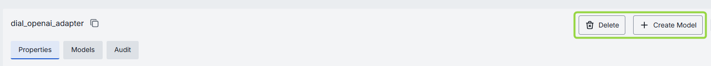
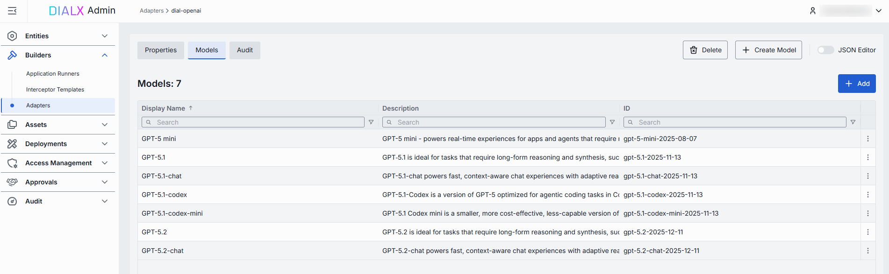

# Adapters

## Introduction

In DIAL, **model adapters** unify provider-specific model APIs with the **Unified Protocol** of DIAL Core. Each adapter consists of:

* **Coded implementation** that talks to the AI model and implements the Unified Protocol.
* **Metadata object** that you manage in **Builders/Adapters**, which establishes the relationship to the **models**.

DIAL includes adapters for [Azure OpenAI](https://github.com/epam/ai-dial-adapter-openai) models, [GCP Vertex AI](https://github.com/epam/ai-dial-adapter-vertexai/?tab=readme-ov-file#supported-models) models, and [AWS Bedrock](https://github.com/epam/ai-dial-adapter-bedrock) models. 

Compatibility with Azure OpenAI API, makes it simple to add new adapters for language models or develop them with [DIAL SDK](https://github.com/epam/ai-dial-sdk).

DIAL enables use of [self-hosted](/docs/tutorials/3.admin/deployments-adapters.md) (deployed withing the DIAL infrastructure) and external adapters.

## Main Screen

The main screen displays all registered adapters in your DIAL instance.

##### Adapters grid

| Column | Description |
|--------|-------------|
| **ID** | Unique identifier of the adapter. |
| **Display Name** | Name of the adapter displayed on UI. |
| **Description** | Brief description of the adapter (e.g., "Adapter for OpenAI models"). |
| **Updated Time** | Timestamp of the last update. |
| **Creation Time** | Creation timestamp. |
| **Topics** | Semantic tags associated with adapter. |
| **Source type** | Type of the adapter source: external endpoint or adapter container. |
| **Source** | URL for externally-deployed adapters or the name of the adapter container for self-hosted adapters. | 

## Create

On the main screen, you can add new adapters by following these steps:

1. Click **+ Create** to invoke the **Create Adapter** modal.

    | Field | Required | Description |
    |-------|----------|-------------|
    | **ID** | Yes | Unique identifier. |
    | **Display name** | Yes | Unique name of the adapter displayed on UI. |
    | **Description** | No | Description of the adapter. |
    | **Source type** | Yes | External Endpoint for externally-deployed adapters or Adapter Container for self-hosted adapter images. |
    | **Completion endpoint path** | Yes | Endpoint that will be used to process chat completion requests. Implements the Unified Protocol (following the format: `{ADAPTER_ORIGIN}/openai/deployments/`). |
    | **Responses endpoint path** | No | Endpoint of the model adapter that supports the OpenAI Responses API. Currently only OpenAI adapters support this. When set, DIAL Core routes `POST /openai/v1/responses` requests to this endpoint. Only basic Responses API behavior is supported: background requests, `previous_request_id`, conversations, prompts, and files are not supported. |
    | **Container** | Conditional | Name of the running [adapter container](/docs/tutorials/3.admin/deployments-adapters.md). Click to select from the list of available containers.  Applies to Adapter Container source type. |

3. Once all required fields are filled, click **Create**. The dialog closes and the new adapter's configuration screen is opened. A new adapter will appear immediately on the main screen once it is created.

    

## Configuration

Click any adapter on the main screen to open its configuration page.

##### Top Bar Controls

* **Create Model**: Use to create a model deployment using the selected model adapter as a source type. Created models will be available in the [Entities/Models](/docs/tutorials/3.admin/entities-models.md) section.
* **Delete**: Use to remove the adapter itself and all models utilizing it. **Note**: After confirmation - the adapter and all related models are deleted.
* **Save**: Use to save and apply any changes.
* **Discard**: Use to discard any unsaved changes. You can revert changes in the [Audit](#audit) section.
* **JSON Editor** (Toggle): Switch between the form-based UI and raw [JSON view](#json-editor) of the adapter's configuration. Use JSON mode for copy-paste or advanced edits.

### Properties

In the Properties tab, you can view and define identity and metadata of the selected adapter.

| Field | Required | Editable | Description |
|-------|----------|----------|-------------|
| **ID** | - | No | Unique read-only identifier of the adapter. |
| **Updated Time** | - | No | Timestamp of the last update to this adapter's configuration. |
| **Creation Time** | - | No | Adapter creation timestamp. |
| **Display Name** | Yes | Yes | Unique name of the adapter displayed on UI. |
| **Description** | No | Yes | Brief description of the adapter. |
| **Source type** | Yes | Yes | External Endpoint for externally-deployed adapters or Adapter Container for self-hosted adapter images. |
| **Completion endpoint path** | Yes | Yes | Endpoint URL of the adapter service that will be used to process chat completion requests. Implements the Unified Protocol (following the format: `{ADAPTER_ORIGIN}/openai/deployments/`).   The base URL is determined by the selected Adapter container, while the path can be partially customized.   Responses API endpoint is recommended to use here for OpenAI models that support Responses API. |
| **Responses endpoint path** | No | Yes | Endpoint of the model adapter that supports the OpenAI Responses API. Currently only OpenAI adapters support this. When set, DIAL Core routes `POST /openai/v1/responses` requests to this endpoint. Only basic Responses API behavior is supported: background requests, `previous_request_id`, conversations, prompts, and files are not supported.   The base URL is determined by the selected Adapter container, while the path can be partially customized. |
| **Container** | Conditional | Yes | Name of the running [adapter container](/docs/tutorials/3.admin/deployments-adapters.md). Click to select from the list of available containers.  Applies and is required to Adapter Container source type. |
| **Topics** | No | Yes |Semantic tags associated with adapter. Click to display a list of available topics.   You can add your own custom topics to the list following these rules: - The topic name must not exceed 255 characters. - The topic name must not contain leading or trailing spaces. |

### Models

In the **Models** tab, you can view and add AI models exposed by the selected adapter.

| Field | Description |
|-------|-------------|
| **ID** | Model's identifier. |
| **Display Name** | Name of the AI model displayed on UI. |
| **Description** | Description of the model. |

#### Add

You can add AI models that will be processed by the selected adapter. 

1. Click **+ Add**.
2. **Select** one or more available models in the modal window. You can check all the available models in the [Entities → Models](/docs/tutorials/3.admin/entities-models.md) section. You can also use **+ Create Model** button [on this screen](#top-bar-controls) to create a new model on the fly.
3. Click **Apply** to insert them into the table.

#### Remove

You can remove models processed by the adapter.
 
1. Click the **actions** menu in the model’s line.
2. Choose **Remove** in the menu.

### Audit

On this screen, you can access a detailed preview and revert any changes made to the selected AI model adapter.

> **TIP**: This section mimics the functionality available in the global [Audit → Activities](/docs/tutorials/3.admin/telemetry-activity-audit.md) menu, but is scoped specifically to the selected AI model adapter.

### JSON Editor

**Advanced users with technical expertise** can work with the adapter properties in a JSON editor view mode. It is useful for advanced scenarios of bulk updates, copy/paste between environments, or tweaking settings not exposed in the form UI.

##### Switching to the JSON Editor

1. Navigate to **Builders → Adapters**, then select the adapter you want to edit.
2. Click the **JSON Editor** toggle (top-right). The UI reveals the raw JSON.

> **TIP**: Switching modes is disabled if there are any unsaved changes.
