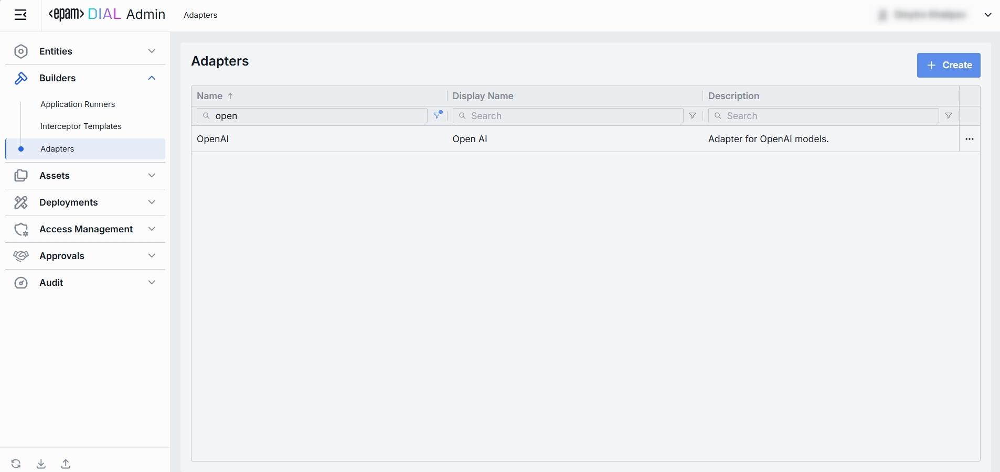
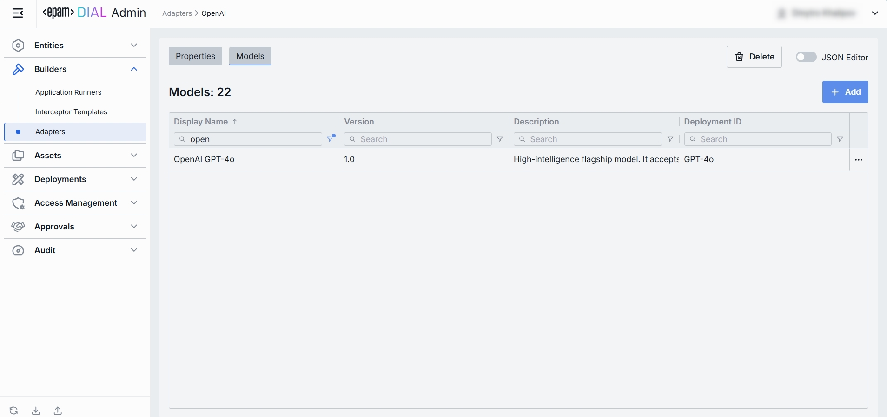

# Adapters

## About Adapters

In DIAL, **adapters** unify provider-specific LLM APIs with the **Unified Protocol** of DIAL Core. Each adapter consists of:

* **Coded implementation** that talks to the LLM and implements the Unified Protocol.
* **Metadata object** that you manage in **Builders → Adapters**, which establishes the relationship to the **models**.

> Refer to [Adapters documentation](/docs/platform/0.architecture-and-concepts/3.components.md#llm-adapters) to learn more.

## Adapters List

The page lists all registered adapters in your DIAL instance.

##### Adapters Grid

| Column            | Definition                                                                                         |
|-------------------|----------------------------------------------------------------------------------------------------|
| **Name**          | The adapter’s unique name (identifier).                                                            |
| **Display Name**  | A user-friendly label for the adapter. Helps you pick the right adapter when creating a new model. |
| **Description**   | Free-text notes about the adapter’s purpose (e.g., “Adapter for OpenAI models”).                   |

## Create

1. Click **+ Create** to invoke the **Create Adapter** modal.
2. Define key parameters for the new adapter:

| Field                 | Required | Definition                                                                                                                                                           |
|-----------------------|----------|----------------------------------------------------------------------------------------------------------------------------------------------------------------------|
| **Name**              | Yes      | A unique identifier for this adapter.                                                                                                                                |
| **Display name**      | No       | A user-friendly name of the adapter.                                                                                                                                 |
| **Description**       | No       | Free-text notes about what this adapter is for.                                                                                                                      |
| **Base endpoint**     | Yes      | The base URL of the adapter service that implements the Unified Protocol. Is the base URL part of the model completion endpoint if one created based on the adapter. |

3. Once all required fields are filled, click **Create**. The dialog closes and the new adapter's configuration screen is opened. A new adapter will appear immediately in the listing once created.

## Configuration

The configuration view has a top bar and two tabs.

##### Top Bar

* **Create Model** - creates a model using the current adapter, directly from this page.
* **Delete** – removes the adapter. Modal shows all models utilizing the adapter. After confirmation - the adapter and all related models are deleted.
* **JSON Editor** (Toggle): Switch between the form-based UI and raw [JSON view](#json-editor) of the adapter's configuration. Use JSON mode for copy-paste or advanced edits.

### Properties
In the Properties tab, you can define identity and metadata of adapters.

| Field                 | Required | Definition                                                                                                                                                       |
|-----------------------|----------|------------------------------------------------------------------------------------------------------------------------------------------------------------------|
| **Name**              | Yes      | A unique identifier for this adapter.                                                                                                                            |
| **Display name**      | No       | A user-friendly name of the adapter.                                                                                                                             |
| **Description**       | No       | Free-text notes about what this adapter is for.                                                                                                                  |
| **Base endpoint**     | Yes      | The base URL of the adapter service that implements the Unified Protocol. Is the base URL part of the model completion endpoint if created based on the adapter. |

### Models

Manage the **models** this adapter exposes.

| Column            | Definition                                                                                |
|-------------------|-------------------------------------------------------------------------------------------|
| **Display Name**  | A user-friendly name of the model                                                         |
| **Version**       | The model’s version (e.g. `v1.0`) as defined in the given model in **Entities → Models**. |
| **Description**   | A free-text description of the model                                                      |
| **Deployment ID** | The unique identifier of the model.                                                       |

#### Add

1. Click **+ Add** (top-right of the Models Grid).
2. **Select** one or more models in the modal.
3. **Confirm** to insert them into the table.

#### Remove
 
1. Click the **actions** menu in the model’s line.
2. Choose **Remove** in the menu.

### JSON Editor

For advanced scenarios of bulk updates, copy/paste between environments, or tweaking settings not exposed in the form UI—you can switch to the **JSON Editor** in any adapter's configuration page.

##### Switching to the JSON Editor

1. Navigate to **Builders → Adapters**, then select the adapter you want to edit.
2. Click the **JSON Editor** toggle (top-right). The UI reveals the raw JSON.

> TIP: Switching modes is disabled if there are any unsaved changes.
