# Application Runners

## Introduction

Application Runner can be seen as an application factory that allows end-users create individual logical instances of applications each with its own configuration. An application runner definition includes a configuration schema that enforces data structure persisted for each instance. 

> Refer to [Entities/Application](/docs/tutorials/3.admin/entities-applications.md#create) or [Assets/Applications](/docs/tutorials/3.admin/assets-applications.md#create) to learn how to create application deployments based on application runners.

For example, a custom RAG application runner may allow an end user to configure a personalized RAG agent by connecting it to chosen data sources, such as internal knowledge bases, document repositories, or external APIs, and then share it with other users and groups. 

It is worth noting that [Quick Apps](/docs/platform/3.core/7.apps.md#quick-apps), [Code Apps](/docs/platform/3.core/7.apps.md#code-apps) and [Mind Maps](/docs/platform/3.core/7.apps.md#mind-maps) are application runners available in DIAL platform out of the box. You can use DIAL SDK to create custom application runners.

> Refer to [Schema-rich Applications](/docs/platform/3.core/7.apps.md#schema-rich-applications) to learn more.

## Main Screen

In Application Runners, you can add and manage Application Runners you have in your DIAL instance.

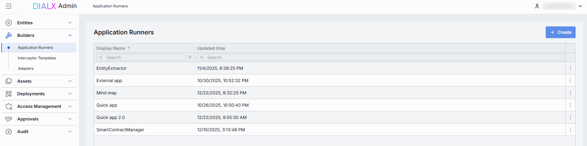

##### Application Runners grid

| Column | Description |
|--------|-------------|
| **Display Name** | Name of the application runner rendered on UI (e.g. "Python Lambda Runner", "NodeJS App Service"). |
| **ID** | Unique identifier of the application runner. Typically, it is the base URL of the service (e.g. `https://my-runner.example.com`). DIAL Core uses this endpoint to POST orchestration payloads. |
| **Description** | Description of the application runner capabilities, cluster location, version, or SLA (e.g. "v2 on GKE, 2 vCPU, 8 GB RAM"). |
| **Topics** | Tags associated with the application runner for identification and filtering on Admin UI (e.g. "finance", "support"). |
| **Updated time** | Timestamp of the last update to this runner's configuration. Useful for tracking recent changes. |

## Create

On the main screen, you can add new Application Runners.

1. Click **+ Create** to invoke the **Application Runner** modal.
2. Define key parameters for the new application runner:

    | Field | Required | Description|
    |-------|----------|------------|
    | **ID** | Yes | Unique identifier of the application runner. Typically, it is the base URL of the service (e.g. `https://my-runner.example.com`). DIAL Core uses this endpoint to POST orchestration payloads. |
    | **Display name** | Yes | Name of the application runner rendered on UI |
    | **Description** | No | Description of the application runner capabilities, cluster location, version, or SLA (e.g. "v2 on GKE, 2 vCPU, 8 GB RAM"). |
    | **Completion endpoint** | Yes | The base URL of the runner's service hosting (e.g. `https://my-runner.example.com/v1/execute`). DIAL Core will POST orchestration payloads to this endpoint for any application bound to this runner. |
3. Once all required fields are filled, click **Create**. The dialog closes and the new runner [configuration screen](#configuration) is opened. A new runner will appear immediately in the listing once created. It may take some time for the changes to take effect after saving.

    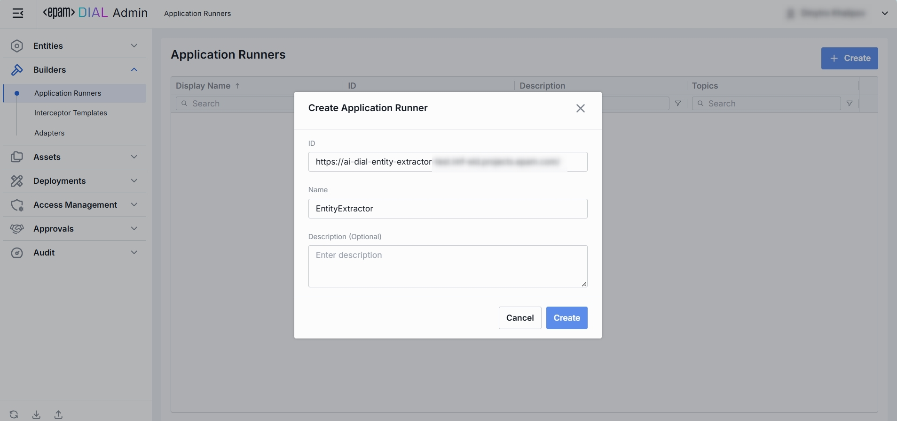

## Configuration

Click any Application Runner on the main screen to open its configuration page.

##### Top Bar Controls

* **Create**: Create an application with the current app runner.
    - **Application**: Create a new custom application deployment in DIAL based on this runner. Created application can be found in [Entities -> Applications](/docs/tutorials/3.admin/entities-applications.md).
    - **Assets Application**: Create a new application based on this runner and place it in the public folder where all users with corresponding permissions can access it. Created application can be found in [Assets -> Applications](/docs/tutorials/3.admin/assets-applications.md)
* **Delete**: Permanently removes the selected runner. All related applications still bound to it will be deleted as well.
* **JSON Editor** (Toggle): Switch between the form-based UI and raw [JSON view](#json-editor) of the runner’s configuration. Use JSON mode for copy-paste or advanced edits.
* **Save**: Commits any unsaved changes to the runner’s configuration. Changes may take some time to propagate and take effect.
* **Discard**: Reverts any unsaved changes made to the runner’s configuration since the last save.

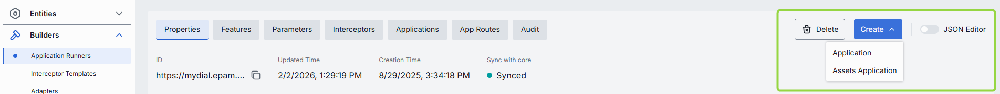

### Properties

In the **Properties** tab, you can define identity and metadata of application runners. DIAL Core uses this information to send orchestration payloads and display application runners on UI.

| Field | Required | Editable | Description |
|-------|----------|----------|-------------|
| **ID** | - | No | The base URL or a unique identifier of the runner's service hosting (e.g. `https://my-runner.example.com/v1/execute`). DIAL Core will POST orchestration payloads to this endpoint for any Application bound to this runner. |
| **Updated Time** | - | No | Date and time when the app runner's configuration was last updated. |
| **Creation Time** | - | No | Date and time when the app runner's configuration was created. |
| **Sync with core** | - | No | Indicator of the state of the entity's configuration synchronization between Admin service and DIAL Core. Synchronization occurs automatically every 2 mins (configurable via `CONFIG_AUTO_RELOAD_SCHEDULE_DELAY_MILLISECONDS`). **Important**: Sync state is not available for sensitive information (API keys/tokens/auth settings). **Synced**: Entity's states are identical in Admin and in Core for valid entities or entity is missing in Core for invalid entities. **In progress...**:  If Synced conditions are not met and changes were applied within last 2 mins (this period is configurable via `CONFIG_EXPORT_SYNC_DURATION_THRESHOLD_MS`). **Out of sync**: If Synced conditions are not met and changes were applied more than 2 mins ago (this period is configurable via `CONFIG_EXPORT_SYNC_DURATION_THRESHOLD_MS`). **Unavailable**: Displayed when it is not possible to determine the entity's state in Core. This occurs if: - The config was not received from Core for any reason. - The configuration of entities in Core is not entirely compatible with the one in the Admin service. |
| **Display name** | Yes | Yes | Name of the application runner displayed on UI (e.g. "Python Lambda Runner" or "NodeJS Service Worker"). |
| **Description** | No | Yes | Description of the application runner (e.g. its environment (staging vs. prod), resource profile (2 vCPU, 8 GB RAM), or any special instructions). |
| **Icon** | No | Yes| Icon representing the runner visually in the UI. |
| **Title** | No | Yes | Title of the application runner. |
| **Bucket copy** | Yes | Yes | This property determines whether files stored in the application's file storage bucket should be copied when the application is copied, moved, or published. |
| **Topics** | No | Yes | Tags associating application runner with specific topics or categories (e.g. "finance", "support") for identification and filtering on UI. |
| **Completion endpoint** | Yes | Yes | Base URL of the runner's service hosting (e.g. `https://my-runner.example.com/v1/execute`). DIAL Core will POST orchestration payloads to this endpoint for any application bound to this runner. |
| **Viewer URL** | No | Yes | URL of an alternative end-user UI (is needed when the default chat interface is not sufficient). If enabled, will override the standard DIAL Chat UI for applications built based on this application runner. |
| **Editor URL** | No | Yes | URL of a UI screen for configuring application settings when creating or updating a logical application instance. |

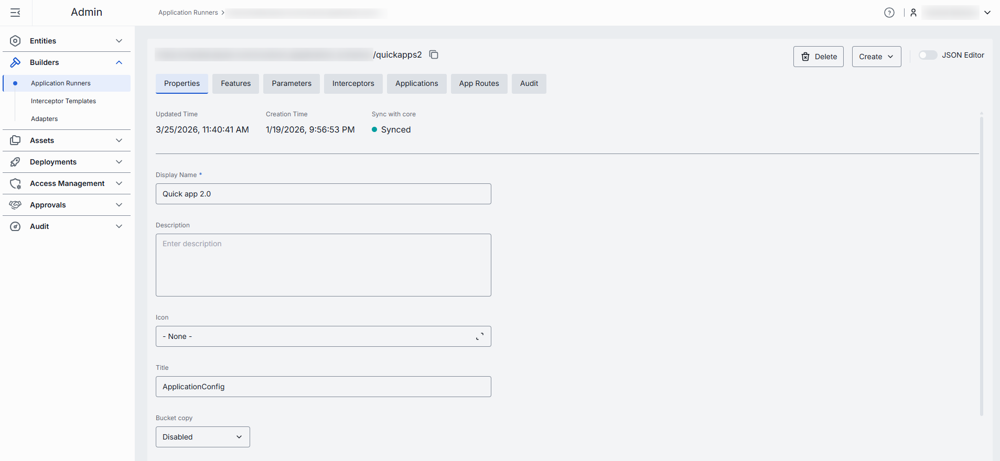

### Features

In the Features tab, you can define additional capabilities of applications created with the Application Runner such as custom endpoints for configuration, cost estimation, tokenization, prompt truncation and other features.

Defined features are propagated to applications created with the related application runner. Features undefined on the application runner level, can be set on per-application basis in the [Applications Configuration](/docs/tutorials/3.admin/entities-applications.md#features).

| Field | Required | Description |
|-------|----------|-------------|
| **Configuration endpoint** | No | URL to fetch JSON Schema describing settings of the application. Use this to drive runtime overrides from a remote config store. |
| **Rate endpoint** | No | URL of a custom rate-estimation API to compute cost or quota usage based on your custom logic (e.g. grouping by tenant, complex billing rules). |
| **Tokenize endpoint** | No | URL to call a custom tokenization service. Can be used if you require precise, app-wide token counting (for mixed-model or multi-step prompts) that the model adapter can't provide. |
| **Truncate prompt endpoint** | No | URL to call your own prompt-truncation API. Handy if you implement advanced context-window management (e.g. dynamic summarization) before the actual app call. |
| **Application properties header** | No | This setting determines how the apps configuration is handled during a chat completion request. If enabled, DIAL will append the apps configuration to the chat completion request headers. |
| **Playback support** | No | This setting enables [Playback](/docs/tutorials/0.user-guide.md#playback). Playback allows to simulate a conversation without any engagement with models. This allows to review and analyze the conversation flow without invoking any model responses. |
| **Assistant attachments in request** | No | This setting indicates whether the application supports `attachments` in `messages` from `role=assistant` in [chat completion request](https://dialx.ai/dial_api#operation/sendChatCompletionRequest). When set to `true`, DIAL Chat preserves `attachments` in `messages` in the chat completion requests to DIAL Core, instead of removing them. The feature is especially useful for apps that can generate attachments as well as take attachments in its input. |

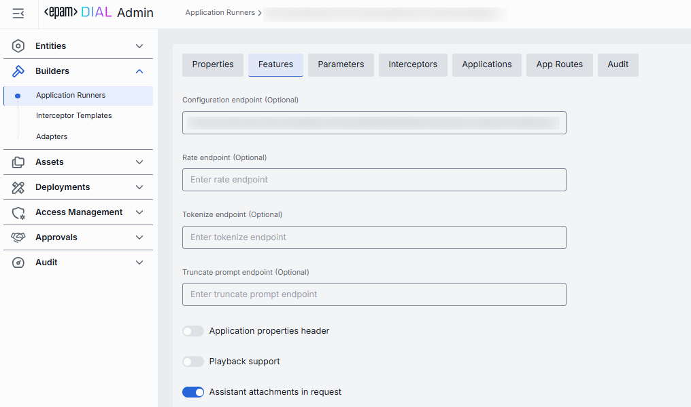

### Parameters

By editing the configuration in the Parameters tab, you define [parameters that must be configured](/docs/tutorials/3.admin/entities-applications.md#parameters) to create an instance of application based on the selected Application Runner. The content of this screen is defined by required properties of the JSON schema of the Application Runner which you can access in [JSON Editor](#json-editor). 

> **Note**: JSON schema of application runners conforms to the main [meta schema](https://github.com/epam/ai-dial-core/blob/development/config/src/main/resources/custom-application-schemas/schema.json).

> Refer to [Schema-rich Applications](/docs/platform/3.core/7.apps.md#schema-rich-applications) to learn more.

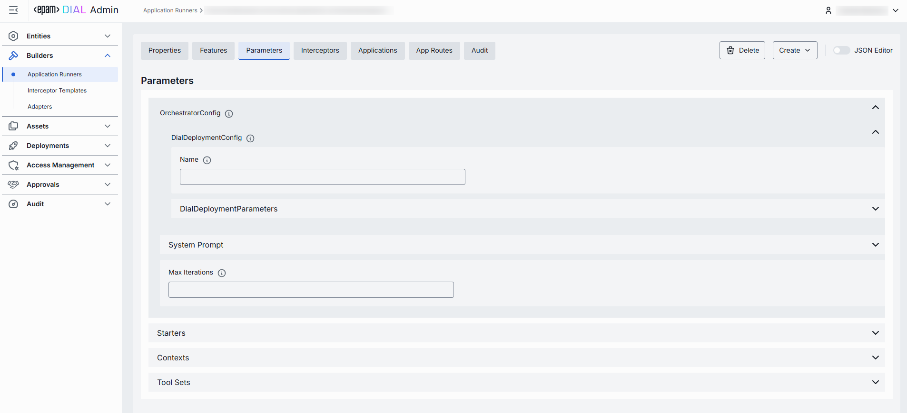

### Interceptors

In the **Interceptors** tab, you can add [local interceptors](https://github.com/epam/ai-dial-core/blob/development/docs/dynamic-settings/interceptors.md#application-type-interceptors) that will process requests and responses for applications built on this runner. Such interceptors will be displayed as **runner interceptors** in the [configuration](/docs/tutorials/3.admin/entities-applications.md#interceptors) of application created based on the selected application runner. 

In this tab, you can also preview **global** interceptors defined in [System Properties](/docs/tutorials/3.admin/home.md#system-properties) that apply to all deployments in DIAL.

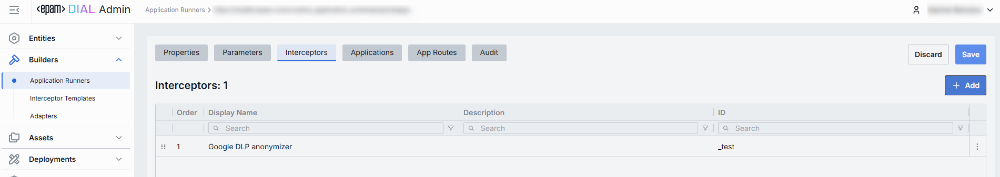

##### Interceptors grid

| Column | Description |
|--------|-------------|
| **Order** | Execution sequence. Interceptors run in ascending order (1 → 2 → 3...). A request will flow through each interceptor's in this order. Response interceptors are invoked in the reversed order. |
| **Display Name** | The interceptor's alias, matching the Name field in its definition. |
| **Description** | Free-text summary from the interceptor's definition, explaining its purpose. |
| **ID** | Unique identifier of the interceptor, as defined in its configuration. |

#### Add

You can add one or more interceptors to the application runner.

1. Click **+ Add** (top-right of the Interceptors Grid).
2. In the modal, select one or more interceptors from the list of [available options](/docs/tutorials/3.admin/entities-interceptors.md).
3. Click **Apply** to insert them into the table.

#### Remove

1. Click the **actions** menu in the interceptor’s line.
2. Choose **Remove** in the menu.

### Applications

In the Applications tab, you can see which DIAL Applications are bound to this runner.
By assigning applications here, you tell DIAL Core to dispatch orchestration payloads for those apps to endpoints of the selected application runner.

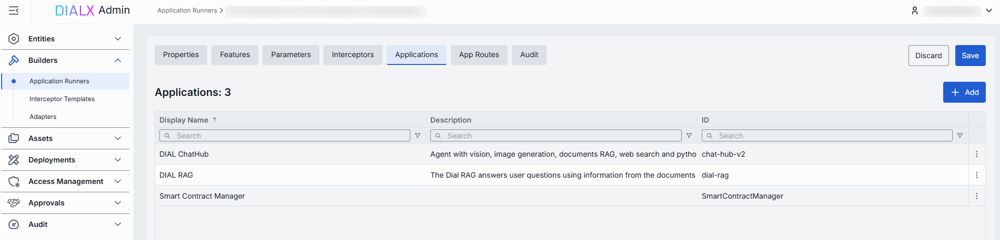

##### Applications List

| Column | Description |
|--------|-------------|
| **ID** | Unique identifier of the application. |
| **Display Name** | Name of the application displayed on UI (e.g. "Data Clustering Application"). |
| **Description** | Text with the description of the application. |

#### Add

You can add applications defined in the [Entities](/docs/tutorials/3.admin/entities-applications.md) section.

1. Click **+ Add** (top-right of the Applications Grid).
2. **Select** one or more applications in the modal.
3. Click **Apply** to insert them into the table.

#### Remove
 
1. Click the **actions** menu in the application’s line.
2. Choose **Remove** in the menu.

### App Routes

Routes in DIAL are used for communication through registered endpoints in the DIAL Core. They act as a bridging mechanism between the DIAL Core and applications, facilitating seamless interactions.

> Refer to [DIAL Core](https://github.com/epam/ai-dial-core/blob/development/docs/dynamic-settings/routes.md) to learn more about routes.

In the **App Routes** tab, you can manage application runner-specific routes. Here you can create, view, edit, and delete routes.

#### Create

1. Click **+ Add** (top-right of the App Routes pane).
2. Enter the route **Display name** in the modal.
3. Click **Create** to confirm creation.

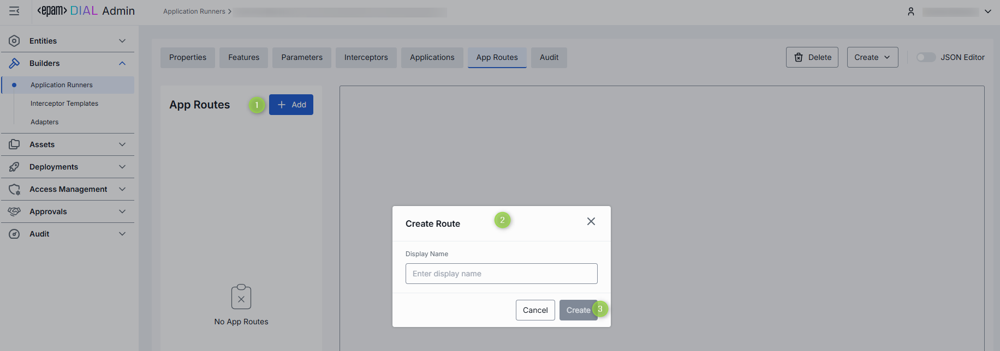

#### Properties

In the **Properties** sub-tab you can configure route's identity and requests-handling behavior.

> **TIP**: Configuration of this tab is similar to routes. See [Routes documentation](/docs/tutorials/3.admin/entities-routes.md) for more information. 

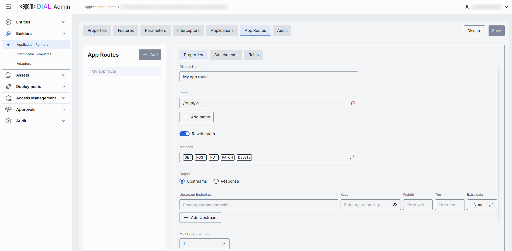

#### Attachments

In the **Attachments** sub-tab you can configure attachment paths for both requests and responses.

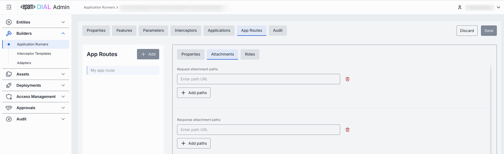

#### Roles

In the **Roles** sub-tab you can define route-specific role assignments, allowing administrators to control access to each individual route.

> **TIP**: Configuration of this tab is mostly similar to routes. See [Routes documentation](/docs/tutorials/3.admin/entities-routes.md) for more information. 

Use **Inherit Application Roles** toggle to apply roles assigned to an application which is built based on the selected application runner.

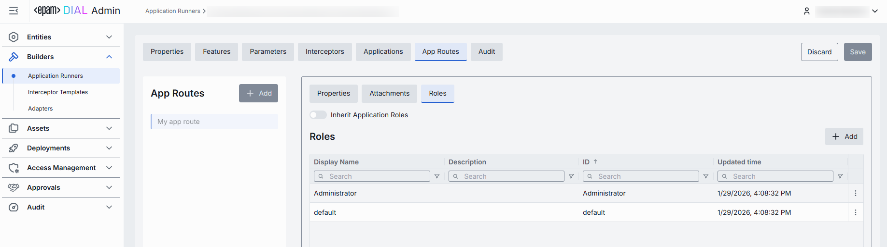

### Audit

In the **Audit** tab, you can monitor activities related to the selected app runner.

> **TIP**: This section mimics the functionality available in the global [Audit → Activities](/docs/tutorials/3.admin/telemetry-activity-audit.md) menu, but is scoped specifically to the selected app runner.

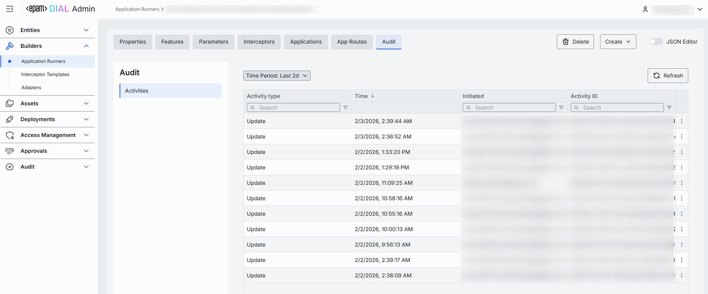

### JSON Editor

**Advanced users with technical expertise** can work with the application runner properties in a JSON editor view mode. It is useful for advanced scenarios of bulk updates, copy/paste between environments, or tweaking settings not exposed on UI.

> **TIP**: You can switch between UI and JSON only if there are no unsaved changes.

In JSON editor, you can use the view dropdown to select between Admin format and Core format. Note, that these formatting options are for your convenience only and do not render properties as they are defined in DIAL Core. After making changes, the **Sync with core** indicator on the main configuration screen will inform you about the synchronization state with DIAL Core.

##### Working with JSON Editor

1. Navigate to **Builders → Application Runners**, then select the application runner you want to edit.
2. Click the **JSON Editor** toggle (top-right). The UI reveals the raw JSON.
3. Chose between the Admin and Core format to see and work with properties in the necessary format. **Note**: Core format view mode does not render the actual configuration stored in DIAL Core but the configuration in Admin service displayed in the DIAL Core format.
4. Make changes and click **Save** to apply them.
5. After making changes, the **Sync with core** indicator on the main configuration screen will inform you about the synchronization state with DIAL Core.