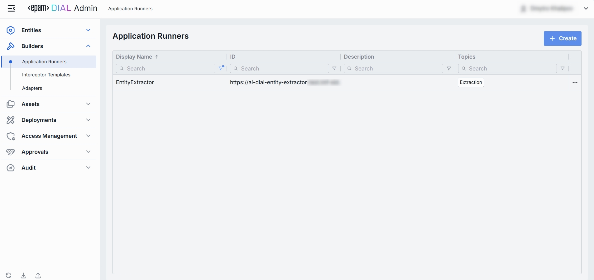
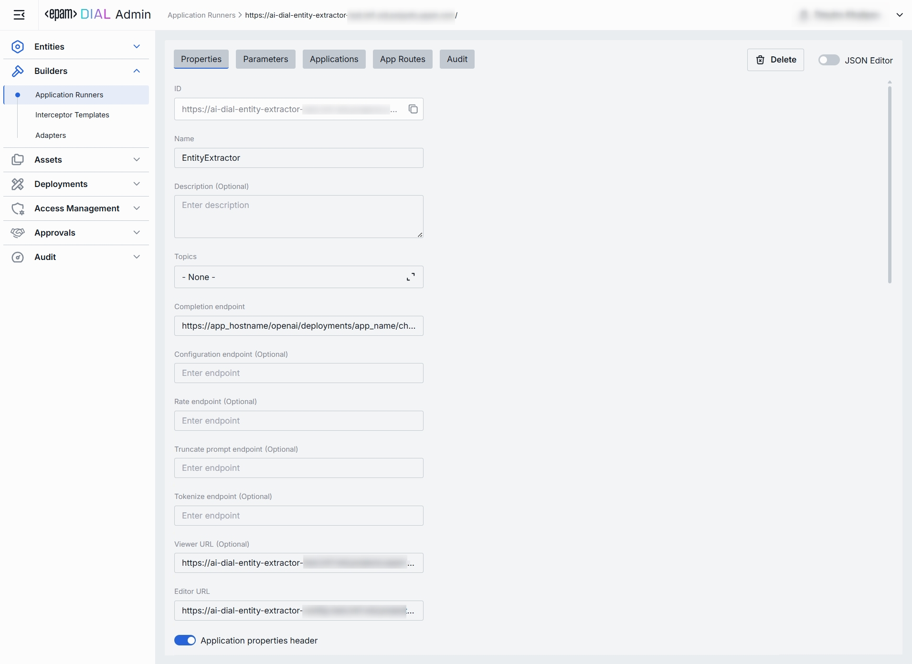
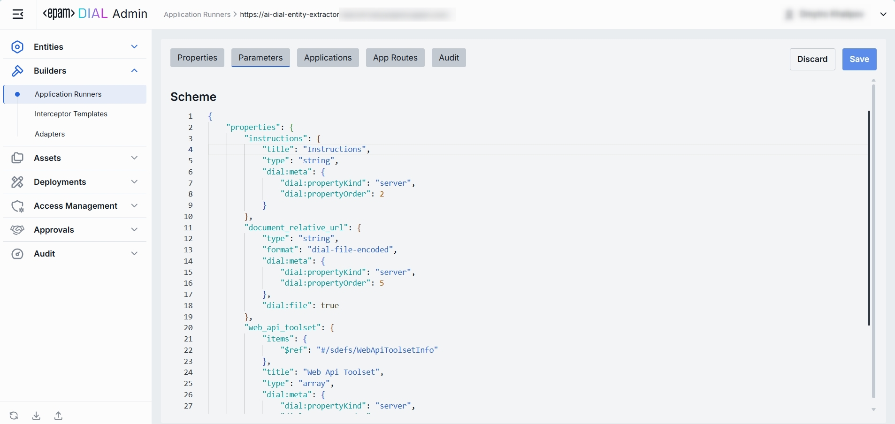
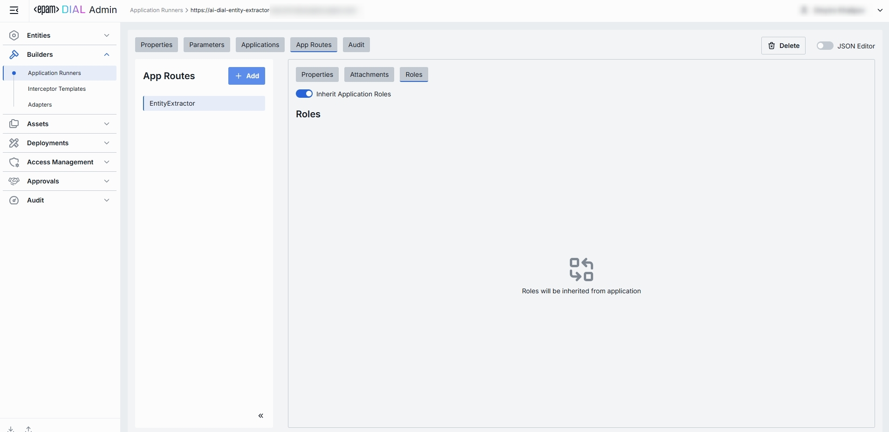

# Application Runners

## About Application Runners

Application Runner can be seen as an application template (based on JSON schema) that allows end-users create individual logical instances each with its own configuration. Quick Apps, Code Apps and Mind Maps are application runners available in DIAL platform out of the box.

> Refer to [Schema-rich Applications](/docs/platform/3.core/7.apps.md#schema-rich-applications) to learn more.

## Application Runners List

In Application Runners, you can add and manage Application Runners you have in your DIAL instance.

##### Application Runners Grid

| Column     | Definition & Use Case   |
|------------------|--------------------|
| **Display Name** | A user-friendly label for the application runner (e.g. "Python Lambda Runner", "NodeJS App Service"). Helps you pick the right runner when creating a new application based on it. |
| **ID**  | The unique identifier for this runner—typically the base URL of the service (e.g. `https://my-runner.example.com`). DIAL Core uses this endpoint to POST orchestration payloads. |
| **Description**  | Free-text notes about the runner’s capabilities, cluster location, version, or SLA (e.g. "v2 on GKE, 2 vCPU, 8 GB RAM").  |
|**Topics**| Tags associated with the runner for identification and filtering on Admin UI (e.g. "finance", "support"). |
|**Updated time**| Timestamp of the last update to this runner's configuration. Useful for tracking recent changes. |

## Create

1. Click **+ Create** to invoke the **Create Application Runner** modal.
2. Define key parameters for the new application runner:

    | Field     | Required | Definition   |
    |-----------|-----------|-----------|
    | **ID**    | Yes   | A unique identifier for this runner—typically the base URL of a specific service. |
    | **Name**  | Yes   |  A user-friendly name of the Application Runner that will be displayed on UI. |
    | **Description** | No  | Free-text notes about the runner’s capabilities.|
3. Once all required fields are filled, click **Create**. The dialog closes and the new runner [configuration screen](#configuration) is opened. A new runner will appear immediately in the listing once created. It may take some time for the changes to take effect after saving.

## Configuration

Click any Application Runner ion the main screen to open its configuration page.

##### Top Bar Controls

* **Create**: Create an application with the current app runner.
    - **Application**: Create a new custom application deployment in DIAL based on this runner. Created application can be found in [Entities -> Applications](/docs/tutorials/3.admin/entities-applications.md).
    - **Assets Application**: Create a new application based on this runner and place it in the public folder where all users with corresponding permissions can access it. Created application can be found in [Assets -> Applications](/docs/tutorials/3.admin/assets-applications.md)
* **Delete**: Permanently removes the selected runner. All related Applications still bound to it will be deleted as well.
* **JSON Editor** (Toggle): Switch between the form-based UI and raw [JSON view](#json-editor) of the runner’s configuration. Use JSON mode for copy-paste or advanced edits.

### Properties

In the Properties tab, you can define identity and metadata of application runners - so DIAL Core knows where to send orchestration payloads and how to present this runner on the UI.

| Field                             | Required | Definition                                                                                                                                                                                                                   |
|-----------------------------------|----------|------------------------------------------------------------------------------------------------------------------------------------------------------------------------------------------------------------------------------|
| **ID**                            | Yes      | The base URL or a unique identifier of the runner's service hosting (e.g. `https://my-runner.example.com/v1/execute`). DIAL Core will POST orchestration payloads to this endpoint for any Application bound to this runner. |
| **Updated Time**                  | -        | Date and time when the app runner's configuration was last updated.                                                                                                                                                          |
| **Creation Time**                 | -        | Date and time when the app runner's configuration was created.                                                                                                                                                               |
| **Display Name**                  | Yes      | A user-friendly label for this runner (e.g. "Python Lambda Runner" or "NodeJS Service Worker").                                                                                                                              |
| **Description**                   | No       | Free-text notes about the runner: its environment (staging vs. prod), resource profile (2 vCPU, 8 GB RAM), or any special instructions.                                                                                      | 
| **Icon**                          | No       | An optional icon representing the runner visually in the UI. Upload a custom image or select from predefined icons.                                                                                                          |
| **Title**                         | No       | Optional title of the application runner.                                                                                                                                                                                    |
| **Type**                          | Yes      | The Parameters object app runner expects in its payload.                                                                                                                                                                     |
| **Bucket copy**                   | Yes      | If this option is enabled, files are copied from source to destination of the application's bucket                                                                                                                           |
| **Topics**                        | No       | Use tags to associate runner with specific topics or categories (e.g. "finance", "support") for identification and filtering on UI.                                                                                          |
| **Completion endpoint**           | Yes      | The base URL or a unique identifier of the runner's service hosting (e.g. `https://my-runner.example.com/v1/execute`). DIAL Core will POST orchestration payloads to this endpoint for any Application bound to this runner. |
| **Configuration endpoint**        | No       | A URL to fetch dynamic app-specific settings. Use this to drive runtime overrides from a remote config store.                                                                                                                |
| **Rate endpoint**                 | No       | A URL to call a custom rate-estimation API. Use this to compute cost or quota usage based on your own logic (e.g. grouping by tenant, complex billing rules).                                                                |
| **Truncate prompt endpoint**      | No       | A URL to call your own prompt-truncation API. Handy if you implement advanced context-window management (e.g. dynamic summarization) before the actual application call.                                                     |
| **Tokenize endpoint**             | No       | A URL to call a custom tokenization service.                                                                                                                                                                                 |
| **Viewer URL**                    | No       | A URL of a custom UI form end users used by this runner.                                                                                                                                                                     |
| **Editor URL**                    | No       | A URL of a custom application builder UI.                                                                                                                                                                                    |
| **Application properties header** | No       | Setting determines how the apps configuration is handled during a chat completion request. If true, DIAL will append the apps configuration to the chat completion request headers.                                          |
| **Playback support**              | No       | Allows to simulate the current conversation without any engagement with models. This allows to review and analyze the conversation flow without invoking any model responses.                                                |

### Parameters

In the Parameters tab, you can configure how DIAL Core interacts with your runner's service (its endpoints) and specify which parameters from the `ApplicationTypeSchema` it should handle. This configuration allows DIAL to validate inputs, document, and render input forms for any application linked to this runner.

### Applications

In the Applications tab, you can see which DIAL Applications are bound to this runner.
By assigning applications here, you tell DIAL Core to dispatch orchestration payloads for those apps to this specific runner endpoint.

##### Applications List

| Column| Definition |
| ----------------- | -----------|
| **Display Name**  | A user-friendly name of the application (e.g. "Data Clustering Application").|
| **Version** | The Application’s version tag (e.g. `v1.0`, `2024-07-15`) as defined in **Entities → Applications → Properties**. |
| **Description**   | A free-text description of the application|
| **Deployment ID** | The unique alias used in the application’s endpoint URL (e.g. `dca`, `support-bot`).|

#### Add

1. Click **+ Add** (top-right of the Applications Grid).
2. **Select** one or more applications in the modal.
3. **Confirm** to insert them into the table.

#### Remove
 
1. Click the **actions** menu in the application’s line.
2. Choose **Remove** in the menu.

### App Routes

App Routes tab is introduced to manage application runner-specific routes. The tab includes a left-hand pane listing all app runner-related routes. 
Tab allows creating, viewing, editing, and deleting routes.

#### Create

1. Click **+ Add** (top-right of the App Routes pane).
2. Enter the route **Display name** in the modal.
3. Click **Create** to confirm creation.

#### Properties

Properties sub-tab allows to configure route identity and requests handling behavior.

> Configuration of this tab is similar to routes. See [Routes documentation](/docs/tutorials/3.admin/entities-routes.md) for more information. 

#### Attachments

Attachments sub-tab enables to configure attachment paths for both requests and responses.

#### Roles

Sub-tab enables route-specific role assignments, allowing administrators to control access to each individual route.

> Configuration of this tab is mostly similar to routes. See [Routes documentation](/docs/tutorials/3.admin/entities-routes.md) for more information. 

Inherit Application Roles option allows to use the roles assigned to application which is built on a given runner.

### Audit

In the **Audit** tab, you can monitor activities related to the selected app runner.

#### Activities

The Activities section provides detailed visibility into all changes made to the selected app runner. This section mimics the functionality available in the global [Audit → Activities](/docs/tutorials/3.admin/telemetry-activity-audit.md) menu, but is scoped specifically to the selected app runner.

### JSON Editor

For advanced scenarios of bulk updates, copy/paste between environments, or tweaking settings not exposed in the form UI—you can switch to the **JSON Editor** in any application runners configuration page.

##### Switching to the JSON Editor

1. Navigate to **Builders → Application Runners**, then select the application runner you want to edit.
2. Click the **JSON Editor** toggle (top-right). The UI reveals the raw JSON.

> **TIP**: You can switch between UI and JSON only if there are no unsaved changes.
