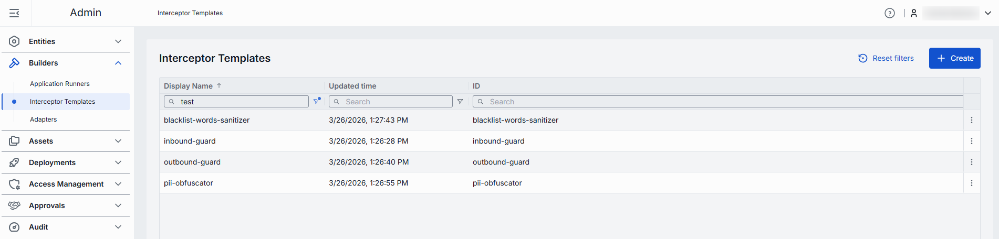
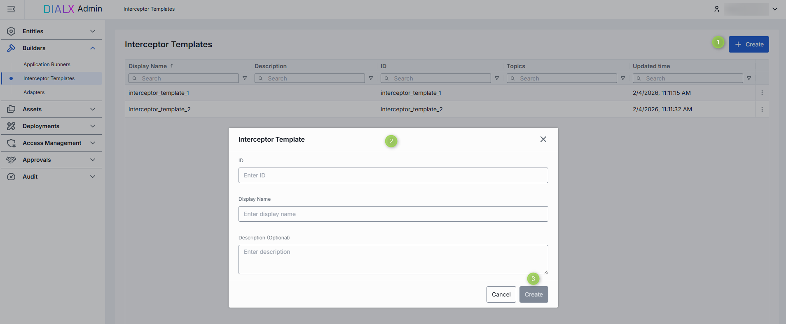
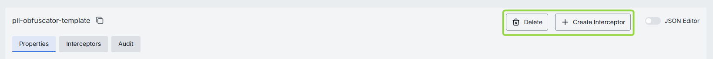
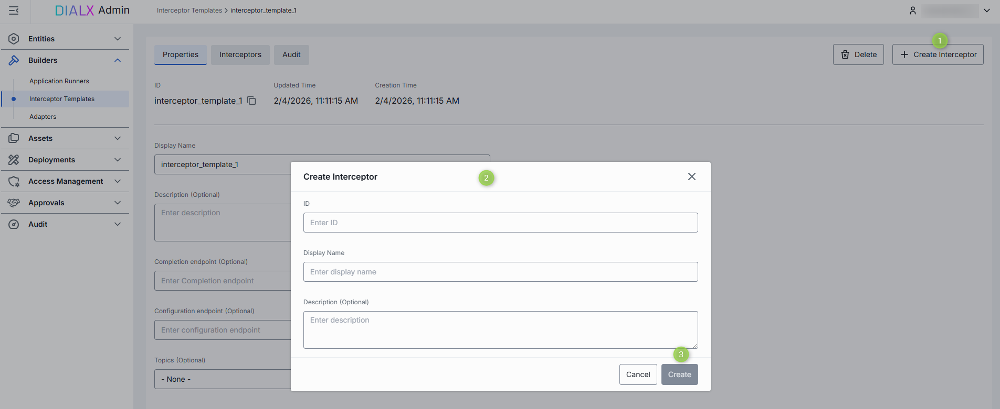
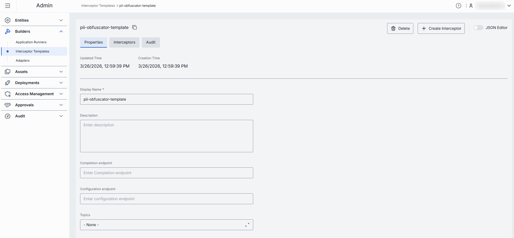
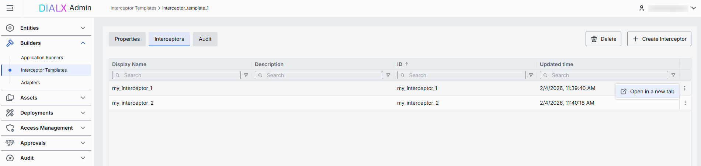
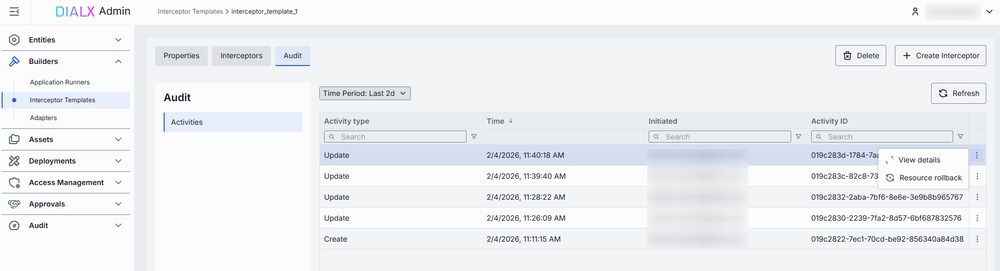

# Interceptor Templates

## Introduction

**Interceptor templates** are reusable blueprints that streamline the creation of interceptors in DIAL. They save time by eliminating repetitive configuration when setting up similar interceptors.

> To learn more about interceptors, refer to [Interceptors](/docs/platform/3.core/6.interceptors.md).

Once created, interceptor templates can be [selected as a source type](/docs/tutorials/3.admin/entities-interceptors.md#create) when creating new interceptor entities.

## Main Screen

On the main screen, you can add and manage Interceptor Templates.

##### Interceptor templates grid

| Field | Description |
|-------|-------------|
| **Display name** | Name of the interceptor template displayed on UI (e.g. "PII Obfuscator", "Words Blacklist", etc.). |
| **ID** | Unique identifier. |
| **Description** | Description of the interceptor template. |
| **Updated time** | Timestamp of the latest update. |
| **Topics** | Semantic tags associated with interceptor template. Topics can be used for identify and filter templates on UI. |

## Create

On the main screen of Interceptor Templates, you can create a new interceptor template by following these steps:

1. Click **+ Create** to invoke the **Interceptor Template** modal.
2. Define key parameters for the new interceptor template:

    | Field | Required | Definition |
    |-------|----------|------------|
    | **ID** | Yes | Unique identifier. |
    | **Display name** | Yes | Name of the interceptor template displayed on UI. |
    | **Description** | No | Description of the interceptor template. |

3. Once all required fields are filled, click **Create**. The dialog closes and the new template [configuration screen](#configuration) is opened. A new template will appear immediately in the listing once created. It may take some time for the changes to take effect after saving.

    

## Configuration

Click on an interceptor template from the main screen to open its configuration screen.

##### Top Bar Controls

* **Create Interceptor**: Creates an interceptor with the current interceptor template. Created interceptor can be found in [Entities -> Interceptors](/docs/tutorials/3.admin/entities-interceptors.md).
* **Save**: Saves any changes made to the interceptor template.
* **Discard**: Reverts any unsaved changes made to the interceptor template.
* **Delete**: Permanently removes the selected interceptor template. **IMPORTANT:** All related interceptors still bound to it will be deleted as well.

### Create Interceptor

On the configuration screen, click **+ Create Interceptor** to create a new [interceptor entity](/docs/tutorials/3.admin/entities-interceptors.md) based on the selected template.

1. Click **+ Create Interceptor** and fill in the pop-up form.
2. Click **Create** to apply. The configuration of the new interceptor entity opens up. You may notice, that the template used is pre-populated in the Interceptor Template field.

### Properties

In the **Properties** tab, you can preview and modify identity, metadata and endpoints of interceptor template.

| Field | Required | Editable | Description |
|-------|----------|----------|-------------|
| **ID** | - | No | Unique ID of the template (copyable). Cannot be changed after interceptor template is created. |
| **Updated Time** | - | No | Timestamp for changes tracking and audit evidence (e.g., to verify when the last change was done). |
| **Creation Time** | - | No | Creation timestamp. |
| **Display Name** | Yes | Yes | Name of the interceptor template displayed on UI (e.g. "PII Obfuscator", "Words Blacklist", etc.). |
| **Description** | No | Yes | Description of the interceptor template and how it can be used. |
| **Completion endpoint** | No | Yes | URL of the interceptor service. This URL is used by DIAL Core to handle requests and responses for the interceptor. |
| **Configuration endpoint** | No | Yes | URL that exposes the configuration of the interceptor as a JSON schema. |
| **Topics** | No | Yes | Semantic tags associated with interceptor template. |

### Interceptors

A **read-only** grid showing all interceptor **instances** created from this template. Use it to assess potential impact before template edits or deletion.

From the actions menu of each interceptor you can navigate to its configuration in [Entities/Interceptors](/docs/tutorials/3.admin/entities-interceptors.md#configuration) section.

### Audit

On this screen, you can access a detailed preview and revert any changes made to the selected interceptor template.

> **TIP**: This section mimics the functionality available in the global [Audit → Activities](/docs/tutorials/3.admin/telemetry-activity-audit.md) menu, but is scoped specifically to the selected template.

