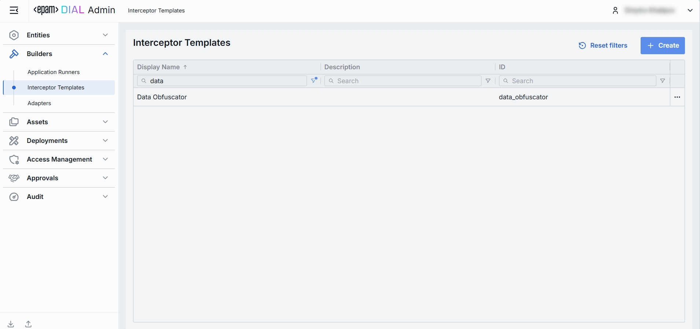
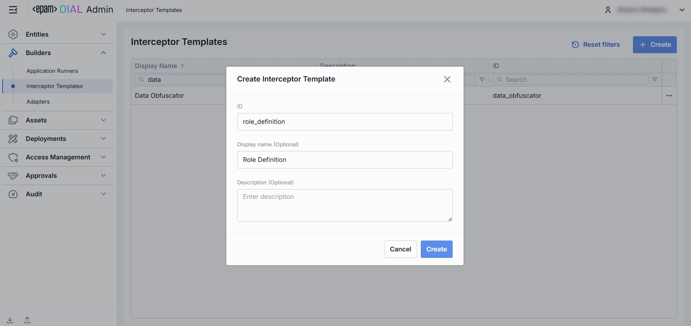
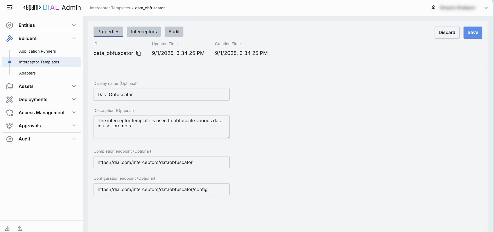

# Interceptor Templates

## About Interceptor Templates

An **interceptor template** is a reusable blueprint for creating interceptors in DIAL. It allows to save time on similar interceptors configuration.

> Refer to [Interceptors](/docs/platform/3.core/6.interceptors.md) to learn more.

## Main Screen

On the main screen, you can add and manage Interceptor Templates you have in your DIAL instance.

### Interceptor Templates Grid

| Field| Definition   |
|------------------|------------------------------------------------------------|
| **Display name** | A user-friendly label for the interceptor template (e.g. “PII Obfuscator”, "Words Blacklist", etc.). Helps you pick the right one when configuring an interceptor. |
| **ID**     | The unique identifier used internally.     |
| **Description**  | Free-text notes about the interceptor template and how it can be used.   |
|**Updated time** | Timestamp for changes tracking and audit evidence (e.g., to verify when the last change was done). |

## Create

On the main screen of Interceptor Templates, you can create a new interceptor template by following these steps:

1. Click **+ Create** to invoke the **Interceptor Template** modal.
2. Define key parameters for the new interceptor template:

    | Field| Required | Definition    |
    |------------------|----------|--------------------------------|
    | **ID**     | **Yes**  | The unique identifier used internally.|
    | **Display name** | No | A user-friendly label for the interceptor template (e.g. “PII Obfuscator”, "Words Blacklist", etc.). Helps you pick the right one when configuring an interceptor.  |
    | **Description**  | No | Free-text notes about the interceptor template and how it can be used.    |

3. Once all required fields are filled, click **Create**. The dialog closes and the new template [configuration screen](#configuration) is opened. A new template will appear immediately in the listing once created. It may take some time for the changes to take effect after saving.

    

## Delete 

To delete an interceptor template, follow these steps:
1. From the main screen, select the interceptor template you want to delete by clicking on its row.
2. Click the **Delete** button in the top-right corner of the configuration screen.
3. A confirmation dialog will appear. Review the information carefully, as deleting an interceptor template will also remove all related interceptors bound to it.
4. If you are sure you want to proceed, click **Delete** in the confirmation dialog. The interceptor template and all related interceptors will be permanently removed from the system.

> **IMPORTANT:** This action is irreversible. Ensure that you have reviewed all dependencies before confirming the deletion.

## Configuration

Click on an interceptor template from the main screen to open its configuration screen.

##### Top Bar Controls

* **Create Interceptor**: Creates an interceptor with the current interceptor template. Created interceptor can be found in [Entities -> Interceptors](/docs/tutorials/3.admin/entities-interceptors.md).
* **Save**: Saves any changes made to the interceptor template.
* **Discard**: Reverts any unsaved changes made to the interceptor template.
* **Delete**: Permanently removes the selected interceptor template. 

    > **IMPORTANT:** All related interceptors still bound to it will be deleted as well.

### Properties

In the **Properties** tab, you can preview and modify identity, metadata and endpoints of interceptor template.

Header (non-editable):

| Field | Definition     |
|-------------------|----------------------------------------------------------------------------------------------------------|
| **ID**| Read-only unique ID of the template (copyable). Cannot be changed after interceptor template is created. |
| **Updated Time**  | Timestamp for changes tracking and audit evidence (e.g., to verify when the last change was done). |
| **Creation Time** | Timestamp of when Interceptor Template was created.|

Fields: 

| Field    | Required | Definition   |
|----------------------------|----------|-----------------------------------------------------|
| **Display name**     | Yes | A user-friendly label for the interceptor template (e.g. “PII Obfuscator”, "Words Blacklist", etc.). Helps you pick the right one when configuring an interceptor. |
| **Description**| No | Free-text notes about the interceptor template and how it can be used.   |
| **Completion endpoint**    | No | This is the endpoint used by DIAL Core to manage chat completion requests from interceptors.     |
| **Configuration endpoint** | No | This endpoint is used to request interceptor's configuration parameters as a JSON schema.  |

### Interceptors

A **read-only** grid showing all interceptor **instances** created from this template. Use it to assess potential impact before template edits or deletion.

##### Grid (non-editable)

| Field| Definition   |
|------------------|--------------------------------------------------------------------------------------|
| **Display Name** | Display name of the interceptor instance that inherits this template.    |
| **ID**     | Unique ID of the dependent Interceptor.    |
| **Description**  | A free-text summary of the interceptor’s behavior and any configuration parameters.  |
| **Updated Time** | Timestamp for changes tracking and audit evidence (e.g., to verify when the last change was done). |

### Audit

#### Activities

The Activities section under the Audit tab of a specific interceptor template provides detailed visibility into all changes made to it.

This section mimics the functionality available in the global [Audit → Activities](/docs/tutorials/3.admin/telemetry-activity-audit.md) menu, but is scoped specifically to the selected template.

##### Activities List Table

| **Field**   | **Definition**   |
|-------------------|------------------------------------------------------------------------------------------|
| **Activity type** | The type of action performed on the interceptor template (e.g., Create, Update, Delete). |
| **Time**    | Timestamp indicating when the activity occurred.     |
| **Initiated**     | Email address of the user who performed the activity.|
| **Activity ID**   | A unique identifier for the logged activity, used for tracking and auditing. |

##### Activity Details

The Activity Details view provides a detailed snapshot of a specific change made to an interceptor template.

To open Activity Details, click on the three-dot menu (⋮) at the end of a row in the Activities grid and select “View Details”.

| **Element/Section** | **Description**     |
|---------------------|---------------------------------------------------------------------------------------------------------------------------------------------------------|
| **Activity type**   | Type of the change performed (e.g., Update, Create, Delete).  |
| **Time**| Timestamp of the change.  |
| **Initiated** | Identifier of the user who made the change. |
| **Activity ID**     | Unique identifier for the specific activity tracking.   |
| **View**| Dropdown to switch between showing all parameter or changed only.   |
| **Parameters Diff** | Side-by-side comparison of the fields values before and after the change. Color-coding is used to indicate the operation type (Update, Create, Delete). |

