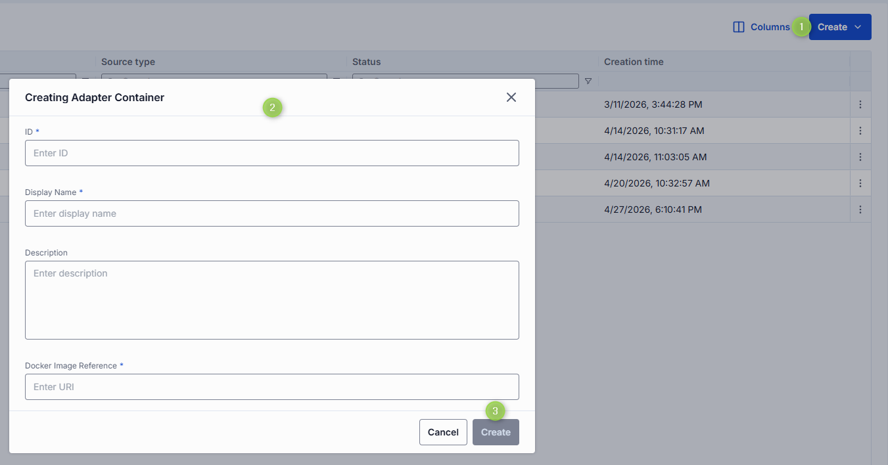
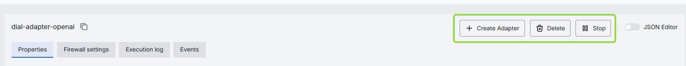

# Adapter Containers

## Introduction

DIAL enables the use of self-hosted AI model adapters by deploying container images within DIAL infrastructure. Once containers are running, you can register adapters in DIAL based on the endpoints exposed by these containers.

> Refer to [Adapters](/docs/tutorials/3.admin/builders-adapters.md) to learn more.

## Main Screen

In **Adapter Containers**, you can manage containers for AI model adapters deployed within the DIAL system. You can create new containers based on existing [images](/docs/tutorials/3.admin/deployments-images.md), start and stop running containers as needed, edit configuration settings, and view logs and events for troubleshooting.

##### Adapter containers grid

| Column | Description |
|--------|-------------|
| Display Name | Name of the adapter container rendered on UI. |
| Description | Brief description of the adapter container. |
| Status | Current status of the adapter container (e.g., Running, Stopped). |
| ID | Unique identifier of the adapter container. |
| Container URL | URL to access the running adapter container. |
| Author | Email address of the creator of the container. |
| Create time | Date and time when the adapter container was created. |
| Update time | Date and time when the adapter container was last updated. |
| Topics | Tags that associate adapter with one or more topics or categories. |
| Actions | Buttons to manage the selected adapter container: - **Open in a new tab**: Use to open the container configuration screen in a new tab in your browser. - **Duplicate**: Use to duplicate the adapter container. - **Stop/Run**: Use to start and stop a container. - **Delete**: Use to remove the container. |  

## Create

On the main screen, you can add new adapter containers based on existing [images](/docs/tutorials/3.admin/deployments-images.md). When a new container is created, you can use it as a source type to create [adapters](/docs/tutorials/3.admin/builders-adapters.md).

##### To create a new adapter container

1. Click the **+Create** button on the main screen to open the **Creating Adapter Container** form.
2. Select the desired [image](/docs/tutorials/3.admin/deployments-images.md) from the list and pick its installed version from the list (labeled with green indicator).
3. Specify properties and click **Finish** to create the container.
4. The screen with the container configuration is displayed. You can modify the configuration as needed, run, stop or delete the container.

## Configuration

Click any adapter container on the main screen to open its configuration screen.

On the configuration screen, you can view and edit the selected adapter container settings, start and stop the container, view logs and events, or delete the container.

> **Note**: Configuration fields are disabled when the container is in a transition state (pending or stopping).

### Actions

In the header of the Configuration screen, you can find the following action buttons:

| Action | Description |
|------- |-------------|
| Create Adapter | Available for running containers.   Click to create a new [adapter](/docs/tutorials/3.admin/builders-adapters.md) using this selected container. |
| Run/Stop | Click to start or stop the container. |       
| Delete | Click to delete the container. **Note**: This will effect adapters created based on the deleted container. |

### To Create Adapter

You can use a **running** container to create a new AI model adapter. Once created, the adapter appears in [Builders/Adapters](/docs/tutorials/3.admin/builders-adapters.md) and can be used by [deployed AI models](/docs/tutorials/3.admin/deployments-models.md) as a source type.

1. In the Configuration screen of the running container, click the **Create Adapter** button in the header.
2. In the Create Adapter dialog, fill in the form fields:
    - **ID**: Unique identifier for the adapter. Auto-populated according to the selected container.
    - **Display Name**: Name of the adapter displayed on UI. Auto-populated according to the selected container.
    - **Description**: Brief description of the adapter.
3. Click **Create** to submit the form and create the adapter. Repeat these steps to create more adapters if needed.

### Properties

In the Properties tab, you can view and edit the selected container settings.

##### Fields description

| Property | Required | Editable | Description |
|----------|----------|----------|-------------|
| ID | - | No | Unique read-only identifier for the container. Must be between 2 and 36 characters long. Can contain only lowercase Latin letters, numbers, and hyphens. |
| Adapter Image | - | No | Image from which the container was created.  Click to display the list of available images where you can change the source image for the container.  **Note**: The container is redeployed when source image changes. |
| Creation Time | - | No | Date and time when the container was created. |
| Updated Time | - | No | Date and time when the container was last updated. |
| Status | - | No | Current status of the container (e.g., Running, Stopped). |
| URL | - | No | URL to access the running container. |
| Restarts | - | No | Restart counter for launching containers. Use to identify crash loops. You can find details in the [Execution Log](#execution-log).|
| Display Name | Yes | Yes | Name of the container rendered in UI. Must be between 2 and 255 characters long. |
| Description | No | Yes | Brief description of the container. |
| Maintainer | No | Yes | Email address of the maintainer of the container. |
| Topics | No | Yes | Topics are semantic labels that you can assign to containers (e.g. "finance", "support") for better navigation on UI. Click to display a list of available topics.   You can add your own custom topics to the list following these rules: - The topic name must not exceed 255 characters. - The topic name must not contain leading or trailing spaces. |
| Endpoint Configuration | No | Yes | Configuration details for the endpoints exposed by the container.   **Note**: Changes to these settings can be applied to a running container. Saving changes will trigger a restart in RollingUpdate mode. |
| Environment Variables | No | Yes | Environment variables set for the container.   **Note**: Changes to these settings can be applied to a running container. Saving changes will trigger a restart in RollingUpdate mode.   - **Name**: Must be between 1 and 253 characters long. Can contain only letters, numbers, dots `(.)`, hyphens `(-)`, and underscores `(_)`.  - **Value**: Must be between 1 and 253 characters long. Can contain only letters, numbers, dots `(.)`, hyphens `(-)`, and underscores `(_)`. |
| Resources | No | Yes | Resource limits and requests for the container.   **Note**: Changes to these settings can be applied to a running container. Saving changes will trigger a restart in RollingUpdate mode. Validation rules:   - Values must be numeric and greater than 0.  - Maximum allowed values for `cpu`, `memory`, and `nvidia.com/gpu` are defined on the backend via environment variables.  - For each matching resource key (e.g. `cpu`), the value in limits must not be less than the value in `requests`. |
| Startup probe | No | Yes | Use this configuration to enable and configure the Startup Probe - it is a type of health check specifically designed to signal that the application inside the container is ready to begin serving traffic. - **Type**: HTTP (Performs an HTTP GET request to a specified path and port on the container. The probe is considered successful if the response has a status code between 200 and 399.); TCP (Attempts to establish a TCP connection to the specified port. The probe is successful if the connection is established.). - **Port**: The network port on the container to which the probe will connect or send the request.  - **Path**: Path to call inside the container. Available for HTTP type. - **Initial delay seconds**: The number of seconds to wait after the container starts before performing the first probe. This allows the application time to initialize before health checks begin.  - **Period seconds**: The interval (in seconds) between consecutive probe checks. This determines how frequently Kubernetes will perform the probe.  - **Timeout seconds**: The maximum number of seconds allowed for a single probe check to complete. If the probe does not return within this time, it is considered a failure.  - **Failure threshold**: The number of consecutive failed probe attempts before Kubernetes considers the startup probe to have failed, which may result in the container being restarted or marked as failed.|
| Configuration | No | Yes | Command that defines the executable and its options to launch the container. Arguments provide extra parameters for customization during startup. |
| Autoscaling | No | Yes | Parameters to dynamically adjust container replicas based on demand.   - **Automatic scale to zero**: Use to define criteria to reduce replicas to zero to save resources.  - **Min and Max Replicas**: Sets the minimum and maximum number of instances that can run, ensuring availability and controlling costs.   - **Pending requests to trigger autoscaling**: Specifies the number of queued requests required to trigger scaling up, helping maintain performance during traffic spikes. |

**Advanced users with technical expertise** can work with the container properties in a JSON editor view mode. It is useful for advanced scenarios of bulk updates, copy/paste between environments, or tweaking settings not exposed on UI.

### Firewall settings 

The whitelist domains settings specify which external domains the container is allowed to connect to. This setting controls outgoing traffic from the container, ensuring that it can only communicate with trusted domains (for example, your company’s website or specific client applications).

**Domain name requirements**: Enter the domain name without protocol, e.g., github.com. Each domain must have at least one dot, labels can include letters, numbers, and hyphens (1–63 chars, not starting or ending with a hyphen), and the top-level domain must be at least 2 letters. Domain name must not include leading or trailing hyphens in labels.

### Execution log

In the Execution Log tab, you can view real-time logs generated by the selected container. This log provides insights into the container's operations, including any errors or important events that occur during its execution.

When container starts with more than one pod, you can see logs for each of them: 

In case of issues, health indicators are displayed to help identify problems:

| Indicator | Description |
|-----------|-------------|
| Restarts | Restart counter for launching containers. Use to identify crash loops. |
| Last restarted at | Timestamp of the last container restart. |
| Last reason | Restart failure reason. |

### Events

In the Events tab, you can view a log of significant events related to the selected container, such as start and stop actions, errors, and other system messages.
