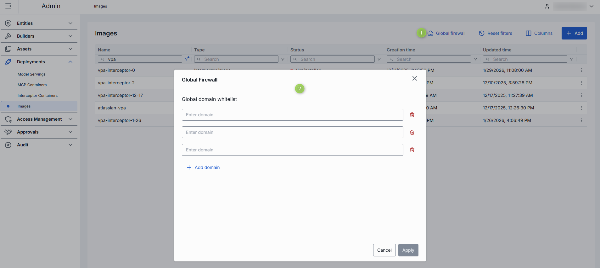
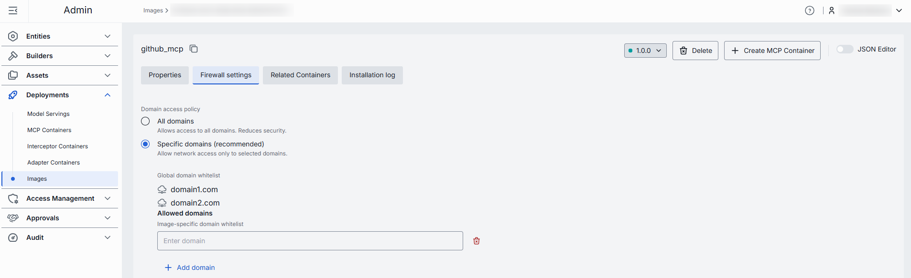

# Images

## Introduction

This page allows you to view, add and manage images for [MCP servers](/docs/tutorials/3.admin/deployments-mcp.md) and [Interceptors](/docs/tutorials/3.admin/deployments-interceptors.md) container deployments within the DIAL system.

## Main Screen

On the main screen, you can see all the available and add new images for MCP Servers and Interceptors.

##### Images grid

| Column | Description |
|--------|-------------|
| ID | Unique identifier of the image. |
| Version | Version of the image. |
| Name | Name of the image. |
| Description | Brief description of the image. |
| Type | Type of the image (MCP or Interceptor). |
| Source | Image or a Source code. |
| Status | Current status of the image. |
| Update time | Date and time when the image was last updated. |
| Create time | Date and time when the image was created. |
| Topics | List of topics associated with the image. |
| Transport type | Transport type used by the MCP image: - **Remote** (HTTP/SSE) - **Local** (STDIO). |
| Actions | Buttons to manage the selected image: - **Delete**: Use to remove the image. - **Duplicate**: Use to create a copy of the image. - **Open in a new tab**: Use to open image properties in a new tab in your browser. |

## Add Image

On the main screen, you can add new images for MCP Servers and Interceptors.

##### To add a new image

1. Click the **+Add** button on the main screen to open the **Adding Image** form.
2. Populate the required fields and click **Add** to add the image.

| Field | Required | Description |
|-------|----------|-------------|
| Name | Yes | Name of the image. |
| Description | No | Brief description of the image. |
| Version | Yes | Version of the image. |
| Type | Yes | Type of the image (MCP or Interceptor). |
| Source type | Conditional | **Note**: Required for MCP type. The source type of the Docker image: - **Docker Image** - **Source Code** |
| Docker image URI | Conditional | URI of the Docker image. Applies to both MCP (if Source type = Docker image) and Interceptor types. |
| Source code repository parameters | Conditional | Applies if Type = MCP Image and Source type = Source code . - **Repo URL**: a source code repository URL. **Required** - **Branch name**: the name of the branch in the source code repository. - **SHA**: the SHA in the source code repository. |

## Global firewall

Global firewall settings define an allow list of authorized domain names that apply to the build process of all images within the environment. These settings specify which external domains or resources any image build is permitted to access, ensuring a consistent security policy across all image builds.

By enforcing this allow list globally, you ensure that only approved network connections are possible during the creation of any image, regardless of individual image configurations.

> Refer to [Firewall settings](#firewall-settings) to configure additional authorized domain names for a specific image.

**Domain name requirements**: Enter the domain name without protocol, e.g., github.com. Each domain must have at least one dot, labels can include letters, numbers, and hyphens (1–63 chars, not starting or ending with a hyphen), and the top-level domain must be at least 2 letters.

## Configuration

Click any image from the main screen to open its configuration screen.

On the configuration screen, you can view and edit the selected image settings.

### Actions

In the header of the Configuration screen, you can find the following action buttons:

| Action | Description |
|--------|-------------|
| Version | Click to create a new image version or display configuration of a selected version. |
| Create Interceptor/MCP Container | Enabled for the installed images. Click to create a new [MCP](/docs/tutorials/3.admin/deployments-mcp.md) or [Interceptor](/docs/tutorials/3.admin/deployments-interceptors.md) container based on the selected image. |
| Install | Enabled for not installed images. Click to install the selected version of an image. |
| Delete | Click to delete the selected image. **Note**: Deleted image will effect the related containers. |

### Properties

In the Properties tab, you can preview and modify selected image's basic properties.

| Field | Required | Editable | Description |
|-------|----------|----------|-------------|
| ID | - | No | Unique identifier of the image. |
| Type | - | No | Type of the image (MCP or Interceptor). |
| Creation Time | - | No | Date and time when the image was created. |
| Updated Time | - | No | Date and time when the image was last updated. |
| Source type | - | No | Source type of the Docker image: - **Docker Image** - **Source Code** |
| Status | - | No | Current status of the image. |
| Name | Yes | Yes | Name of the image. |
| Description | No | Yes | Brief description of the image. |
| Maintainer | No | Yes | The maintainer of the image. |
| Topics | No | Yes | List of topics associated with the image. |
| Source type | Conditional | Yes | **Note**: Required for MCP type of image. The source type of the Docker image: - **Docker Image** - **Source Code** |
| Docker image URI | Conditional | Yes | URI of the Docker image. Applies to both MCP (if Source type = Docker image) and Interceptor types. |
| Source code repository parameters | Conditional | Yes | Applies if Type = MCP Image and Source type = Source code . - **Repo URL** (required): a source code repository URL. - **Branch name**: the name of the branch in the source code repository. - **SHA**: the SHA in the source code repository. - **Base directory**: the directory path with the Docker file. |
| MCP transport type | Conditional | Yes | Applies only to MCP type of image. The transport type used by the MCP image: - **Remote** (HTTP/SSE) - **Local** (STDIO). |

**Advanced users with technical expertise** can work with image properties in the table or a JSON editor view modes. It is useful for advanced scenarios of bulk updates, copy/paste between environments, or tweaking settings not exposed on UI.

### Firewall settings 

The allow list domains setting specifies which external resources the image build process can access. These settings are relevant only while the image is being created—for example, to control which domains or repositories can be reached when installing dependencies or downloading files.

> **Note**: Firewall settings defined for a specific image apply in addition to the [Global firewall settings](#global-firewall).

> **Note**: These firewall rules do not affect containers that are later created from the image. Containers can have their own firewall settings.

**Domain name requirements**: Enter the domain name without protocol, e.g., github.com. Each domain must have at least one dot, labels can include letters, numbers, and hyphens (1–63 chars, not starting or ending with a hyphen), and the top-level domain must be at least 2 letters.

### Related Containers

> This tab is enabled for installed images.

The Related Containers tab displays all [MCP](/docs/tutorials/3.admin/deployments-mcp.md) or [Interceptor](/docs/tutorials/3.admin/deployments-interceptors.md) containers related to the selected version of the image.

##### Add containers

You can link containers to this image or a specific version of it. When you add a container here, it will automatically use the selected image version in its configuration. 

**Note**: Every container must be linked to an image or image version. Once linked, you cannot remove the container from this list—you can only change which image it uses.

1. Click **Add** to invoke the adding modal.
2. In the modal, you can enable/disable the **Show containers related to this image** toggle to display containers related to any version of this image or to this image group.
3. Select one or several containers and click **Apply**. **Important**: Running containers will be restarted with the new image.

### Installation log

> This tab is enabled for installed images.

The Build Log tab displays the complete output generated during the image build process. Here you can view the step-by-step execution of build instructions, including command outputs, warnings, and errors that occurred during image creation.

