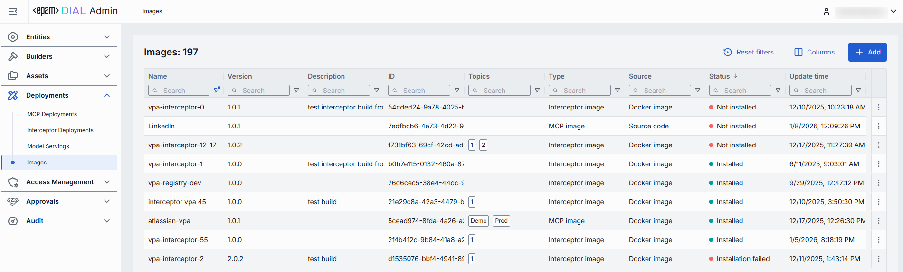
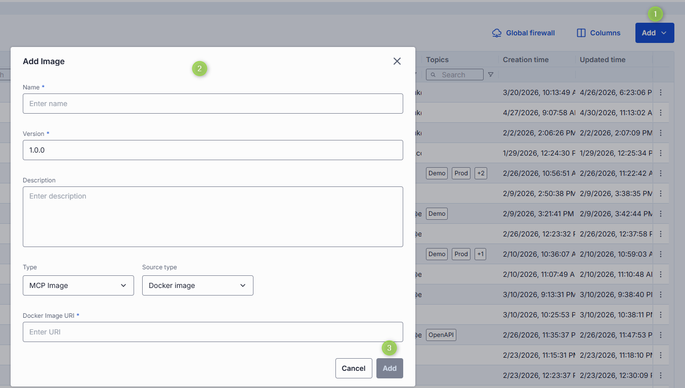
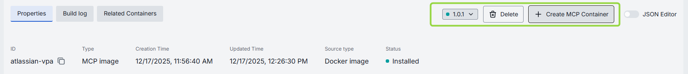
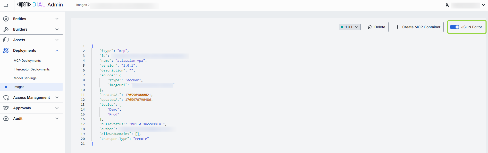
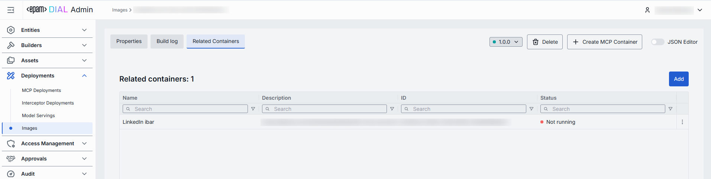

# Images

## Introduction

This page allows you to view, add and manage Docker images for [MCP servers](/docs/tutorials/3.admin/deployments-mcp.md) and [Interceptors](/docs/tutorials/3.admin/deployments-interceptors.md) container deployments within the DIAL system.

## Main Screen

On the main screen, you can see all the available and add new Docker images for MCP Servers and Interceptors.

##### Images Grid

| Column         | Description                                                  |
|----------------|--------------------------------------------------------------|
| ID             | The unique identifier of the Docker image.                  |
| Version        | The version of the Docker image.                             |
| Name           | The name of the Docker image.                               |
| Description    | A brief description of the Docker image.                               |
| Type           | The type of the Docker image (MCP or Interceptor).          |
|Source          |Docker image or a Source code.|
|Status          | The current status of the Docker image. |
|Update time     | The date and time when the Docker image was last updated.    |
|Create time     | The date and time when the Docker image was created.        |
|Topics          | The list of topics associated with the Docker image.        |
|Transport type  | The transport type used by the Docker image: -**Remote** (HTTP/SSE) -**Local** (STDIO).|
| Actions        | Buttons to manage the selected Docker image: -**Delete** - click to remove the Docker image. -**Duplicate** - click to create a copy of the Docker image. -**Open in a new tab** - click to open image properties in a new tab in your browser. |

## Add Image

On the main screen, you can add new Docker images for MCP Servers and Interceptors.

##### To add a new Docker image

1. Click the **+Add** button on the main screen to open the **Adding Image** form.
2. Populate the required fields and click **Add** to add the Docker image.

| Field          | Required |Description                                                  |
|----------------|-----------|---------------------------------------------------|
| Name           | Yes | A name of the Docker image.                               |
| Description    | No | A brief description of the Docker image.                               |
|Version        | Yes |A version of the Docker image.                             |
| Type           | Yes |A type of the Docker image (MCP or Interceptor).          |
|Source type| Conditional | **Note**: Required for MCP type. The source type of the Docker image: -**Docker Image** -**Source Code**|
|Docker image URI| Conditional| URI of the Docker image. Applies to both MCP (if Source type = Docker image) and Interceptor types.|
|Source code repository parameters| Conditional |Applies if Type = MCP Image and Source type = Source code . -**Repo URL**: a source code repository URL. **Required** -**Branch name**: the name of the branch in the source code repository. -**SHA**: the SHA in the source code repository.|

## Configuration Screen

Click any Docker image from the main screen to open its configuration screen.

On the configuration screen, you can view and edit the selected Docker image settings.

### Actions

In the header of the Configuration screen, you can find the following action buttons:

| Action         | Description                                                  |
|----------------|--------------------------------------------------------------|
| Version| Click to create a new image version or display configuration of a selected version.|
| Create Interceptor/MCP Container          | Enabled for the installed images. Click to create a new [MCP](/docs/tutorials/3.admin/deployments-mcp.md) or [Interceptor](/docs/tutorials/3.admin/deployments-interceptors.md) container based on the selected image.         |
| Install        | Enabled for not installed images. Click to install the selected version of an image.                   |  
| Delete         | Click to delete the selected image.                           |

### Properties

In the Properties tab, you can preview and modify selected image's basic properties.

| Field          | Required |Description                                                  |
|----------------|-----------|---------------------------------------------------|
| ID             | - | The unique identifier of the Docker image.                  |
|Type| - | The type of the Docker image (MCP or Interceptor).          |
|Creation Time| - | The date and time when the Docker image was created.        |
|Updated Time| - | The date and time when the Docker image was last updated.    |
|Source type|-| The source type of the Docker image: -**Docker Image** -**Source Code**|
|Status| - | The current status of the Docker image. |
| Name           | Yes | A name of the Docker image.                               |
| Description    | No | A brief description of the Docker image.                               |
|Maintainer     | No | The maintainer of the Docker image.                          |
|Topics          | No | The list of topics associated with the Docker image.        |
|Source type| Conditional | **Note**: Required for MCP type of image. The source type of the Docker image: -**Docker Image** -**Source Code**|
|Docker image URI| Conditional| URI of the Docker image. Applies to both MCP (if Source type = Docker image) and Interceptor types.|
|Source code repository parameters| Conditional |Applies if Type = MCP Image and Source type = Source code . -**Repo URL**: a source code repository URL. **Required** -**Branch name**: the name of the branch in the source code repository. -**SHA**: the SHA in the source code repository. -**Base directory**: the directory path with the Docker file. |
|MCP transport type|Conditional|Applies only to MCP type of image. The transport type used by the MCP image: -**Remote** (HTTP/SSE) -**Local** (STDIO).|

You can work with image properties in the table or a JSON editor view modes:

### Build log

> This tab is enabled for installed images.

The Build Log tab displays the complete output generated during the Docker image build process. Here you can view the step-by-step execution of build instructions, including command outputs, warnings, and errors that occurred during image creation.

### Related Containers

> This tab is enabled for installed images.

The Related Containers tab displays all [MCP](/docs/tutorials/3.admin/deployments-mcp.md) or [Interceptor](/docs/tutorials/3.admin/deployments-interceptors.md) containers that were created based on the selected Docker image.

