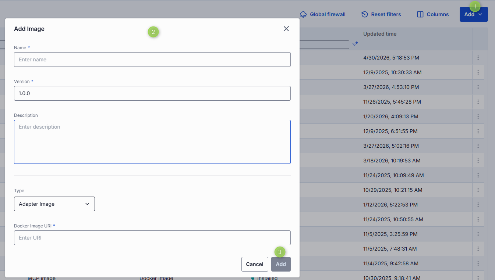
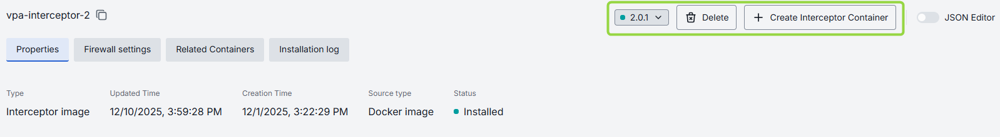
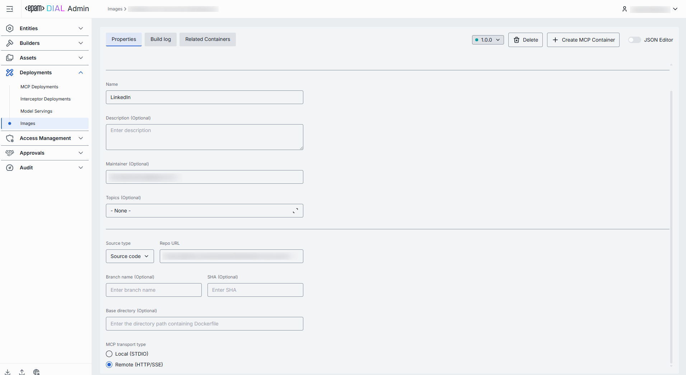
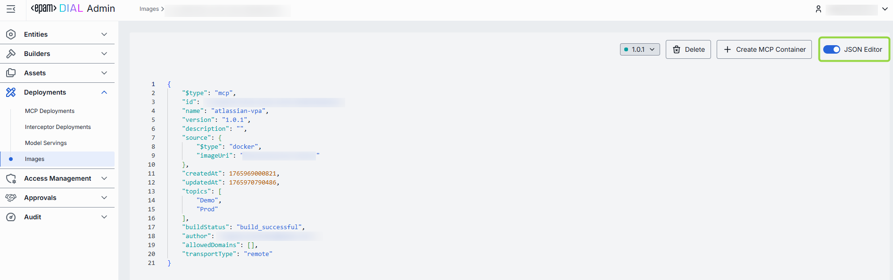
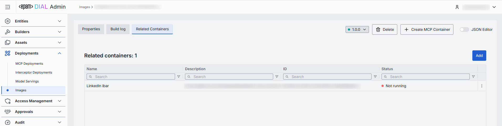
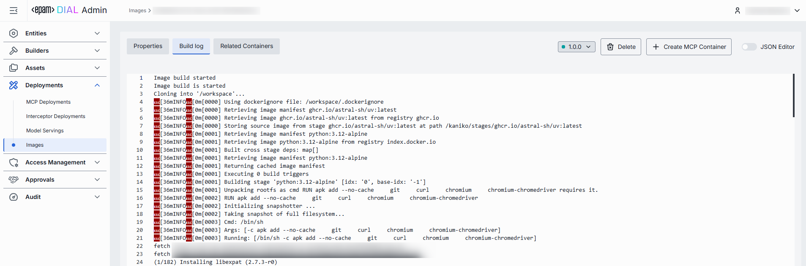

# Images

## Introduction

This page allows you to view, add and manage images for [MCP servers](/docs/tutorials/3.admin/deployments-mcp.md), [AI model adapters](/docs/tutorials/3.admin/deployments-adapters.md), [Applications](/docs/tutorials/3.admin/deployments-applications.md) and [Interceptors](/docs/tutorials/3.admin/deployments-interceptors.md) container deployments within the DIAL system.

## Main Screen

On the main screen, you can see all the available and add new images.

##### Images grid

| Column | Description |
|--------|-------------|
| ID | Unique identifier of the image. |
| Version | Version of the image. |
| Name | Name of the image. |
| Author | Email address of the creator of the image. |
| Description | Brief description of the image. |
| Type | Type of the image (MCP, Adapter, Application or Interceptor). |
| Source | Image or a Source code. |
| Status | Current status of the image. |
| Updated time | Timestamp of the last update. |
| Creation time | Creation timestamp. |
| Topics | List of topics associated with the image. |
| Transport type | Transport type used by the MCP image: - **Remote**: HTTP (default), SSE (deprecated) - **Local** (STDIO). |
| Actions | Buttons to manage the selected image: - **Open in a new tab**: Use to open image properties in a new tab in your browser. - **Delete**: Use to remove the image. - **Duplicate**: Use to create a copy of the image. |

## Add Image

On the main screen, you can add images for MCP Servers, AI Model Adapters, Applications and Interceptors. Use created images to add and run containers for specific entities.

##### To add a new image

1. Click the **Add** button on the main screen and select **Add Image**.
2. In the **Add Image** form, populate the required fields and click **Add** to add the image.

| Field | Required | Description |
|-------|----------|-------------|
| Name | Yes | Name of the image. |
| Version | Yes | Version of the image. |
| Description | No | Brief description of the image. |
| Type | Yes | Type of the image (MCP, Adapter, Application or Interceptor). |
| Source type | Conditional | **Note**: Available if **Type=MCP Image**.  Available values: - **Docker Image**: To use external Docker image as a source. - **Source Code**: To use source code repository as a source. |
| Docker Image URI | Conditional | URI of the Docker image used as a source.   Available if **Source type=Docker Image**. |
| Repo URL | Conditional | URL of the source code repository.   Available if **Source type=Source Code**. |
| Branch name | Conditional | The name of the branch in the source code repository.   Available if **Source type=Source Code**. |
| SHA | Conditional | The SHA in the source code repository that uniquely identifies each commit in the repository’s history. This SHA is a 40-character hexadecimal string generated by Git whenever you make a commit.   Available if **Source type=Source Code**. |

## Add Image from MCP Registry

On the main screen, you can add images for MCP servers based on [MCP Registry](https://registry.modelcontextprotocol.io/). MCP Registry is a centralized directory for Model Context Protocol (MCP) servers. It provides a catalog of available MCP servers along with their details, allowing you to easily discover and integrate MCP servers into your DIAL environment.

##### To add a new image

1. Click the **Add** button on the main screen and select **From MCP Registry**.
2. In the **Add Image from MCP Registry** form, populate the required fields and click **Add** to add the image.

| Field | Required | Description |
|-------|----------|-------------|
| Name | Yes | Name of the image. |
| Version | Yes | Version of the image. |
| Description | No | Brief description of the image. |
| MCP server name | Conditional | Name of MCP server from the [MCP Registry](https://registry.modelcontextprotocol.io/). Start typing in the text box to search for available MCP servers or click **Select from registry** to display a window with a list of available MCP servers and their details. |
| Source type | Conditional | Use Source type to choose how to deploy an image in case the selected MCP has both source code repository and Open Container Initiative (OCI) package available. Available values: - **Docker Image**: To deploy from the Docker image specified in the OCI package. - **Source Code**: To deploy from the source code repository.   Click **Select from registry** and open server details to find all this information. |
| Branch name | Conditional | The name of the branch in the source code repository.   Available if **Source type=Source Code**. |
| SHA | Conditional | The SHA in the source code repository that uniquely identifies each commit in the repository’s history. This SHA is a 40-character hexadecimal string generated by Git whenever you make a commit.   Available if **Source type=Source Code**. |

## Global firewall

Global firewall settings define an allow list of authorized domain names for all image builds in the environment. This helps operators avoid duplicating common allowed domains across images. [Individual image allow lists](#firewall-settings) can extend the global list.

**Domain name requirements**: Enter the domain name without protocol, e.g., github.com. Each domain must have at least one dot, labels can include letters, numbers, and hyphens (1–63 chars, not starting or ending with a hyphen), and the top-level domain must be at least 2 letters. Domain name must not include leading or trailing hyphens in labels.

## Configuration

Click any image from the main screen to open its configuration screen.

On the configuration screen, you can view and edit the selected image settings.

### Actions

In the header of the Configuration screen, you can find the following action buttons:

| Action | Description |
|--------|-------------|
| Version | Click to create a new image version or display configuration of a selected version. |
| Create Interceptor/MCP/Adapter/Application Container | Enabled for the installed images. Click to create a new [MCP](/docs/tutorials/3.admin/deployments-mcp.md), [Adapter](/docs/tutorials/3.admin/deployments-adapters.md), [Application](/docs/tutorials/3.admin/deployments-applications.md) or [Interceptor](/docs/tutorials/3.admin/deployments-interceptors.md) container based on the selected image. |
| Install | Enabled for not installed images. Click to install the selected version of an image. |
| Delete | Click to delete the selected image. **Note**: Deleted image will effect the related containers. |

### Properties

In the Properties tab, you can preview and modify selected image's basic properties.

| Field | Required | Editable | Description |
|-------|----------|----------|-------------|
| ID | - | No | Unique read-only identifier of the image. |
| Type | - | No | Type of the image (MCP, Adapter, Application or Interceptor). |
| Creation Time | - | No | Creation timestamp. |
| Updated Time | - | No | Timestamp of the last update. |
| Source type | - | No | Source type of the selected image: - **Docker Image** - **Source Code** |
| Status | - | No | Current status of the image. |
| Name | Yes | Yes | Name of the image.   Must be between 2 and 255 characters long.   Can contain only letters, numbers, spaces, underscores, and hyphens.   Special characters are not allowed. |
| Description | No | Yes | Brief description of the image. |
| Maintainer | No | Yes | Email address of the maintainer of the image. |
| Topics | No | Yes | List of topics associated with the image. Click to display a list of available topics.  You can add your own custom topics to the list following these rules:  - The topic name must not exceed 255 characters.   - The topic name must not contain leading or trailing spaces.|
| Build privileges | Yes | Yes | Use this setting to define permissions level when building image. |
| Source type | Conditional | No | The source type of the selected image required for MCP type of image. Available values:  - **Docker Image** - **Source Code** |
| Docker image URI | Conditional | Yes |  Valid Docker image URI (validated on backend). If provided, must not start or end with `/`. Applies to MCP (if Source type = Docker image), Adapter, Application and Interceptor image types.  Read-only and auto-populated from the OCI package for images created from MCP Registry. |
| Source code repository parameters | Conditional | Yes | Parameters of the source code repository used to create the selected image.  Applies if Type = MCP Image and Source type = Source code. Also, when the image is created from MCP Registry. - **Repo URL** (required): Source code repository URL. If provided, must not start or end with `/`. Read-only and auto-populated for images created from MCP Registry. - **Branch name**: Name of the branch in the source code repository. - **SHA**: SHA in the source code repository that uniquely identifies each commit in the repository’s history. This SHA is a 40-character hexadecimal string generated by Git whenever you make a commit. - **Base directory**: Directory path with the Docker file. If provided, must not start or end with `/`. |
| MCP server name | Conditional | Yes | Name of MCP server from the [MCP Registry](https://registry.modelcontextprotocol.io/). Start typing in the text box to search for available MCP servers or click **Select from registry** to display a window with a list of available MCP servers and their details.  Applies only to MCP type of image. |
| MCP transport type | Conditional | Yes | Applies only to MCP type of image. The transport type used by the MCP image:  - **Remote**: HTTP (default), SSE (deprecated) - **Local** (STDIO) |

**Advanced users with technical expertise** can work with image properties in the table or a JSON editor view modes. It is useful for advanced scenarios of bulk updates, copy/paste between environments, or tweaking settings not exposed on UI.

### Firewall settings 

The allow list domains setting specifies which external resources the image build process can access. These settings are relevant only while the image is being created—for example, to control which domains or repositories can be reached when installing dependencies or downloading files.

> **Note**: Firewall settings defined for a specific image apply in addition to the [Global firewall settings](#global-firewall).

> **Note**: These firewall rules do not affect containers that are later created from the image. Containers can have their own firewall settings.

**Domain name requirements**: Enter the domain name without protocol, e.g., github.com. Each domain must have at least one dot, labels can include letters, numbers, and hyphens (1–63 chars, not starting or ending with a hyphen), and the top-level domain must be at least 2 letters. Domain name must not include leading or trailing hyphens in labels.

### Related Containers

> This tab is enabled for installed images.

The Related Containers tab displays all [MCP](/docs/tutorials/3.admin/deployments-mcp.md), [Adapter](/docs/tutorials/3.admin/deployments-adapters.md), [Application](/docs/tutorials/3.admin/deployments-applications.md) or [Interceptor](/docs/tutorials/3.admin/deployments-interceptors.md) containers related to the selected version of the image.

##### Add containers

You can link containers to this image or a specific version of it. When you add a container here, it will automatically use the selected image version in its configuration. 

**Note**: Every container must be linked to an image or image version. Once linked, you cannot remove the container from this list—you can only change which image it uses.

1. Click **Add** to invoke the adding modal.
2. In the modal, you can enable/disable the **Show containers related to this image** toggle to display all containers or containers associated with all versions of the selected image.
3. Select one or several containers and click **Apply**. **Important**: Running containers will be restarted with the new image.

### Installation log

> This tab is enabled for installed images.

The Build Log tab displays the complete output generated during the image build process. Here you can view the step-by-step execution of build instructions, including command outputs, warnings, and errors that occurred during image creation.

