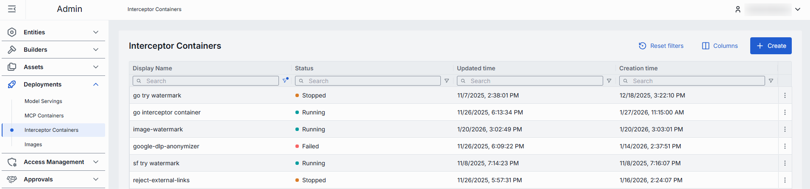
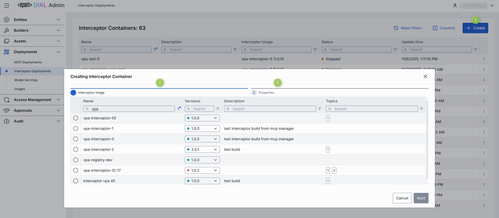
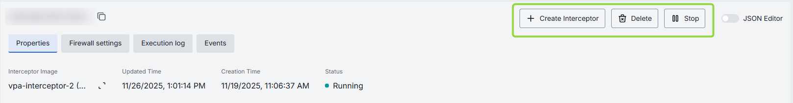
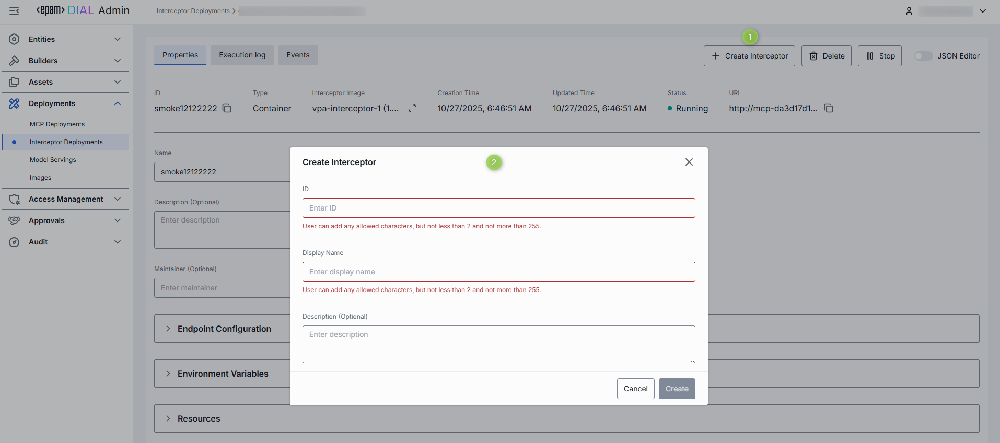
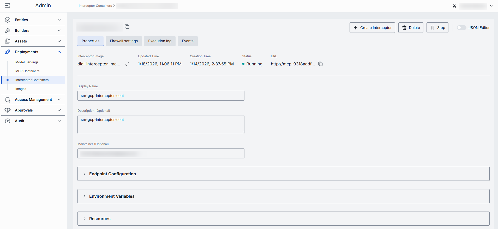
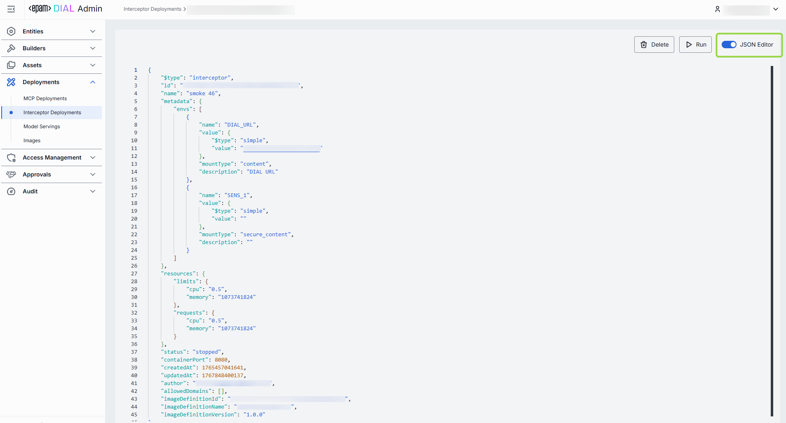
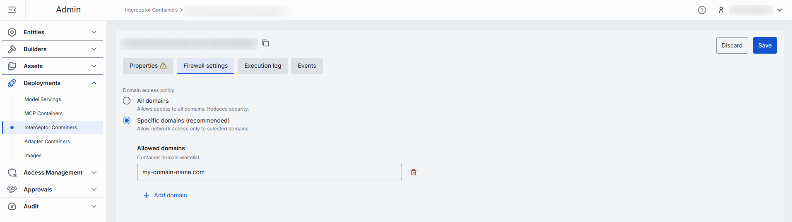
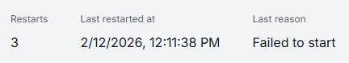

# Interceptor Containers

## Introduction

DIAL uses interceptors as a middleware that modifies incoming or outgoing requests to/from apps and AI models according to a specific logic enabling PII obfuscation, guardrails, safety checks, and beyond. 

> Refer to [Interceptors](/docs/platform/3.core/6.interceptors.md) to learn more.

##### Ways of adding interceptors in DIAL

> Use [Interceptors SDK](https://github.com/epam/ai-dial-interceptors-sdk) to create custom interceptors.

- Use endpoints of your custom interceptors to [add interceptors](/docs/tutorials/3.admin/entities-interceptors.md#create) directly using the External Endpoint source type.
- Define and configure [Interceptor Templates](/docs/tutorials/3.admin/builders-interceptor-templates.md) and use them as a source type to create interceptors.
- You can also deploy custom interceptors using Docker [Images](/docs/tutorials/3.admin/deployments-images.md), create containers, which you can use as a source type to [create interceptors](#to-create-interceptor).

## Main Screen

In **Interceptor Deployments**, you can manage containers for interceptors within the DIAL system. You can create new containers based on existing [images](/docs/tutorials/3.admin/deployments-images.md), start and stop running containers as needed, edit configuration settings, and view logs and events for troubleshooting.

##### Interceptor containers grid

| Column | Description |
|--------|-------------|
| Display Name | Name of the interceptor container rendered on UI. |
| Description | Brief description of the interceptor container. |
| Interceptor Image | Docker image from which the interceptor container was created. |
| Status | Current status of the interceptor container (e.g., Running, Stopped). |
| ID | Unique identifier of the interceptor container. |
| Container URL | URL to access the running interceptor container. |
| Maintainer | Maintainer of the interceptor container. |
| Create time | Date and time when the interceptor container was created. |
| Update time | Date and time when the interceptor container was last updated. |
| Actions | Buttons to manage the selected interceptor container: - **Open in a new tab**: Use to open the container configuration screen in a new tab in your browser. - **Duplicate**: Use to duplicate the interceptor container. - **Stop/Run**: Use to start and stop a container. - **Delete**: Use to remove the container. |  

## Create

On the main screen, you can add new interceptor containers based on existing [images](/docs/tutorials/3.admin/deployments-images.md). When a new container is created, you can use it as a source type to create [interceptors](/docs/tutorials/3.admin/entities-interceptors.md).

##### To create a new interceptor container

1. Click the **+Create** button on the main screen to open the **Creating Interceptor Container** form.
2. Select the desired [image](/docs/tutorials/3.admin/deployments-images.md) from the list and pick its installed version from the list (labeled with green indicator).
3. Specify properties and click **Finish** to create the container.
4. The screen with the container configuration is displayed. You can modify the configuration as needed, run, stop or delete the container.

## Configuration

Click any interceptor container on the main screen to open its configuration screen.

On the configuration screen, you can view and edit the selected interceptor container settings, start and stop the container, view logs and events, or delete the container.

> **Note**: Configuration fields are disabled when the container is in a transition state (launching or stopping).

### Actions

In the header of the Configuration screen, you can find the following action buttons:

| Action | Description |
|------- |-------------|
| Create Interceptor | Available for running containers.   Click to create a new [interceptor](/docs/tutorials/3.admin/entities-interceptors.md) using this selected interceptor container. |
| Run/Stop | Click to start or stop the interceptor container. |       
| Delete | Click to delete the interceptor container. **Note**: This will effect interceptors created based on the deleted container. |

### To Create Interceptor

You can use a **running** interceptor container to create a new interceptor in DIAL. Once created, the interceptor appears in [Entities/Interceptors](/docs/tutorials/3.admin/entities-interceptors.md) and can be used by DIAL applications, tool and models or as a [global interceptor](/docs/tutorials/3.admin/home.md#system-properties).

1. In the Configuration screen of the running interceptor container, click the **Create Interceptor** button in the header.
2. In the Create Interceptor dialog, fill in the form fields:
    - **ID**: Unique identifier for the interceptor. Auto-populated according to the selected container.
    - **Display Name**: Enter a name for the interceptor. Auto-populated according to the selected container.
    - **Description**: Provide a brief description of the interceptor.
3. Click the **Create** button to submit the form and create the interceptor. Repeat these steps to create more interceptors if needed.

### Properties

In the Properties tab, you can view and edit the selected interceptor container settings.

##### Fields description

| Property | Required | Editable | Description |
|----------|----------|----------|-------------|
| ID | - | No | Unique identifier for the interceptor container. |
| Interceptor Image | - | No | Docker image from which the interceptor container was created. |
| Creation Time | - | No | Date and time when the interceptor container was created. |
| Updated Time | - | No | Date and time when the interceptor container was last updated. |
| Status | - | No | Current status of the interceptor container (e.g., Running, Stopped). |
| URL | - | No | URL to access the running interceptor container. |
| Restarts | - | No | Restart counter for launching containers. Use to identify crash loops. You can find details in the [Execution Log](#execution-log).|
| Display Name | Yes | Yes | Name of the interceptor container rendered in UI. |
| Description | No | Yes | Brief description of the interceptor container. |
| Maintainer | No | Yes | Maintainer of the interceptor container. |
| Endpoint Configuration | No | Yes | **Note**: Running container will be redeployed when these settings change.   Configuration details for the endpoints exposed by the interceptor container. |
| Environment Variables | No | Yes | **Note**: Running container will be redeployed when these settings change.   Environment variables set for the interceptor container. |
| Resources | No | Yes | **Note**: Running container will be redeployed when these settings change.   Resource limits and requests for the interceptor container. |

**Advanced users with technical expertise** can work with the container properties in a JSON editor view mode. It is useful for advanced scenarios of bulk updates, copy/paste between environments, or tweaking settings not exposed on UI.

### Firewall settings 

A whitelist domains setting specifies which domains are allowed to access the interceptor. This is a security feature that restricts incoming requests, so only trusted domains (such as your company’s website or specific client applications) can interact with the interceptor.

> Refer to [Global Firewall](/docs/tutorials/3.admin/deployments-images.md#global-firewall) to learn how to define authorized domain names for all images.

**Domain name requirements**: Enter the domain name without protocol, e.g., github.com. Each domain must have at least one dot, labels can include letters, numbers, and hyphens (1–63 chars, not starting or ending with a hyphen), and the top-level domain must be at least 2 letters.

### Execution log

In the Execution Log tab, you can view real-time logs generated by the selected interceptor container. This log provides insights into the container's operations, including any errors or important events that occur during its execution.

In case of issues, health indicators are displayed to help identify problems:

| Indicator | Description |
|-----------|-------------|
| Restarts | Restart counter for launching containers. Use to identify crash loops. |
| Last restarted at | Timestamp of the last container restart. |
| Last reason | Restart failure reason. |

### Events

In the Events tab, you can view a log of significant events related to the selected interceptor container, such as start and stop actions, errors, and other system messages.
