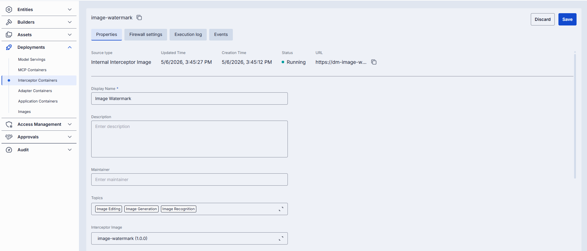
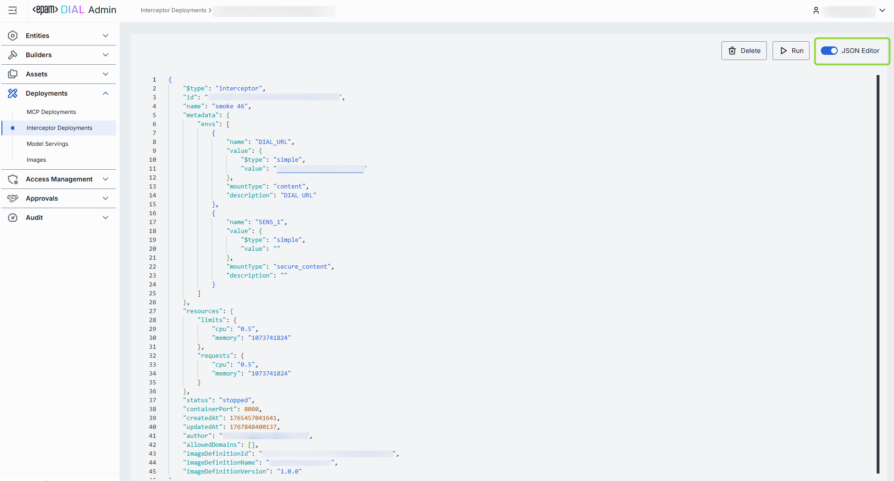

# Interceptor Containers

## Introduction

DIAL uses interceptors as a middleware that modifies incoming or outgoing requests to/from apps and AI models according to a specific logic enabling PII obfuscation, guardrails, safety checks, and beyond. 

> Refer to [Interceptors](/docs/platform/3.core/6.interceptors.md) to learn more.

##### Ways of adding interceptors in DIAL

> Use [Interceptors SDK](https://github.com/epam/ai-dial-interceptors-sdk) to create custom interceptors.

- Use endpoints of your custom interceptors to [add interceptors](/docs/tutorials/3.admin/entities-interceptors.md#create) directly using the External Endpoint source type.
- Define and configure [Interceptor Templates](/docs/tutorials/3.admin/builders-interceptor-templates.md) and use them as a source type to create interceptors.
- You can also deploy custom interceptors using Docker [Images](/docs/tutorials/3.admin/deployments-images.md), create containers, which you can use as a source type to [create interceptors](#to-create-interceptor).

## Main Screen

In **Interceptor Containers**, you can manage containers for interceptors within the DIAL system. You can create new containers based on existing [images](/docs/tutorials/3.admin/deployments-images.md), start and stop running containers as needed, edit configuration settings, and view logs and events for troubleshooting.

##### Interceptor containers grid

| Column | Description |
|--------|-------------|
| Display Name | Name of the interceptor container rendered on UI. |
| Description | Brief description of the interceptor container. |
| Status | Current status of the interceptor container (e.g., Running, Stopped). |
| ID | Unique identifier of the interceptor container. |
| Container URL | URL to access the running interceptor container. |
| Author | Email address of the creator of the interceptor container. |
| Topics | Tags that associate adapter with one or more topics or categories. |
| Create time | Date and time when the interceptor container was created. |
| Update time | Date and time when the interceptor container was last updated. |
| Actions | Buttons to manage the selected interceptor container: - **Open in a new tab**: Use to open the container configuration screen in a new tab in your browser. - **Duplicate**: Use to duplicate the interceptor container. - **Stop/Run**: Use to start and stop a container. - **Delete**: Use to remove the container. |  

## Create

On the main screen, you can add new interceptor containers based on existing [images](/docs/tutorials/3.admin/deployments-images.md). When a new container is created, you can use it as a source type to create [interceptors](/docs/tutorials/3.admin/entities-interceptors.md).

##### To create a new interceptor container

1. Click the **+Create** button on the main screen to open the **Creating Interceptor Container** form.
2. Select the desired [image](/docs/tutorials/3.admin/deployments-images.md) from the list and pick its installed version from the list (labeled with green indicator).
3. Specify properties and click **Finish** to create the container.
4. The screen with the container configuration is displayed. You can modify the configuration as needed, run, stop or delete the container.

## Configuration

Click any interceptor container on the main screen to open its configuration screen.

On the configuration screen, you can view and edit the selected interceptor container settings, start and stop the container, view logs and events, or delete the container.

> **Note**: Configuration fields are disabled when the container is in a transition state (pending or stopping).

### Actions

In the header of the Configuration screen, you can find the following action buttons:

| Action | Description |
|------- |-------------|
| Create Interceptor | Available for running containers.   Click to create a new [interceptor](/docs/tutorials/3.admin/entities-interceptors.md) using this selected interceptor container. |
| Run/Stop | Click to start or stop the interceptor container. |       
| Delete | Click to delete the interceptor container. **Note**: This will effect interceptors created based on the deleted container. |

### To Create Interceptor

You can use a **running** interceptor container to create a new interceptor in DIAL. Once created, the interceptor appears in [Entities/Interceptors](/docs/tutorials/3.admin/entities-interceptors.md) and can be used by DIAL applications, tool and models or as a [global interceptor](/docs/tutorials/3.admin/home.md#system-properties).

1. In the Configuration screen of the running interceptor container, click the **Create Interceptor** button in the header.
2. In the Create Interceptor dialog, fill in the form fields:
    - **ID**: Unique identifier for the interceptor. Auto-populated according to the selected container.
    - **Display Name**: Enter a name for the interceptor. Auto-populated according to the selected container.
    - **Description**: Provide a brief description of the interceptor.
3. Click the **Create** button to submit the form and create the interceptor. Repeat these steps to create more interceptors if needed.

### Properties

In the Properties tab, you can view and edit the selected interceptor container settings.

##### Fields description

| Property | Required | Editable | Description |
|----------|----------|----------|-------------|
| ID | - | No | Unique read-only identifier for the interceptor container. Must be between 2 and 36 characters long. Can contain only lowercase Latin letters, numbers, and hyphens. |
| Interceptor Image | - | No | Docker image from which the interceptor container was created.  Click to display the list of available images where you can change the source image for the container.  **Note**: The container is redeployed when source image changes. |
| Creation Time | - | No | Date and time when the interceptor container was created. |
| Updated Time | - | No | Date and time when the interceptor container was last updated. |
| Status | - | No | Current status of the interceptor container (e.g., Running, Stopped). |
| URL | - | No | URL to access the running interceptor container. |
| Restarts | - | No | Restart counter for launching containers. Use to identify crash loops. You can find details in the [Execution Log](#execution-log).|
| Display Name | Yes | Yes | Name of the interceptor container rendered in UI. Must be between 2 and 255 characters long. |
| Description | No | Yes | Brief description of the interceptor container. |
| Maintainer | No | Yes | Maintainer of the interceptor container. |
| Topics | No | Yes | Topics are semantic labels that you can assign to containers (e.g. "finance", "support") for better navigation on UI. Click to display a list of available topics.   You can add your own custom topics to the list following these rules: - The topic name must not exceed 255 characters. - The topic name must not contain leading or trailing spaces. |
| Endpoint Configuration | No | Yes | Configuration details for the endpoints exposed by the interceptor container.   **Note**: Changes to these settings can be applied to a running container. Saving changes will trigger a restart in RollingUpdate mode. |
| Environment Variables | No | Yes | Environment variables set for the interceptor container.   **Note**: Changes to these settings can be applied to a running container. Saving changes will trigger a restart in RollingUpdate mode.   - **Name**: Must be between 1 and 253 characters long. Can contain only letters, numbers, dots `(.)`, hyphens `(-)`, and underscores `(_)`.  - **Value**: Must be between 1 and 253 characters long. Can contain only letters, numbers, dots `(.)`, hyphens `(-)`, and underscores `(_)`. |
| Resources | No | Yes | Resource limits and requests for the interceptor container.   **Note**: Changes to these settings can be applied to a running container. Saving changes will trigger a restart in RollingUpdate mode. Validation rules:   - Values must be numeric and greater than 0.  - Maximum allowed values for `cpu`, `memory`, and `nvidia.com/gpu` are defined on the backend via environment variables.  - For each matching resource key (e.g. `cpu`), the value in limits must not be less than the value in `requests`. |
| Startup probe | No | Yes | Use this configuration to enable and configure the Startup Probe - it is a type of health check specifically designed to signal that the application inside the container is ready to begin serving traffic. - **Type**: HTTP (Performs an HTTP GET request to a specified path and port on the container. The probe is considered successful if the response has a status code between 200 and 399.); TCP (Attempts to establish a TCP connection to the specified port. The probe is successful if the connection is established.). - **Port**: The network port on the container to which the probe will connect or send the request.  - **Path**: Path to call inside the container. Available for HTTP type. - **Initial delay seconds**: The number of seconds to wait after the container starts before performing the first probe. This allows the application time to initialize before health checks begin.  - **Period seconds**: The interval (in seconds) between consecutive probe checks. This determines how frequently Kubernetes will perform the probe.  - **Timeout seconds**: The maximum number of seconds allowed for a single probe check to complete. If the probe does not return within this time, it is considered a failure.  - **Failure threshold**: The number of consecutive failed probe attempts before Kubernetes considers the startup probe to have failed, which may result in the container being restarted or marked as failed.|

**Advanced users with technical expertise** can work with the container properties in a JSON editor view mode. It is useful for advanced scenarios of bulk updates, copy/paste between environments, or tweaking settings not exposed on UI.

### Firewall settings 

The whitelist domains setting specifies which external domains the interceptor container is allowed to connect to. This setting controls outgoing traffic from the container, ensuring that it can only communicate with trusted domains (for example, your company’s website or specific client applications).

**Domain name requirements**: Enter the domain name without protocol, e.g., github.com. Each domain must have at least one dot, labels can include letters, numbers, and hyphens (1–63 chars, not starting or ending with a hyphen), and the top-level domain must be at least 2 letters. Domain name must not include leading or trailing hyphens in labels.

### Execution log

In the Execution Log tab, you can view real-time logs generated by the selected interceptor container. This log provides insights into the container's operations, including any errors or important events that occur during its execution.

When container starts with more than one pod, you can see logs for each of them: 

In case of issues, health indicators are displayed to help identify problems:

| Indicator | Description |
|-----------|-------------|
| Restarts | Restart counter for launching containers. Use to identify crash loops. |
| Last restarted at | Timestamp of the last container restart. |
| Last reason | Restart failure reason. |

### Events

In the Events tab, you can view a log of significant events related to the selected interceptor container, such as start and stop actions, errors, and other system messages.
