# MCP Deployments

## Introduction

This page allows you to manage MCP server containers within the DIAL system. You can create new containers based on existing [images](/docs/tutorials/3.admin/deployments-images.md), start and stop running containers as needed, edit configuration settings, and view logs and events for troubleshooting. The page provides all essential tools for deploying and maintaining your MCP servers efficiently.

> MCP Containers can be used as sources to create [Toolsets](/docs/tutorials/3.admin/entities-toolsets.md) and [Assets Toolsets](/docs/tutorials/3.admin/assets-toolsets.md).

## Main Screen

On the main screen, you can see a list of all MCP containers along with their current status and details. On this screen, you can also add new MCP containers based on existing images.

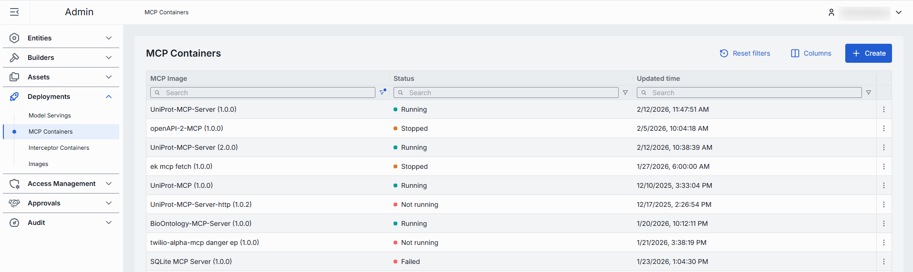

##### MCP Containers Grid

| Column         | Description                                                  |
|----------------|--------------------------------------------------------------|
| Name           | The name of the MCP container.                               |
| Description    | A brief description of the MCP container.                               |
| MCP Image      | The image from which the MCP container was created.          |
| Status         | The current status of the MCP container (e.g., Running, Stopped). |
|ID             | The unique identifier of the MCP container.                  |
|Container URL | The URL to access the MCP container.                          |
|Maintainer     | The maintainer of the MCP container.                          |
| Create time     | The date and time when the MCP container was created.        |
|Update time   | The date and time when the MCP container was last updated.    |
| Actions        | Buttons to manage the selected MCP container: -**Open in a new tab** - click to open the container configuration screen in a new tab in your browser. -**Duplicate** - click to duplicate the MCP container. -**Stop/Run** - click to start and stop a container. -**Delete** - click to remove the container. |

## Create

On the main screen, you can add new MCP containers based on existing [images](/docs/tutorials/3.admin/deployments-images.md). When a new container is created, you can use it as a source type to create [toolsets](/docs/tutorials/3.admin/entities-toolsets.md).

##### To create a new MCP container

1. Click the **+Create** button on the main screen to open the **Creating MCP Container** form.
2. Select the desired image from the list, including the image version.
3. Specify optional properties and click **Finish** to create the container.
4. The screen with the container configuration is displayed. You can modify the configuration as needed, run, stop or delete the container.

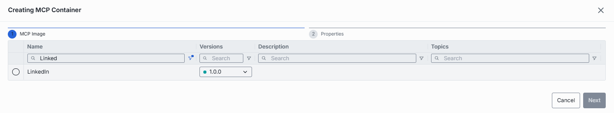

## Configuration Screen

On the configuration screen, you can view and edit the selected MCP container settings, start and stop the container, view logs and events, or delete the container.

### Actions

In the header of the Configuration screen, you can find the following action buttons:

| Action         | Description                                                  |
|----------------|--------------------------------------------------------------|
| Create           | Available for running containers.   Click to create a new [Toolset](/docs/tutorials/3.admin/entities-toolsets.md) and [Asset Toolset](/docs/tutorials/3.admin/assets-toolsets.md).         |
| Run/Stop        | Click to start or stop the MCP container.                   |  
| Delete         | Click to delete the MCP container.                           |

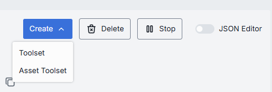

### Create Toolset

You can create a new toolset based on the running MCP container. The created toolset will use the MCP container as its source and appear in the Toolsets list on the [Entities - Toolsets](/docs/tutorials/3.admin/entities-toolsets.md) page.

1. In the Configuration screen of the running MCP container, click the **Create** button in the header and select **Toolset** from the dropdown.
2. In the Create Toolsets dialog, fill in the form fields:
    - **ID**: Unique identifier for the toolset.
    - **Display Name**: Enter a name for the toolset.
    - **Description**: Provide a brief description of the toolset.
3. Click the **Create** button to submit the form and create the toolset.

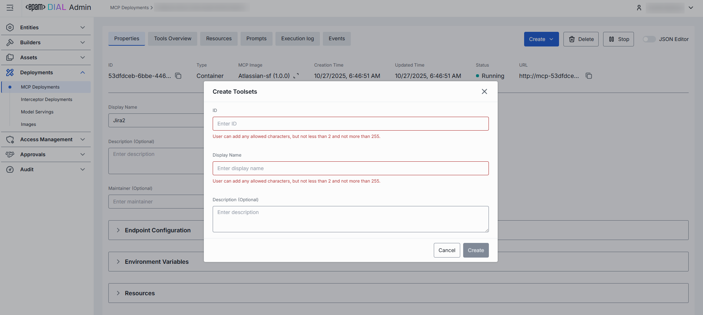

### Create Asset Toolset

You can create a new asset toolset based on the running MCP container. The created asset toolset will use the MCP container as its source and appear in the Asset Toolsets list on the [Assets - Toolsets](/docs/tutorials/3.admin/assets-toolsets.md) page.

1. In the Configuration screen of the running MCP container, click the **Create** button in the header and select **Asset Toolset** from the dropdown.
2. In the Create Asset Toolsets dialog, fill in the form fields:    
    - **ID**: Unique identifier for the asset toolset.
    - **Display Name**: Enter a name for the asset toolset.
    - **Version**: Specify a version of the asset toolset.
    - **Description**: Provide a brief description of the asset toolset.
    - **External Endpoint**: Specify an external endpoint for the asset toolset.
    - **Target folder**: Specify the target folder for the asset toolset.
3. Click the **Create** button to submit the form and create the asset toolset.

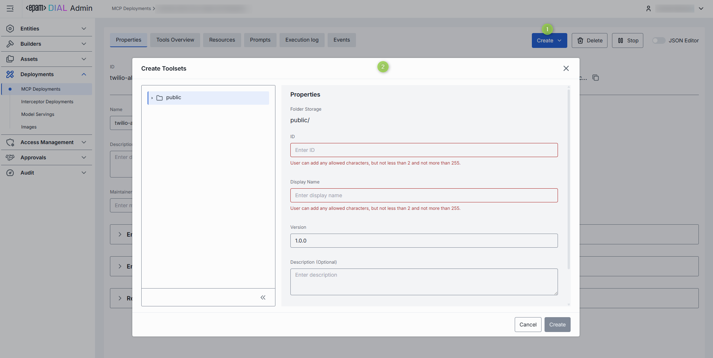

### Properties

In the Properties tab, you can preview and modify selected container's basic properties.

##### Fields Description

| Property        | Description |
|----------------|--------------|
|ID             | The unique identifier of the MCP container.|
|Type           | The type of the MCP container.|
| MCP Image      | The image from which the MCP container was created. Click to open details or navigate to [MCP Images](/docs/tutorials/3.admin/deployments-images.md).|
| Creation Time     | The date and time when the MCP container was created.|
|Updated Time   | The date and time when the MCP container was last updated.|
| Status         | The current status of the MCP container (e.g., Running, Stopped).|
|URL | The URL to access the MCP container.|
| Name           | The name of the MCP container. You can edit this field.|
| Description    | A brief description of the MCP container. You can edit this field.|
|Maintainer     | The maintainer of the MCP container. You can edit this field.|
|Endpoint Configuration| The endpoint configuration of the MCP container:  **Transport**: the transport protocol (HTTP or Server-Sent Events). **Container endpoint path**: the specific endpoint path where the MCP service is accessible. **Port**: the network port the container uses.|
|Environment Variables| A list of environment variables for the MCP container. You can add, edit, or remove variables as needed.|
|Resources| The resource limits for the MCP container, including CPU and memory allocation. You can adjust these settings based on your requirements.|

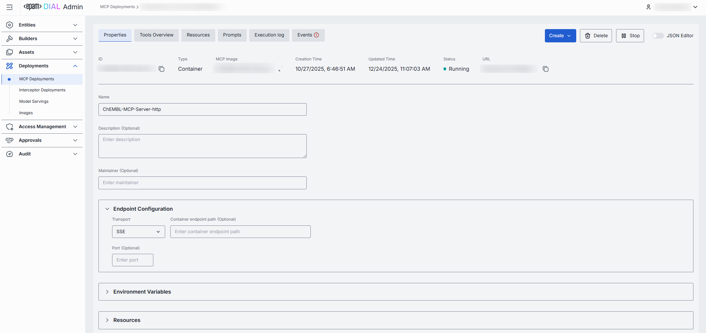

You can work with container properties in the table or a JSON editor view modes:

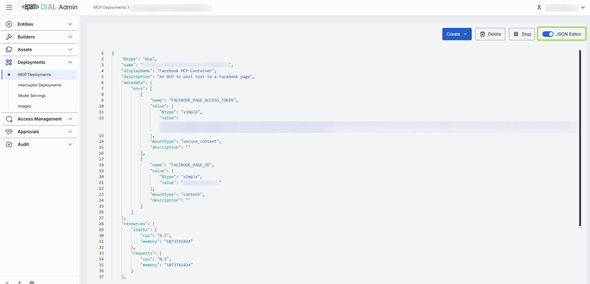

### Tools Overview

MCP server-specific functions exposed to the LLM to take actions. These tools provide specific capabilities to process, transform, or analyze data flowing through the MCP server. Each tool can be configured independently within the container to support different operational requirements.

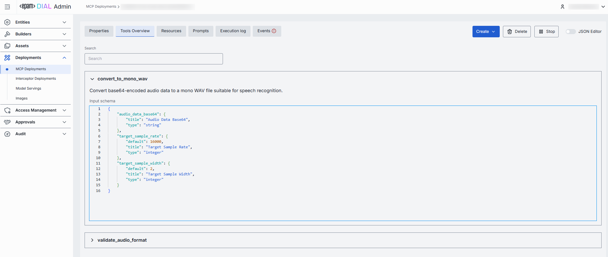

### Resources

A specific contextual data attached and managed by the MCP server that provides additional context to AI models.

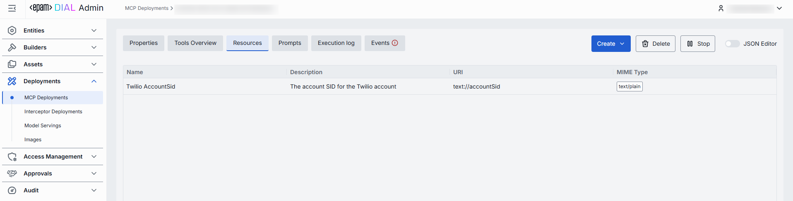

### Prompts

Pre-defined by MCP server templates or instructions that guide language model interactions.

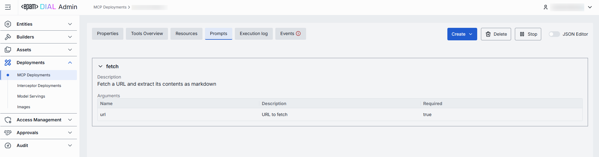

### Execution log

The Execution Log tab provides real-time visibility into the operations of your MCP container. Here you can view the chronological output generated during container execution, including status messages, errors, and operational events. This information is invaluable for monitoring container health, diagnosing issues, and verifying proper functionality. Use this log to quickly identify and troubleshoot problems that may occur during the operation of your MCP server.

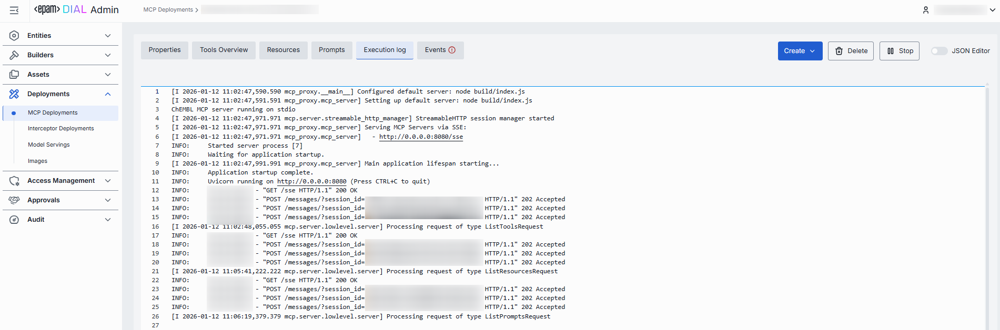

### Events

The Events tab displays significant state changes and discrete occurrences within your MCP container. Unlike the continuous output in the Execution Log, this tab focuses on specific actions such as container starts, stops, configuration changes, and error conditions. 

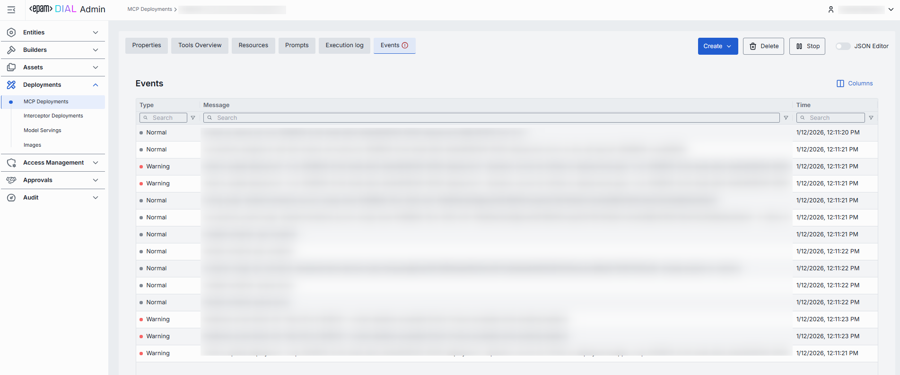

