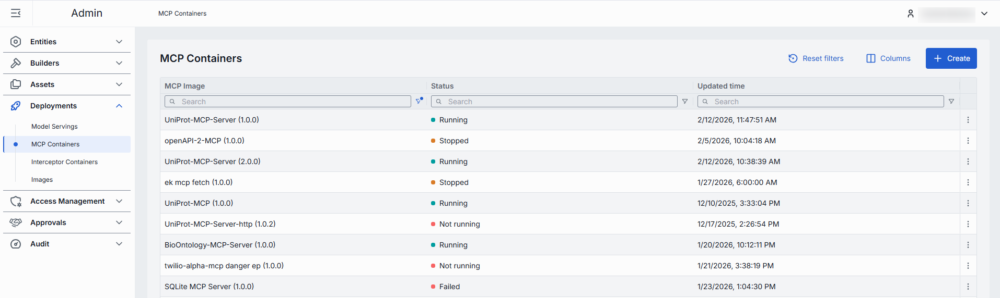
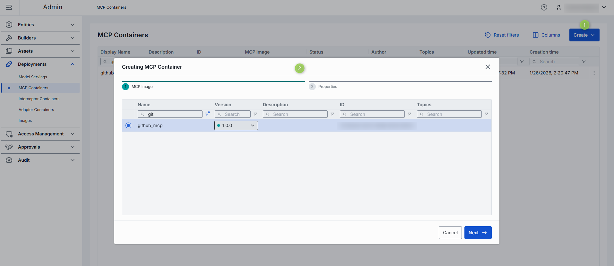
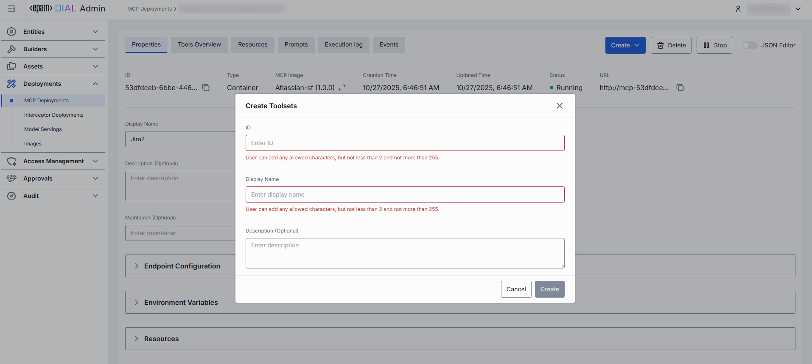
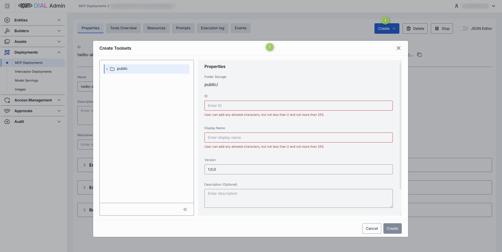
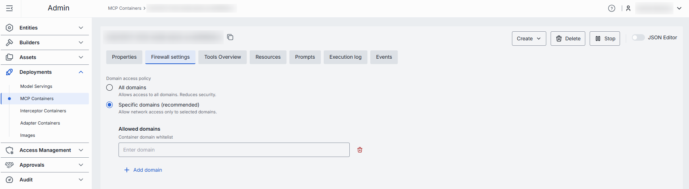
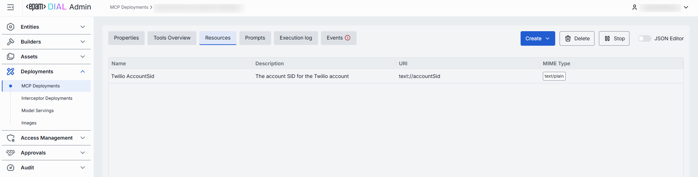
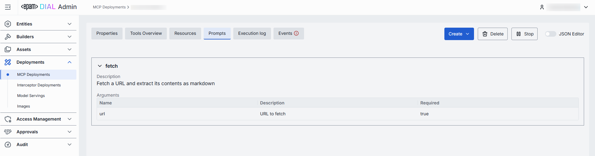
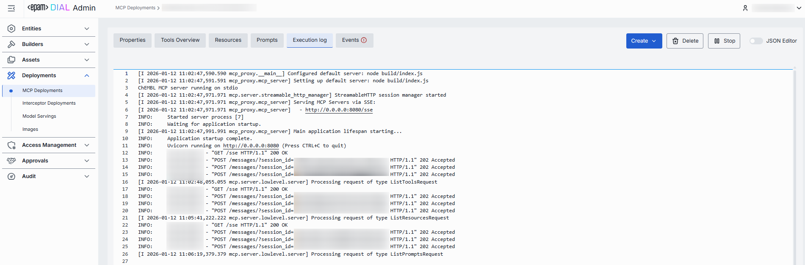
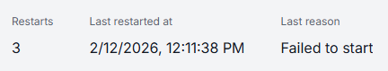
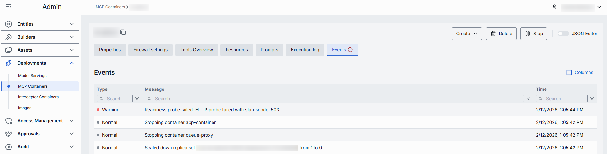

# MCP Containers

## Introduction

This page allows you to manage MCP server containers within the DIAL system. You can create new containers based on existing [images](/docs/tutorials/3.admin/deployments-images.md), start and stop running containers as needed, edit configuration settings, and view logs and events for troubleshooting. The page provides all essential tools for deploying and maintaining your MCP servers efficiently.

MCP Containers can be used as sources to create [Toolsets](/docs/tutorials/3.admin/entities-toolsets.md) and [Assets Toolsets](/docs/tutorials/3.admin/assets-toolsets.md).

##### To create a toolset based on MCP container

> Created toolsets can be used in [Quick Apps 2.0](/docs/tutorials/0.user-guide.md#quick-apps-20) workflow to perform specific tasks.

1. [Deploy an image](/docs/tutorials/3.admin/deployments-images.md) with type MCP and use it to [create a container](/docs/tutorials/3.admin/deployments-images.md#actions).
3. In the running container configuration screen, use the [Create](#create-toolset) button to create toolsets.
4. Created toolsets will appear in [Entities/Toolsets](/docs/tutorials/3.admin/entities-toolsets.md) or [Assets/Toolsets](/docs/tutorials/3.admin/assets-toolsets.md).

## Main Screen

On the main screen, you can see a list of all MCP containers along with their current status and details. On this screen, you can also add new MCP containers based on existing images.

##### MCP containers grid

| Column | Description |
|--------|-------------|
| Display Name | Name of the MCP container rendered on UI. |
| Description | Brief description of the MCP container. |
| MCP Image | Name of the image from which the MCP container was created. |
| Status | Current status of the MCP container (e.g., Running, Stopped). |
| ID | Unique identifier of the MCP container. |
| Container URL | URL to access the MCP container. |
| Author | Email address of the creator of the container. |
| Topics | Tags that associate MCP container with one or more topics or categories. |
| Create time | Creation timestamp. |
| Update time | Timestamp of the last update. |
| Actions | Buttons to manage the selected MCP container: - **Open in a new tab**: Use to open the container configuration screen in a new tab in your browser. - **Duplicate**: Use to duplicate the MCP container. - **Stop/Run**: Use to start and stop a container. - **Delete**: Use to remove the container. |

## Create

On the main screen, you can add new MCP containers based on existing [images](/docs/tutorials/3.admin/deployments-images.md). When a new container is created, you can use it as a source type to create [toolsets](/docs/tutorials/3.admin/entities-toolsets.md).

##### To create a new MCP container

1. Click **Create** on the main screen and select to create a container from the internally-deployed image or an external image.
    - **From Internal MCP Image**: Select the desired [image](/docs/tutorials/3.admin/deployments-images.md) from the list and pick its installed version from the list (labeled with green indicator).
    - **From Docker Image Reference**: Provide the URL of the external Docker image you want to use.
2. Specify properties and click **Finish** to create the container.
3. The screen with the container configuration is displayed. You can modify the configuration as needed, run, stop or delete the container.

## Configuration

Click any MCP container on the main screen to open its configurations.

On the configurations screen, you can view and edit the selected MCP container settings, start and stop the container, view logs and events, or delete the container.

> **Note**: Configuration fields are disabled when the container is in a transition state (launching or stopping).

### Actions

In the header of the Configuration screen, you can find the following action buttons:

| Action | Description |
|--------|-------------|
| Create | Available for running containers.   Click to create a new [Toolset](/docs/tutorials/3.admin/entities-toolsets.md) and [Asset Toolset](/docs/tutorials/3.admin/assets-toolsets.md). |
| Run/Stop | Click to start or stop the MCP container. |
| Delete | Click to delete the MCP container. **Note**: This will effect toolset created based on the deleted container. |

### Create Toolset

You can create a new toolset based on the running MCP container. The created toolset will use the MCP container as its source and appear in [Entities/Toolsets](/docs/tutorials/3.admin/entities-toolsets.md).

1. In the Configuration screen of the running MCP container, click the **Create** button in the header and select **Toolset** from the dropdown.
2. In the Create Toolsets dialog, fill in the form fields:
    - **ID**: Unique identifier for the toolset. Auto-populated according to the selected MCP container.
    - **Display Name**: Enter a name for the toolset. Auto-populated according to the selected MCP container.
    - **Description**: Provide a brief description of the toolset.
3. Click the **Create** button to submit the form and create the toolset.

### Create Asset Toolset

> Assets are stored in the Public folder in DIAL file system. All authorized users have access to this folder. Objects can be placed in sub-folders, which can have specific access rules applied to them. You can view and manage access rules in [Folders Storage](/docs/tutorials/3.admin/access-management-folders-storage.md).

You can create a new asset toolset based on the running MCP container. The created asset toolset will use the MCP container as its source and appear in [Assets/Toolsets](/docs/tutorials/3.admin/assets-toolsets.md).

1. In the Configuration screen of the running MCP container, click the **Create** button in the header and select **Asset Toolset** from the dropdown.
2. In the Create Asset Toolsets dialog, fill in the form fields:
    - **Folder Storage**: Select a folder for the asset toolset in the Public storage.  
    - **ID**: Unique identifier for the asset toolset. Auto-populated according to the selected MCP container.
    - **Display Name**: Enter a name for the asset toolset. Auto-populated according to the selected MCP container.
    - **Version**: Specify a version of the asset toolset.
    - **Description**: Provide a brief description of the asset toolset.
    - **External Endpoint**: Specify an external endpoint for the asset toolset.
3. Click the **Create** button to submit the form and create the asset toolset.

### Properties

In the Properties tab, you can preview and modify selected container's basic properties.

##### Fields description

| Property | Required | Editable | Description |
|----------|----------|----------|-------------|
| ID | - | No | Unique identifier of the MCP container. Must be between 2 and 36 characters long. Can contain only lowercase Latin letters, numbers, and hyphens. |
| MCP Image | - | No | Image from which the MCP container was created.  Click to display the list of available images where you can change the source image for the container.  **Note**: The container is redeployed when source image changes.  |
| Creation Time | - | No | Container creation timestamp. |
| Updated Time | - | No | Timestamp of the last update. |
| Status | - | No | Current status of the MCP container (e.g., Running, Stopped). |
| URL | - | No | The URL to access the running MCP container. |
| Restarts | - | No | Restart counter for launching containers. Use to identify crash loops. You can find details in the [Execution Log](#execution-log). |
| Display Name | Yes | Yes | Display name of the MCP container rendered in UI. Must be between 2 and 255 characters long. |
| Description | No | Yes | Brief description of the MCP container. |
| Maintainer | No | Yes | Maintainer of the MCP container. |
| Topics | No | Yes | Topics are semantic labels that you can assign to containers (e.g. "finance", "support") for better navigation on UI. Click to display a list of available topics.   You can add your own custom topics to the list following these rules: - The topic name must not exceed 255 characters. - The topic name must not contain leading or trailing spaces. |
| Docker Image Reference | Conditional | Yes | Reference of the external Docker image used to create the container.   Available if the external Docker image was used to create the container. Disabled if the internal image was used to create the container. |
| Endpoint Configuration | No | Yes | Endpoint configuration of the MCP container:  **Transport**: the transport protocol (HTTP (default) or SSE). **Container endpoint path**: the specific endpoint path where the MCP service is accessible. **Port**: the network port the container uses (If provided, must be between 1 and 65535.).   **Note**: Changes to these settings can be applied to a running container. Saving changes will trigger a restart in RollingUpdate mode. |
| Autoscaling | No | Yes | Parameters to dynamically adjust container replicas based on demand.   - **Automatic scale to zero**: Use to define criteria to reduce replicas to zero to save resources.  - **Min and Max Replicas**: Sets the minimum and maximum number of instances that can run, ensuring availability and controlling costs.   - **Pending requests to trigger autoscaling**: Specifies the number of queued requests required to trigger scaling up, helping maintain performance during traffic spikes. |
| Environment Variables | No | Yes | List of environment variables for the MCP container.  You can add, edit, or remove variables as needed.   **Note**: Changes to these settings can be applied to a running container. Saving changes will trigger a restart in RollingUpdate mode.   - **Name**: Must be between 1 and 253 characters long. Can contain only letters, numbers, dots `(.)`, hyphens `(-)`, and underscores `(_)`.  - **Value**: Must be between 1 and 253 characters long. Can contain only letters, numbers, dots `(.)`, hyphens `(-)`, and underscores `(_)`. |
| Resources | No | Yes | Resource limits for the MCP container, including CPU and memory allocation. You can adjust these settings based on your requirements. **Note**: Changes to these settings can be applied to a running container. Saving changes will trigger a restart in RollingUpdate mode. Validation rules:   - Values must be numeric and greater than 0.  - Maximum allowed values for `cpu`, `memory`, and `nvidia.com/gpu` are defined on the backend via environment variables.  - For each matching resource key (e.g. `cpu`), the value in limits must not be less than the value in `requests`. |
| Configuration | No | Yes | Command that defines the executable and its options to launch the container. Arguments provide extra parameters for customization during startup. |
| Startup probe | No | Yes | Use this configuration to enable and configure the Startup Probe - it is a type of health check specifically designed to signal that the application inside the container is ready to begin serving traffic. - **Type**: HTTP (Performs an HTTP GET request to a specified path and port on the container. The probe is considered successful if the response has a status code between 200 and 399.); TCP (Attempts to establish a TCP connection to the specified port. The probe is successful if the connection is established.). - **Port**: The network port on the container to which the probe will connect or send the request.  - **Path**: Path to call inside the container. Available for HTTP type. - **Initial delay seconds**: The number of seconds to wait after the container starts before performing the first probe. This allows the application time to initialize before health checks begin.  - **Period seconds**: The interval (in seconds) between consecutive probe checks. This determines how frequently Kubernetes will perform the probe.  - **Timeout seconds**: The maximum number of seconds allowed for a single probe check to complete. If the probe does not return within this time, it is considered a failure.  - **Failure threshold**: The number of consecutive failed probe attempts before Kubernetes considers the startup probe to have failed, which may result in the container being restarted or marked as failed.|

**Advanced users with technical expertise** can work with container properties in the table or a JSON editor view modes. It is useful for advanced scenarios of bulk updates, copy/paste between environments, or tweaking settings not exposed on UI.

### Firewall settings 

The whitelist domains setting specifies which external domains the MCP container is allowed to connect to. This setting controls outgoing traffic from the container, ensuring that it can only communicate with trusted domains (for example, your company’s website or specific client applications).

**Domain name requirements**: Enter the domain name without protocol, e.g., github.com. Each domain must have at least one dot, labels can include letters, numbers, and hyphens (1–63 chars, not starting or ending with a hyphen), and the top-level domain must be at least 2 letters. Domain name must not include leading or trailing hyphens in labels.

### Tools Overview

[Tools](https://modelcontextprotocol.io/specification/2025-06-18/server/tools) are specific functions supported by a related MCP server that can be used by clients to perform specific actions (e.g., process, transform, or analyze data flowing through the MCP server). 

On this screen, you can view the list of tools supported by the selected MCP server along with their details. Toolsets created based on this container will inherit these tools in the [Tools Overview](/docs/tutorials/3.admin/entities-toolsets.md#tools-overview) configuration tab.

### Resources

A specific contextual data attached and managed by the MCP server that provides additional context to AI models.

### Prompts

Pre-defined by MCP server templates or instructions that guide language model interactions.

### Execution log

The Execution Log tab provides real-time visibility into the operations of your MCP container. Here you can view the chronological output generated during container execution, including status messages, errors, and operational events. This information is invaluable for monitoring container health, diagnosing issues, and verifying proper functionality. Use this log to quickly identify and troubleshoot problems that may occur during the operation of your MCP server.

When container starts with more than one pod, you can see logs for each of them: 

In case of issues, health indicators are displayed to help identify problems:

| Indicator | Description |
|-----------|-------------|
| Restarts | Restart counter for launching containers. Use to identify crash loops. |
| Last restarted at | Timestamp of the last container restart. |
| Last reason | Restart failure reason. |

### Events

The Events tab displays significant state changes and discrete occurrences within your MCP container. Unlike the continuous output in the Execution Log, this tab focuses on specific actions such as container starts, stops, configuration changes, and error conditions. 

