# Models Servings

## Introduction

The Model Servings page enables DIAL admins to deploy and manage containers for AI models listed at [NVIDIA NIM](https://build.nvidia.com/models) and [Hugging Face](https://huggingface.co/models).

## How to Use Models

To be able to use AI models in DIAL, you need adapters. Model adapters unify the APIs of respective AI models to align with the Unified Protocol of DIAL Core. DIAL includes adapters for [Azure OpenAI](https://github.com/epam/ai-dial-adapter-openai) models, [GCP Vertex AI](https://github.com/epam/ai-dial-adapter-vertexai/?tab=readme-ov-file#supported-models) models, and [AWS Bedrock](https://github.com/epam/ai-dial-adapter-bedrock) models. You can also create custom adapters for other AI models with [DIAL SDK](https://github.com/epam/ai-dial-sdk). 

You can use DIAL OpenAI adapter to work with compatible models listed on Hugging Face or NVIDIA NIM. For other models not compatible with OpenAI API, you need to create custom adapters.

##### To enable a model in DIAL:

1. Add and run a model serving container with an OpenAI-compatible model from Hugging Face or NIM.
2. Unless it is a part of your DIAL setup, create a new adapter based on [DIAL Azure OpenAI Adapter](https://github.com/epam/ai-dial-adapter-openai) and add it in [Builders/Adapters](/docs/tutorials/3.admin/builders-adapters.md#create).
3. In [Entities/Models](/docs/tutorials/3.admin/entities-models.md#create-model), create a new model entity:
   - As a **Source Type**, select your OpenAI adapter. 
   - As an **Override Name**, use the model name from the running model serving container. You can find it in the container logs.
   - Add **Upstream Endpoint** with the URL of your model serving running container. Follow this pattern: `http://<container_url>/openai/v1/chat/completions`.
4. Now the AI model is available for users and apps based on your permissions model. 

## Main Screen

On the main screen, you can view existing and add new AI model servings.

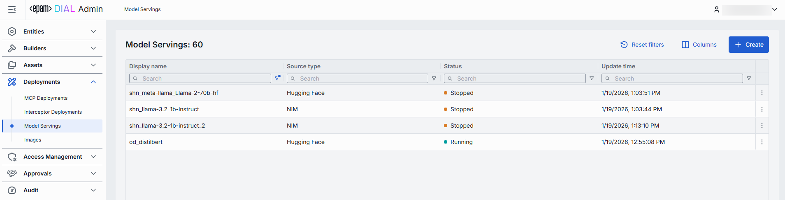

##### Model servings grid

| Field | Description |
|-------|-------------|
| Display Name | Name of the model serving rendered on UI. |
| Description | Brief description of the model serving. |
| Source Type | Source type of the model (NIM or Hugging Face). |
| Status | Current status of the model serving. |
| ID | Unique identifier for the model serving. |
| Container URL | URL of the container where the model is hosted. Available for a running container. |
| Maintainer | Person or team responsible for maintaining the model serving. |
| Create time | Date and time when the model serving was created. |
| Update time | Date and time when the model serving was last updated. |

## Create Model Serving

On the main screen, use the **Create** button to create Hugging Face or NIM model servings.

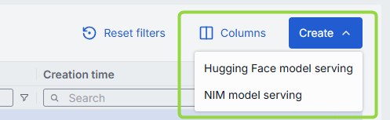

##### To create a new model serving:

1. Click the **Create** button on the main screen and select which type of model serving you want to create.
2. Fill in the required fields in the Model Serving form:
   - **ID**: Unique identifier for the model serving.
   - **Display Name**: Enter a name for the model serving.
   - **Description**: Provide a brief description of the model serving.
   - **Hugging Face Model Name**: Applies to Hugging Face source type. Enter the name of the model from Hugging Face or select from the registry.
   - **Docker Image URI**: Applies to NIM source type. Enter the Docker image URI for the model.
3. Click the **Create** button to submit the form and create the model serving.

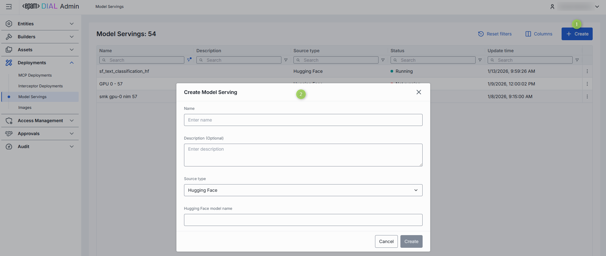

## Configuration

Click any model serving from the main screen to open its configuration.

> **Note**: Configuration fields are disabled when the container is in a transition state (launching or stopping).

### Actions

In the header of the Configuration screen, you can find the following action buttons:

| Action | Description |
|--------|-------------|
| Create Model | Available for running model servings. Click to create a new [model deployment](/docs/tutorials/3.admin/entities-models.md) using this selected model serving. |
| Run/Stop | Click to start or stop the selected model serving. |
| Delete | Click to delete the selected model serving container. **Note**: This will effect model deployments created based on the deleted container. |

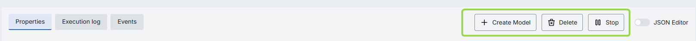

### To Create Model

You can use a **running** model serving container to create a new model deployment in DIAL. Once created, the model deployment appears in [Entities/Models](/docs/tutorials/3.admin/entities-models.md). Refer to [How to Use Models](#how-to-use-models) section for more details on how to enable models in DIAL.

1. In the Configuration screen of the running model serving, click the **Create Model** button in the header.
2. In the Create Model dialog, fill in the form fields:
   - **ID**: Unique identifier for the model deployment. Auto-populated according to the selected model serving.
   - **Display Name**: Enter a name for the model deployment. Auto-populated according to the selected model serving.
   - **Display Version**: Specify a version of the model deployment.
   - **Description**: Provide a brief description of the model deployment.
3. Click the **Create** button to submit the form and create the model deployment. Repeat these steps to create more model deployments if needed.

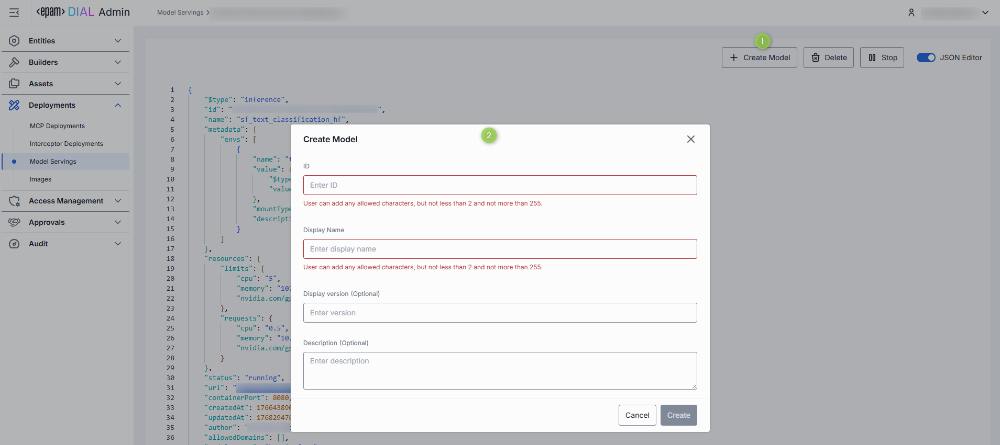

## Properties

In the Properties tab, you can view and edit the selected model serving container settings.

| Property | Required | Editable | Description |
|----------|----------|----------|-------------|
| ID | - | No | Unique identifier of the model serving container. |
| Creation Time | - | No | Date and time when the model serving container was created. |
| Updated Time | - | No | Date and time when the model serving container was last updated. |
| Status | - | No | Current status of the model serving container. |
| Restarts | - | No | Restart counter for launching containers. You can find details in the [Execution Log](#execution-log). |
| URL | - | No | URL of the running container where the model is hosted. |
| Display Name | Yes | Yes | Name of the model serving container rendered in UI. |
| Description | No | Yes | Brief description of the model serving container. |
| Maintainer | No | Yes | Person or team responsible for maintaining the model serving container. |
| Hugging Face model name | Conditional | Yes | Applies to Hugging Face models. The name of the model from Hugging Face. |
| Docker Image URI | Conditional | Yes | Applies to NIM models. The Docker image URI for the model. |
| Endpoint Configuration | No | Yes | Port configuration for the model serving.   **Note**: Changes to these settings can be applied to a running container. Saving changes will trigger a restart in RollingUpdate mode. |
| Environment Variables | No | Yes | List of environment variables for the model serving.   **Note**: Changes to these settings can be applied to a running container. Saving changes will trigger a restart in RollingUpdate mode. |
| Resources | No | Yes | Resource allocation settings for the model serving (CPU, Memory, GPU).   **Note**: Changes to these settings can be applied to a running container. Saving changes will trigger a restart in RollingUpdate mode. |
| Configuration | No | Yes | Command that defines the executable and its options to launch the model serving. Arguments provide extra parameters for customization during startup. |
| Autoscaling | No | Yes | **Note**: Autoscaling is available for Hugging Face models.  Parameters to dynamically adjust AI model replicas based on demand.   - **Automatic scale to zero**: Use to define criteria to reduce replicas to zero to save resources.  - **Min and Max Replicas**: Sets the minimum and maximum number of model instances that can run, ensuring availability and controlling costs.   - **Pending requests to trigger autoscaling**: Specifies the number of queued requests required to trigger scaling up, helping maintain performance during traffic spikes. |

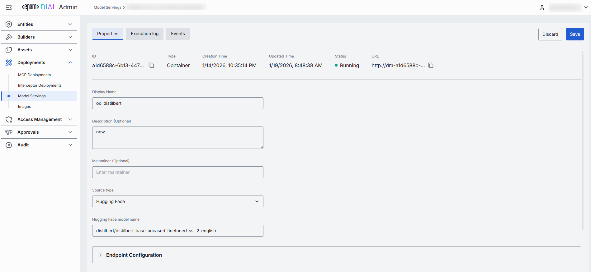

**Advanced users with technical expertise** can work with model serving properties in the table or a JSON editor view modes. It is useful for advanced scenarios of bulk updates, copy/paste between environments, or tweaking settings not exposed on UI.

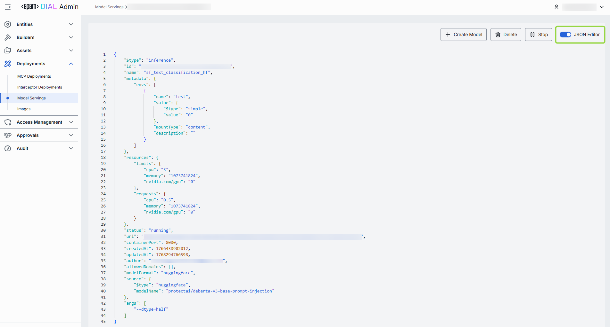

## Firewall settings 

The whitelist domains setting specifies which external domains the model serving container is allowed to connect to. This setting controls outgoing traffic from the container, ensuring that it can only communicate with trusted domains (for example, your company’s website or specific client applications).

**Domain name requirements**: Enter the domain name without protocol, e.g., github.com. Each domain must have at least one dot, labels can include letters, numbers, and hyphens (1–63 chars, not starting or ending with a hyphen), and the top-level domain must be at least 2 letters.

## Execution log

In the Execution Log tab, you can view the logs related to the operations and activities of the selected model serving container.

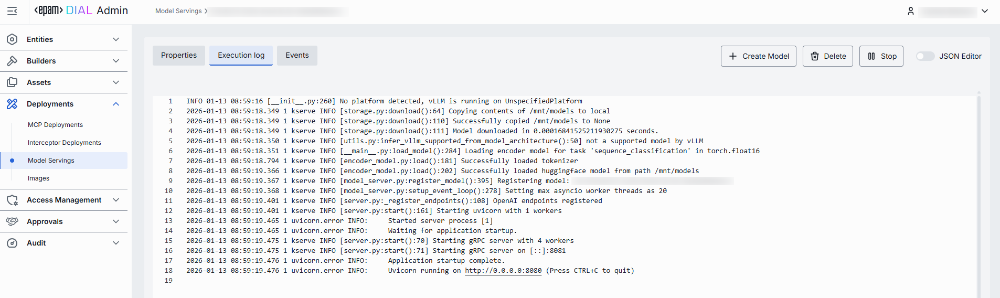

When container starts with more than one pod, you can see logs for each of them: 

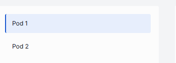

In case of issues, health indicators are displayed to help identify problems:

| Indicator | Description |
|-----------|-------------|
| Restarts | Restart counter for launching containers. Use to identify crash loops. |
| Last restarted at | Timestamp of the last model serving restart. |
| Last reason | Restart failure reason. |

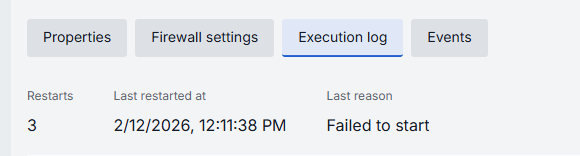

## Events

In the Events tab, you can view the event history related to the selected model serving.

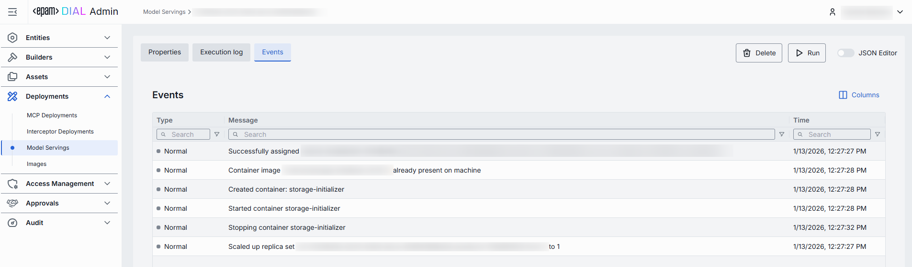