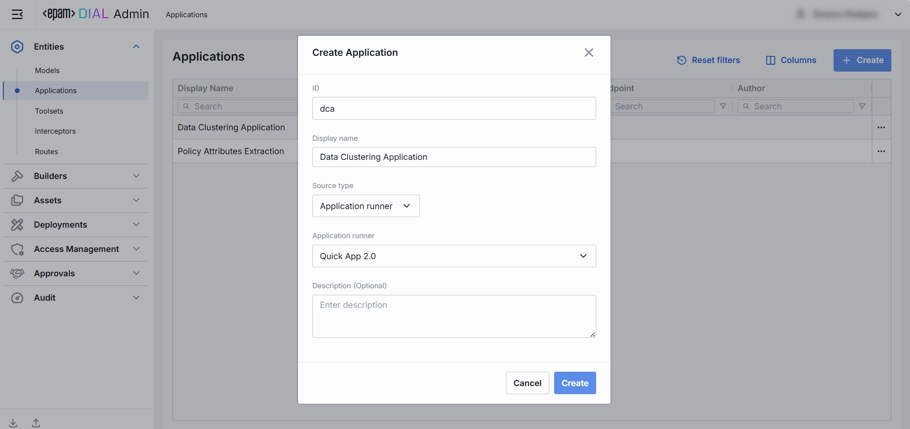
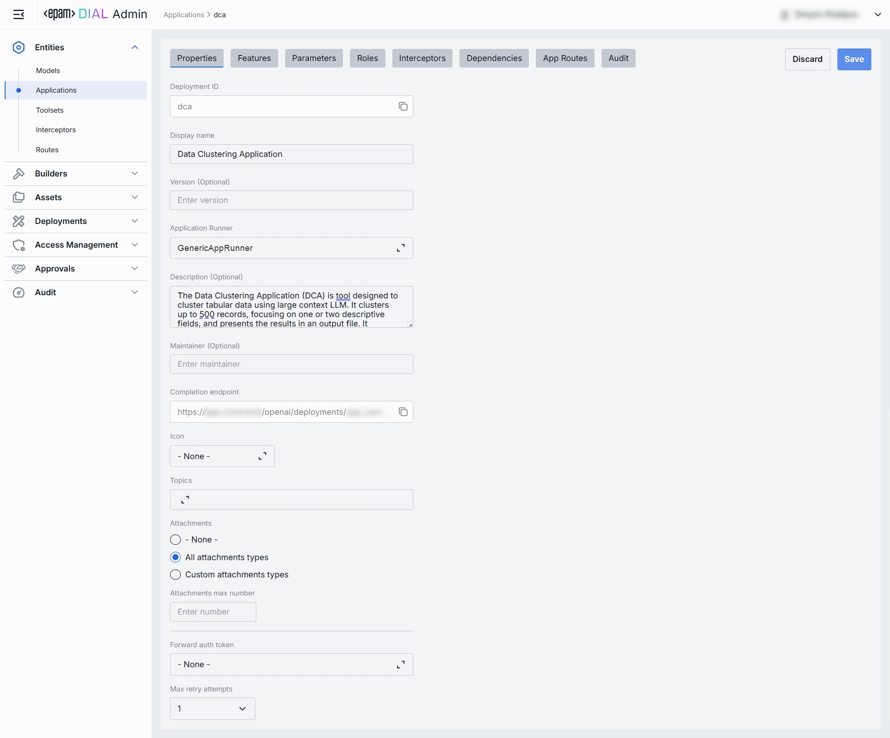
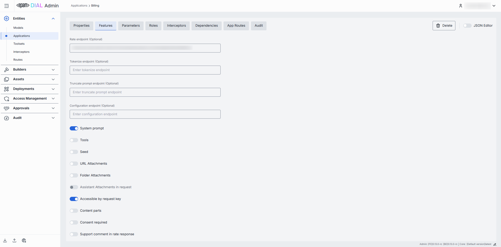
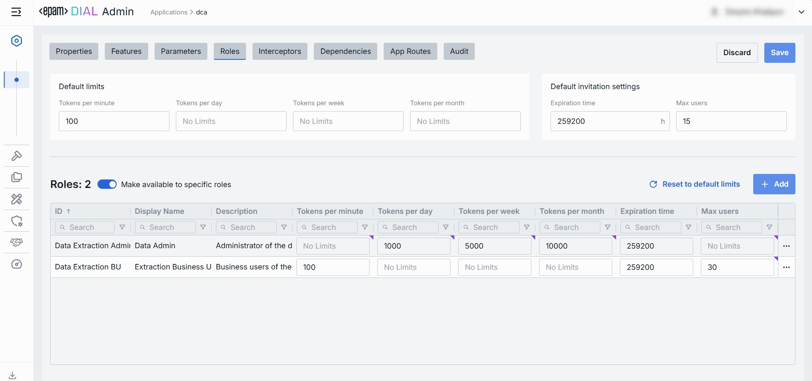
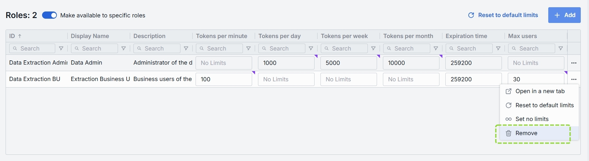
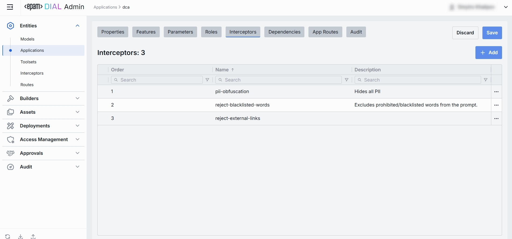
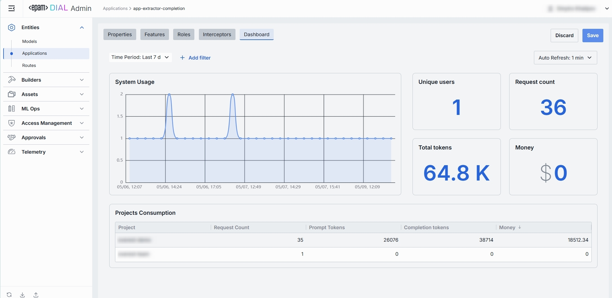
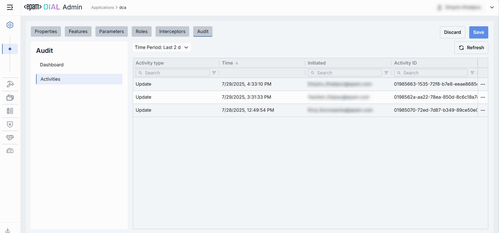
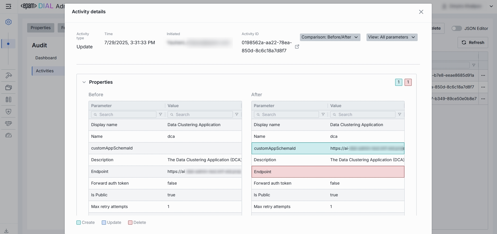
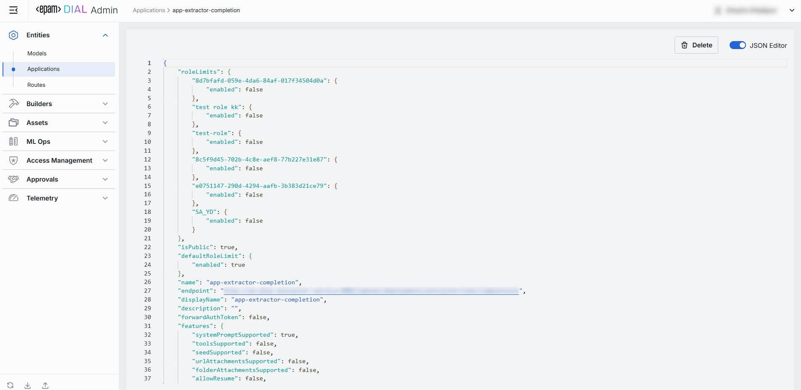

# Applications

## About Applications

> Refer to [DIAL-Native Applications](/docs/platform/3.core/7.apps.md) to learn about applications in DIAL.

## Applications List

In Applications, you can see, create and manage applications deployed in your instance of DIAL.

##### Applications grid

> **TIP**: Use the **Columns** selector to customize which columns are visible in the grid.

| Field                     | Definition   |
|---------------------------|----------------|
| **Display Name**          | A user-friendly name of the application (e.g. "Data Clustering Application").                 |
| **Version**               | Version string or tag (e.g. v1, 2024-07-01). You can use a higher version to publish application updates without disrupting existing users.    |
| **Description**           | A brief free-text summary describing the application (e.g. "Clusters incoming text into semantic groups").           |
| **Deployment ID**         | A unique identifier used in the DIAL [dynamic settings](https://github.com/epam/ai-dial-core?tab=readme-ov-file#dynamic-settings) (e.g. dca, support-bot). This is the path segment of the Application’s HTTP endpoint.|
| **Endpoint**              | Full URL where the application is exposed.     |
| **Topics**                | Tags or categories (e.g. "finance," "support," "image-capable") you can assign for discovery, filtering, or grouping in large deployments. Helps end users and admins find the right application by the use case. |
| **Attachment types**      | An option you can use to define which file attachments this application can accept.        |
| **Max attachment number** | Maximum number of attachments allowed per single request.           |
| **Forward auth token**    | This parameter allow you to determine whether the Auth Token should be forwarded from the caller's session to the upstream API call. This enables multi-tenant scenarios or pass-through authentication for downstream services. |

## Create Application

> Refer to [Enable App](/docs/tutorials/1.developers/4.apps-development/3.enable-app.md) to learn more about enabling applications in DIAL.

1. Click **+ Create** to invoke the **Create Application** modal.
2. Define application's parameters

    | Field                  | Required       | Definition & Guidance|
    |------------------------|-----------------|------------------------------------|
    | **Deployment ID**      | Yes         | A unique identifier under the `applications` section of DIAL Core’s [dynamic settings](https://github.com/epam/ai-dial-core?tab=readme-ov-file#dynamic-settings) (e.g. support-bot, data-cluster).                    |
    | **Display Name**       | Yes         | A user-friendly label (e.g. "Customer Support Bot") shown throughout the Admin UI.       |
    | **Version**            | No              | An optional version tag to track apps releases (e.g. `2024-07-18`, `v1`).     |
    | **Application Runner** | No              | [Application type schema](/docs/platform/3.core/7.apps.md#schema-rich-applications). Defined in [Application Runners](/docs/tutorials/3.admin/builders-application-runners.md). |
    | **Description**        | No              | A free-text summary describing the application (e.g. supported inputs, business purpose).                       |
    | **Endpoint**           | Conditional | The full URL where this Application’s API will be exposed once created. Not needed if Application Runner is selected. Required otherwise.|

3. Once all required fields are filled click **Create**. The dialog closes and the new [application configuration](#application-configuration) screen is opened. This entry will appear immediately in the listing once created. It may take some time for the changes to take effect after saving.

        

## Application Configuration

##### Top Bar Controls

* **Delete**: Permanently removes this application. All clients calling its endpoint will receive errors until a replacement is published.
* **JSON Editor** (Toggle): Switch between the form-based UI and raw [JSON view](#json-editor) of the application’s configuration. Use JSON mode for copy-paste or advanced edits.

### Properties

In the Properties tab, you can define the application's identity, routing, UI metadata, and other basic runtime controls. 

Once configured, your application is ready to orchestrate models and interceptors behind a single HTTP endpoint.

| Field                   | Required | Description                                                                                                                                                                                                                                                                                                                                                                                                                                                                                                          |
|-------------------------|----------|----------------------------------------------------------------------------------------------------------------------------------------------------------------------------------------------------------------------------------------------------------------------------------------------------------------------------------------------------------------------------------------------------------------------------------------------------------------------------------------------------------------------|
| **Deployment ID**       | Yes      | A unique key under `applications` in DIAL Core’s [dynamic settings](https://github.com/epam/ai-dial-core?tab=readme-ov-file#dynamic-settings) (e.g. data-clustering, support-bot).                                                                                                                                                                                                                                                                                                                                   |
| **Display Name**        | Yes      | A user-friendly label shown on the UI (e.g. "Data Clustering Application"). Helps end user to identify and select applications.                                                                                                                                                                                                                                                                                                                                                                                      |
| **Version**             | No       | A version tag for rollout management (e.g. `v1.0`, `2024-07-15`). Use this to publish a new version of an application without disturbing existing users.                                                                                                                                                                                                                                                                                                                                                             |
| **Application Runner**  | No       | Application type schema. Defined in [Application Runners](/docs/tutorials/3.admin/builders-application-runners.md).                                                                                                                                                                                                                                                                                                                                                                                                  |
| **Description**         | No       | A free-text summary describing the application (e.g. tooling, supported inputs/outputs, SLAs).                                                                                                                                                                                                                                                                                                                                                                                                                       |
| **Maintainer**          | No       | Field used to specify the responsible person or team overseeing the app’s configuration.                                                                                                                                                                                                                                                                                                                                                                                                                             |
| **Completion Endpoint** | Optional | URL where the app is exposed. Clients use this to integrate. Auto-populated if Application Runner is selected. **Required** if Application Runner is not selected.                                                                                                                                                                                                                                                                                                                                                   |
| **Icon**                | No       | A logo to visually distinguish the app on the UI.                                                                                                                                                                                                                                                                                                                                                                                                                                                                    |
| **Topics**              | No       | Tags that you can assign to apps (e.g. "finance", "support"). Helps to split apps into categories for better navigation on UI.                                                                                                                                                                                                                                                                                                                                                                                       |
| **Attachments**         | No       | An option you can use to define the [attachment types](/docs/tutorials/1.developers/3.chat/0.chat-objects.md#attachments) (images, files) this app can have:   **Available values**:  **None** – attachments are not allowed.    **All** – unrestricted types. Optionally specify max number of attachments.   **Custom** – enter specific [MIME types](https://developer.mozilla.org/en-US/docs/Web/HTTP/Basics_of_HTTP/MIME_types/Common_types). Optionally specify max number of attachments. |
| **Forward auth token**  | No       | Select a downstream auth token to forward from the user’s session (for multi-tenant downstream).                                                                                                                                                                                                                                                                                                                                                                                                                     |
| **Max retry attempts**  | No       | Number of times DIAL Core will [retry](/docs/platform/3.core/5.load-balancer.md#fallbacks) a failed run (due to timeouts or 5xx errors).                                                                                                                                                                                                                                                                                                                                                                             |
 
### Features

In the Features tab, you can control optional capabilities of applications. 

##### The difference between model and application features

While [Model feature flags](/docs/tutorials/3.admin/entities-models.md#feature-flags-toggles) govern what each LLM integration can do, Application feature flags define which of those capabilities your orchestrated service exposes to clients. Also, you can plug in custom preprocessing endpoints.

**Scope**

* **Model features** apply *per LLM*, controlling what the model endpoint itself supports (e.g. whether GPT-4 can accept system prompts or function calls).
* **Application features** apply *per orchestrated service*, governing what your composed workflow will accept and pass through—regardless of which models are called under the hood.

**Override Capability**

* At the **application** level, you can disable a feature globally (even if models support it) or plug in custom endpoints that apply *above* all models.
* At the **model** level, toggles only reflect the true capabilities of that specific LLM integration.

**Use Cases**

* **Model** toggles ensure you don’t accidentally send unsupported parameters to a given model.
* **Application** toggles let you present a consistent API to your clients (e.g. always accept `temperature` or never allow attachments), even if different underlying models behave differently.

#### Endpoints

You can override or extend DIAL Core’s built-in protocol calls with your own HTTP services. Here, you can specify endpoints used by [Application Runners](/docs/tutorials/3.admin/builders-application-runners.md) (e.g. a Python or Node Runner) to perform preprocessing or policy checks before delegating to your underlying models and workflows.

| Field                        | Description & When to Use                                                                                                                                                 |
|------------------------------|---------------------------------------------------------------------------------------------------------------------------------------------------------------------------|
| **Rate endpoint**            | A URL to call a custom rate-estimation API. Use this to compute cost or quota usage based on your own logic (e.g. grouping by tenant, complex billing rules).             |
| **Tokenize endpoint**        | A URL to call a custom tokenization service. When you need precise, app-wide token counting (for mixed-model or multi-step prompts) that the model adapter can’t provide. |
| **Truncate prompt endpoint** | A URL to call your own prompt-truncation API. Handy if you implement advanced context-window management (e.g. dynamic summarization) before the actual application call.  |
| **Configuration endpoint**   | A URL to fetch dynamic app-specific settings (e.g. per-tenant max tokens, allowed parameters). Use this to drive runtime overrides from a remote config store.            |

#### Feature Flags (Toggles)

Enable or disable per-request options that your application accepts from clients and forwards to the underlying models. **Toggle On/Off** any feature as needed.

> **Note**: Changes take effect immediately after saving.

| Toggle                        | What It Does                                                                                                                                                  |
|-------------------------------|---------------------------------------------------------------------------------------------------------------------------------------------------------------|
| **System prompt**             | Enables an initial "system" message injection. Useful for orchestrating multi-step agents where you need to enforce a global policy at the application level. |
| **Tools**                     | Enables `tools`/`functions` payloads in API calls. Switch on if your application makes external function calls (e.g. calendar lookup, database fetch).        |
| **Seed**                      | Enables the `seed` parameter for reproducible results. Great for testing or deterministic pipelines.  Disable to ensure randomized creativity.                |
| **URL Attachments**           | Enables URL references (images, docs) as attachments in API requests. Must be enabled if your workflow downloads or processes remote assets via URLs.         |
| **Folder Attachments**        | Enables attachments of folders (batching multiple files).                                                                                                     |
| **Accessible by request key** | Indicates whether the deployment is accessible using a [per-request API key](/docs/platform/3.core/3.per-request-keys.md).                                    |
| **Content parts**             | Indicates whether the deployment supports requests with content parts or not.                                                                                 |
| **Consent required**          | indicates whether the application requires user consent before use.                                                                                           |

### Parameters
The Parameters tab within an application’s configuration allows administrators to manage application-specific parameters that influence its behavior:
* Displays a list of key–value pairs defined for the selected application.
* Parameters can be used to pass custom configurations or flags.
* Parameters values are controlled by the admin.

For example, in a data extraction application, admins can use this tab to:
1. Manage specific fields that need to be extracted.
2. Link prompt templates from the Assets → Prompts Library to each field.

### Roles

In the Roles tab, you can create and manage roles defined in the [Access Management](/docs/tutorials/3.admin/access-management-roles.md) section. Here, you can define user groups that can use specific applications and define rate limits for them.

**Important**: if roles are not specified for a specific application, it will be available to all users

> Refer to [Access & Cost Control](/docs/platform/3.core/2.access-control-intro.md) to learn more about roles and rate limits in DIAL.

##### Roles grid

| Column                | Description & Guidance        |
|-----------------------|------------------------------------------------------------------------------------------------------------------------|
| **Name**              | A unique role identifier.       |
| **Description**       | A user-friendly description of the role (e.g., "Admin, Prompt Engineer, Developer"). |
| **Tokens per minute** | Per Minute tokens limit for a specific role. Blank = no limits.  Inherits the [default value](#default-rate-limits).  Can be overridden.       |
| **Tokens per day**    | Daily tokens limit for a specific role. Blank = no limits.  Inherits the [default value](#default-rate-limits).  Can be overridden.        |
| **Tokens per week**   | Weekly tokens limit for a specific role. Blank = no limits.  Inherits the [default value](#default-rate-limits).  Can be overridden.       |
| **Tokens per month**  | Monthly tokens limit for a specific role. Blank = no limits.  Inherits the [default value](#default-rate-limits).  Can be overridden.      |
| **Actions**     | Additional role-specific actions.   Open [Roles](/docs/tutorials/3.admin/access-management-roles.md) section in a new tab.   Make all restrictions unlimited for the given role |

#### Set Rate Limits

The grid on the Roles screen lists roles that can access a specific application. Here, you can also set individual limits for selected roles. For example, you can give "Admin" role unlimited monthly tokens but throttle "Developer" to 100,000 tokens/day or allow the "External Partner" role a small trial quota (e.g., 10,000 tokens/month) before upgrade.

**To set or change rate limits for a role:**

1. **Click** in the desired cell (e.g., **Tokens per day** for the "ADMIN").
2. **Enter** a numeric limit or leave blank to set no limits. Click **Reset to default limits** to restore default settings for all roles.
3. Click **Save** to apply changes.

#### Default Rate Limits

Default rate limits are set for all roles in the **Roles** grid by default; however you can override them for any role.

| Field  | Description      |
|-------------------------------|---|
| **Default tokens per minute** | The maximum tokens any user can consume per minute unless a specific limit is in place. |
| **Default tokens per day**    | The maximum tokens any user can consume per day unless a specific limit is in place.    |
| **Default tokens per week**   | The maximum tokens any user can consume per week unless a specific limit is in place.   |
| **Default tokens per month**  | The maximum tokens any user may consume per month unless a specific limit is in place.  |

#### Role-Specific Access

Use **Make available to specific roles** toggle to define access to the application:

* **Off**: Application is callable by any authenticated user. All existing user roles are in the grid.
* **On**: Application is restricted - only the roles you explicitly add to the grid can invoke it.

#### Add

You can add a role only if **Make available to specific roles** toggle is **On**.

1. Click **+ Add** (top-right of the Roles Grid).
2. **Select** one or more roles in the modal. The list or roles is defined in the [Access Management](/docs/tutorials/3.admin/access-management-roles.md) section.
3. **Confirm** to add role(s) to the table.

#### Remove

You can remove a role only if **Make available to specific roles** toggle is **On**.

1. Click the **actions** menu in the role's line.
2. Choose **Remove** in the menu.

### Interceptors

DIAL uses Interceptors to add custom logic to in/out requests for models and apps, enabling PII obfuscation, guardrails, safety checks, and beyond. 

You can define Interceptors in the [Entities → Interceptors](/docs/tutorials/3.admin/entities-interceptors.md) section to add them to the processing pipeline of DIAL Core.

> Refer to [Interceptors](/docs/platform/3.core/6.interceptors.md) to learn more.

##### The difference between model and application interceptors

**Scope of Invocation**

* **Model**: Interceptors are triggered with each request to a model (i.e. before/after the LLM invocation).
* **Application**: Interceptors wrap the entire orchestrated workflow, including multi-model sequences and branching logic.

**Use Cases**

* **Model**: Ideal for prompt "pre-processing" or response transformations that are specific for each LLM.
* **Application**: Manage cross-cutting concerns across the whole application (e.g., tenant-based routing, unified logging, end-to-end policy enforcement).

##### Interceptors Grid

| Column            | Description  |
| ----------------- |-------------|
| **Order**         | Execution sequence. Interceptors run in ascending order (1 → 2 → 3...). A request will flow through each interceptor’s in this order.Response interceptors are invoked in the reversed order.      |
| **Name**          | The interceptor’s alias, matching the **Name** field in its definition.      |
| **Description**   | Free-text summary from the interceptor’s definition, explaining its purpose. |
| **Actions** | Additional role-specific actions.   Open interceptor in a new tab.   [Remove](#remove-1) the selected interceptor from the model's configuration. |

#### Add

1. Click **+ Add** (in the upper-right of the interceptors grid).
2. In the **Add Interceptors** modal, choose one or more from the grid of [defined interceptors](/docs/tutorials/3.admin/entities-interceptors.md).
3. **Apply** to append them to the bottom of the list (are added in the same order as selected in the modal).

> **TIP**: If you need a new interceptor, first create it under [Entities → Interceptors](/docs/tutorials/3.admin/entities-interceptors.md) and then revisit this tab to attach it to the application's configuration.

#### Reorder

1. **Drag & Drop** the handle (⋮⋮⋮⋮) to reassign the order in which interceptors are triggered.
2. Release to reposition; order renumbers automatically.
3. **Save** to lock-in the new execution sequence.

#### Remove

1. Click the actions menu in the interceptor's row.
2. Choose **Remove** to detach it from this application.
3. **Save** to lock-in the interceptors list

### Audit

#### Dashboard

In the **Dashboard** tab, you can see real-time and historical metrics for the application. You can use it to monitor usage patterns, enforce SLAs, optimize costs, and troubleshoot anomalies.

##### Top Bar Controls

| Control                | What It Does          |
| ---------------------- |----------------------------------------------------------------------------------------------|
| **Time Period**        | Use to select the date range for all charts and tables (e.g. last 15 min, 2 days, 7 days, 30 days). |
| **+ Add filter**       | Use to drill into specific subsets by adding filters on Projects.          |
| **Auto refresh**       | Set the dashboard to poll for new data (e.g. every 1 min) or turn off auto-refresh.          |

##### System Usage Chart

A time-series line chart of request throughput over time. You can use it to monitor traffic peaks and valleys, correlate spikes with deployments or feature roll outs.

##### Key Metrics

Four high-level metrics are displayed alongside the chart. All calculated for the user-selected period.

You can use them to:

* Chargeback to internal teams or external customers by "Money".
* Track adoption via "Unique Users".
* Monitor burst traffic with "Request Count".
* Watch token consumption to anticipate quota exhaustion.

| Metric            | Definition|
|-------------------|---------------------------|
| **Unique Users**  | Count of distinct user IDs or API keys that have called this application. |
| **Request Count** | Total number of chat or embedding calls routed to this application.       |
| **Total Tokens**  | Sum of `prompt + completion` tokens consumed by this application.           |
| **Money**         | Estimated spending on this application.   |

##### Projects Consumption Table

This table shows the KPIs breakdown by **Project**. You can use it to compare consumption across multiple projects.

| Column                | Description |
|-----------------------|-----------------------------------------------------------|
| **Project**           | The entity utilizing this application.   |
| **Request Count**     | Number of calls directed to the application.                      |
| **Prompt tokens**     | Total tokens submitted in the prompt portion of requests. |
| **Completion tokens** | Total tokens returned by the application as responses.            |
| **Money**             | Estimated cost.                  |

#### Activities

The Activities section under the Audit tab of a specific application provides detailed visibility into all changes made to that app.

This section mimics the functionality available in the global Audit → Activities menu, but is scoped specifically to the selected app.

##### Activities List Table

| **Field**         | **Definition**                                                               |
| ----------------- |------------------------------------------------------------------------------|
| **Activity type** | The type of action performed on the app (e.g., Create, Update, Delete).      |
| **Time**          | Timestamp indicating when the activity occurred.                             |
| **Initiated**     | Email address of the user who performed the activity.                        |
| **Activity ID**   | A unique identifier for the logged activity, used for tracking and auditing. |

##### Activity Details

The Activity Details view provides a detailed snapshot of a specific change made to an app.

To open Activity Details, click on the three-dot menu (⋮) at the end of a row in the Activities grid and select “View Details”.

| **Element/Section** | **Description**                                                                                                                                         |
|---------------------|---------------------------------------------------------------------------------------------------------------------------------------------------------|
| **Activity type**   | Type of the change performed (e.g., Update, Create, Delete).                                                                                            |
| **Time**            | Timestamp of the change.                                                                                                                                |
| **Initiated**       | Identifier of the user who made the change.                                                                                                             |
| **Activity ID**     | Unique identifier for the specific activity tracking.                                                                                                   |
| **View**            | Dropdown to switch between showing all parameter or changed only.                                                                                       |
| **Parameters Diff** | Side-by-side comparison of app fields values before and after the change. Color-coding is used to indicate the operation type (Update, Create, Delete). |

### JSON Editor

For advanced scenarios of bulk updates, copy/paste between environments, or tweaking settings not exposed in the form UI—you can switch to the **JSON Editor** in any app’s configuration page.

##### Switching to the JSON Editor

1. Navigate to **Entities → Applications**, then select the application you want to edit.
2. Click the **JSON Editor** toggle (top-right). The UI reveals the raw JSON.

> **TIP**: You can switch between UI and JSON only if there are no unsaved changes.

