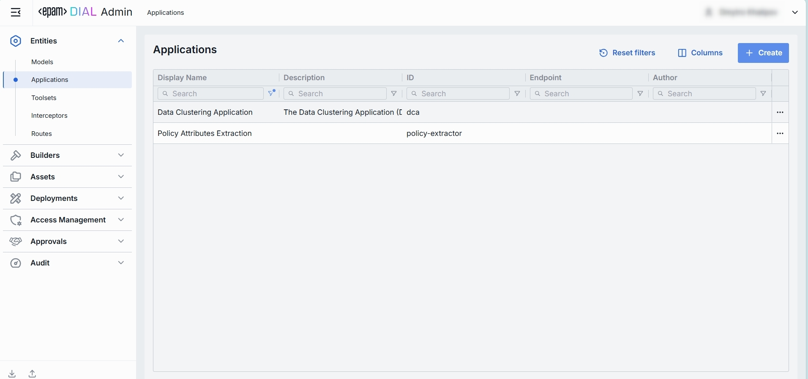
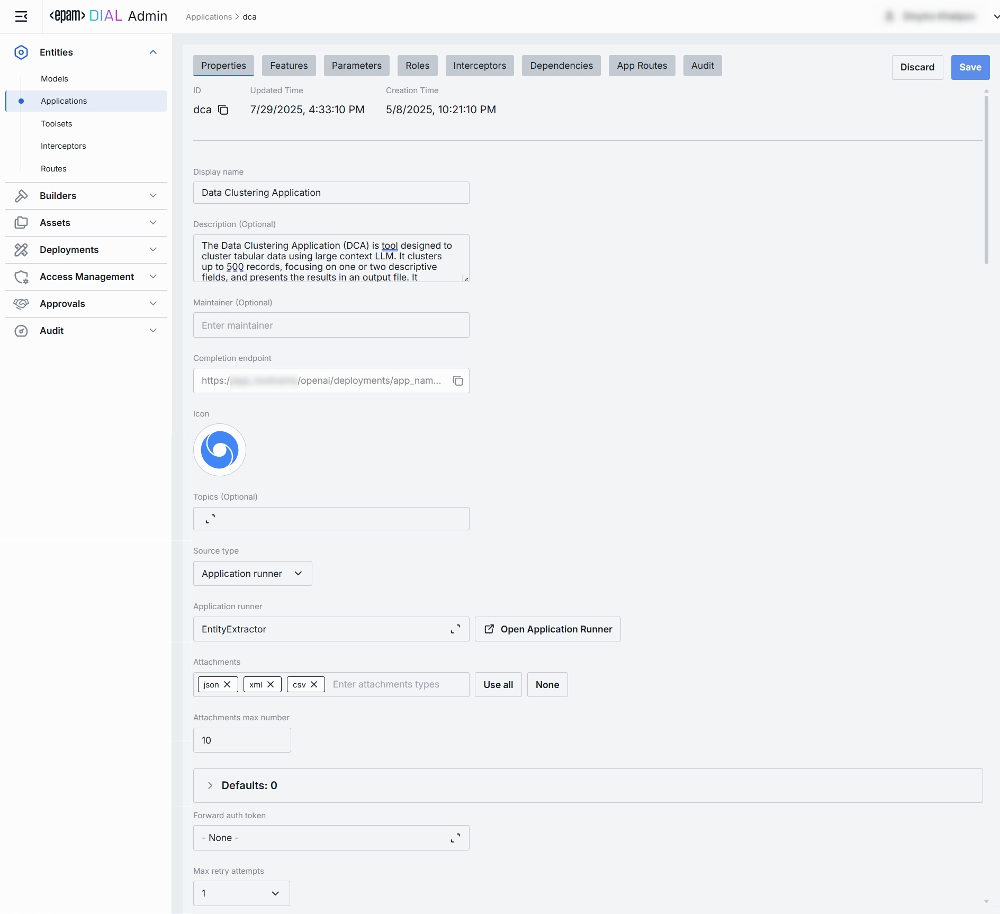
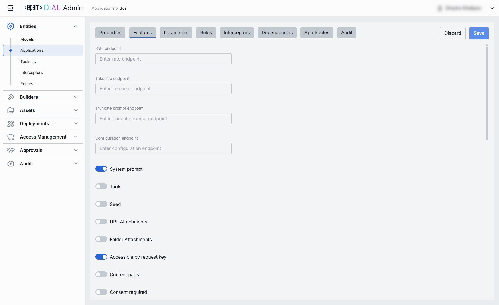
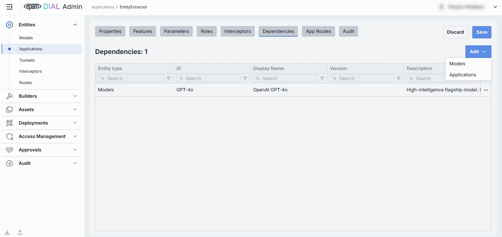
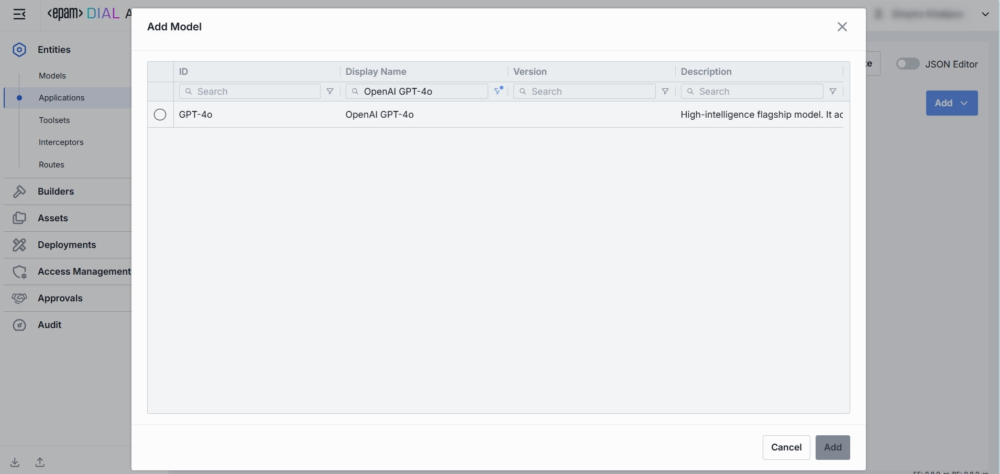
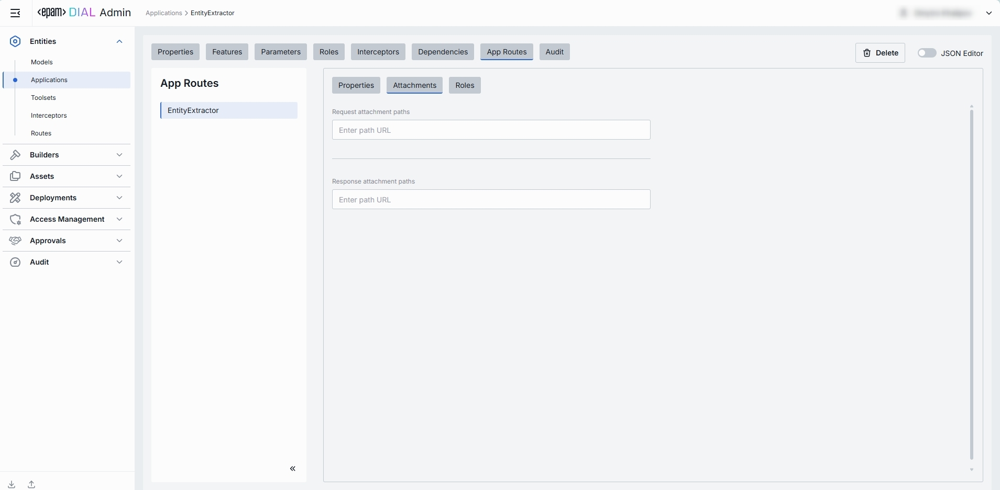
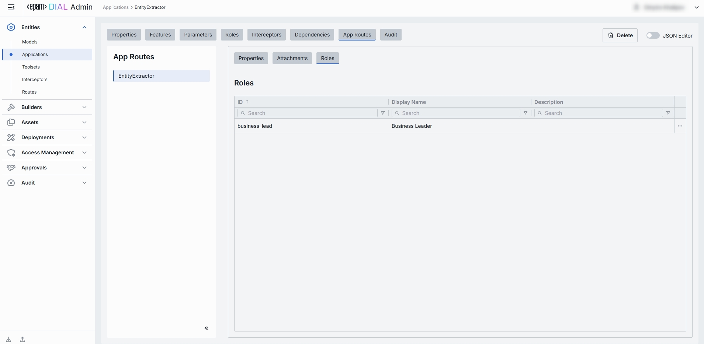
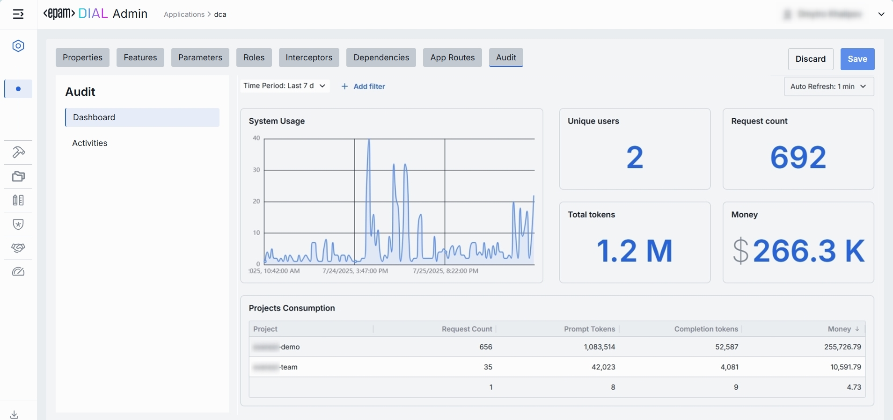
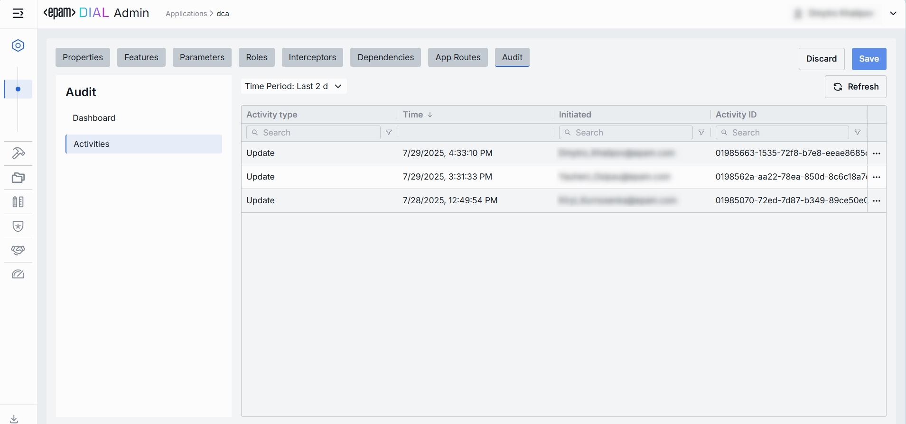
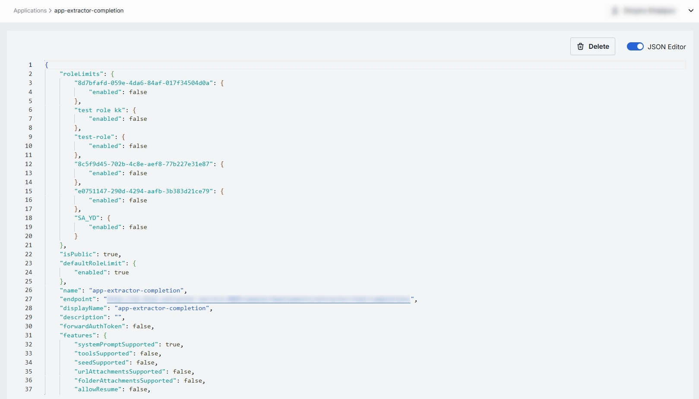

# Applications

## About Applications

> Refer to [DIAL-Native Applications](/docs/platform/3.core/7.apps.md) to learn about applications in DIAL.

## Applications Main Screen

In Applications, you can see, create and manage applications deployed in your instance of DIAL.

##### Applications grid

> **TIP**: Use the **Columns** selector to customize which columns are visible in the grid and their order.

| Field                     | Definition    |
|---------------------------|--------------------------------------------|
| **Display Name**          | A user-friendly name of the application (e.g. "Data Clustering Application").  |
| **Description**           | A brief free-text summary describing the application (e.g. "Clusters incoming text into semantic groups"). |
| **ID**                    | A unique identifier used in the DIAL [dynamic settings](https://github.com/epam/ai-dial-core/blob/development/docs/dynamic-settings/applications.md) (e.g. dca, support-bot). This is the path segment of the Application’s HTTP endpoint.          |
| **Endpoint**              | Full URL where the application is exposed.                                     |
| **Author**                | Contains information about the application's author.                                       |
| **Topics**                | Tags or categories (e.g. "finance," "support," "image-capable") you can assign for discovery, filtering, or grouping in large deployments. Helps end users and admins find the right application by the use case.                |
| **Attachment types**      | Controls which types of attachments this application can accept according to [MIME types](https://developer.mozilla.org/en-US/docs/Web/HTTP/Guides/MIME_types/Common_types).                           |
| **Max attachment number** | Maximum number of attachments allowed in a single request.                      |
| **Forward auth token**    | This parameter allow you to determine whether the Auth Token should be forwarded from the caller's session to the upstream API call. This enables multi-tenant scenarios or pass-through authentication for downstream services. |

## Create Application

On the main screen you can add new application deployments.

> Refer to [Enable App](/docs/tutorials/1.developers/4.apps-development/3.enable-app.md) to learn more about enabling applications in DIAL.

1. Click **+ Create** to invoke the **Create Application** modal.
2. Define application's parameters

    | Field                    | Required      | Definition & Guidance                                                          |
    |--------------------------|---------------|--------------------------------------------|
    | **ID**                   | Yes           | A unique identifier under the `applications` section of DIAL Core’s [dynamic settings](https://github.com/epam/ai-dial-core?tab=readme-ov-file#dynamic-settings) (e.g. support-bot, data-cluster).                               |
    | **Display Name**         | Yes           | A user-friendly label (e.g. "Customer Support Bot") shown throughout the Admin UI.                         |
    | **Source Type**          | Yes           | Can be one of the following options: Endpoints, Application Runner.            |
    | **Endpoint**             | Conditional   | Required if Source Type is 'Endpoints'. The application’s completion endpoint. |
    | **Application Runner**   | Conditional   | Required if Source Type is 'Application Runner'. [Application type schema](/docs/platform/3.core/7.apps.md#schema-rich-applications) as defined in [Application Runners](/docs/tutorials/3.admin/builders-application-runners.md). |
    | **Description**          | No            | A free-text summary describing the application (e.g. supported inputs, business purpose).                  |

3. Once all required fields are filled click **Create**. The dialog closes and the new [application configuration](#application-configuration) screen is opened. This entry will appear immediately in the listing once created. It may take some time for the changes to take effect after saving.

    

## Application Configuration

Click any application on the main screen to open the configuration section.

### Properties

In the Properties tab, you can define the application's identity, routing, UI metadata, and other basic runtime controls. 

Once configured, your application is ready to orchestrate models and interceptors behind a single HTTP endpoint.

| Field                      | Required    | Description                                                                    |
|----------------------------|-------------|------------------------------------------------------------------------------------------------------------------------------------------|
| **ID**                     | Yes         | A unique key under `applications` in DIAL Core’s [dynamic settings](https://github.com/epam/ai-dial-core?tab=readme-ov-file#dynamic-settings) (e.g. data-clustering, support-bot).                                                                                                                |
| **Updated Time**           | -           | Date and time when the app's configuration was last updated.                   |
| **Creation Time**          | -           | Date and time when the app's configuration was created.                        |
| **Display Name**           | Yes         | A user-friendly label shown on the UI (e.g. "Data Clustering Application"). Helps end user to identify and select applications.                 |
| **Application Runner**     | No          | Application type schema. Defined in [Application Runners](/docs/tutorials/3.admin/builders-application-runners.md).                             |
| **Description**            | No          | A free-text summary describing the application (e.g. tooling, supported inputs/outputs, SLAs).                                                  |
| **Maintainer**             | No          | Field used to specify the responsible person or team overseeing the app’s configuration.                                                        |
| **Icon**                   | No          | A logo to visually distinguish the app on the UI.                              |
| **Topics**                 | No          | Tags that you can assign to apps (e.g. "finance", "support"). Helps to split apps into categories for better navigation on UI.                  |
| **Source Type**            | Yes         | Can be one of the following options: Endpoints, Application Runner.            |
| **Application Runner**     | Conditional | Required if Source Type is 'Application Runner'. [Application type schema](/docs/platform/3.core/7.apps.md#schema-rich-applications). Defined in [Application Runners](/docs/tutorials/3.admin/builders-application-runners.md).                                                                  |
| **Completion Endpoint**    | Conditional | URL where the app is exposed. Clients use this to integrate. Auto-populated if Source is Application Runner and endpoint is specified in respective runner. **Required** if Source is Endpoints.                                                                                                  |
| **Viewer URL**             | Optional    | Optional, needed only if Source Type is 'Endpoints'. An optional field with a URL of the application's custom UI. A custom UI, if enabled, will override the standard DIAL Chat UI.                                                                                                               |
| **Editor URL**             | Optional    | Optional, needed only if Source Type is 'Endpoints'. An optional field with a URL of the application's custom builder UI. Application builder allows end-users to create instances of apps using a [UI wizard](/docs/tutorials/0.user-guide.md#application-builder).                              |
| **Attachments**            | No          | An option you can use to define the [attachment types](/docs/tutorials/1.developers/3.chat/0.chat-objects.md#attachments) (images, files) this app can have:   **Available values**:  **None** – attachments are not allowed.    **All** – unrestricted types. Optionally specify max number of attachments.   **Custom** – enter specific [MIME types](https://developer.mozilla.org/en-US/docs/Web/HTTP/Basics_of_HTTP/MIME_types/Common_types). Optionally specify max number of attachments. |
| **Attachments Max Number** | No          | Maximum number of input attachments.                                           |
| **Forward auth token**     | No          | Select a downstream auth token to forward from the user’s session (for multi-tenant downstream).                                                |
| **Max retry attempts**     | No          | Number of times DIAL Core will [retry](/docs/platform/3.core/5.load-balancer.md#fallbacks) a failed run (due to timeouts or 5xx errors).        |
 
### Features

In the Features tab, you can control optional capabilities of applications. 

##### The difference between model and application features

While [Model feature flags](/docs/tutorials/3.admin/entities-models.md#feature-flags-toggles) govern what each LLM integration can do, Application feature flags define which of those capabilities your orchestrated service exposes to clients. Also, you can plug in custom preprocessing endpoints.

**Scope**

* **Model features** apply *per LLM*, controlling what the model endpoint itself supports (e.g. whether GPT-4 can accept system prompts or function calls).
* **Application features** apply *per orchestrated service*, governing what your composed workflow will accept and pass through—regardless of which models are called under the hood.

**Override Capability**

* At the **application** level, you can disable a feature globally (even if models support it) or plug in custom endpoints that apply *above* all models.
* At the **model** level, toggles only reflect the true capabilities of that specific LLM integration.

**Use Cases**

* **Model** toggles ensure you don’t accidentally send unsupported parameters to a given model.
* **Application** toggles let you present a consistent API to your clients (e.g. always accept `temperature` or never allow attachments), even if different underlying models behave differently.

#### Endpoints

You can override or extend DIAL Core’s built-in protocol calls with your own HTTP services. Here, you can specify endpoints used by [Application Runners](/docs/tutorials/3.admin/builders-application-runners.md) (e.g. a Python or Node Runner) to perform preprocessing or policy checks before delegating to your underlying models and workflows.

| Field                        | Description & When to Use                           |
|------------------------------|--------------------------|
| **Rate endpoint**            | A URL to call a custom rate-estimation API. Use this to compute cost or quota usage based on your own logic (e.g. grouping by tenant, complex billing rules).             |
| **Tokenize endpoint**        | A URL to call a custom tokenization service. When you need precise, app-wide token counting (for mixed-model or multi-step prompts) that the model adapter can’t provide. |
| **Truncate prompt endpoint** | A URL to call your own prompt-truncation API. Handy if you implement advanced context-window management (e.g. dynamic summarization) before the actual application call.  |
| **Configuration endpoint**   | A URL to fetch dynamic app-specific settings (e.g. per-tenant max tokens, allowed parameters). Use this to drive runtime overrides from a remote config store.            |

#### Feature Flags (Toggles)

Enable or disable per-request options that your application accepts from clients and forwards to the underlying models. **Toggle On/Off** any feature as needed.

> **Note**: Changes take effect immediately after saving.

| Toggle                        | What It Does|
|-------------------------------|------------|
| **System prompt**             | Enables an initial "system" message injection. Useful for orchestrating multi-step agents where you need to enforce a global policy at the application level. |
| **Tools**                     | Enables `tools`/`functions` payloads in API calls. Switch on if your application makes external function calls (e.g. calendar lookup, database fetch).        |
| **Seed**                      | Enables the `seed` parameter for reproducible results. Great for testing or deterministic pipelines.  Disable to ensure randomized creativity.                |
| **URL Attachments**           | Enables URL references (images, docs) as attachments in API requests. Must be enabled if your workflow downloads or processes remote assets via URLs.         |
| **Folder Attachments**        | Enables attachments of folders (batching multiple files).                                                                                                     |
| **Accessible by request key** | Indicates whether the deployment is accessible using a [per-request API key](/docs/platform/3.core/3.per-request-keys.md).                                    |
| **Content parts**             | Indicates whether the deployment supports requests with content parts or not.                                                                                 |
| **Consent required**          | indicates whether the application requires user consent before use.                                                                                           |

### Parameters
The Parameters tab within an application’s configuration allows administrators to manage application-specific parameters that influence its behavior:
* Displays a list of key–value pairs defined for the selected application.
* Parameters can be used to pass custom configurations or flags.
* Parameters values are controlled by the admin.

For example, in a data extraction application, admins can use this tab to:
1. Manage specific fields that need to be extracted.
2. Link prompt templates from the Assets → Prompts Library to each field.

### Roles

In the Roles tab, you can create and manage roles defined in the [Access Management](/docs/tutorials/3.admin/access-management-roles.md) section. Here, you can define user groups that can use specific applications and define rate limits for them.

**Important**: if roles are not specified for a specific application, it will be available to all users

> Refer to [Access & Cost Control](/docs/platform/3.core/2.access-control-intro.md) to learn more about roles and rate limits in DIAL.

##### Roles grid

| Column                | Description & Guidance        |
|-----------------------|------------------------------------------------------------------------------------------------------------------------|
| **Name**              | A unique role identifier.       |
| **Description**       | A user-friendly description of the role (e.g., "Admin, Prompt Engineer, Developer"). |
| **Tokens per minute** | Per Minute tokens limit for a specific role. Blank = no limits.  Inherits the [default value](#default-rate-limits).  Can be overridden.       |
| **Tokens per day**    | Daily tokens limit for a specific role. Blank = no limits.  Inherits the [default value](#default-rate-limits).  Can be overridden.        |
| **Tokens per week**   | Weekly tokens limit for a specific role. Blank = no limits.  Inherits the [default value](#default-rate-limits).  Can be overridden.       |
| **Tokens per month**  | Monthly tokens limit for a specific role. Blank = no limits.  Inherits the [default value](#default-rate-limits).  Can be overridden.      |
| **Expiration time**   | The maximum number of users who can accept a shared resource.    |
| **Max users**         | TTL (Time To Live) of the invitation link to a shared resource.  |
| **Actions**     | Additional role-specific actions.   Open [Roles](/docs/tutorials/3.admin/access-management-roles.md) section in a new tab.   Make all restrictions unlimited for the given role |

#### Set Rate Limits

The grid on the Roles screen lists roles that can access a specific application. Here, you can also set individual limits for selected roles. For example, you can give "Admin" role unlimited monthly tokens but throttle "Developer" to 100,000 tokens/day or allow the "External Partner" role a small trial quota (e.g., 10,000 tokens/month) before upgrade.

**To set or change rate limits for a role:**

1. **Click** in the desired cell (e.g., **Tokens per day** for the "ADMIN").
2. **Enter** a numeric limit or leave blank to set no limits. Click **Reset to default limits** to restore default settings for all roles.
3. Click **Save** to apply changes.

#### Default Rate Limits

Default rate limits are set for all roles in the **Roles** grid by default; however you can override them for any role.

| Field                         | Description                                                                             |
|-------------------------------|-----------------------------------------------------------------------------------------|
| **Default tokens per minute** | The maximum tokens any user can consume per minute unless a specific limit is in place. |
| **Default tokens per day**    | The maximum tokens any user can consume per day unless a specific limit is in place.    |
| **Default tokens per week**   | The maximum tokens any user can consume per week unless a specific limit is in place.   |
| **Default tokens per month**  | The maximum tokens any user may consume per month unless a specific limit is in place.  |
| **Expiration time**           | The default maximum number of users who can accept a shared resource.                   |
| **Max users**                 | The default TTL (Time To Live) of the invitation link to a shared resource.             |

#### Role-Specific Access

Use **Make available to specific roles** toggle to define access to the application:

* **Off**: Application is callable by any authenticated user. All existing user roles are in the grid.
* **On**: Application is restricted - only the roles you explicitly add to the grid can invoke it.

#### Add

You can add a role only if **Make available to specific roles** toggle is **On**.

1. Click **+ Add** (top-right of the Roles Grid).
2. **Select** one or more roles in the modal. The list or roles is defined in the [Access Management](/docs/tutorials/3.admin/access-management-roles.md) section.
3. **Confirm** to add role(s) to the table.

#### Remove

You can remove a role only if **Make available to specific roles** toggle is **On**.

1. Click the **actions** menu in the role's line.
2. Choose **Remove** in the menu.

### Interceptors

DIAL uses Interceptors to add custom logic to in/out requests for models and apps, enabling PII obfuscation, guardrails, safety checks, and beyond. 

You can define Interceptors in the [Entities → Interceptors](/docs/tutorials/3.admin/entities-interceptors.md) section to add them to the processing pipeline of DIAL Core.

> Refer to [Interceptors](/docs/platform/3.core/6.interceptors.md) to learn more.

##### The difference between model and application interceptors

**Scope of Invocation**

* **Model**: Interceptors are triggered with each request to a model (i.e. before/after the LLM invocation).
* **Application**: Interceptors wrap the entire orchestrated workflow, including multi-model sequences and branching logic.

**Use Cases**

* **Model**: Ideal for prompt "pre-processing" or response transformations that are specific for each LLM.
* **Application**: Manage cross-cutting concerns across the whole application (e.g., tenant-based routing, unified logging, end-to-end policy enforcement).

##### Interceptors Grid

| Column            | Description  |
| ----------------- |-------------|
| **Order**         | Execution sequence. Interceptors run in ascending order (1 → 2 → 3...). A request will flow through each interceptor’s in this order.Response interceptors are invoked in the reversed order.      |
| **Name**          | The interceptor’s alias, matching the **Name** field in its definition.      |
| **Description**   | Free-text summary from the interceptor’s definition, explaining its purpose. |
| **Actions** | Additional role-specific actions.   Open interceptor in a new tab.   [Remove](#remove-1) the selected interceptor from the model's configuration. |

#### Add

1. Click **+ Add** (in the upper-right of the interceptors grid).
2. In the **Add Interceptors** modal, choose one or more from the grid of [defined interceptors](/docs/tutorials/3.admin/entities-interceptors.md).
3. **Apply** to append them to the bottom of the list (are added in the same order as selected in the modal).

> **TIP**: If you need a new interceptor, first create it under [Entities → Interceptors](/docs/tutorials/3.admin/entities-interceptors.md) and then revisit this tab to attach it to the application's configuration.

#### Reorder

1. **Drag & Drop** the handle (⋮⋮⋮⋮) to reassign the order in which interceptors are triggered.
2. Release to reposition; order renumbers automatically.
3. **Save** to lock-in the new execution sequence.

#### Remove

1. Click the actions menu in the interceptor's row.
2. Choose **Remove** to detach it from this application.
3. **Save** to lock-in the interceptors list

### Dependencies
This tab lists other entities Models or Applications that the current Application depends on. Administrators can manually add new dependencies (by selecting from available Models and Applications) or remove the existing ones.

| Column           | Description                                                                                |
|------------------|--------------------------------------------------------------------------------------------|
| **Entity Type**  | Indication whether dependent object is an Application or a Model.                          |
| **ID**           | Identifier of the respective model or application.                                         |
| **Display Name** | Descriptive name of the dependent model or application.                                    |
| **Version**      | Version of the dependent model.                                                            |
| **Description**  | Additional textual details about the dependent model or application.                       |
| **Actions**      | Allows to open the dependent object in new tab or remove it from the list of dependencies. |

#### Add

1. Click **+ Add** (in the upper-right of the dependencies grid).
2. Select the type of object to add: Application or Model.
3. In the modal window, choose model or application existing in DIAL from the grid.
4. **Add** to append them to the dependencies grid.

### App Routes

App Routes tab is introduced to manage application-specific routes. The tab includes a left-hand pane listing all app-related routes. 
If the application is created based on a specific application runner, tab allows only viewing routes inherited from the app runner. 
Otherwise, it allows creating, viewing, editing, and deleting routes.

#### Properties

Properties sub-tab allows to configure route identity and requests handling behavior.

> Configuration of this tab is similar to routes. See [Routes documentation](/docs/tutorials/3.admin/entities-routes.md) for more information. 

#### Attachments

Attachments sub-tab enables to configure attachment paths for both requests and responses.

#### Roles

Sub-tab enables route-specific role assignments, allowing administrators to control access to each individual route.

> Configuration of this tab is similar to routes. See [Routes documentation](/docs/tutorials/3.admin/entities-routes.md) for more information. 

### Audit

#### Dashboard

In the **Dashboard** tab, you can see real-time and historical metrics for the application. You can use it to monitor usage patterns, enforce SLAs, optimize costs, and troubleshoot anomalies.

##### Top Bar Controls

| Control                | What It Does          |
| ---------------------- |----------------------------------------------------------------------------------------------|
| **Time Period**        | Use to select the date range for all charts and tables (e.g. last 15 min, 2 days, 7 days, 30 days). |
| **+ Add filter**       | Use to drill into specific subsets by adding filters on Projects.          |
| **Auto refresh**       | Set the dashboard to poll for new data (e.g. every 1 min) or turn off auto-refresh.          |

##### System Usage Chart

A time-series line chart of request throughput over time. You can use it to monitor traffic peaks and valleys, correlate spikes with deployments or feature roll outs.

##### Key Metrics

Four high-level metrics are displayed alongside the chart. All calculated for the user-selected period.

You can use them to:

* Chargeback to internal teams or external customers by "Money".
* Track adoption via "Unique Users".
* Monitor burst traffic with "Request Count".
* Watch token consumption to anticipate quota exhaustion.

| Metric            | Definition|
|-------------------|---------------------------|
| **Unique Users**  | Count of distinct user IDs or API keys that have called this application. |
| **Request Count** | Total number of chat or embedding calls routed to this application.       |
| **Total Tokens**  | Sum of `prompt + completion` tokens consumed by this application.           |
| **Money**         | Estimated spending on this application.   |

##### Projects Consumption Table

This table shows the KPIs breakdown by **Project**. You can use it to compare consumption across multiple projects.

| Column                | Description |
|-----------------------|-----------------------------------------------------------|
| **Project**           | The entity utilizing this application.   |
| **Request Count**     | Number of calls directed to the application.                      |
| **Prompt tokens**     | Total tokens submitted in the prompt portion of requests. |
| **Completion tokens** | Total tokens returned by the application as responses.            |
| **Money**             | Estimated cost.                  |

#### Traces

> **TIP**: You can monitor the entire system's traces in [Usage Log](/docs/tutorials/3.admin/telemetry-usage-log.md).

In this tab, you can see individual traces, each representing a single end-to-end interaction of a DIAL entity with the selected application.

| Column                     | Definition                                                                                   |
|----------------------------|----------------------------------------------------------------------------------------------|
| Completion Time            | Timestamp when the trace finished processing (end-to-end interaction).                       |
| Trace ID                   | Unique identifier of the trace (one end-to-end interaction).                                 |
| Topic                      | Auto-generated subject/title summarizing the trace.                                          |
| Reactions                  | Indication of user reactions presence (like/dislike) for the trace.                          |
| Cached prompt tokens       | Number of prompt tokens served from cache (prompt-caching).                                  |
| Prompt tokens              | Number of tokens in the prompt sent to the model for this trace.                             |
| Completion tokens          | Number of tokens generated by the model as output for this trace.                            |
| Deployment price           | Cost attributed to the selected deployment for this trace.                                   |
| Total price                | Total cost of the trace.                                                                     |
| Number of request messages | Number of discrete request messages that were included in the trace.                         |
| Deployment ID              | Identifier of the DIAL deployment used to serve this trace.                                  |
| Parent Deployment ID       | Identifier of the parent deployment (e.g., application that was using the underlying model). |
| Model                      | Identifier of the underlying model used to carry out the trace.                              |
| Project                    | Project to which this trace associated in DIAL.                                              |
| Upstream                   | The upstream endpoint (e.g., completions endpoint of the model).                             |
| Execution path             | The execution path of the trace.                                                             |
| User                       | Identifier of the end user who initiated the trace.                                          |
| User title                 | The name of the user (if available).                                                         |
| Language                   | Language detected in the trace (e.g., `en`).                                                 |
| Duration                   | Total end-to-end duration of the trace from first request to completion.                     |
| Response ID                | Identifier of the response object returned by the model for this trace.                      |
| Conversation ID            | Identifier of the conversation/session this trace belongs to.                                |
| Code span ID               | Identifier of a specific code execution span associated with the trace (if any).             |
| Code span parent ID        | Identifier of the parent span for a code execution span (if any).                            |

#### Conversations

> **TIP**: You can monitor all usage sessions in [Usage Log](/docs/tutorials/3.admin/telemetry-usage-log.md).

In Conversations, you can see individual traces grouped into end‑to‑end conversation sessions.

| Column                     | Definition                                                                                     |
|----------------------------|------------------------------------------------------------------------------------------------|
| Last activity              | Timestamp of the most recent trace within the conversation.                                    |
| Conversation ID            | Unique identifier of the user session that groups related traces.                              |
| Topic                      | Auto-generated subject summarizing the conversation.                                           |
| Cached prompt tokens       | Count of prompt tokens served from cache across the conversation.                              |
| Prompt tokens              | Total number of request/prompt tokens sent to the model across all traces in the conversation. |
| Completion tokens          | Total number of tokens generated by the model across all traces in the conversation.           |
| Total price                | Aggregated cost for the conversation.                                                          |
| Number of request messages | Total number of discrete request messages included in the conversation.                        |
| Deployment ID              | Identifier of the deployment associated with the conversation.                                 |
| Project                    | Project to which the conversation associated in DIAL.                                          |
| User                       | Identifier of the end user who initiated the conversation.                                     |
| User title                 | Name of the user (if available).                                                               |
| Language                   | Detected language for the conversation (e.g., `en`).                                           |

#### Activities

The Activities section under the Audit tab of a specific application provides detailed visibility into all changes made to that app.

This section mimics the functionality available in the global [Audit → Activities](/docs/tutorials/3.admin/telemetry-activity-audit.md) menu, but is scoped specifically to the selected app.

##### Activities List Table

| **Field**         | **Definition**                                                               |
| ----------------- |------------------------------------------------------------------------------|
| **Activity type** | The type of action performed on the app (e.g., Create, Update, Delete).      |
| **Time**          | Timestamp indicating when the activity occurred.                             |
| **Initiated**     | Email address of the user who performed the activity.                        |
| **Activity ID**   | A unique identifier for the logged activity, used for tracking and auditing. |
|**Actions**|Available actions: - **View details**: Click to open a new screen with activity details. Refer to [Activity Details](#activity-details) to learn more. - **Resource rollback**: click to restore a previous version. Refer to [Resource Rollback](#resource-rollback) for details.  |

##### Activity Details

The Activity Details view provides a detailed snapshot of a specific change made to an app.

To open Activity Details, click on the three-dot menu (⋮) at the end of a row in the Activities grid and select “View Details”.

| **Element/Section** | **Description**                   |
|---------------------|---------------------------------------------------------------------------------------------------------------------------------------------------------|
| **Activity type**   | Type of the change performed (e.g., Update, Create, Delete).                                                                                            |
| **Time**            | Timestamp of the change.          |
| **Initiated**       | Identifier of the user who made the change.                                                                                                             |
| **Activity ID**     | Unique identifier for the specific activity tracking.                                                                                                   |
| **Comparison**      | Dropdown to switch between showing all parameter or changed only.|
| **View**            | Dropdown to switch for selection between Before/After and Before/Current state.|
| **Parameters Diff** | Side-by-side comparison of app fields values before and after the change. Color-coding is used to indicate the operation type (Update, Create, Delete). |

##### Resource Rollback

Use Resource Rollback to restore the previous version of the selected activity. A rollback leads to generation of a new entry on the audit activity screen.

### JSON Editor

Use the**JSON Editor** toggle to switch between the form-based UI and raw JSON view of the application’s configuration. It is useful for advanced scenarios of bulk updates, copy/paste between environments, or tweaking settings not exposed in the form UI—you can switch to the **JSON Editor** in any interceptor configuration page.

##### Switching to the JSON Editor

1. Navigate to **Entities → Applications**, then select the application you want to edit.
2. Click the **JSON Editor** toggle (top-right). The UI reveals the raw JSON.

> **TIP**: You can switch between UI and JSON only if there are no unsaved changes.

### Delete

Use the **Delete** button in the Configuration screen toolbar to permanently remove the selected application.

