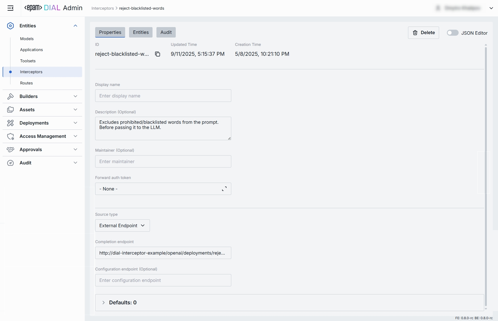
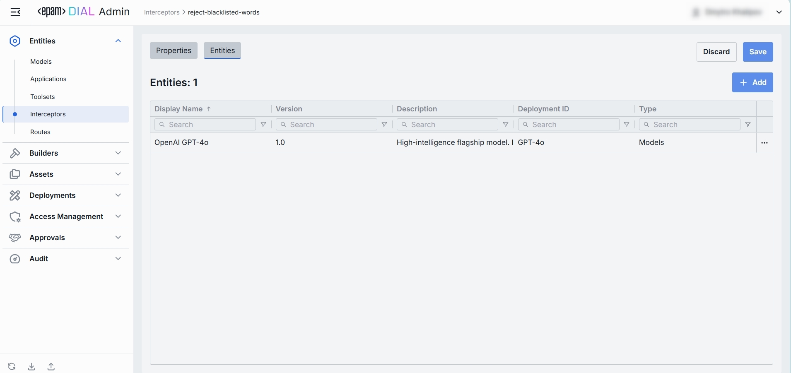

# Interceptors

## Introduction

DIAL Interceptor is a pluggable component with the primary goal to implement Responsible AI approach and enforce compliance with organization and external policies and standards (biased answers, data leaks etc.). 

Interceptors provide an ability to delegate content analysis to third-party systems or dedicated models used within an organization or have any other custom implementation in it.

Selected use cases:

* Prevent harmful request from reaching the model
* Prevent harmful reply from reaching the user 
* Modify the request/response, introduce disclaimers 
* DLP (Data Loss Prevention) 
* Smart information collection
* Implement caching strategies
* Application of watermarks

[DIAL Interceptors Python SDK](https://github.com/epam/ai-dial-interceptors-sdk) makes development of new interceptors easier and enables integration with external systems like Google Model Armor, MS Presidio and more.

In DIAL, you can create and use templates to add interceptors, create interceptors based on images deployed in DIAL or third-party systems.

You can configure global interceptors that apply on a system level in [System Properties](/docs/tutorials/3.admin/home.md#system-properties) and local interceptors that are triggered for specific [model](/docs/tutorials/3.admin/entities-models.md#interceptors) or [application](/docs/tutorials/3.admin/entities-applications.md#interceptors) deployments or apps created based on [application runners](/docs/tutorials/3.admin/builders-application-runners.md#interceptors). 

Interceptors can be added via a direct configuration of [DIAL Core](https://github.com/epam/ai-dial-core/blob/development/docs/dynamic-settings/interceptors.md) or via DIAL Admin, as described in this section.

> * Refer to [Interceptors](/docs/platform/3.core/6.interceptors.md) to learn more.
> * Refer to [DIAL Interceptors Python SDK](https://github.com/epam/ai-dial-interceptors-sdk) for a comprehensive information, configuration and implementation examples.

## Main Screen

On the main screen, you can access all the available interceptors, manage and add interceptors to your DIAL environment.

##### Interceptors grid

| Field | Description |
|-------|-------------|
| **Display Name** | Name of the interceptor displayed on UI (e.g. "PII Information Remover"). |
| **Description** | Brief summary of what this interceptor does and any parameters it uses (e.g. BLACKLIST={"foo","bar"} or Logs request/response payloads). |
| **ID** | Unique identifier for the interceptor (e.g. reject-blacklisted-words, audit-logger). This key is used when you attach it to a Model or Application. |
| **Source Type** | Source type of the interceptor: - [Interceptor Template](/docs/tutorials/3.admin/builders-interceptor-templates.md): Interceptor is based on a template. - [Interceptor deployment](/docs/tutorials/3.admin/deployments-interceptors.md): Interceptor is based on a deployed interceptor image. - External Endpoint: Interceptor is based on an external HTTP endpoint. |
| **Source** | Identifier of the interceptor source: Interceptor's Template, Interceptor Container Id or Completion Endpoint URL, depending on the choice of the Source Type. |
| **Author** | Information about the interceptor's author. |
| **Updated time** | Date and time when the interceptor's configuration was last updated. |
| **Status** | The current status of the interceptor. - **local**: Apply to selected deployments. - [global](/docs/tutorials/3.admin/home.md#system-properties): Apply to all deployments. |
 **Topics** | Tags that associate an interceptor with one or more topics or categories (e.g. "compliance", "logging"). |

## Create

Follow these steps to add a new definition of an interceptor:

1. Click **+ Create** to invoke the **Create Interceptor** modal.
2. Define interceptor's parameters:

    | Column | Required | Description |
    |--------|----------|-------------|
    | **ID** | Yes | Unique identifier for the interceptor (e.g. reject-blacklisted-words, audit-logger). This key is used when you attach it to a Model or Application. |
    | **Display Name** | Yes | Name of the interceptor (e.g. "PII Information Remover") displayed on UI. |
    | **Description** | No | Brief summary of what this interceptor does and any parameters it uses (e.g. BLACKLIST={"foo","bar"} or Logs request/response payloads). |
    | **Source Type** | Yes | Source type of the interceptor: - [Interceptor Template](/docs/tutorials/3.admin/builders-interceptor-templates.md): Interceptor is based on a template. - [Interceptor deployment](/docs/tutorials/3.admin/deployments-interceptors.md): Interceptor is based on a deployed interceptor image. - External Endpoint: Interceptor is based on an external HTTP endpoint. |
    | **Interceptor template** | Conditional | Interceptor's Template Id. Applies for the Interceptor Template source type. |
    | **Container** | Conditional | Interceptor's [Container Id](/docs/tutorials/3.admin/deployments-interceptors.md). Applies for the Interceptor Container source type. |
    | **Completion endpoint** | Conditional | URL of the chat completion endpoint. Applies for the External Endpoint source type. |

3. Once all required fields are filled, click **Create**. The dialog closes and the new interceptor [configuration screen](#configuration) is opened. Once added, a new entry appears in the **Interceptors** listing. It may take some time for the changes to take effect after saving.

    

## Configuration

Click any interceptor on the main screen to open its configuration details.

### Properties

In the Properties tab, you can define metadata and execution endpoints for Interceptors.

| Field | Required | Editable | Description |
|-------|----------|----------|-------------|
| **ID** | - | No | Unique key under `interceptors` in DIAL Core's [dynamic settings](https://github.com/epam/ai-dial-core?tab=readme-ov-file#dynamic-settings) (e.g. data-clustering, support-bot). |
| **Updated Time** | - | No | Date and time when the interceptor's configuration was last updated. |
| **Creation Time** | - | No | Date and time when the interceptor's configuration was created. |
| **Status** | - | No | Current status of the interceptor: - **local**: configured and applied to a specific instance of a deployment. - [global](/docs/tutorials/3.admin/home.md#system-properties): apply to any deployment in DIAL and tend to have the most strict rules, because they receive original input first and examine the response last. |
| **Sync with core** | - | No | Indicates the state of the entity's configuration synchronization between Admin and DIAL Core. Synchronization occurs automatically every 2 mins (configurable via `CONFIG_AUTO_RELOAD_SCHEDULE_DELAY_MILLISECONDS`). **Important**: Sync state is not available for sensitive information (API keys/tokens/auth settings). - **Synced**: Entity's states are identical in Admin and in Core for valid entities or entity is missing in Core for invalid entities. - **In progress...**:  If Synced conditions are not met and changes were applied within last 2 mins (this period is configurable via `CONFIG_EXPORT_SYNC_DURATION_THRESHOLD_MS`). - **Out of sync**: If Synced conditions are not met and changes were applied more than 2 mins ago (this period is configurable via `CONFIG_EXPORT_SYNC_DURATION_THRESHOLD_MS`). - **Unavailable**: Displayed when it is not possible to determine the entity's state in Core. This occurs if: - The config was not received from Core for any reason. - The configuration of entities in Core is not entirely compatible with the one in the Admin service. |
| **Display Name** | Yes | Yes | Name of the interceptor displayed on IU (e.g. "PII Information Remover"). |
| **Description** | No | Yes | Description of the interceptor (e.g. `BLACKLIST={"foo","bar"}`). Helps to identify the interceptor and its purpose. |
| **Maintainer** | No | Yes | Identification of a responsible person or a team overseeing the interceptor and its configuration. |
| **Forward Auth Token** | Yes | Yes | This parameter allows to determine whether to forward an Auth Token to your interceptor's endpoint. Use this when your interceptor service requires its own authentication. If enabled, HTTP header with authorization token are forwarded to chat completion endpoint of the interceptor. |
| **Source Type** | Yes | Yes | Source type of the interceptor: - [Interceptor Template](/docs/tutorials/3.admin/builders-interceptor-templates.md): Interceptor is based on a template. - [Interceptor deployment](/docs/tutorials/3.admin/deployments-interceptors.md): Interceptor is based on a deployed interceptor image. - External Endpoint: Interceptor is based on an external HTTP endpoint. |
| **Completion Endpoint** | Conditional | Yes | URL of the chat completion endpoint. Applies for the External Endpoint source type. |
| **Configuration Endpoint** | Conditional | Yes | The URL that exposes the configuration of the interceptor. This endpoint returns JSON schema with configuration parameters that are rendered in the [Parameter Scheme tab](#parameter-scheme). Applies for the External Endpoint source type. |
| **Interceptor template** | Conditional | Yes | Interceptor's template Id. Applies for the Interceptor Template source type. |
| **Container** | Conditional | Yes | Interceptor's Container Id. Applies for the Interceptor deployment source type. |
| **Defaults** | No | Yes | The interceptor configuration could be preset on the per-interceptor basis via the `defaults` field. Default parameters are applied if a request doesn't contain them in OpenAI chat/completions API call. Refer to [Interceptors SDK](https://github.com/epam/ai-dial-interceptors-sdk/blob/development/README.md#interceptor-configuration) to learn more. |

### Parameter Scheme

In this tab, you can define additional configuration parameters for the interceptor. The parameters displayed in this section are defined by the JSON schema returned by the interceptor's configuration endpoint specified in the [Properties tab](#properties) when the source type External Endpoint is selected. If a valid endpoint is specified, the content on this screen is rendered automatically based on the JSON schema returned by that endpoint. Rendered parameters are pre-populated with their default values. In case the invalid configuration endpoint is provided, "No Configuration Scheme" state is shown instead.

### Entities

In the Entities tab, you can see Models and Applications this interceptor is currently associated with.

> **TIP**: You can also define this mapping on the [Models](/docs/tutorials/3.admin/entities-models.md#interceptors) and [Applications](/docs/tutorials/3.admin/entities-applications.md#interceptors) configuration screens in the Interceptors tab. 

| Column | Description |
|--------|-------------|
| **ID** | Unique identifier of the Application or Model deployment. |
| **Display Name** | Name of the Application/Model deployment (e.g. "Data Clustering Application"). |
| **Description** | Description of the deployment. |
| **Type** | Type of the entity using the given interceptor: Model, Application. |

#### Add

On this screen, you can add a model or application to associate them with the selected interceptor.

1. Click **+ Add** (top-right of the Entities Grid).
2. **Select** one or more apps/models in the modal.
3. **Apply** to complete action.

#### Remove
 
1. Click the **actions** menu in the entity's line.
2. Choose **Remove** in the menu.

### Application Runners

In this tab, you can see Application Runners a specific interceptor is currently associated with. Application Runners are used to run [schema-rich applications](/docs/platform/3.core/7.apps.md#schema-rich-applications) of specific types. By creating this binding, you can determine what types of applications will use the selected interceptor during their execution. 

> **TIP**: You can also define this mapping on the [Application Runners](/docs/tutorials/3.admin/builders-application-runners.md#interceptors) configuration screen in the Interceptors tab.

### Audit

In the Audit tab, you can track all changes made to this interceptor.

#### Activities

In the Activities section, you can see all changes made to the selected interceptor.

This section mimics the functionality available in the global [Audit → Activities](/docs/tutorials/3.admin/telemetry-activity-audit.md) menu, but is scoped specifically to the selected interceptor.

##### Activities List Table

| Field | Description |
|-------|-------------|
| **Activity type** | The type of action performed on the interceptor (e.g., Create, Update, Delete). |
| **Time** | Timestamp indicating when the activity occurred. |
| **Initiated** | Email address of the user who performed the activity. |
| **Activity ID** | A unique identifier for the logged activity, used for tracking and auditing. |
| **Actions** | Available actions: - **View details**: Click to open a new screen with activity details. Refer to [Activity Details](#activity-details) to learn more. - **Resource rollback**: click to restore a previous version. Refer to [Resource Rollback](#resource-rollback) for details. |

##### Resource Rollback

Use Resource Rollback to restore the previous version of the selected activity. A rollback leads to generation of a new entry on the audit activity screen.

##### Activity Details

To open Activity Details, click on the three-dot menu (⋮) at the end of a row in the Activities grid and select “View Details”. The Activity Details view provides a detailed snapshot of a specific change made to an interceptor.

| Element/Section | Description |
|-----------------|-------------|
| **Activity type** | Type of the change performed (e.g., Update, Create, Delete). |
| **Time** | Timestamp of the change. |
| **Initiated** | Identifier of the user who made the change. |
| **Activity ID** | Unique identifier for the specific activity tracking. |
| **Comparison** | Dropdown to switch between showing all parameter or changed only. |
| **View** | Dropdown to switch for selection between Before/After and Before/Current state. |
| **Parameters Diff** | Expandable sections with side-by-side comparison of changes made. Color-coding is used to indicate the operation type (Update, Create, Delete). |

### JSON Editor

**Advanced users with technical expertise** can work with the interceptor properties in a JSON editor view mode. It is useful for advanced scenarios of bulk updates, copy/paste between environments, or tweaking settings not exposed on UI.

> **TIP**: You can switch between UI and JSON only if there are no unsaved changes.

##### Working with JSON Editor

1. Navigate to **Entities → Interceptors**, then select the interceptor you want to edit.
2. Click the **JSON Editor** toggle (top-right). The UI reveals the raw JSON.
3. Chose between the Admin and Core format to see and work with properties in the necessary format. **Note**: Core format view mode does not render the actual configuration stored in DIAL Core but the configuration in Admin service displayed in the DIAL Core format.
4. Make changes and click **Save** to apply them.
5. After making changes, the **Sync with core** indicator on the main configuration screen will inform you about the synchronization state with DIAL Core.

### Delete

Use the **Delete** button in the Configuration screen toolbar to permanently remove the selected interceptor.

