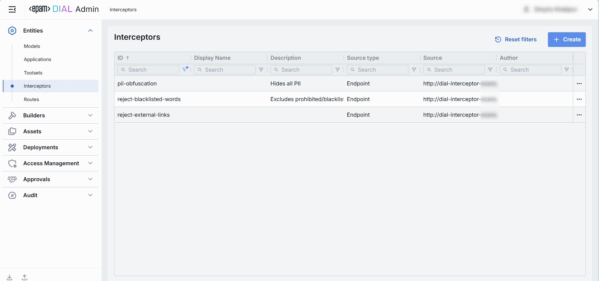
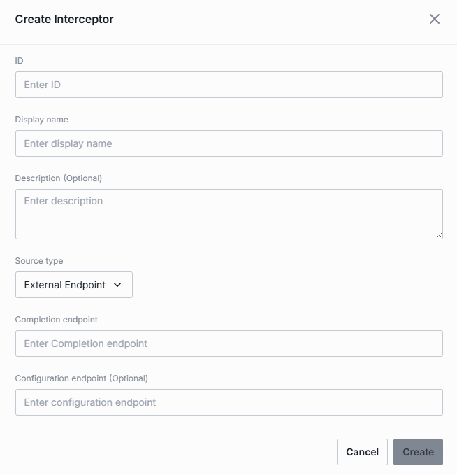

# Interceptors

## About Interceptors

You can add an additional logic into the processing of every request and response for models and apps, enabling PII obfuscation, guardrails, safety checks, and beyond. This is achieved through the integration of pluggable components known as Interceptors.

> Refer to [Interceptors](/docs/platform/3.core/6.interceptors.md) to learn more.

## Interceptors Main Screen

In Interceptors, you can find, manage and add interceptors to your DIAL environment.

##### Interceptors Grid

| Field            | Definition                                                                                                                                            |
| ---------------- | ----------------------------------------------------------------------------------------------------------------------------------------------------- |
| **Display Name** | A user-friendly name of the interceptor (e.g. "PII Information Remover").                                                                             |
| **Description**  | A brief summary of what this interceptor does and any parameters it uses (e.g. BLACKLIST={"foo","bar"} or Logs request/response payloads).            |
| **ID**           | A unique identifier for the interceptor (e.g. reject-blacklisted-words, audit-logger). This key is used when you attach it to a Model or Application. |
| **Source Type**  | Can be one of the following options: Interceptor Template, Interceptor Container, External Endpoint.                                                  |
| **Source**       | Interceptor's Adapter ID, Interceptor Container Id or Completion Endpoint URL, depending on the choice of the Source Type.                            |
| **Author**       | Contains information about the interceptor's author.                                                                                                  |

## Create

Follow these steps to add a new definition of an interceptor:

1. Click **+ Create** to invoke the **Create Interceptor** modal.
2. Define interceptor's parameters:

   | Column                     | Definition & Use                                                                                                                                      |
   | -------------------------- | ----------------------------------------------------------------------------------------------------------------------------------------------------- |
   | **ID**                     | A unique identifier for the interceptor (e.g. reject-blacklisted-words, audit-logger). This key is used when you attach it to a Model or Application. |
   | **Display Name**           | A user-friendly name of the interceptor (e.g. "PII Information Remover").                                                                             |
   | **Description**            | A brief summary of what this interceptor does and any parameters it uses (e.g. BLACKLIST={"foo","bar"} or Logs request/response payloads).            |
   | **Source Type**            | Can be one of the following options: Interceptor Template, Interceptor Container, External Endpoint.                                                  |
   | **Adapter**                | Interceptor's Adapter Id. Applies for the Template source type.                                                                                       |
   | **Container**              | Interceptor's Container Id. Applies for the Interceptor Container source type.                                                                        |
   | **Completion endpoint**    | URL of the chat completion endpoint. Applies for the External Endpoint source type.                                                                   |
   | **Configuration endpoint** | The URL that exposes the configuration of the interceptor. Applies for the External Endpoint source type.                                             |

3. Once all required fields are filled, click **Create**. The dialog closes and the new interceptor [configuration screen](#configuration) is opened. Once added, a new entry appears in the **Interceptors** listing. It may take some time for the changes to take effect after saving.

   

## Configuration

Click any interceptor on the main screen to open its configuration details.

### Properties

In the Properties tab, you can define metadata and execution endpoints for Interceptors.

| Field                      | Required    | Definition & Use Case                                                                                                                                                                                                                                                                                                                                        |
| -------------------------- | ----------- | ------------------------------------------------------------------------------------------------------------------------------------------------------------------------------------------------------------------------------------------------------------------------------------------------------------------------------------------------------------ |
| **ID**                     | Yes         | A unique key under `interceptors` in DIAL Core’s [dynamic settings](https://github.com/epam/ai-dial-core?tab=readme-ov-file#dynamic-settings) (e.g. data-clustering, support-bot).                                                                                                                                                                           |
| **Updated Time**           | -           | Date and time when the interceptor's configuration was last updated.                                                                                                                                                                                                                                                                                         |
| **Creation Time**          | -           | Date and time when the interceptor's configuration was created.                                                                                                                                                                                                                                                                                              |
| **Display Name**           | Yes         | A user-friendly name of the interceptor (e.g. "PII Information Remover").                                                                                                                                                                                                                                                                                    |
| **Description**            | No          | A free-text summary of the interceptor’s behavior and any configuration parameters (e.g. `BLACKLIST={"foo","bar"}`). Helps to identify the interceptor and its purpose.                                                                                                                                                                                      |
| **Maintainer**             | No          | Field used to specify the responsible person or team overseeing the interceptor and its configuration.                                                                                                                                                                                                                                                       |
| **Forward Auth Token**     | No          | Specify whether to forward an Auth Token to your interceptor's endpoint. Use this when your interceptor service requires its own authentication.                                                                                                                                                                                                             |
| **Source Type**            | Yes         | Can be one of the following options: Interceptor Template, Interceptor Container, External Endpoint.                                                                                                                                                                                                                                                         |
| **Completion Endpoint**    | Conditional | URL of the chat completion endpoint. Applies for the External Endpoint source type.                                                                                                                                                                                                                                                                          |
| **Configuration Endpoint** | Conditional | The URL that exposes the configuration of the interceptor. Applies for the External Endpoint source type.                                                                                                                                                                                                                                                    |
| **Adapter**                | Conditional | Interceptor's Adapter Id. Applies for the Template source type.                                                                                                                                                                                                                                                                                              |
| **Container**              | Conditional | Interceptor's Container Id. Applies for the Interceptor Container source type.                                                                                                                                                                                                                                                                               |
| **Defaults**               | No          | The interceptor configuration could be preset on the per-interceptor basis via the `defaults` field. Default parameters are applied if a request doesn't contain them in OpenAI chat/completions API call. Refer to [Interceptors SDK](https://github.com/epam/ai-dial-interceptors-sdk/blob/development/README.md#interceptor-configuration) to learn more. |

### Entities

In the Entities tab, you can see Models and Applications this interceptor is currently associated with. By binding interceptors here, you control exactly which AI endpoints (and in what order) will invoke your custom pre- or post-processing logic.

| Column           | Definition                                                                          |
| ---------------- | ----------------------------------------------------------------------------------- |
| **ID**           | A unique identifier of the Application or Model.                                    |
| **Display Name** | A user-friendly name of the Application/Model (e.g. "Data Clustering Application"). |
| **Description**  | Provides a brief summary of the application or model purpose.                       |
| **Type**         | A type of the entity using the given interceptor: Model, Application.               |

#### Add

1. Click **+ Add** (top-right of the Entities Grid).
2. **Select** one or more apps/models in the modal.
3. **Confirm** to insert them into the table.

#### Remove

1. Click the **actions** menu in the entity's line.
2. Choose **Remove** in the menu.

### Audit

In the Audit tab, you can track all changes made to this interceptor.

#### Activities

In the Activities section, you can see all changes made to the selected interceptor.

This section mimics the functionality available in the global [Audit → Activities](/docs/tutorials/3.admin/telemetry-activity-audit.md) menu, but is scoped specifically to the selected interceptor.

##### Activities List Table

| **Field**         | **Definition**                                                                                                                                                                                                                                                                               |
| ----------------- | -------------------------------------------------------------------------------------------------------------------------------------------------------------------------------------------------------------------------------------------------------------------------------------------- |
| **Activity type** | The type of action performed on the interceptor (e.g., Create, Update, Delete).                                                                                                                                                                                                              |
| **Time**          | Timestamp indicating when the activity occurred.                                                                                                                                                                                                                                             |
| **Initiated**     | Email address of the user who performed the activity.                                                                                                                                                                                                                                        |
| **Activity ID**   | A unique identifier for the logged activity, used for tracking and auditing.                                                                                                                                                                                                                 |
| **Actions**       | Available actions: - **View details**: Click to open a new screen with activity details. Refer to [Activity Details](#activity-details) to learn more. - **Resource rollback**: click to restore a previous version. Refer to [Resource Rollback](#resource-rollback) for details. |

##### Resource Rollback

Use Resource Rollback to restore the previous version of the selected activity. A rollback leads to generation of a new entry on the audit activity screen.

##### Activity Details

To open Activity Details, click on the three-dot menu (⋮) at the end of a row in the Activities grid and select “View Details”. The Activity Details view provides a detailed snapshot of a specific change made to an interceptor.

| **Element/Section** | **Description**                                                                                                                                 |
| ------------------- | ----------------------------------------------------------------------------------------------------------------------------------------------- |
| **Activity type**   | Type of the change performed (e.g., Update, Create, Delete).                                                                                    |
| **Time**            | Timestamp of the change.                                                                                                                        |
| **Initiated**       | Identifier of the user who made the change.                                                                                                     |
| **Activity ID**     | Unique identifier for the specific activity tracking.                                                                                           |
| **Comparison**      | Dropdown to switch between showing all parameter or changed only.                                                                               |
| **View**            | Dropdown to switch for selection between Before/After and Before/Current state.                                                                 |
| **Parameters Diff** | Expandable sections with side-by-side comparison of changes made. Color-coding is used to indicate the operation type (Update, Create, Delete). |

### JSON Editor

Use the **JSON Editor** toggle to switch between the form-based UI and raw JSON view of the interceptor’s configuration. It is useful for advanced scenarios of bulk updates, copy/paste between environments, or tweaking settings not exposed in the form UI—you can switch to the **JSON Editor** on any interceptor configuration page.

##### Switching to the JSON Editor

1. Navigate to **Entities → Interceptors**, then select the interceptor you want to edit.
2. Click the **JSON Editor** toggle (top-right). The UI reveals the raw JSON.

> **TIP**: You can switch between UI and JSON only if there are no unsaved changes.

### Delete

Use the **Delete** button in the Configuration screen toolbar to permanently remove the selected interceptor.
