# Models

## Main Screen

On the **Models** page, you can find all AI models available on your DIAL instance. Here you can view, filter, and add new model definitions.

> Refer to the [Supported Models](/docs/platform/2.supported-models.md) to learn more about the supported AI models and model adapters.

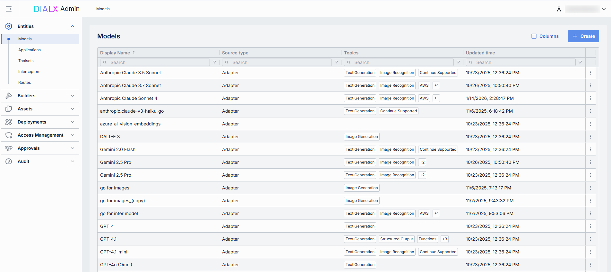

##### Models grid

> **TIP**: Click **Columns** to open the columns selector to define what columns to display and in which order.

The grid with models displays the main properties of models which include:

| Field | Definition |
|-------|------------|
| **Display Name** | Model name (e.g. "GPT-4 Turbo"). Display name is shown in all DIAL client UI components for a quick model identification. |
| **Version** | Version of a specific model deployment (e.g. `0613`, `v1`). Used to distinguish between "latest," "beta," or date-stamped builds. |
| **Description** | Description of the model’s purpose including any relevant details. The description is displayed in DIAL Chat UI and Marketplace.|
| **ID** | Unique key under the `models` section of [DIAL Core’s config](https://github.com/epam/ai-dial-core/blob/development/docs/dynamic-settings/models.md). Must match the upstream service’s model or deployment name (e.g. `gpt-4-0613`). |
| **Source Type** | Source type of a model: - [Adapter](/docs/tutorials/3.admin/builders-adapters.md): Model is based on a model adapter. - **External Endpoint**: Model is deployed outside DIAL infrastructure and exposes an endpoint DIAL Core uses for communication. - [Model Container](/docs/tutorials/3.admin/deployments-models.md): Model is based on a deployed model container.|
| **Source** | Source identifier. Adapter Id, [Model serving container Id](/docs/tutorials/3.admin/deployments-models.md) or Endpoint of the model, based on your Source Type selection.  |
| **Author** | Information about the user who deployed the model. |
| **Type** | Defines **Chat** (conversational completions) and **Embedding** models (vector generation). DIAL Core uses this to choose the correct API endpoint and a payload schema.    |
| **Override Name** | Context-specific optional display label that overrides the Display Name in UI components. Use it to give a model different aliases in different workflows without redefining the model.             |
| **Topics** | Tags or categories you can assign for discovery, filtering, or grouping in large deployments (e.g. "finance," "support," "image-capable"). Helps end users and admins find the right model by the use case. Topics are also used to filter models in [DIAL Marketplace](/docs/platform/4.chat/1.marketplace.md).|
| **Attachment types** | Types of attachments this model can accept according to [MIME types](https://developer.mozilla.org/en-US/docs/Web/HTTP/Guides/MIME_types/Common_types).       |
| **Max attachment number** | Maximum number of attachments allowed in a single request. Blank for an unlimited number.|
| **Tokenizer model** | Identifies the specific model with a tokenization algorithm identical to the referenced model's. This is typically the name of the earliest released model in a series of models sharing an identical tokenization algorithm. This parameter is essential for DIAL clients that reimplement tokenization algorithms on their side, instead of utilizing the tokenize Endpoint provided by the model. |
| **Interaction limit** | The interaction limit parameter in models refers to the maximum number of tokens that can be transmitted in a completion request and response combined. This parameter ensures that the model does not exceed a specified token limit during interactions.     |
| **Prompt price** | Cost per unit (according to **Cost unit**, typically "token" or "request") applied to the *input* portion of each call. Used by the [Dashboard and Usage Logs](/docs/tutorials/3.admin/telemetry-dashboard.md) to estimate spending in real time. |
| **Completion price** | Cost per unit is charged for the output portion of each call. Combined with the prompt price, it determines your per-model cost calculations. |

## Create Model

Follow these steps to add new AI model to your DIAL instance:

1. Click **+ Create** to invoke a **Create Model** modal.
2. Define parameters for a new model:

    | Field            | Required     | Description |
    |------------------|--------------|-------------|
    | **ID**           | Yes          | Unique identifier used by the model adapter to invoke the model's backend.  |
    | **Display Name** | Yes          | Model name shown across the UI (e.g. "GPT-4 Turbo").|
    | **Display version** | No        | Version is an optional tag to track releases when you register multiple variants of the same model. (e.g. `2024-07-18`, `v1`)  |
    | **Description**  | No           | Free-text note about the model’s purpose or distinguishing traits.            |
    | **Source type**  | Yes          | **Adapter**: Select the corresponding AI model adapter from the list of [available adapters](/docs/tutorials/3.admin/builders-adapters.md). In this case DIAL Core will use the adapter endpoint URL to communicate with the model. **Model Container**: Select one of the available [model containers](/docs/tutorials/3.admin/deployments-models.md). In this case DIAL Core will use the container URL to communicate with the model. **External Endpoint**: Provide the external chat completion endpoint URL DIAL Core will use to directly (not using model adapters) communicate with the model. In this case, the model API must be compatible with DIAL Core API.|

3. Click **Create** to close the dialog and open the [configuration screen](#model-configuration). When done with model configuration, click **Save**. It may take some time for the changes to take effect after saving. Once added, the model appears in the **Models** listing and become available to use across the DIAL ecosystem.

    

## Configuration

You can access the model configuration screen by clicking any model in the models grid and also when adding a new model. In this section, you can view and configure all settings for the selected language model deployment.

* [Properties](#properties): Main definitions and runtime settings.
* [Features](#features): Optional capabilities and custom endpoints.
* [Roles](#roles): User groups that can invoke this model and their rate limits.
* [Interceptors](#interceptors): Custom logic to modify requests or responses.
* [Audit](#audit): Provides aggregated audit metrics and detailed logs of individual configuration changes.

### Properties

In the **Properties** tab, you can view and edit main definitions and runtime settings for model deployment.

* [Basic identification](#basic-identification-and-information): ID, Display Name, Version, Description.
* [Adapter & Endpoint](#adapter): Select the Adapter, API Type (Chat or Embedding), and read-only Endpoint URL.
* [Presentation & Attachments](#presentation--attachments): Override name, icon, topics, and attachment types.
* [Upstream Configuration](#upstream-configuration): Define upstream endpoints, authentication keys, weights, and extra data.
* [Advanced Options](#advanced-options): Tokenizer model, forward auth token, interaction limits, retry attempts.
* [Cost Configuration](#cost-configuration): Set cost unit, prompt price, and completion price for real-time billing.

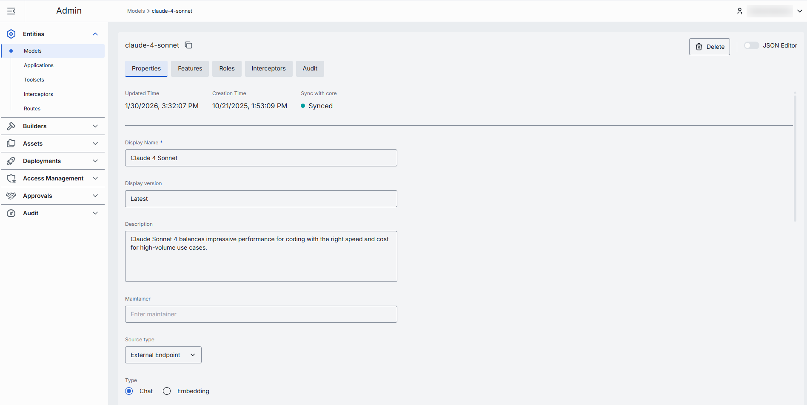

##### Basic Identification and Information

| Field             | Required | Description |
|-------------------|----------|-------------|
| **ID** | - | Unique key DIAL Core uses in the `models` section. Must match the upstream’s deployment or model name (e.g. `gpt-4o`, `gpt-4-turbo`). Non-editable after the model created. |
| **Updated Time**  | - | Date and time when the model's configuration was last updated. |
| **Creation Time** | - | Date and time when the model's configuration was created. |
| **Sync with core** | - | Indicates the state of the entity's configuration synchronization between Admin and DIAL Core. Synchronization occurs automatically every 2 mins (configurable via `CONFIG_AUTO_RELOAD_SCHEDULE_DELAY_MILLISECONDS`). **Important**: Sync state is not available for sensitive information (API keys/tokens/auth settings). **Synced**: Entity's states are identical in Admin and in Core for valid entities or entity is missing in Core for invalid entities. **In progress...**:  If Synced conditions are not met and changes were applied within last 2 mins (this period is configurable via `CONFIG_EXPORT_SYNC_DURATION_THRESHOLD_MS`). **Out of sync**: If Synced conditions are not met and changes were applied more than 2 mins ago (this period is configurable via `CONFIG_EXPORT_SYNC_DURATION_THRESHOLD_MS`). **Unavailable**: Displayed when it is not possible to determine the entity’s state in Core. This occurs if: - The config was not received from Core for any reason. - The configuration of entities in Core is not entirely compatible with the one in the Admin service. |
| **Display Name** | Yes | User-friendly label shown in tables and dropdowns in DIAL clients (e.g. "GPT-4o").   Helps users identify and select models on UI. |
| **Display version** | No | An optional version tag for tracking releases (e.g. `0613`, `v1`).   Useful for A/B testing or canary rollouts. |
| **Description** | No | Free-text note describing the model’s purpose, fine-tune details, or its cost tier. |
| **Maintainer** | No | Field used to specify the responsible person or team overseeing the model’s configuration. |
| **Source type** | Yes | Allows to select one of the following options: [Adapter](#adapter), [Model Container](#model-container), [External Endpoint](#external-endpoint). |

##### Adapter

Unless AI model API is compatible with the DIAL Unified Protocol, you need adapters to be able to use AI models in DIAL. Model adapters unify the APIs of respective AI models to align with the Unified Protocol of DIAL Core. If the Source Type of your model is Adapter, DIAL Core will use adapters endpoint to communicate with the model.

DIAL includes adapters for [Azure OpenAI](https://github.com/epam/ai-dial-adapter-openai) models, [GCP Vertex AI](https://github.com/epam/ai-dial-adapter-vertexai/?tab=readme-ov-file#supported-models) models, and [AWS Bedrock](https://github.com/epam/ai-dial-adapter-bedrock) models. You can also create custom adapters for other AI models with [DIAL SDK](https://github.com/epam/ai-dial-sdk). 

Adapter can be added in [Builders/Adapters](/docs/tutorials/3.admin/builders-adapters.md#create).

The following properties need to be specified if selected Source Type is Adapter:

| Field        | Required | Description |
|--------------|----------|-------------|
| **Adapter**  | Yes      | [Model adapter](/docs/tutorials/3.admin/builders-adapters.md) that will be used to handle requests to this model deployment (e.g. **OpenAI**, **DIAL**).  Adapter defines how to authenticate, format payloads, and parse responses. |
| **Type**     | Yes      | A choice between **Chat** or **Embedding** API.   **Chat**: Conversational chat completions. **Embedding**: Vector generation (semantic search, clustering).         |
| **Endpoint** | Yes      | URL that DIAL Core will invoke for this model. The base URL is determined by the selected adapter, while the path can be partially customized.      |

##### Model Container

AI models can be deployed in DIAL using Docker images. You can add and run [images](/docs/tutorials/3.admin/deployments-images.md) and [containers](/docs/tutorials/3.admin/deployments-models.md) in the Deployment section.

If the Source Type of your model is Model Container, DIAL Core will use the container URL to communicate with the model.

The following properties need to be specified if selected Source Type is Model Container:

| Field          | Required | Description |
|----------------|----------|-------------|
| **Container**  | Yes      | Select one of the running [Model Containers](/docs/tutorials/3.admin/deployments-models.md). |

##### External Endpoint

If your AI model is deployed elsewhere and is compatible with DIAL Core API, you can add it using its chat completion endpoint for a direct communication between the DIAL Core and the AI model.

The following properties need to be specified if selected Source Type is External Endpoint:

| Field        | Required | Description|
|--------------|----------|----------------------------|
| **Type**     | Yes      | A choice between **Chat** or **Embedding** API.   **Chat**: Conversational chat completions. **Embedding**: Vector generation (semantic search, clustering). |
| **Endpoint** | Yes      | URL that DIAL Core will invoke for this model.              |

##### Presentation & Attachments

| Field             | Required | Description        |
|-------------------|-----------|--------|
| **Override name** | No        | Custom display name for specific contexts.    |
| **Icon**          | No        | Logo to visually distinguish models in the UI.  |
| **Topics**        | No        | Tag that associates a model with one or more topics or categories (e.g. "finance", "support").  |
| **Attachments**   | No        | Attachment types (images, files) this model can accept.   **None**: Attachments are not allowed.   **All**: Unrestricted types. Optionally specify max number of attachments. **Custom**: Specific [MIME types](https://developer.mozilla.org/en-US/docs/Web/HTTP/Basics_of_HTTP/MIME_types/Common_types). Optionally specify max number of attachments. |

##### Default Parameters 

Default parameters are applied if a request doesn't contain them in OpenAI chat/completions API call.

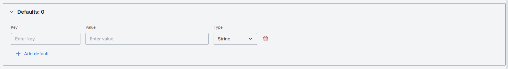

##### Upstream Configuration

| Field | Description |
|-------|-------------|
| **Upstream Endpoints** | One or more backend URLs to send requests to. Enables round-robin load balancing or fallback among multiple hosts. Refer to [Load Balancer](/docs/platform/3.core/5.load-balancer.md) to learn more.  You can use upstream endpoint to provide an alternative URL. For example a model Docker container URL if the model is deployed as a container in DIAL. Refer to [Model Servings](/docs/tutorials/3.admin/deployments-models.md#to-enable-a-model-in-dial) to learn more about this use case.|
| **Keys** | API key, token, or credential passed to the upstream.  Stored securely and masked—click the eye icon to reveal.|
| **Weight** | Numeric [weight](/docs/platform/3.core/5.load-balancer.md#weights) for this endpoint in a multi-upstream scenario.  Higher = more traffic share. |
| **Tier** | Specifies an endpoint group. In a regular scenario, all requests are routed to endpoints with the lowest tier, but in case of an outage or hitting the limits, the next one in the line helps to handle the load. |
| **Extra Data** | Free-form JSON or string metadata passed to the model adapter with each request. |

##### Advanced Options

| Field | Description |
|-------|-------------|
| **Tokenizer Model** | Identifies the specific model whose tokenization algorithm exactly matches that of the referenced model. This is typically the name of the earliest released model in a series of models sharing an identical tokenization algorithm. This parameter is essential for DIAL clients that reimplement tokenization algorithms on their side, instead of utilizing the tokenize endpoint provided by the model. |
| **Forward auth token** | Select a downstream auth token to forward from the user’s session (for downstream multi-tenant).|
| **Interaction limit** | This parameter ensures that the model does not exceed a specified token limit during interactions. **Available values**: **None**: DIAL does not apply any additional interaction limits beyond limits that your model enforces natively. Ideal for early prototyping or when you trust the LLM’s built-in safeguards.  **Total number of tokens**: Enforces a single, cumulative cap on the sum of all `prompt + completion` tokens across the entire chat.  **Separately Prompts & Completions**: Two independent limits: one on the sum of all input (prompt) tokens and another on the sum of all output (completion) tokens over the course of a conversation. |
| **Max retry attempts** | The number of times DIAL Core will retry a connection in case of upstream errors (e.g. on timeouts or 5xx responses).    |
| **Hashing Order** | Specifies the ordered components of a chat request used to compute its hash, reflecting how tools and messages are tokenized in LLMs. Enables DIAL Core to route requests with shared prefixes to the same upstream, supporting effective context caching. Refer to [DIAL Core documentation](https://github.com/epam/ai-dial-core/blob/development/docs/dynamic-settings/models.md) to learn more. |

##### Cost Configuration

Enables real-time cost estimation and quota enforcement. Powers the [telemetry dashboard](/docs/tutorials/3.admin/telemetry-dashboard.md) with per-model spending metrics.

| Field | Required | Description |
|-------|----------|-------------|
| **Cost unit** | Yes | Base unit for billing.  **Available values**: **None**: Disables all cost tracking for this model.  **Tokens**: Every token sent or received by the model is counted towards your cost metrics.  **Char without whitespace**: Tells DIAL to count only non-whitespace characters (letters, numbers, punctuation) in each request as the billing unit. |
| **Prompt price** | Yes | Cost per unit for prompt tokens. |
| **Completion price** | Yes | Cost per unit for completion tokens (chat responses). |

### Features

In the **Features** tab, you can enable, disable, or override optional capabilities for a specific model. You can use model's features to tailor DIAL Core’s [Unified Protocol](/docs/platform/3.core/0.about-core.md#unified-api) behavior—turning features on when your model supports them, or off when it doesn’t.

> **TIPs**:  Enable only the features you need. Extra toggles can cause errors if upstream doesn’t support them. After setting a custom endpoint, test it via a simple API call to confirm accessibility and authentication.

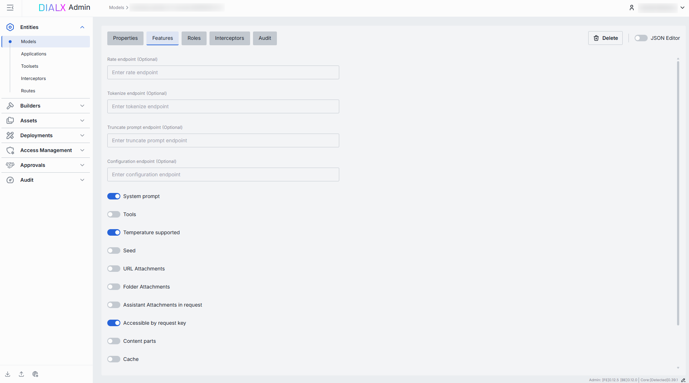

##### Custom Endpoints

Some models adapters expose specialized HTTP endpoints for tokenization, rate estimation, prompt truncation, or live configuration. You can override the default Unified Protocol calls by specifying them in this section.

| Field | Description |
|-------|-------------|
| **Rate endpoint** | URL to invoke the model’s cost‐estimation or billing API.  Call an endpoint that returns token counts & credit usage.   Override if your adapter supports a dedicated "rate" path. |
| **Tokenize endpoint** | URL to invoke a standalone tokenization service.  Use when you need precise token counts before truncation or batching.   Models without built-in tokenization require this. |
| **Truncate prompt endpoint** | URL to invoke a prompt‐truncation API.  Ensures prompts are safely cut to max context length.   Useful when working with very long user inputs. |
| **Configuration endpoint** | A URL to fetch JSON Schema describing settings of the DIAL model. DIAL Core exposes this endpoint to DIAL clients as `GET v1/deployments/<deployment name>/configuration`. DIAL client must provide a JSON value corresponding to the configuration JSON Schema in a chat completion request in the `custom_fields.configuration` field.|

##### Feature Flags (Toggles)

Each toggle corresponds to a capability in the [Unified Protocol](/docs/platform/3.core/0.about-core.md#unified-api-features). Enable them only if your model and adapter fully support that feature.

| Toggle   | Description |
|----------|-------------|
| **System prompt** | Allows injecting a system‐level message (the "agent’s instructions") at the start of every chat. Disable for models that ignore or block system prompts. |
| **Tools**| Enables the `tools` (a.k.a. functions) feature for safe external API calls. Enable if you plan to use DIAL Add-ons or function calling. |
| **Temperature supported**  | Enables the `temperature` parameter to control randomness in output. |
| **Seed** | Enables the `seed` parameter for deterministic output. Use in testing or reproducible workflows. |
| **URL Attachments** | Allows passing URLs as attachments (images, docs) to the model. Can be required for image-based or file-referencing prompts. |
| **Folder Attachments** | Enables attaching folders (batching multiple files). |
| **Assistant attachment in request** | Indicates whether the model supports `attachments` chat completion `messages` form the `role=assistant`. When enabled, DIAL Chat must preserve attachments in messages from assistants, instead of removing them. The feature is especially useful for models that can generate attachments as well as take attachments in its input. A typical example of such a model is an image-editing model. |
| **Accessible by request key** | Indicates whether the deployment is accessible using a [per-request API key](/docs/platform/3.core/3.per-request-keys.md). |
| **Content parts** | Indicates whether the deployment supports requests with content parts or not. 
| **Cache**| Whether the deployment supports [LLM caching](/docs/tutorials/1.developers/6.prompt-caching.md). |
| **Auto caching** | Indicates whether the deployment supports [automatic caching](/docs/tutorials/1.developers/6.prompt-caching.md), where it's possible. |
| **Parallel tool calls** | Indicates whether the deployment supports `parallel_tool_calls` parameter in a chat completion request. |
| **Support comment in rate response** | Indicates whether the model supports the field `comment` in rate response payload. |

### Roles

> You can create and manage roles in the [Access Management](/docs/tutorials/3.admin/access-management-roles.md) section.

In the **Roles** tab, you can define user groups that are authorized to use a specific model and enforce per-role rate limits.
This is essential for multi-tenant governance, quota enforcement, and cost control across teams or customers, preventing runaway costs by enforcing a hard ceiling.

**Important**: if roles are not specified for a specific model, the model will be available to all users.

> Refer to [Access Control](/docs/platform/0.architecture-and-concepts/6.access-control.md#roles) to learn more about roles in DIAL.
>
> * Refer to [Access & Cost Control](/docs/platform/3.core/2.access-control-intro.md) to learn more about access control in DIAL.
> * Refer to [Roles](/docs/platform/0.architecture-and-concepts/6.access-control.md#roles) to lean more about roles in DIAL.
> * Refer to tutorials to learn how to configure access and limits for [JWT](/docs/tutorials/2.devops/2.auth-and-access-control/1.jwt.md) and [API keys](/docs/tutorials/2.devops/2.auth-and-access-control/0.api-keys.md)

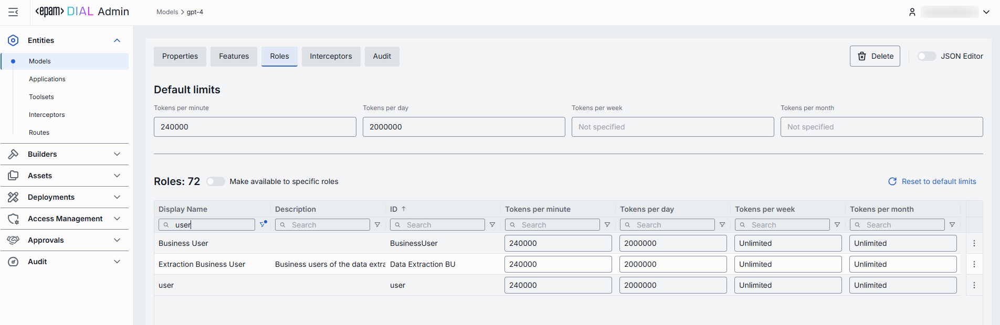

##### Roles grid

| Column | Description |
|--------|-------------|
| **ID** | Unique role's identifier. |
| **Display Name** | Unique role's name displayed on UI. |
| **Description**       | Description of the role’s purpose (e.g., "DIAL Prompt Engineering Team"). |
| **Tokens per minute** | Per Minute tokens limit for a specific role. Blank = no limits. Inherits the [default value](#default-rate-limits). Can be overridden.|
| **Tokens per day**    | Daily tokens limit for a specific role. Blank = no limits. Inherits the [default value](#default-rate-limits). Can be overridden.     |
| **Tokens per week**   | Weekly tokens limit for a specific role. Blank = no limits. Inherits the [default value](#default-rate-limits). Can be overridden.    |
| **Tokens per month**  | Monthly tokens limit for a specific role. Blank = no limits. Inherits the [default value](#default-rate-limits). Can be overridden.   |
| **Actions**           | Additional role-specific actions.   When **Make available to specific roles** toggle is off - opens the [Roles](/docs/tutorials/3.admin/access-management-roles.md) section in a new tab.   When **Make available to specific roles** toggle is on, you can open the [Roles](/docs/tutorials/3.admin/access-management-roles.md) section in a new tab, set **Set unlimited** or [Remove](#remove) the role from the list. |

#### Set Rate Limits

The grid on the Roles screen lists the roles that can access a specific model. Here, you can also set individual limits for selected roles. For example, you can give "Admin" role unlimited monthly tokens but throttle "Developer" to 100,000 tokens/day or allow the "External Partner" role a small trial quota (e.g., 10,000 tokens/month) before upgrade.

##### To set or change rate limits for a role

1. **Click** in the desired cell (e.g., **Tokens per day** for the "ADMIN").
2. **Enter** a numeric limit or leave blank to enable an unlimited access. Click **Reset to default limits** to restore [default settings](#default-rate-limits) for all roles.
3. Click **Save** to apply changes.

#### Default Limits

Default limits are set for all roles in the **Roles** grid by default; however you can override them as needed.

| Field    | Description       |
|-------------------------------|-----------------------------------------------------------------------------------------|
| **Default tokens per minute** | The maximum tokens any user can consume per minute unless a specific limit is in place. |
| **Default tokens per day**    | The maximum tokens any user can consume per day unless a specific limit is in place.    |
| **Default tokens per week**   | The maximum tokens any user can consume per week unless a specific limit is in place.   |
| **Default tokens per month**  | The maximum tokens any user may consume per month unless a specific limit is in place.  |

#### Role-Specific Access

Use **Make available to specific roles** toggle to define access to the model:

* **Off**: Model is callable by any authenticated user. All existing user roles are in the grid.
* **On**: Model is restricted - only the roles you explicitly add to the grid can invoke it.

#### Add

You can add a role only if **Make available to specific roles** toggle is **On**.

1. Click **+ Add** (top-right of the Roles Grid).
2. **Select** one or more roles in the modal. The list or roles is defined in the [Access Management](/docs/tutorials/3.admin/access-management-roles.md) section.
3. **Confirm** to add role(s) to the table.

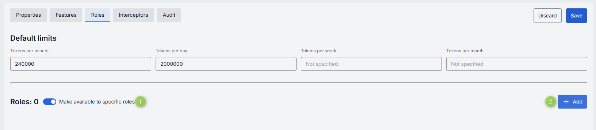

#### Remove

You can remove a role only if **Make available to specific roles** toggle is **On**.

1. Click the actions menu in the role's line.
2. Choose **Remove** in the menu.

### Interceptors

DIAL uses Interceptors to add custom logic to in/out requests for models and apps, enabling PII obfuscation, guardrails, safety checks, and beyond.

> Refer to [Interceptors](/docs/platform/3.core/6.interceptors.md) to learn more.

In the **Interceptors** tab, you can view configured [global interceptors](/docs/tutorials/3.admin/home.md#system-properties) and define local interceptors that will be triggered for the selected model. You can define Interceptors in the [Entities → Interceptors](/docs/tutorials/3.admin/entities-interceptors.md) section to add them to the processing pipeline of DIAL Core.

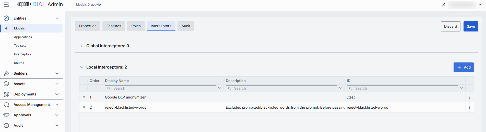

##### Interceptors grid

| Column            | Description  |
| ----------------- |-------------|
| **ID** | Unique interceptor identifier.      |
| **Order** | Execution sequence. Interceptors run in ascending order (1 → 2 → 3...). A request will flow through each interceptor’s in this order.Response interceptors are invoked in the reversed order.      |
| **Display Name** | Alias of the interceptor, matching the **Name** field in its definition.|
| **Description** | Free-text summary from the interceptor’s definition, explaining its purpose. |
| **Actions** | Additional role-specific actions.   Open interceptor in a new tab.   [Remove](#remove-1) the selected interceptor from the model's configuration. |

#### Add

Follow these steps to attach one or more interceptors to the model's configuration:

1. Click **+ Add** (in the upper-right of the interceptors grid).
2. In the **Add Interceptors** modal, choose one or more from the grid of [defined interceptors](/docs/tutorials/3.admin/entities-interceptors.md).
3. **Apply** to append them to the bottom of the list (are added in the same order as selected in the modal).

> **TIP**: If you need a new interceptor, first create it under [Entities → Interceptors](/docs/tutorials/3.admin/entities-interceptors.md) and then revisit this tab to attach it to the model's configuration.

#### Reorder

1. **Drag & Drop** the handle (⋮⋮⋮⋮) to reassign the order in which interceptors are triggered.
2. Release to reposition; order renumbers automatically.
3. **Save** to lock-in the new execution sequence.

#### Remove

1. Click the actions menu in the interceptor's row.
2. Choose **Remove** to detach it from this model.
3. **Save** to lock-in the interceptors list.

### Audit

In the **Audit** tab, you can monitor key metrics, activities and traces related to the selected language model.

#### Dashboard

> **TIP**: You can monitor the entire system's metrics in [Telemetry](/docs/tutorials/3.admin/telemetry-dashboard.md).

In the **Dashboard** tab, you can monitor real-time and historical metrics for the model. You can use it to monitor usage patterns, enforce SLAs, optimize costs, and troubleshoot anomalies.

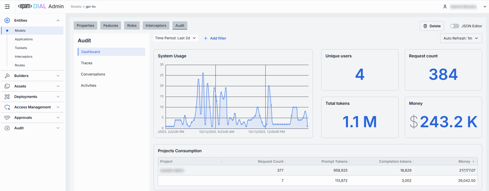

##### Top Bar Controls

| Control                | What It Does            |
| ---------------------- |----------|
| **Time Period**        | An option allowing to select the date range for all charts and tables (e.g. last 15 min, 2 days, 7 days, 30 days). |
| **+ Add filter**       | A filter with options to drill into a specific project.   |
| **Auto refresh**       | Set the dashboard to poll for new data (e.g. every 1 min) or turn off auto-refresh.          |

##### System Usage Chart

A time-series line chart of requests throughput over time. You can use it to monitor traffic peaks and valleys, correlate spikes with deployments or feature roll outs.

##### Key Metrics

Four high-level metrics are displayed alongside the chart. All calculated for the selected time period.

You can use them to:

* Chargeback to internal teams or external customers by "Money".
* Track adoption via "Unique Users".
* Monitor burst traffic with "Request Count".
* Watch token consumption to anticipate quota exhaustion.

| Metric            | Definition|
|-------------------|---------------------------|
| **Unique Users**  | Count of distinct user IDs or API keys that have called this model. |
| **Request Count** | Total number of chat or embedding calls routed to this model.       |
| **Total Tokens**  | Sum of `prompt + completion` tokens consumed by this model.           |
| **Money**         | Estimated spending on this model.   |

##### Projects Consumption Table

This table shows the KPIs breakdown by **Project**. You can use it to compare consumption across multiple projects.

| Column                | Description               |
|-----------------------|-----------------|
| **Project**           | The project utilizing this model.|
| **Request Count**     | Number of calls directed to the model.                    |
| **Prompt tokens**     | Total tokens submitted in the prompt portion of requests. |
| **Completion tokens** | Total tokens returned by the model as responses.          |
| **Money**             | Estimated costs.           |

#### Traces

> **TIP**: You can monitor the entire system's traces in [Usage Log](/docs/tutorials/3.admin/telemetry-usage-log.md).

In this tab, you can see individual traces, each representing a single end-to-end interaction of a DIAL entity with the selected model.

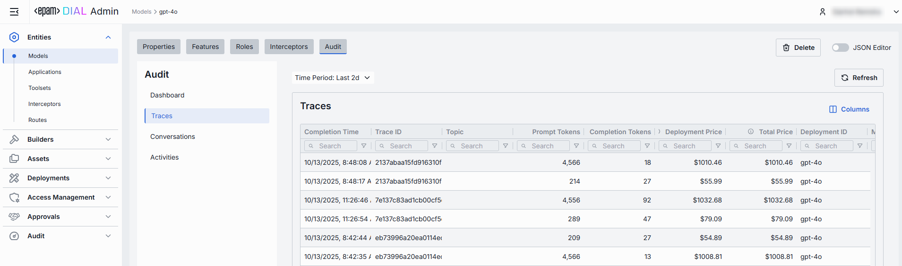

| Column                     | Definition                                                                                   |
|----------------------------|----------------------------------------------------------------------------------------------|
| Completion Time            | Timestamp when the trace finished processing (end-to-end interaction).                       |
| Trace ID                   | Unique identifier of the trace (one end-to-end interaction).                                 |
| Topic                      | Auto-generated subject/title summarizing the trace.                                          |
| Reactions                  | Indication of user reactions presence (like/dislike) for the trace.                          |
| Cached prompt tokens       | Number of prompt tokens served from cache (prompt-caching).                                  |
| Prompt tokens              | Number of tokens in the prompt sent to the model for this trace.                             |
| Completion tokens          | Number of tokens generated by the model as output for this trace.                            |
| Deployment price           | Cost attributed to the selected deployment for this trace.                                   |
| Total price                | Total cost of the trace.                                                                     |
| Number of request messages | Number of discrete request messages that were included in the trace.                         |
| Deployment ID              | Identifier of the DIAL deployment used to serve this trace.                                  |
| Parent Deployment ID       | Identifier of the parent deployment (e.g., application that was using the underlying model). |
| Model                      | Identifier of the underlying model used to carry out the trace.                              |
| Project                    | Project to which this trace associated in DIAL.                                              |
| Upstream                   | The upstream endpoint (e.g., completions endpoint of the model).                             |
| Execution path             | The execution path of the trace.                                                             |
| User                       | Identifier of the end user who initiated the trace.                                          |
| User title                 | The name of the user (if available).                                                         |
| Language                   | Language detected in the trace (e.g., `en`).                                                 |
| Duration                   | Total end-to-end duration of the trace from first request to completion.                     |
| Response ID                | Identifier of the response object returned by the model for this trace.                      |
| Conversation ID            | Identifier of the conversation/session this trace belongs to.                                |
| Code span ID               | Identifier of a specific code execution span associated with the trace (if any).             |
| Code span parent ID        | Identifier of the parent span for a code execution span (if any).                            |

#### Conversations

> **TIP**: You can monitor all usage sessions in [Usage Log](/docs/tutorials/3.admin/telemetry-usage-log.md).

In Conversations, you can see individual traces grouped into end‑to‑end conversation sessions.

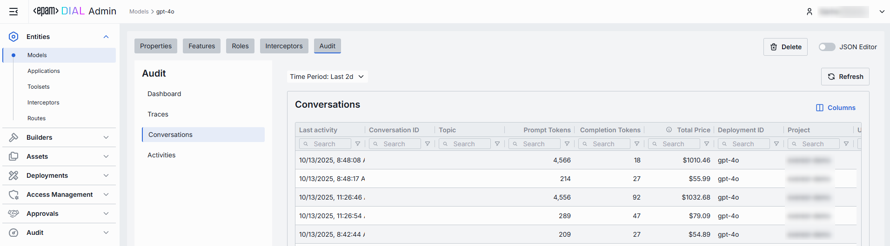

| Column                     | Definition                                                                                     |
|----------------------------|------------------------------------------------------------------------------------------------|
| Last activity              | Timestamp of the most recent trace within the conversation.                                    |
| Conversation ID            | Unique identifier of the user session that groups related traces.                              |
| Topic                      | Auto-generated subject summarizing the conversation.                                           |
| Cached prompt tokens       | Count of prompt tokens served from cache across the conversation.                              |
| Prompt tokens              | Total number of request/prompt tokens sent to the model across all traces in the conversation. |
| Completion tokens          | Total number of tokens generated by the model across all traces in the conversation.           |
| Total price                | Aggregated cost for the conversation.                                                          |
| Number of request messages | Total number of discrete request messages included in the conversation.                        |
| Deployment ID              | Identifier of the deployment associated with the conversation.                                 |
| Project                    | Project to which the conversation associated in DIAL.                                          |
| User                       | Identifier of the end user who initiated the conversation.                                     |
| User title                 | Name of the user (if available).                                                               |
| Language                   | Detected language for the conversation (e.g., `en`).                                           |

#### Activities

The Activities section provides detailed visibility into all changes made to the selected model. This section mimics the functionality available in the global [Audit → Activities](/docs/tutorials/3.admin/telemetry-activity-audit.md) menu, but is scoped specifically to the selected model.

##### Activities List Table

| **Field**         | **Definition**              |
| ----------------- | ---------------------------------------------------------------------------- |
| **Activity type** | The type of action performed on the model (e.g., Create, Update, Delete).    |
| **Time**          | Timestamp indicating when the activity occurred.        |
| **Initiated**     | Email address of the user who performed the activity.   |
| **Activity ID**   | A unique identifier for the logged activity, used for tracking and auditing. |
|**Actions**|Available actions: - **View details**: Click to open a new screen with activity details. Refer to [Activity Details](#activity-details) to learn more. - **Resource rollback**: click to restore a previous version. Refer to [Resource Rollback](#resource-rollback) for details.  |

##### Activity Details

The Activity Details view provides a detailed snapshot of a specific change made to a model.

To open Activity Details, click on the three-dot menu (⋮) at the end of a row in the Activities grid and select “View Details”.

| **Element/Section** | **Description**     |
|---------------------|--------|
| **Activity type**   | Type of the change performed (e.g., Update, Create, Delete).         |
| **Time**            | Timestamp of the change.           |
| **Initiated**       | Identifier of the user who made the change.             |
| **Activity ID**     | Unique identifier for the specific activity tracking.   |
| **Comparison**      | Dropdown to switch between showing all parameter or changed only.|
| **View**            | Dropdown to switch for selection between Before/After and Before/Current state.|
| **Parameters Diff** | Side-by-side comparison of model fields values before and after the change. Color-coding is used to indicate the operation type (Update, Create, Delete). |

##### Resource Rollback

Use Resource Rollback to restore the previous version of the selected activity. A rollback leads to generation of a new entry on the audit activity screen.

### JSON Editor

You can work with model properties using the UI and JSON view modes. Use the **JSON Editor** toggle on the configuration screen to switch between them. It is useful for advanced scenarios of bulk updates, copy/paste between environments, or tweaking settings not exposed in the form UI. 

You can also use the JSON editor to preview and edit deployment properties as they are defined in Admin service and DIAL Core formats. **Sync with core** indicator will inform you about the synchronization state when any changes are made.

##### Switching to the JSON Editor

1. Navigate to **Entities → Models**, then select the model you want to edit.
2. Click the **JSON Editor** toggle (top-right). The UI reveals the raw JSON.

> **TIP**: You can switch between UI and JSON only if there are no unsaved changes.

### Delete

Use the **Delete** button in the Configuration screen toolbar to permanently remove the selected language model.

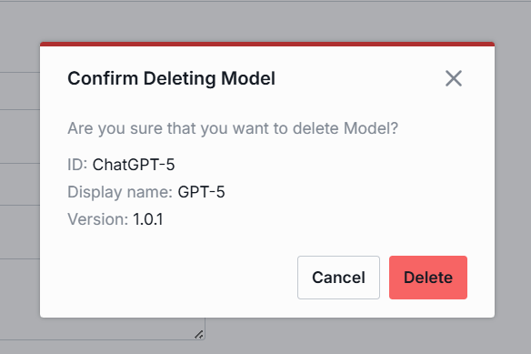
