# Models

## Introduction

DIAL allows you to access and use AI models from all major LLM providers, open-source community, alternative vendors, and fine-tuned micro models, as well as self-hosted or models listed on Hugging Face, NVIDIA NIM or DeepSeek.

> Refer to [Supported Models](/docs/platform/2.supported-models.md) to learn more about the supported AI models.

DIAL provides a single [Unified API](https://dialx.ai/dial_api), based on OpenAI API, for accessing all AI models, embedding models and applications. The key design principle is to create a unification layer that allows all models and applications to be interchangeable, delivering a cohesive conversational experience and future-proof development of custom GenAI applications.

DIAL uses [AI model adapters](/docs/tutorials/3.admin/builders-adapters.md), that unify the APIs of respective AI models to align with the Unified Protocol of DIAL Core. If a model is compatible with DIAL Unified Protocol, it can be used directly without an adapter. 

You can add AI models to DIAL via a direct configuration of [DIAL Core](https://github.com/epam/ai-dial-core/blob/development/docs/dynamic-settings/models.md) or using DIAL Admin Panel. This tutorial describes how to add and manage AI models using DIAL Admin Panel.

## Main Screen

On this page, you can find all AI models deployments available on your DIAL instance. Here you can view, filter, and add new model definitions.

When a model deployment is successfully added, it can be accessed across the DIAL ecosystem including, [DIAL Chat](https://dialx.ai/features/dial-chat), [DIAL Marketplace](https://dialx.ai/features/dial-marketplace) and via [API](https://dialx.ai/dial_api#operation/sendChatCompletionRequest) for authorized [user roles](/docs/tutorials/3.admin/access-management-roles.md).

> You can use DIAL Core API to [access](https://dialx.ai/dial_api#tag/Deployment-listing/operation/getModels) available model deployments and to [send chat completion](https://dialx.ai/dial_api#operation/sendChatCompletionRequest) requests.

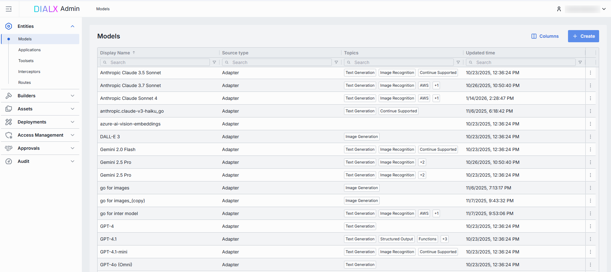

##### Models grid

> **TIP**: Click **Columns** to open the columns selector to define what columns to display and in which order.

The grid with models displays the main properties of models which include:

| Field | Description |
|-------|------------|
| **Display Name** | Model name (e.g. "GPT-4 Turbo"). Display name is shown in all DIAL client UI components for a quick model identification. |
| **Version** | Version of a specific model deployment (e.g. `0613`, `v1`). Used to distinguish between "latest", "beta" or date-stamped builds. |
| **Description** | Description of the model's purpose including any relevant details. The description is displayed in DIAL Chat UI and Marketplace. |
| **ID** | Unique key under the `models` section of [DIAL Core's config](https://github.com/epam/ai-dial-core/blob/development/docs/dynamic-settings/models.md). Must match the upstream service's model or deployment name (e.g. `gpt-4-0613`). |
| **Source Type** | Source type of a model: **Adapter**: Model is based on a [model adapter](/docs/tutorials/3.admin/builders-adapters.md). **External Endpoint**: Model is deployed outside DIAL infrastructure and exposes an endpoint DIAL Core uses for communication. **Model Serving**: Model is based on a deployed [model serving container](/docs/tutorials/3.admin/deployments-models.md). |
| **Source** | Adapter, Model Serving or External endpoint depending on the selected source type. |
| **Author** | Email address of the user who created the model deployment. |
| **Topics** | Semantic tags associated with the model deployment. |
| **Attachment types** | Types of attachments this model can accept according to [MIME types](https://developer.mozilla.org/en-US/docs/Web/HTTP/Guides/MIME_types/Common_types). |
| **Max attachment number** | Maximum number of attachments allowed in a single request. Blank for an unlimited number. |
| **Interaction limit** | The interaction limit parameter in models refers to the maximum number of tokens that can be transmitted in a completion request and response combined. This parameter ensures that the model does not exceed a specified token limit during interactions. |
| **Prompt price** | Cost per unit (according to **Cost unit**, typically "token" or "request") applied to the *input* portion of each call. Used by the [Dashboard and Usage Logs](/docs/tutorials/3.admin/telemetry-dashboard.md) to estimate spending in real time. |
| **Completion price** | Cost per unit is charged for the output portion of each call. Combined with the prompt price, it determines your per-model cost calculations. |
| **Creation Time** | Entity creation timestamp. |
| **Updated Time** | Timestamp of the latest update of the entity. |

## Create Model

Follow these steps to add new AI model to your DIAL instance:

1. Click **+ Create** to invoke a **Create Model** modal.
2. Define parameters for a new model:

    | Field | Required | Description |
    |-------|----------|-------------|
    | **ID** | Yes | Unique identifier used by the model adapter to invoke the model's backend. |
    | **Display Name** | Yes | Model name shown across the UI (e.g. "GPT-4 Turbo"). |
    | **Display version** | No | Version is an optional tag to track releases when you register multiple variants of the same model. (e.g. `2024-07-18`, `v1`) |
    | **Description** | No | Free-text note about the model's purpose or distinguishing traits. |
    | **Source type** | Yes | **Adapter**: Select the corresponding AI model adapter from the list of [available adapters](/docs/tutorials/3.admin/builders-adapters.md). In this case DIAL Core will use the adapter's endpoint URL to communicate with the model. **Model Serving**: Select one of the available [model serving containers](/docs/tutorials/3.admin/deployments-models.md) deployed in DIAL. In this case DIAL Core will use the Model Serving container URL to communicate with the model. **External Endpoint**: For externally-hosted models, provide the chat completion and/or responses endpoints' URLs DIAL Core will use to directly (not using model adapters) communicate with the model. In this case, the model API must be compatible with DIAL Core API. |

3. Click **Create** to close the dialog and open the [configuration screen](#configuration). When done with model configuration, click **Save**. It may take some time for the changes to take effect after saving. Once added, the model appears in the **Models** listing and become available to use across the DIAL ecosystem.

    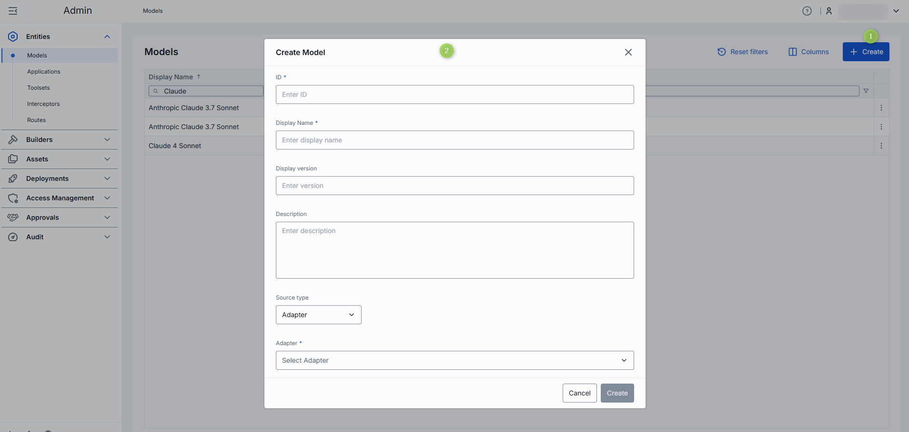

## Configuration

You can access the model deployment configuration screen by clicking any model deployment on the main screen and also when adding a new model deployment. In this section, you can view and configure all settings for the selected model deployment.

* [Properties](#properties): Main definitions and runtime settings.
* [Features](#features): Optional capabilities and custom endpoints.
* [Roles](#roles): User groups that can invoke this model and their rate limits.
* [Interceptors](#interceptors): Custom logic to modify requests or responses.
* [Audit](#audit): Provides aggregated audit metrics and detailed logs of individual configuration changes.

### Properties

In the **Properties** tab, you can view and edit main definitions and runtime settings for model deployment.

* [Basic Information](#basic-information): Identification and basic information about the model and its author.
* [Source Type](#source-type): Parameters associated with the way the model was created: Adapter, Model Container, or External Endpoint.
* [Personalization](#personalization): Parameters to customize model's appearance on UI.
* [Attachments](#attachments): Define attachment types and maximum number of attachments the model can accept.
* [Default Parameters](#default-parameters): Set default values for model parameters used in chat/completions and responses requests.
* [Upstream Configuration](#upstream-configuration): Define upstream endpoints, authentication keys, weights, and extra data.
* [Advanced Options](#advanced-options): Tokenizer model, forward auth token, interaction limits, retry attempts.
* [Cost Configuration](#cost-configuration): Set cost unit, prompt price, and completion price for real-time billing.

##### Basic Information

| Field | Required | Editable | Description |
|-------|----------|----------|-------------|
| **ID** | - | No | Unique key DIAL Core uses in the `models` section. Must match the upstream's deployment or model name (e.g. `gpt-4o`, `gpt-4-turbo`). Non-editable after the model created. |
| **Updated Time** | - | No | Timestamp of the last update. |
| **Creation Time** | - | No | Model deployment creation timestamp. |
| **Sync with core** | - | No | Indicates the state of the entity's configuration synchronization between Admin and DIAL Core. Synchronization occurs automatically every 2 mins (configurable via `CONFIG_AUTO_RELOAD_SCHEDULE_DELAY_MILLISECONDS`). **Important**: Sync state is not available for sensitive information (API keys/tokens/auth settings). **Synced**: Entity's states are identical in Admin and in Core for valid entities or entity is missing in Core for invalid entities. **In progress...**:  If Synced conditions are not met and changes were applied within last 2 mins (this period is configurable via `CONFIG_EXPORT_SYNC_DURATION_THRESHOLD_MS`). **Out of sync**: If Synced conditions are not met and changes were applied more than 2 mins ago (this period is configurable via `CONFIG_EXPORT_SYNC_DURATION_THRESHOLD_MS`). **Unavailable**: Displayed when it is not possible to determine the entity's state in Core. This occurs if: - The config was not received from Core for any reason. - The configuration of entities in Core is not entirely compatible with the one in the Admin service. |
| **Display Name** | Yes | Yes | Model name shown in tables and dropdowns in DIAL clients (e.g. "GPT-4o"). Helps users identify and select models on UI. |
| **Display version** | No | Yes | Version tag for tracking releases (e.g. `0613`, `v1`). Useful for A/B testing or canary rollouts. |
| **Description** | No | Yes | Text describing the model's features, details, or other relevant information. |
| **Maintainer** | No | Yes | Name of the responsible person or team overseeing the model's configuration. |
| **Source type** | Yes | Yes | Source type indicates the way a model was created: [Adapter](#adapter), [Model Serving](#model-serving), [External Endpoint](#external-endpoint). |

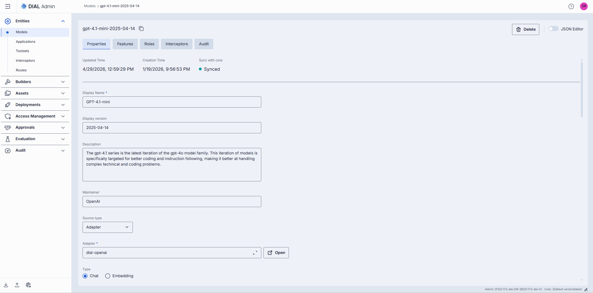

##### Source Type

The Source Type defines how the model is integrated into DIAL. Depending on the selected Source Type, different parameters need to be specified.

##### Adapter

Unless AI model API is compatible with the DIAL Unified Protocol, you need adapters to be able to use AI models in DIAL. Model adapters unify the APIs of respective AI models to align with the Unified Protocol of DIAL Core. If the Source Type of your model is Adapter, DIAL Core will use adapters endpoint to communicate with the model.

DIAL includes adapters for [Azure OpenAI](https://github.com/epam/ai-dial-adapter-openai) models, [GCP Vertex AI](https://github.com/epam/ai-dial-adapter-vertexai/?tab=readme-ov-file#supported-models) models, and [AWS Bedrock](https://github.com/epam/ai-dial-adapter-bedrock) models. You can also create custom adapters for other AI models with [DIAL SDK](https://github.com/epam/ai-dial-sdk). 

Adapter can be added in [Builders/Adapters](/docs/tutorials/3.admin/builders-adapters.md#create).

The following properties need to be specified if selected Source Type is Adapter:

| Field | Required | Description |
|-------|----------|-------------|
| **Adapter** | Yes | [Model adapter](/docs/tutorials/3.admin/builders-adapters.md) that will be used to handle requests to this model deployment (e.g. **OpenAI**, **DIAL**). Adapter defines how to authenticate, format payloads, and parse responses. |
| **Type** | Yes | Select **Chat** or **Embedding** API.  **Chat**: Conversational chat completions. **Embedding**: Vector generation (semantic search, clustering). |
| **Completion endpoint** | Yes | Endpoint URL that will be invoked to process chat completion requests. The base URL is determined by the selected adapter, while the path can be partially customized. |
| **Responses endpoint** | Yes | Endpoint of the model adapter that supports the OpenAI Responses API. The URL is read-only and is determined by the selected AI model adapter. Currently only [OpenAI adapters](https://github.com/epam/ai-dial-adapter-openai/blob/development/README.md) support this. When set, DIAL Core routes `POST /openai/v1/responses` requests to this endpoint. Only basic Responses API behavior is supported: background requests, `previous_request_id`, conversations, prompts, and files are not supported. |

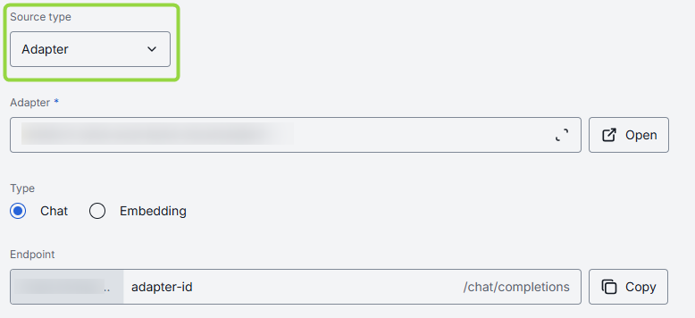

##### Model Serving

AI models can be deployed in DIAL using [Model Servings](/docs/tutorials/3.admin/deployments-models.md). If the Source Type of the model deployment is Model Servings, DIAL Core will use its URL to communicate with the model deployment.

The following properties need to be specified if selected Source Type is Model Serving:

| Field | Required | Description |
|-------|----------|-------------|
| **Container** | Yes | ID of one of the running [Model Serving](/docs/tutorials/3.admin/deployments-models.md) containers. Click to select among the available containers. |
| **Type** | Yes | Select **Chat** or **Embedding** type of model.  **Chat**: Conversational chat completions. **Embedding**: Vector generation (semantic search, clustering). **Note**: This setting is available if Model Serving container is set and running.  |
| **Completion endpoint** | Yes | Endpoint URL that will be invoked to process chat completion requests. The base URL is determined by the selected Model Serving container, while the path can be partially customized: it starts with URL of the Model Serving container and ends with `/chat/completion`. The middle part `openai/v1` can be manually edited. |
| **Responses endpoint** | Yes | Endpoint URL of the Model Serving container that supports the OpenAI Responses API. When set, DIAL Core routes `POST /openai/v1/responses` requests to this endpoint. Only basic Responses API behavior is supported: background requests, `previous_request_id`, conversations, prompts, and files are not supported. The base URL is determined by the selected Model Serving container, while the path can be partially customized: it starts with URL of the Model Serving container and ends with `/responses`. The middle part can be manually edited. |

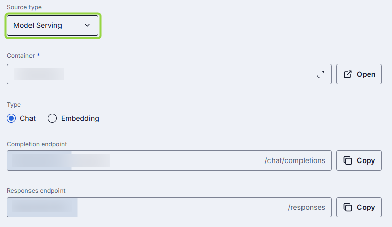

##### External Endpoint

DIAL allows using AI models deployed outside DIAL infrastructure which are compatible with DIAL Core API. External Endpoint source type is used for such AI models.

The following properties need to be specified if selected Source Type is External Endpoint:

| Field | Required | Description |
|-------|----------|-------------|
| **Type** | Yes | Select **Chat** or **Embedding** API.  **Chat**: Conversational chat completions. **Embedding**: Vector generation (semantic search, clustering). |
| **Completion endpoint** | Yes | Endpoint URL that will be invoked to process chat completion requests. |
| **Responses endpoint** | Yes | Endpoint URL that supports the OpenAI Responses API. When set, DIAL Core routes `POST /openai/v1/responses` requests to this endpoint. Only basic Responses API behavior is supported: background requests, `previous_request_id`, conversations, prompts, and files are not supported. |

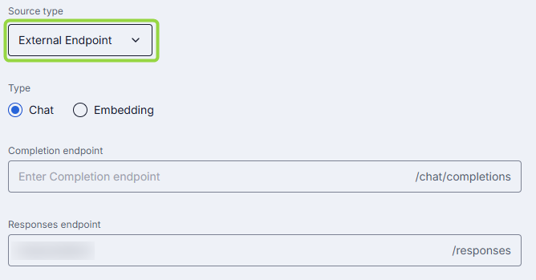

##### Personalization

These parameters help customize how the model is presented in the DIAL UI.

| Field | Required | Description |
|-------|----------|-------------|
| **Override name** | Conditional | Custom display name for specific contexts.  **Note**: Override name is **required** for AI model deployments created based on Model Servings. When `Source Type = Model Serving`, Override name is pre-populated with the ID of the selected Model Serving container. If Source Type is changed from Model Serving to anything else, Override name must be populated manually for the model deployment to work properly. |
| **Icon** | No | Icon to visually distinguish model deployments in the UI. |
| **Topics** | No | Semantic tags associated with the model deployment. Click to display a list of available topics.   You can add your own custom topics to the list following these rules: - The topic name must not exceed 255 characters. - The topic name must not contain leading or trailing spaces. |

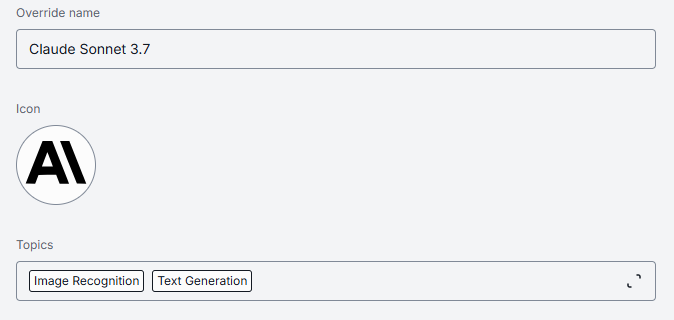

##### Attachments

| Field | Required | Description |
|-------|----------|-------------|
| **Attachment types** | No | This parameter allows you to define attachment types (images, files etc.) this model can accept.  **No attachments**: Disables all attachment types.  **All attachments types**: Allows all types of file attachments. Optionally specify max number of attachments. **Specific attachments types**: Enables the user to define/select specific [MIME types](https://developer.mozilla.org/en-US/docs/Web/HTTP/Basics_of_HTTP/MIME_types/Common_types). Start typing to see suggestions or use `<type>/<subtype>` format for a manual entry. |
| **Attachments max number** | No | Maximum number of input attachments, When **unset** (default), attachments are not allowed. |

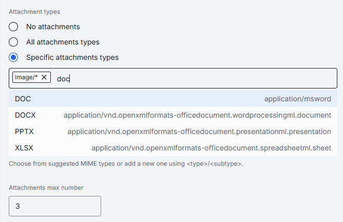

##### Default Parameters 

Default parameters can be used to pass additional parameters with the chat completion or responses requests. 

| Field | Required | Description |
|-------|----------|-------------|
| **Completion Defaults** | No | Default parameters are applied if a request doesn't contain them in OpenAI `chat/completions` API call. |
| **Responses Defaults** | No | Default parameters are applied if a request doesn't contain them in OpenAI `openai/v1/responses` API call.   Available if OpenAI Responses API is supported. |

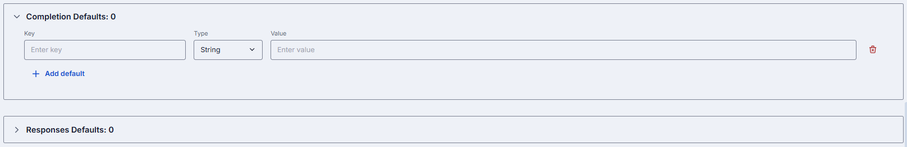

##### Upstream Configuration

You can use upstream endpoints to provide alternative URLs DIAL Core will use to send chat completions and responses requests to. Enables round-robin load balancing or fallback among multiple hosts. Refer to [Load Balancer](/docs/platform/3.core/5.load-balancer.md) to learn more. For example, you can provide a model's Docker container URI if the model's container is deployed in DIAL. Refer to [Model Servings](/docs/tutorials/3.admin/deployments-models.md#to-enable-a-model-in-dial) to learn more about this use case.

| Field | Description |
|-------|-------------|
| **Chat completion endpoint** | The upstream backend URL for the chat completions API. Passed to the model adapter in the `X-UPSTREAM-ENDPOINT` header. Responses API endpoint is recommended to use here for OpenAI models that support Responses API. |
| **Responses endpoint** | The upstream backend URL for the Responses API. Passed to the model adapter in the `X-UPSTREAM-ENDPOINT` header when routing Responses API requests. |
| **Keys** | API key, token, or credential passed to the upstream. Stored securely and masked—click the eye icon to reveal.|
| **Weight** | Numeric [weight](/docs/platform/3.core/5.load-balancer.md#weights) for this endpoint in a multi-upstream scenario. Higher = more traffic share. |
| **Tier** | Specifies an endpoint group. In a regular scenario, all requests are routed to endpoints with the lowest tier, but in case of an outage or hitting the limits, the next one in the line helps to handle the load. |
| **Extra Data** | Free-form JSON or string metadata passed to the model adapter with each request. |

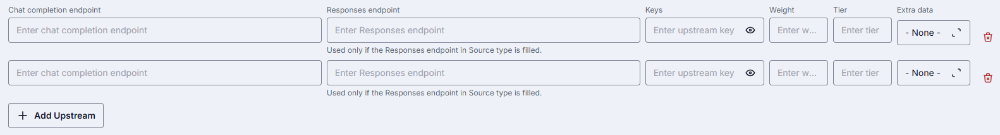

##### Advanced Options

| Field | Description |
|-------|-------------|
| **Tokenizer Model** | Identifies the specific model whose tokenization algorithm exactly matches that of the referenced model. This is typically the name of the earliest released model in a series of models sharing an identical tokenization algorithm. This parameter is essential for DIAL clients that reimplement tokenization algorithms on their side, instead of utilizing the tokenize endpoint provided by the model. |
| **Forward auth token** | This parameter allows to determine whether to forward an Auth Token to your models's endpoint. If enabled, HTTP header with authorization token is forwarded to chat completion endpoint. |
| **Interaction limit** | This parameter ensures that the model does not exceed a specified token limit during interactions. **Available values**: **None**: DIAL does not apply any additional interaction limits beyond limits that your model enforces natively. Ideal for early prototyping or when you trust the LLM’s built-in safeguards.  **Total number of tokens**: Enforces a single, cumulative cap on the sum of all `prompt + completion` tokens across the entire chat.  **Separately Prompts & Completions**: Two independent limits: one on the sum of all input (prompt) tokens and another on the sum of all output (completion) tokens over the course of a conversation. |
| **Max retry attempts** | The number of times DIAL Core will retry a connection in case of upstream errors (e.g. on timeouts or 5xx responses).    |
| **Hashing Order** | Specifies the order in which parts of a chat completion request—like the `tools` used and the chat `messages` — are combined to create a unique fingerprint (hash) for that request. By default, it checks the `tools` first and then the `messages`. This fingerprint helps the system recognize when different requests share the same beginning, so it can reuse previous work and speed things up through caching, which is especially important because the system can only cache information for requests that start the same way. Refer to [DIAL Core documentation](https://github.com/epam/ai-dial-core/blob/development/docs/dynamic-settings/models.md) for details. |

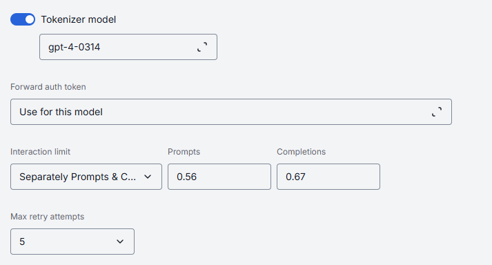

##### Cost Configuration

Enables real-time cost estimation and quota enforcement. Powers the [telemetry dashboard](/docs/tutorials/3.admin/telemetry-dashboard.md) with per-model spending metrics.

| Field | Required | Description |
|-------|----------|-------------|
| **Cost unit** | Yes | Base unit for billing.  **Available values**: **None**: Disables all cost tracking for this model.  **Tokens**: Every token sent or received by the model is counted towards your cost metrics.  **Char without whitespace**: Tells DIAL to count only non-whitespace characters (letters, numbers, punctuation) in each request as the billing unit. |
| **Prompt price** | Yes | Cost per unit for prompt tokens. |
| **Completion price** | Yes | Cost per unit for completion tokens (chat responses). |

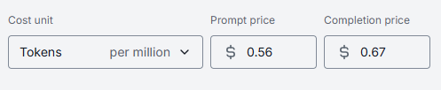

### Features

In the **Features** tab, you can enable, disable, or override optional capabilities for a specific model. You can use model's features to tailor DIAL Core’s [Unified Protocol](/docs/platform/3.core/0.about-core.md#unified-api) behavior—turning features on when your model supports them, or off when it doesn’t.

Model features apply per AI model, controlling what the model endpoint itself supports (e.g. whether GPT-4 can accept system prompts or function calls).

> **TIP**:  Enable only the features you need. Extra toggles can cause errors if upstream doesn’t support them. After setting a custom endpoint, test it via a simple API call to confirm accessibility and authentication.

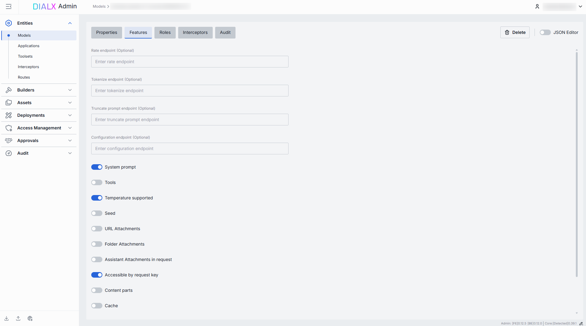

##### Custom Endpoints

Some models adapters expose specialized HTTP endpoints for tokenization, rate estimation, prompt truncation, or live configuration. You can override the default Unified Protocol calls by specifying them in this section.

| Field | Description |
|-------|-------------|
| **Rate endpoint** | URL to invoke the model’s cost‐estimation or billing API.  Call an endpoint that returns token counts & credit usage.   Override if your adapter supports a dedicated "rate" path. |
| **Tokenize endpoint** | URL to invoke a standalone tokenization service.  Use when you need precise token counts before truncation or batching.   Models without built-in tokenization require this. |
| **Truncate prompt endpoint** | URL to invoke a prompt‐truncation API.  Ensures prompts are safely cut to max context length.   Useful when working with very long user inputs. |
| **Configuration endpoint** | URL to fetch JSON Schema describing settings of the DIAL model. DIAL Core exposes this endpoint to DIAL clients as `GET v1/deployments/<deployment name>/configuration`. DIAL client must provide a JSON value corresponding to the configuration JSON Schema in a chat completion request in the `custom_fields.configuration` field.|

##### Feature Flags (Toggles)

Model toggles ensure you don’t accidentally send unsupported parameters to a given model.

Each toggle corresponds to a capability in the [Unified Protocol](/docs/platform/3.core/0.about-core.md#unified-api-features). Enable them only if your model and adapter fully support that feature.

| Toggle | Description |
|--------|-------------|
| **System prompt** | Allows injecting a system‐level message (the "agent’s instructions") at the start of every chat. Disable for models that ignore or block system prompts. |
| **Tools** | Enables the `tools` (a.k.a. functions) feature for safe external API calls. Enable if you plan to use DIAL toolsets or function calling. |
| **Temperature supported**  | Enables the `temperature` parameter to control randomness in model deployment's output. |
| **Seed** | Enables the `seed` parameter for deterministic output. If specified, our system will make a best effort to sample deterministically, such that repeated requests with the same `seed` and parameters should return the same result. Determinism is not guaranteed, and you should refer to the `system_fingerprint` response parameter to monitor changes in the backend. |
| **URL Attachments** | Allows passing URLs as attachments (images, docs) to the model. Can be required for image-based or file-referencing prompts. |
| **Folder Attachments** | Enables attaching folders (batching multiple files). |
| **Assistant attachment in request** | Indicates whether the model deployment supports `attachments` [chat completion request](https://dialx.ai/dial_api#operation/sendChatCompletionRequest) `messages` form the `role=assistant`. When enabled, DIAL Chat must preserve `attachments` in `messages` from assistants, instead of removing them. The feature is especially useful for models that can generate attachments as well as take attachments as an input. A typical example of such a model is an image-editing model. |
| **Accessible by request key** | Indicates whether the deployment is accessible using a [per-request API key](/docs/platform/3.core/3.per-request-keys.md). |
| **Content parts** | Indicates whether the model deployment supports requests with content parts or not. Content parts in a chat completion request allow sending to AI model a message consisting of different types of content, such as text, images, or other media, within a single request which enables more rich and flexible interaction with a model.|
| **Cache** | Whether the deployment supports [LLM caching](/docs/tutorials/1.developers/6.prompt-caching.md). |
| **Auto caching** | Indicates whether the deployment supports [automatic caching](/docs/tutorials/1.developers/6.prompt-caching.md), where it's possible. |
| **Parallel tool calls** | Indicates whether the deployment supports `parallel_tool_calls` parameter in a [chat completion request](https://dialx.ai/dial_api#operation/sendChatCompletionRequest) which enables parallel `function` calling when using a `tool`. |
| **Support comment in rate response** | Indicates whether the model supports the field `comment` in rate response payload. |

### Roles

> You can create and manage roles in the [Access Management](/docs/tutorials/3.admin/access-management-roles.md) section or via a direct configuration of [DIAL Core](https://github.com/epam/ai-dial-core/blob/development/docs/dynamic-settings/roles.md).

In the **Roles** tab, you can define user groups that are authorized to use a specific model deployment and enforce role-based rate and usage limits.
This is essential for multi-tenant governance, quota enforcement, and cost control across teams or customers, preventing runaway costs by enforcing a hard ceiling.

**Important**: if roles are not specified for a specific model deployment, it is available to all users.

> * Refer to [Access & Cost Control](/docs/platform/3.core/2.access-control-intro.md) to learn more about access control in DIAL.
> * Refer to [Roles](/docs/platform/0.architecture-and-concepts/6.access-control.md#roles) to learn more about roles in DIAL.
> * Refer to tutorials to learn how to use roles to define access and cost control for [JWT](/docs/tutorials/2.devops/2.auth-and-access-control/1.jwt.md) and [API keys](/docs/tutorials/2.devops/2.auth-and-access-control/0.api-keys.md)

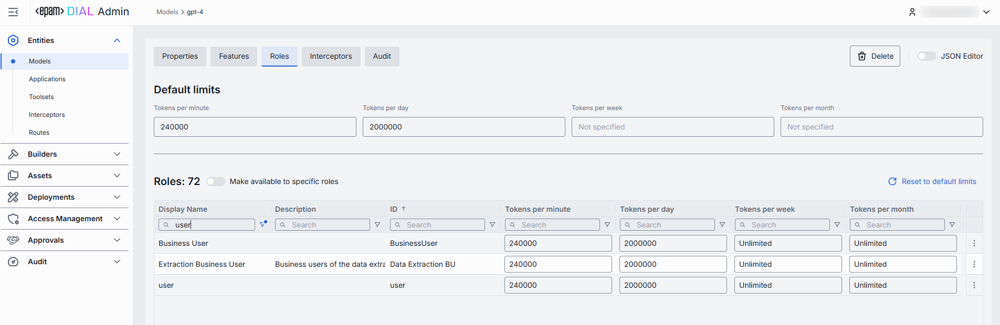

##### Roles grid

| Column | Description |
|--------|-------------|
| **ID** | Unique role's identifier. |
| **Display Name** | Unique role's name displayed on UI. |
| **Description** | Description of the role's purpose (e.g., "DIAL Prompt Engineering Team"). |
| **Tokens per minute** | Per Minute tokens limit for a specific role. Blank = no limits. Inherits the [default value](#default-limits). Can be overridden. |
| **Tokens per day** | Daily tokens limit for a specific role. Blank = no limits. Inherits the [default value](#default-limits). Can be overridden. |
| **Tokens per week** | Weekly tokens limit for a specific role. Blank = no limits. Inherits the [default value](#default-limits). Can be overridden. |
| **Tokens per month** | Monthly tokens limit for a specific role. Blank = no limits. Inherits the [default value](#default-limits). Can be overridden. |
| **Actions** | Additional role-specific actions.   When **Make available to specific roles** toggle is off - opens the [Roles](/docs/tutorials/3.admin/access-management-roles.md) section in a new tab.   When **Make available to specific roles** toggle is on, you can open the [Roles](/docs/tutorials/3.admin/access-management-roles.md) section in a new tab, set **Set unlimited**, [Remove](#remove) the role from the list or **Reset to default limits**. |

#### Set Rate Limits

The grid on the Roles screen lists the roles that can access a specific model. Here, you can also set individual limits for selected roles. For example, you can give "Admin" role unlimited monthly tokens but throttle "Developer" to 100,000 tokens/day or allow the "External Partner" role a small trial quota (e.g., 10,000 tokens/month) before upgrade.

##### To set or change rate limits for a role

1. **Click** in the desired cell (e.g., **Tokens per day** for the "ADMIN").
2. **Enter** a numeric limit or leave blank to enable an unlimited access. Click **Reset to default limits** to restore [default settings](#default-limits) for all roles.
3. Click **Save** to apply changes.

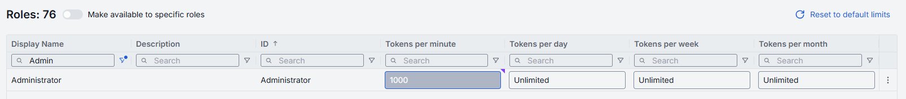

#### Default Limits

Default limits are set for all roles in the **Roles** grid by default; however you can override them as needed.

| Field | Description |
|-------|-------------|
| **Default tokens per minute** | The maximum tokens any user can consume per minute unless a specific limit is in place. |
| **Default tokens per day** | The maximum tokens any user can consume per day unless a specific limit is in place. |
| **Default tokens per week** | The maximum tokens any user can consume per week unless a specific limit is in place. |
| **Default tokens per month** | The maximum tokens any user may consume per month unless a specific limit is in place. |

#### Role-Specific Access

Use **Make available to specific roles** toggle to define access to the model:

* **Off**: Model is callable by any authenticated user. All existing user roles are in the grid.
* **On**: Model is restricted - only the roles you explicitly add to the grid can invoke it.

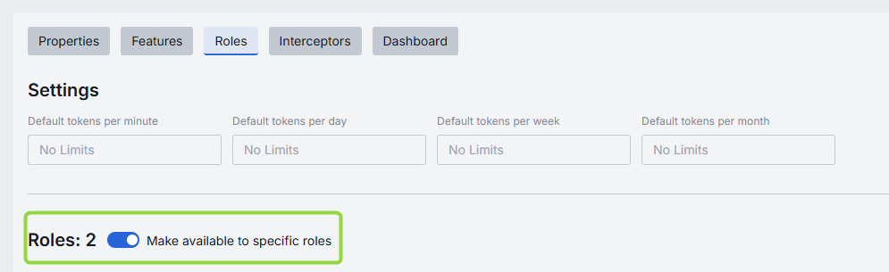

#### Add

You can add a role only if **Make available to specific roles** toggle is **On**.

1. Click **+ Add** (top-right of the Roles Grid).
2. **Select** one or more roles in the modal. The list or roles is defined in the [Access Management](/docs/tutorials/3.admin/access-management-roles.md) section.
3. **Confirm** to add role(s) to the table.

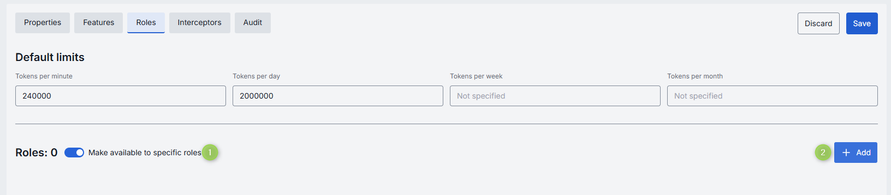

#### Remove

You can remove a role only if **Make available to specific roles** toggle is **On**.

1. Click the actions menu in the role's line.
2. Choose **Remove** in the menu.

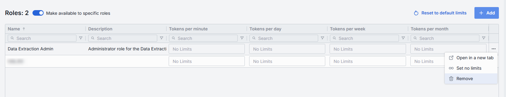

### Interceptors

DIAL uses Interceptors to add custom logic to in/out requests for models and apps, enabling PII obfuscation, guardrails, safety checks, and beyond.

> Refer to [Interceptors](/docs/platform/3.core/6.interceptors.md) to learn more.

In the **Interceptors** tab, you can view configured [global interceptors](/docs/tutorials/3.admin/home.md#system-properties) and define local interceptors that will be triggered for the selected model. You can define Interceptors in the [Entities → Interceptors](/docs/tutorials/3.admin/entities-interceptors.md) section to add them to the processing pipeline of DIAL Core.

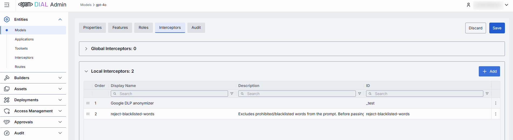

##### Interceptors grid

| Column | Description |
|--------|-------------|
| **ID** | Unique interceptor identifier. |
| **Order** | Execution sequence. Interceptors run in ascending order (1 → 2 → 3...). A request will flow through each interceptor's in this order.Response interceptors are invoked in the reversed order. |
| **Display Name** | Alias of the interceptor, matching the **Name** field in its definition. |
| **Description** | Free-text summary from the interceptor's definition, explaining its purpose. |
| **Actions** | Additional actions.   Open interceptor in a new tab.   [Remove](#remove-1) the selected interceptor from the model's configuration. |

#### Add

Follow these steps to attach one or more interceptors to the model's configuration:

1. Click **+ Add** (in the upper-right of the interceptors grid).
2. In the **Add Interceptors** modal, choose one or more from the grid of [defined interceptors](/docs/tutorials/3.admin/entities-interceptors.md).
3. **Apply** to append them to the bottom of the list (are added in the same order as selected in the modal).

> **TIP**: If you need a new interceptor, first create it under [Entities → Interceptors](/docs/tutorials/3.admin/entities-interceptors.md) and then revisit this tab to attach it to the model's configuration.

#### Reorder

1. **Drag & Drop** the handle (⋮⋮⋮⋮) to reassign the order in which interceptors are triggered.
2. Release to reposition; order renumbers automatically.
3. **Save** to lock-in the new execution sequence.

#### Remove

1. Click the actions menu in the interceptor's row.
2. Choose **Remove** to detach it from this model.
3. **Save** to lock-in the interceptors list.

### Audit

In the **Audit** tab, you can monitor key metrics, activities and usage related to the selected AI model. This tab provides comprehensive insights into performance, user interactions, and operational changes. You can track real-time and historical data, identify usage patterns, audit and roll back all modifications made to the selected AI model deployment for compliance and troubleshooting purposes.

> **Note**: This section mimics the functionality available in the global [Dashboard](/docs/tutorials/3.admin/telemetry-dashboard.md), [Activity](/docs/tutorials/3.admin/telemetry-activity-audit.md), and [Usage Log](/docs/tutorials/3.admin/telemetry-usage-log.md) sections, but is scoped specifically to the selected AI model.

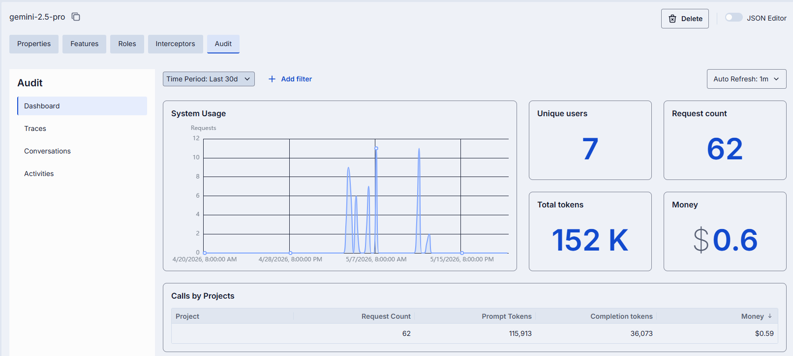

### JSON Editor

**Advanced users with technical expertise** can work with the model properties in a JSON editor view mode. It is useful for advanced scenarios of bulk updates, copy/paste between environments, or tweaking settings not exposed on UI.

> **TIP**: You can switch between UI and JSON only if there are no unsaved changes.

In JSON editor, you can use the view dropdown to select between Admin format and Core format. Note, that these formatting options are for your convenience only and do not render properties as they are defined in DIAL Core. After making changes, the **Sync with core** indicator on the main configuration screen will inform you about the synchronization state with DIAL Core.

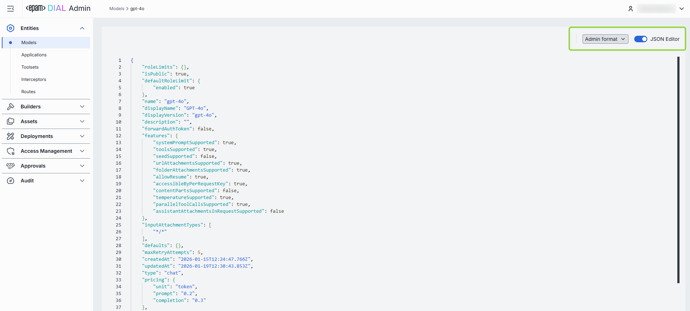

##### Working with JSON Editor

1. Navigate to **Entities → Models**, then select the model you want to edit.
2. Click the **JSON Editor** toggle (top-right). The UI reveals the raw JSON.
3. Chose between the Admin and Core format to see and work with properties in the necessary format. **Note**: Core format view mode does not render the actual configuration stored in DIAL Core but the configuration in Admin service displayed in the DIAL Core format.
4. Make changes and click **Save** to apply them.
5. After making changes, the **Sync with core** indicator on the main configuration screen will inform you about the synchronization state with DIAL Core.

### Delete

Use the **Delete** button in the Configuration screen toolbar to permanently remove the selected language model.

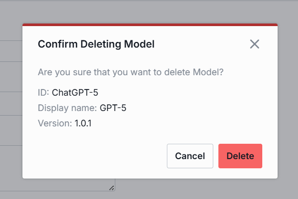
